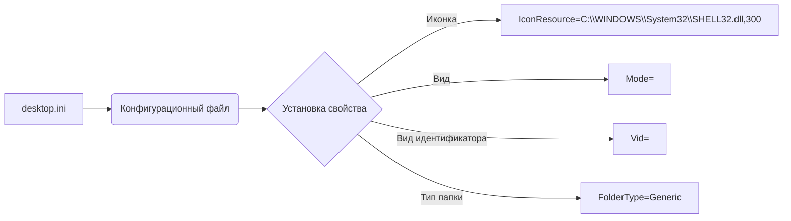

```MD
# Анализ кода desktop.ini

**1. <input code>**

```
[.ShellClassInfo]
IconResource=C:\\WINDOWS\\System32\\SHELL32.dll,300
[ViewState]
Mode=
Vid=
FolderType=Generic
```

**2. <algorithm>**

Этот код не содержит алгоритма в привычном понимании.  Он представляет собой сценарий конфигурации для файла `desktop.ini`, который используется в Windows для управления визуальными отображениями и свойствами папок.  Кода в формате исполняемого файла нет, поэтому нет пошаговых действий.  Данные, представленные в коде, непосредственно записываются в файл `desktop.ini`.

**Пример:**

Данный код будет записан в файл `desktop.ini` в папке, определяя ее отображение как стандартное.

**3. <mermaid>**



**Описание диаграммы:**

Диаграмма показывает, что код непосредственно влияет на конфигурацию файла `desktop.ini`.  Он устанавливает свойства папки (иконка, режим, идентификатор вида и тип).

**4. <explanation>**

* **Импорты:** Нет импортов, так как это не код программы, а конфигурационный файл.
* **Классы:** Нет классов.
* **Функции:** Нет функций.
* **Переменные:** Нет переменных в привычном понимании.  Все значения задают свойства файла.
* **Возможные ошибки/улучшения:**
    * Несоответствие пути к `SHELL32.dll`: Если путь некорректен, иконка не будет отображаться.
    * Необходимость дополнительной информации: Для специфических настроек отображения может потребоваться добавить в файл `desktop.ini` другие секции и ключи.
* **Взаимосвязь с другими частями проекта:** Файл `desktop.ini` служит для настройки отображения папки в Windows Explorer. Он взаимодействует с операционной системой, а не с другими частями проекта.  Его задача - изменить поведение конкретной папки, указанной в той же директории, где он размещен.

**Вывод:**

Код `desktop.ini` является специальным метаданными, которые не содержат логики в привычном смысле. Он описывает свойства папки, такие как иконка, вид и тип.  Отсутствие импортов и функций делает анализ алгоритма и его связи с другими частями проекта тривиальным.