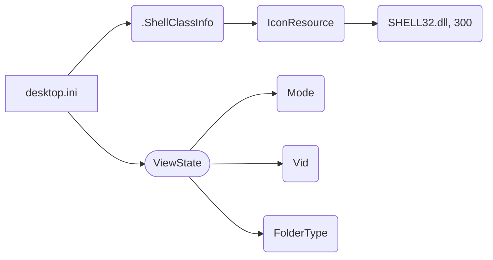

# Анализ файла hypotez/src/desktop.ini

**1. <input code>**

```
[.ShellClassInfo]
IconResource=C:\\WINDOWS\\System32\\SHELL32.dll,300
[ViewState]
Mode=
Vid=
FolderType=Generic
```

**2. <algorithm>**

Этот файл не содержит алгоритма в традиционном понимании. Он представляет собой INI-файл, используемый для хранения метаданных о файле или папке в операционной системе Windows.  Структура файла представляет собой набор разделов, каждый из которых начинается с имени в квадратных скобках.  Внутри каждого раздела находятся ключевые значения, разделённые знаком равенства.

* **[.ShellClassInfo]:**  Этот раздел задаёт свойства отображения иконки файла/папки в проводнике Windows. `IconResource` указывает, откуда брать иконку (библиотека SHELL32.dll) и её индекс (300).

* **[ViewState]:** Этот раздел хранит информацию о состоянии папки (видимость, режим просмотра, и т.д.), но в данном случае все значения пусты.

**3. <mermaid>**



**Диаграмма иллюстрирует:**

* Файл `desktop.ini` содержит два раздела: `.ShellClassInfo` и `ViewState`.
* `.ShellClassInfo` содержит ключевую пару `IconResource`, которая ссылается на ресурс в `SHELL32.dll`.
* `ViewState` содержит несколько ключей, но все они пусты в данном случае.


**4. <explanation>**

* **Импорты:**  В этом файле нет импортов в традиционном понимании, поскольку это не код на языке программирования, а конфигурационный файл.


* **Классы и функции:**  В данном файле нет ни классов, ни функций.


* **Переменные:**  Ключи `IconResource`, `Mode`, `Vid`, `FolderType` - это переменные, хранящие различные параметры конфигурации.  Они являются строками.


* **Возможные ошибки или области для улучшений:**  Нет ошибок, так как файл представляет собой корректный INI-файл.  Можно было бы добавить другие параметры в раздел `ViewState` для сохранения большего количества информации о состоянии папки.


**Взаимосвязь с другими частями проекта:**

Файл `desktop.ini` используется операционной системой Windows и никак не связан с каким-либо конкретным приложением или языком программирования.  Он связан с организацией и отображением файлов/папок в файловой системе.