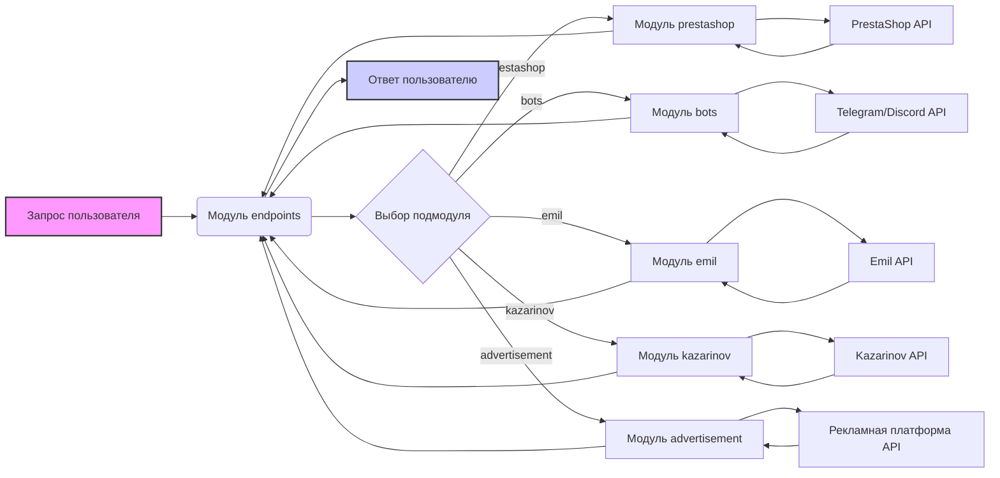

# Анализ модуля `endpoints`

## 1. <алгоритм>

Модуль `endpoints` служит точкой входа для взаимодействия с различными потребителями данных, такими как PrestaShop, Telegram/Discord боты, сервис Emil и Kazarinov. 

**Общая схема работы:**
1. **Инициализация:**
   - Происходит загрузка необходимых библиотек и модулей.
   - Подготавливаются необходимые настройки, включая аутентификацию.
2. **Маршрутизация:**
   - Модуль определяет, какой конкретно endpoint требуется использовать, исходя из запроса.
   - Вызывается соответствующий подмодуль.
3. **Обработка запроса:**
   - Подмодуль обрабатывает запрос, взаимодействуя с API конкретного сервиса (PrestaShop, Telegram, Emil и т.д.).
   - Выполняются необходимые операции: получение, создание, редактирование или удаление данных.
4. **Возврат результата:**
   - Подмодуль возвращает результат обработки запроса.

**Примеры:**

- **PrestaShop:**
    - Запрос на создание нового продукта:
        1. Модуль `endpoints` принимает запрос на создание продукта.
        2. Перенаправляет запрос в подмодуль `prestashop`.
        3. `prestashop` модуль взаимодействует с PrestaShop API для создания продукта.
        4. `prestashop` возвращает ответ (успех/ошибка) модулю `endpoints`.
        5. `endpoints` возвращает ответ пользователю.
- **Telegram/Discord боты:**
    - Запрос на отправку сообщения:
        1. Модуль `endpoints` получает запрос на отправку сообщения.
        2. Перенаправляет запрос в подмодуль `bots`.
        3. `bots` модуль взаимодействует с Telegram/Discord API для отправки сообщения.
        4. `bots` возвращает ответ (успех/ошибка) модулю `endpoints`.
        5. `endpoints` возвращает ответ пользователю.
- **Emil:**
    - Запрос на получение данных о продукте:
        1. Модуль `endpoints` получает запрос на получение данных о продукте.
        2. Перенаправляет запрос в подмодуль `emil`.
        3. `emil` модуль взаимодействует с API сервиса Emil.
        4. `emil` возвращает полученные данные модулю `endpoints`.
        5. `endpoints` возвращает данные пользователю.
- **Kazarinov:**
    - Запрос на формирование прайслиста:
        1. Модуль `endpoints` получает запрос на формирование прайслиста.
        2. Перенаправляет запрос в подмодуль `kazarinov`.
        3. `kazarinov` модуль формирует прайслист на основе данных.
        4. `kazarinov` возвращает сформированный прайслист модулю `endpoints`.
        5. `endpoints` возвращает прайслист пользователю.

## 2. <mermaid>

**Описание диаграммы:**

- **Запрос пользователя (`A`)**: Начальная точка, представляющая входящий запрос от пользователя.
- **Модуль `endpoints` (`B`)**: Центральный модуль, который принимает запрос и определяет, какой подмодуль нужно вызвать.
- **Выбор подмодуля (`C`)**: Условный блок, который маршрутизирует запрос в соответствующий подмодуль.
- **Подмодули (`D`, `E`, `F`, `G`, `H`)**:
    - **`prestashop` (`D`)**: Отвечает за интеграцию с PrestaShop.
    - **`bots` (`E`)**: Отвечает за интеграцию с Telegram и Discord ботами.
    - **`emil` (`F`)**: Отвечает за интеграцию с сервисом Emil.
    - **`kazarinov` (`G`)**: Отвечает за интеграцию с сервисом Kazarinov.
    - **`advertisement` (`H`)**: Отвечает за управление рекламными кампаниями.
- **Внешние API (`I`, `J`, `K`, `L`, `M`)**:
    - **`PrestaShop API` (`I`)**: API для взаимодействия с PrestaShop.
    - **`Telegram/Discord API` (`J`)**: API для взаимодействия с Telegram и Discord.
    - **`Emil API` (`K`)**: API для взаимодействия с сервисом Emil.
    - **`Kazarinov API` (`L`)**: API для взаимодействия с сервисом Kazarinov.
    - **`Рекламная платформа API` (`M`)**: API для взаимодействия с рекламной платформой
- **Стрелки**: Показывают поток данных и вызовов между модулями.
- **Ответ пользователю (`N`)**: Конечная точка, представляющая ответ, возвращаемый пользователю после обработки запроса.

## 3. <объяснение>

**Импорты:**

В предоставленном коде отсутствуют явные импорты, но описание подразумевает использование следующих импортов:
   - `from src.endpoints.prestashop import PrestashopAPI`: Импортирует класс `PrestashopAPI` из модуля `prestashop`.
   - `from src.endpoints.advertisement import AdvertisementAPI`: Импортирует класс `AdvertisementAPI` из модуля `advertisement`.
    
Эти импорты показывают, как можно использовать классы API для конкретных сервисов.

**Классы:**

В коде явно не определены классы, но подразумевается наличие следующих классов API:
- `PrestashopAPI`: Предназначен для интеграции с PrestaShop.  Имеет методы для управления продуктами, заказами и пользователями.
- `AdvertisementAPI`: Предназначен для управления рекламными платформами.  Имеет методы для создания кампаний и обработки аналитики.
  - Могут существовать дополнительные классы, такие как `TelegramBotAPI`, `EmilAPI`, `KazarinovAPI`, которые не указаны в описании, но подразумеваются из контекста.

**Функции:**

В явном виде функции не представлены.  Предполагается, что каждый класс API, такой как `PrestashopAPI` и `AdvertisementAPI`, содержит методы для выполнения конкретных операций.  Например:
- `PrestashopAPI.create_product(product_data)`: Создает новый продукт в PrestaShop.
- `PrestashopAPI.get_orders(filters)`: Получает заказы из PrestaShop.
- `AdvertisementAPI.create_campaign(campaign_data)`: Создает рекламную кампанию.
- `AdvertisementAPI.get_analytics(report_type)`: Получает аналитические данные.
  
**Переменные:**

В коде не приведены конкретные переменные, но в контексте можно предположить, что используются переменные:
- `product_data`: Словарь или объект, содержащий данные о продукте для создания/обновления.
- `filters`: Словарь или объект, содержащий параметры фильтрации для получения данных.
- `campaign_data`: Словарь или объект, содержащий данные о рекламной кампании для создания.
- `report_type`: Строка, определяющая тип аналитического отчета.

**Потенциальные ошибки и области для улучшения:**

- **Отсутствие конкретной реализации:** В описании не хватает подробностей об архитектуре подмодулей, а также примеров кода для функций.
- **Безопасность:** Необходимо убедиться, что все API endpoints защищены от несанкционированного доступа и утечек данных.
- **Логирование:** Необходимо добавить логирование запросов и ошибок для облегчения отладки.
- **Тестирование:** Необходимо покрыть код юнит-тестами и интеграционными тестами для обеспечения надежности.
- **Обработка ошибок:** Необходимо предусмотреть обработку возможных ошибок при взаимодействии с внешними API.
- **Масштабируемость:** Необходимо обеспечить масштабируемость системы, учитывая возможный рост числа запросов и пользователей.

**Взаимосвязь с другими частями проекта:**

- Данный модуль `endpoints` предназначен для взаимодействия с модулем `src` и другими частями проекта, которые нуждаются во взаимодействии с внешними сервисами.
- Этот модуль, скорее всего, использует общие модули, такие как конфигурация, логирование, и т.д.
- Вызывает методы классов API соответствующих подмодулей для выполнения конкретных задач.

В целом, модуль `endpoints` служит важной точкой интеграции с внешними системами, и его правильная работа критична для функциональности всего проекта.