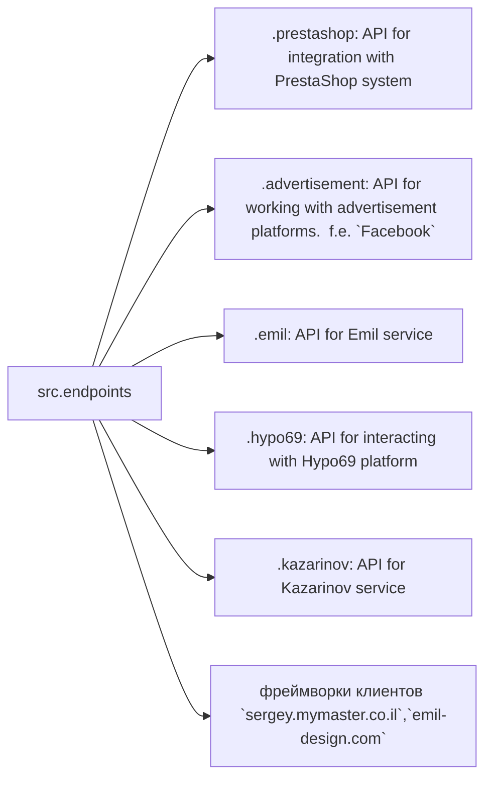

```MD
# <input code>

```[English](https://github.com/hypo69/hypo/endpoints/blob/master/readme.md)
Модуль конечных точек взаимодействия с потребителями данных
=========================================================================================

Модуль `endpoints` предоставляет реализацию API для взаимодействия с потребителями данных.
Каждая поддиректория представляет собой отдельный модуль, реализующий API для определённого сервиса.
Модуль `endpoints` включает подмодули для интеграции с различными системами потребителей,
обеспечивая взаимодействие с внешними сервисами.


## Структура модуля


### Final Consumer Endpoints


# 1. **PrestaShop**
Интеграция с API PrestaShop. Использует стандартные api.

# 2. **bots**
Подмодуль для управления интеграцией с ботами Telegram и Discord.

# 3. **emil**
Подмодуль для интеграции с клиентом  https://emil-design.com (prestashop + facebook)


# 4. **kazarinov**
Подмодуль для интеграции с поставщиком данных Kazarinov. (pricelist creator, facebook promotion)

## Описание модулей

### 1. `prestashop`
Модуль предназначен для интеграции с системой электронной коммерции PrestaShop. Реализует функционал взаимодействия с заказами, товарами и клиентами.

- **Основные функции**:
  - Создание, редактирование и удаление товаров.
  - Управление заказами и пользователями.

### 2. `advertisement`
Модуль предоставляет API для управления рекламными платформами, включая создание кампаний и аналитические отчеты.

- **Основные функции**:
  - Управление рекламными кампаниями.
  - Сбор и обработка данных аналитики.

### 3. `emil`
Интерфейс для работы с сервисом Emil, предоставляющим API для обмена данными.

- **Основные функции**:
  - Обработка и отправка запросов в сервис.
  - Сбор данных из API Emil.

### 4. `hypo69`
API для взаимодействия с платформой Hypo69, предоставляющей специфические бизнес-решения.

- **Основные функции**:
  - Получение данных о клиентах.
  - Работа с пользовательскими отчетами.

### 5. `kazarinov`
Модуль для интеграции с сервисом Kazarinov. Поддерживает функционал аналитики и обмена данными.

- **Основные функции**:
  - Интеграция данных между системами.
  - Создание отчетов и аналитика.

## Установка и использование

### Установка
Для начала работы убедитесь, что установлены все зависимости проекта. Используйте команду:

```bash
pip install -r requirements.txt
```

### Использование
Импортируйте нужный модуль в своем коде:

```python
from src.endpoints.prestashop import PrestashopAPI
from src.endpoints.advertisement import AdvertisementAPI
```

Далее настройте и используйте методы в зависимости от вашего кейса.

## Вклад в разработку

Если вы хотите внести изменения в модуль, соблюдайте следующие правила:

1. Используйте [PEP 8](https://peps.python.org/pep-0008/) для стиля кода.
2. Добавляйте тесты для нового функционала.
3. Оставляйте подробные комментарии к изменениям.

Для вопросов и предложений обращайтесь к владельцу репозитория или оставляйте комментарии в [Issues](#).
```

# <algorithm>

Пошаговая блок-схема отсутствует, т.к. код не содержит реализации функций. Блок-схема будет зависеть от конкретной реализации подмодулей (`prestashop`, `advertisement`, `emil`, `hypo69`, `kazarinov`).  Схема будет включать вызовы API этих сервисов, обработку полученных данных и взаимодействие с другими частями проекта.

# <mermaid>

```mermaid
graph LR
    subgraph src.endpoints
        src.endpoints --> prestashop
        src.endpoints --> advertisement
        src.endpoints --> emil
        src.endpoints --> hypo69
        src.endpoints --> kazarinov
        src.endpoints --> websites
    end
```

**Описание диаграммы:**

Диаграмма показывает взаимосвязь модуля `src.endpoints` с другими модулями (или системами).  Каждая стрелка `src.endpoints --> ...` представляет собой взаимодействие,  где `src.endpoints` является инициатором или потребителем данных. Подмодули `prestashop`, `advertisement`, `emil`, `hypo69`, `kazarinov`  представляют собой API для интеграции с различными внешними сервисами, а `websites` – фреймворки клиентов.


# <explanation>

* **Импорты:** Документация описывает импорт функций/классов из подмодулей.  Например, `from src.endpoints.prestashop import PrestashopAPI`.  Это позволяет использовать функционал `PrestashopAPI` в других частях проекта. Импорты подразумевают структуру проекта `src.endpoints.modulename`, где `modulename` – имя подмодуля, который содержит API-функционал.

* **Классы:** Документация описывает классы (`PrestashopAPI`, `AdvertisementAPI`, etc.), которые, скорее всего, содержат методы для взаимодействия с конкретным сервисом.  Например, класс `PrestashopAPI` предназначен для взаимодействия с API PrestaShop.  В реализации этих классов будут определены методы для работы с API (создание, чтение, обновление, удаление данных).

* **Функции:**  Документация описывает функции, которые могут быть внутри классов или отдельных модулях для выполнения конкретных задач.  Описание функций (например, `создание, редактирование, удаление товаров` в `prestashop`) определяет их функциональность и аргументы, необходимые для выполнения.  Реализация таких функций будет зависеть от структуры API-сервисов, с которыми они взаимодействуют.

* **Переменные:**  Переменные будут определены в классах и функциях.  Их типы будут зависеть от конкретного функционала и данных, которые обрабатываются.

* **Возможные ошибки/улучшения:** Недостаточно информации для определения конкретных ошибок или областей для улучшений, так как код отсутствует.  В реальности, необходимо обращать внимание на правильность обработки ошибок (обработка исключений), использование правильных типов данных, удобство использования API, соответствие PEP 8.  Также важен анализ на производительность, масштабируемость и безопасность при взаимодействии с внешними API.

* **Взаимосвязи с другими частями проекта:**  Модуль `endpoints` является связующим звеном между остальным кодом проекта и внешними API.  Он принимает запросы, отправляет запросы к внешним сервисам, обрабатывает полученные данные и возвращает результаты.

**Выводы:**

Документация описывает структуру модуля `endpoints`, но не предоставляет код.  Для детального анализа требуется изучить код реализаций подмодулей.