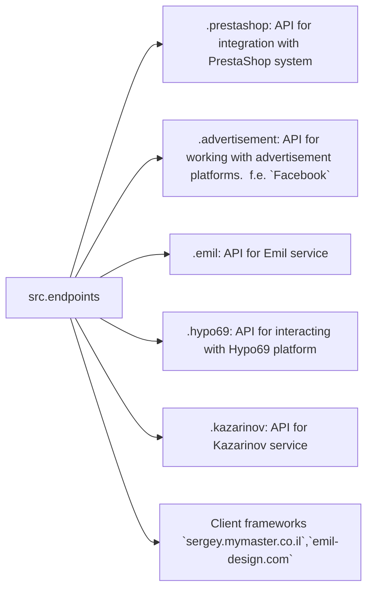
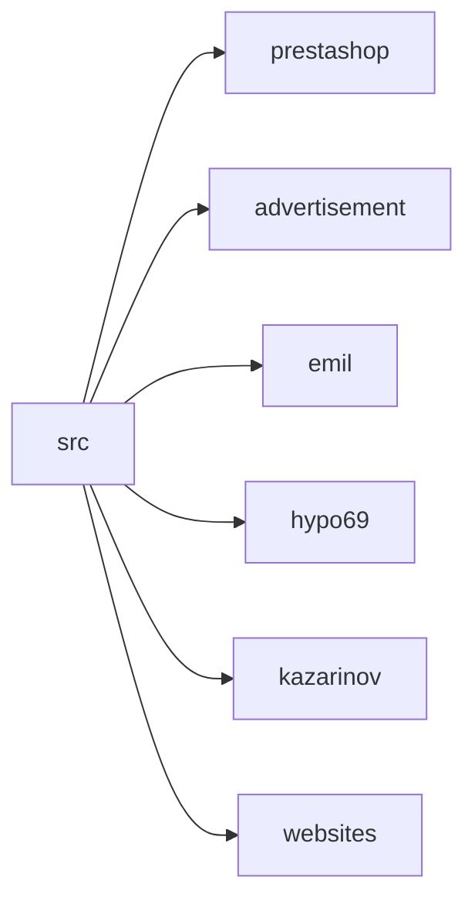

```MD
# Анализ кода модуля `endpoints`

## <input code>

```[Русский](https://github.com/hypo69/hypo/endpoints/blob/master/README.RU.MD)
### Data Consumer Endpoints Module
=========================================================================================

The `endpoints` module provides an implementation of APIs for interacting with data consumers.
Each subdirectory represents a separate module that implements the API for a specific service.
The `endpoints` module includes submodules for integration with various consumer systems,
ensuring seamless interaction with external services.

## Module Structure


### Final Consumer Endpoints

#### 1. **PrestaShop**
Integration with the PrestaShop API, utilizing standard API features.

#### 2. **bots**
Submodule for managing integration with Telegram and Discord bots.

#### 3. **emil**
`https://emil-design.com`
Submodule for integrating with the client at https://emil-design.com (PrestaShop + Facebook).

#### 4. **kazarinov**
`https://sergey.mymaster.co.il`,`@hypo69_kazarinov_bot`
Submodule for integrating with the Kazarinov data provider (pricelist creator, Facebook promotion).

## Module Descriptions

### 1. `prestashop`
This module is designed for integration with the PrestaShop e-commerce system. It implements functionality for managing orders, products, and customers.

- **Key Features**:
  - Create, edit, and delete products.
  - Manage orders and users.

### 2. `advertisement`
The module provides an API for managing advertising platforms, including campaign creation and analytical reports.

- **Key Features**:
  - Manage advertising campaigns.
  - Collect and process analytics data.

### 3. `emil`
Interface for working with the Emil service, providing an API for data exchange.

- **Key Features**:
  - Process and send requests to the service.
  - Retrieve data from the Emil API.

### 4. `hypo69`
API for interacting with the Hypo69 platform, which offers specific business solutions.

- **Key Features**:
  - Retrieve client data.
  - Work with custom reports.

### 5. `kazarinov`
Module for integrating with the Kazarinov service. It supports analytics and data exchange functionality.

- **Key Features**:
  - Data integration between systems.
  - Generate reports and perform analytics.

## Installation and Usage

### Installation
Ensure all project dependencies are installed before starting. Use the following command:

```bash
pip install -r requirements.txt
```

### Usage
Import the required module into your code:

```python
from src.endpoints.prestashop import PrestashopAPI
from src.endpoints.advertisement import AdvertisementAPI
```

Then configure and use the methods depending on your use case.

## Contribution

If you want to contribute to the module, please follow these guidelines:

1. Follow [PEP 8](https://peps.python.org/pep-0008/) for code style.
2. Add tests for new features.
3. Leave detailed comments for any changes.

For questions and suggestions, contact the repository owner or leave comments in [Issues](#).
```

## <algorithm>

Не предоставлен код, только описание. Алгоритм работы не может быть описан в виде блок-схемы, так как нет кода.

## <mermaid>



## <explanation>

The provided text describes a Python module `endpoints` responsible for interacting with various external data sources.  It's a high-level overview of the module structure and functionality.

**Импорты:** The example code snippets show how to import specific classes from the `src.endpoints` modules.  The exact implementation of these APIs within each submodule (e.g., `prestashop`, `advertisement`) would be in the respective `.py` files.


**Классы:** The text mentions classes like `PrestashopAPI` and `AdvertisementAPI`. These are likely classes defining the API interfaces for interacting with the corresponding services. The classes would likely contain methods to execute actions like creating, retrieving, or updating data.


**Функции:** No specific functions are explicitly defined.  The text mentions key features (create, edit, delete products, etc.) implying the existence of relevant functions within the classes to support these actions.  


**Переменные:** The description doesn't explicitly detail variables. However, the classes would contain variables to store API keys, URLs, or other necessary configuration parameters.  These variables would be used within the functions to interact with external services.


**Возможные ошибки и улучшения:**

* **Отсутствие кода:** The analysis is based on a description, which prevents a detailed analysis of the code structure, logic, and potential bugs. The explanation would be more comprehensive if the actual code was available.
* **Отсутствие документации:** Adding docstrings to the Python classes and functions would greatly improve readability and maintainability.
* **Тестирование:**  The mention of "Add tests for new features" highlights the importance of thorough testing to ensure the reliability of the APIs.
* **Обработка ошибок:** The described APIs should handle potential errors (e.g., network issues, API errors) gracefully.
* **Уровни логирования:** Using appropriate logging levels would allow for more detailed tracking of events and debugging issues.

**Взаимосвязи с другими частями проекта:** The `endpoints` module interacts with other parts of the `hypo` project, likely data processing, storage, and presentation layers. The specific interactions depend on the implementation details.