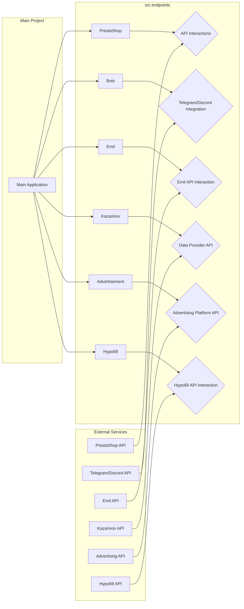

# Анализ кода модуля src.endpoints

## 1. <input code>

```rst
.. module: src.endpoints
```
[Root ↑](https://github.com/hypo69/hypo/blob/master/REDAME.RU.MD)

[Русский](https://github.com/hypo69/hypo/blob/master/endpoints/readme.ru.md)

Data Consumer Endpoints Module
=========================================================================================

The `endpoints` module provides an implementation of APIs for interacting with data consumers.
Each subdirectory represents a separate module that implements the API for a specific service.
The `endpoints` module includes submodules for integration with various consumer systems,
ensuring seamless interaction with external services.

## Module Structure


### Final Consumer Endpoints

#### 1. **PrestaShop**
Integration with the PrestaShop API, utilizing standard API features.

#### 2. **bots**
Submodule for managing integration with Telegram and Discord bots.

#### 3. **emil**
`https://emil-design.com`
Submodule for integrating with the client at https://emil-design.com (PrestaShop + Facebook).

#### 4. **kazarinov**
`https://sergey.mymaster.co.il`,`@hypo69_kazarinov_bot`
Submodule for integrating with the Kazarinov data provider (pricelist creator, Facebook promotion).

## Module Descriptions

### 1. `prestashop`
This module is designed for integration with the PrestaShop e-commerce system. It implements functionality for managing orders, products, and customers.

- **Key Features**:
  - Create, edit, and delete products.
  - Manage orders and users.

### 2. `advertisement`
The module provides an API for managing advertising platforms, including campaign creation and analytical reports.

- **Key Features**:
  - Manage advertising campaigns.
  - Collect and process analytics data.

### 3. `emil`
Interface for working with the Emil service, providing an API for data exchange.

- **Key Features**:
  - Process and send requests to the service.
  - Retrieve data from the Emil API.

### 4. `hypo69`
API for interacting with the Hypo69 platform, which offers specific business solutions.

- **Key Features**:
  - Retrieve client data.
  - Work with custom reports.

### 5. `kazarinov`
Module for integrating with the Kazarinov service. It supports analytics and data exchange functionality.

- **Key Features**:
  - Data integration between systems.
  - Generate reports and perform analytics.

## Installation and Usage

### Installation
Ensure all project dependencies are installed before starting. Use the following command:

```bash
pip install -r requirements.txt
```

### Usage
Import the required module into your code:

```python
from src.endpoints.prestashop import PrestashopAPI
from src.endpoints.advertisement import AdvertisementAPI
```

Then configure and use the methods depending on your use case.

## Contribution

If you want to contribute to the module, please follow these guidelines:

1. Follow [PEP 8](https://peps.python.org/pep-0008/) for code style.
2. Add tests for new features.
3. Leave detailed comments for any changes.

For questions and suggestions, contact the repository owner or leave comments in [Issues](#).
```

## 2. <algorithm>

N/A - The provided code is a README file, not executable code.  It describes the structure and purpose of the `src.endpoints` module, not an algorithm for its implementation.


## 3. <mermaid>



**Explanation of Dependencies:**

The diagram shows the relationships between the `src.endpoints` modules and other parts of the project, as well as external APIs.  The `endpoints` modules are responsible for interacting with external services (e.g., PrestaShop API, Emil API) to gather and process data from various consumer systems.  The `Main Application` utilizes the functions exported by the `endpoints` submodules.  The `External Services` group highlights the APIs that are being accessed by the `endpoints` modules.


## 4. <explanation>

The provided code is a README file, not Python code. It documents the structure and purpose of the `src.endpoints` module within the `hypo` project.

* **Imports:** There are no imports within the README file itself. The README describes the modules that *would* contain imports for APIs, if the project were to include the corresponding Python code.  Import statements are crucial for accessing functions from other modules.
* **Classes:** The README mentions classes like `PrestashopAPI` within modules such as `src.endpoints.prestashop`. These classes would encapsulate the logic for interacting with the PrestaShop API in Python.
* **Functions:**  Specific functions within the classes would handle tasks like making API calls, processing responses, and handling exceptions. The documentation describes the expected functionality of these functions.
* **Variables:** Variables would store API keys, URLs, and data retrieved from the APIs within the modules' implementations.  The README does not define variables or their types.
* **Possible Errors/Improvements:**  The README itself lacks executable code, so it's impossible to identify specific coding errors. The code, if properly implemented, should include error handling (e.g., `try-except` blocks) for API calls that might fail and proper logging for debugging and tracing requests.
* **Inter-project Dependencies:**  The `endpoints` module depends on external services (PrestaShop, various other APIs).  The implementation within the modules will need appropriate libraries (e.g., `requests`) for interacting with these services. The project also depends on a `requirements.txt` file to correctly manage dependencies.  The `requirements.txt` will list all Python libraries necessary to run the project.

**In summary:** The README file serves as a crucial documentation component, describing the overall organization and purpose of the `src.endpoints` module, highlighting the need for specific classes, functions, and dependencies to achieve desired functionality in the `hypo` project.