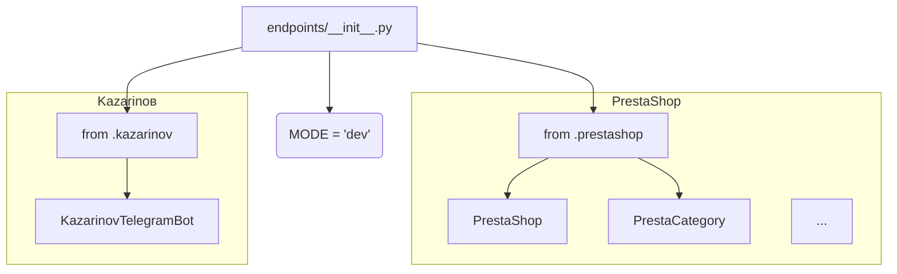

# <input code>

```python
## \file hypotez/src/endpoints/__init__.py
# -*- coding: utf-8 -*-
#! venv/Scripts/python.exe
#! venv/bin/python/python3.12

"""
.. module: src.endpoints 
	:platform: Windows, Unix
	:synopsis:

"""
MODE = 'dev'


# from .prestashop import PrestaShop, PrestaCategory, PrestaCustomer, PrestaLanguage, PrestaProduct, PrestaShopShop, PrestaSupplier, PrestaWarehouse, PriceListRequester 
# from .kazarinov import KazarinovTelegramBot
```

# <algorithm>

В данном файле `__init__.py` определены переменные, вероятно, для конфигурации модуля `endpoints`. Он импортирует классы и функции из других модулей в той же папке (`.prestashop`, `.kazarinov`).  Обычно `__init__.py` используется для инициализации подмодулей или пакетов.  В этом случае происходит импорт необходимых классов для работы с системами PrestaShop и Kazarinов.

**Логика:** Файл представляет собой пустой начальный модуль для `endpoints`. Он определяет глобальную переменную `MODE`, которая, вероятно, используется для выбора режима работы (например, `dev`, `prod`). Основное содержимое - это импорт других модулей, которые, скорее всего, содержат классы, отвечающие за взаимодействие с определёнными API или базами данных.

**Пример данных:** Никаких данных не передается и не обрабатывается внутри этого `__init__.py`. Данные будут передаваться при вызове функций и методов из импортированных модулей.

# <mermaid>



# <explanation>

**Импорты:**

Файл `__init__.py` в папке `endpoints` импортирует классы и функции из других модулей внутри папки `endpoints`.
Например: `from .prestashop import ...` и `from .kazarinov import ...` . Эти строки импортируют необходимые классы для работы с системами PrestaShop и Kazarinов.  Этот подход организует код в логические модули.

**Классы:**

* `PrestaShop`, `PrestaCategory`, `PrestaCustomer`, `PrestaLanguage`, `PrestaProduct`, `PrestaShopShop`, `PrestaSupplier`, `PrestaWarehouse`, `PriceListRequester`, `KazarinovTelegramBot`: Эти классы, вероятно, представляют собой объекты, описывающие различные сущности или сервисы, связанные с системами PrestaShop и Kazarinов.  Они отвечают за взаимодействие с API этих систем.


**Функции:**

Этот `__init__.py` не содержит функций.  Функции, отвечающие за работу с указанными системами, будут находиться в `prestashop.py` и `kazarinov.py`


**Переменные:**

`MODE = 'dev'`: Переменная, вероятно, для выбора режима работы приложения. `'dev'` указывает на режим разработки. Она может влиять на поведение других модулей.


**Возможные ошибки и улучшения:**

* **Недостаток документации:** Отсутствуют комментарии к переменной `MODE` и более подробные пояснения о том, как использовать и конфигурировать  этот модуль. Документация важна для понимания и использования.
* **Нет обработки ошибок:**  Отсутствует обработка ситуаций, когда импортируемые модули не найдены.
* **Более сложная конфигурация:**  В `__init__.py` обычно содержатся настройки, которые могут быть загружены из конфигурационных файлов, а не жестко закодированы.
* **Необъясненные зависимости:**  Неизвестно, какие зависимости `endpoints` имеет от других модулей. Необходимо проанализировать и документировать эти зависимости.


**Взаимосвязи с другими частями проекта:**

`endpoints` отвечает за взаимодействие с внешними системами (PrestaShop и Kazarinов).  Поэтому он связан с любыми частями приложения, которые нуждаются в данных из этих систем (например, с частью приложения, которая отвечает за обработку заказов, вывод отчетов).  Связь через вызовы функций и методов из импортированных модулей. `endpoints` является звеном, связывающим приложение с внешними API.