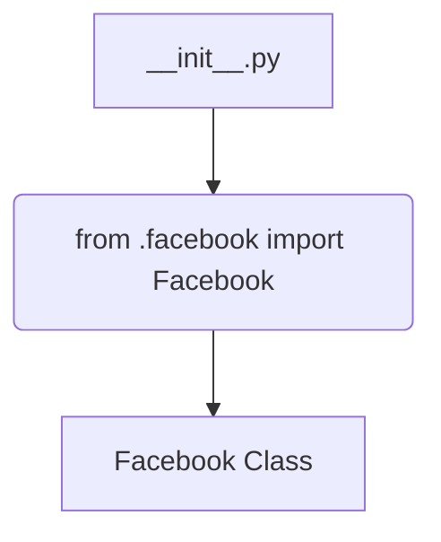
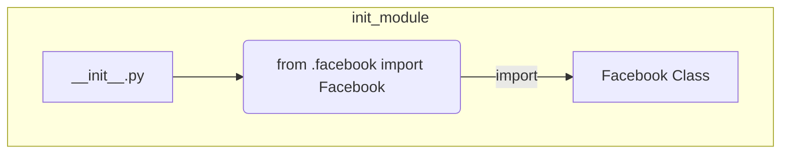

```MD
# Анализ файла hypotez/src/endpoints/advertisement/__init__.py

## <input code>

```python
## \file hypotez/src/endpoints/advertisement/__init__.py
# -*- coding: utf-8 -*-\
#! venv/Scripts/python.exe
#! venv/bin/python/python3.12

"""
.. module: src.endpoints.advertisement 
	:platform: Windows, Unix
	:synopsis:

"""
MODE = 'dev'


from .facebook import Facebook
```

## <algorithm>

Этот файл представляет собой инициализационный модуль для пакета `advertisement`.  Он не содержит сложной логики.  Основной функционал обеспечивается импортом класса `Facebook` из подпапки `facebook`.

**Блок-схема:**



**Пример:**

В приложении, использующем этот модуль, можно будет импортировать и использовать класс `Facebook`.

```python
from hypotez.src.endpoints.advertisement import Facebook
fb_instance = Facebook()
#Далее использование объекта fb_instance
```

## <mermaid>




## <explanation>

**Импорты:**

- `from .facebook import Facebook`: Этот импорт подключает класс `Facebook` из модуля `facebook`, расположенного в той же папке. Значок `.` перед именем папки указывает на текущую директорию. Это типичный способ организации импорта в Python.  Это указывает на зависимость от модуля `facebook` в рамках пакета `advertisement`.

**Классы:**

- `Facebook`: Этот класс (определенный в `facebook.py`) описывает, скорее всего, API для работы с рекламной платформой Facebook.  Подробности о его реализации, атрибутах и методах можно найти в файле `facebook.py`. Пока не видно, какие именно взаимодействия этот класс предоставляет.

**Функции:**

- Нет функций в этом файле.  Этот файл — инициализационный, поэтому его цель — организовывать и экспортировать доступ к другим компонентам.

**Переменные:**

- `MODE = 'dev'`:  Эта переменная вероятно используется для определения режима работы (например, разработка, производство).  Она может влиять на поведение других частей приложения.  Тип данных - строка.

**Возможные ошибки или области для улучшений:**

- Нет явного определения, как именно используются экспортируемые классы. Это требует дальнейшего анализа (`facebook.py`).
- В коде отсутствует явная документация для переменных.
- Отсутствует подробное описание и документация по классу `Facebook`.  Потенциально полезно добавить примеры использования или прописать более подробно, как этот класс взаимодействует с другими частями системы.

**Взаимосвязи с другими частями проекта:**

Этот файл является частью структуры пакета `hypotez`, и его связь с другими компонентами в проекте очевидна, но не детализирована в этом файле. Чтобы определить полные взаимосвязи, необходимо проанализировать другие файлы, такие как `facebook.py` и модули, которые используют класс `Facebook`.


**Вывод:**

Файл `__init__.py` в папке `advertisement` выполняет роль модуля-пусковой площадки для доступа к классу `Facebook`.  Для более глубокого понимания функционала необходимо проанализировать файл `facebook.py` и контекст, в котором используется этот класс.