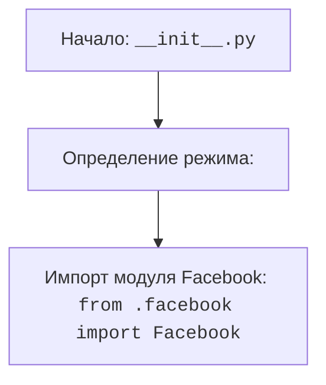

## Анализ кода `hypotez/src/endpoints/advertisement/__init__.py`

### 1. <алгоритм>

1. **Начало:** Инициализация модуля `__init__.py` в пакете `src.endpoints.advertisement`.
    - Пример: Когда Python интерпретатор встречает этот файл, он запускает код внутри него.
2. **Определение режима `MODE`:** Устанавливается переменная `MODE` в значение `'dev'`. Это может использоваться для условного выполнения кода в зависимости от режима работы (разработка, тестирование, продакшн).
    - Пример: `` устанавливает режим разработки.
3. **Импорт модуля `Facebook`:** Импортируется модуль `Facebook` из текущего пакета (`.`). Этот модуль, вероятно, содержит функциональность, связанную с Facebook рекламой.
    - Пример: `from .facebook import Facebook` импортирует класс или модуль `Facebook`.

### 2. <mermaid>

**Объяснение `mermaid`:**

- `Start`: Начало выполнения файла `__init__.py`.
- `ModeDef`: Определяется переменная `MODE`, устанавливающая режим работы в `'dev'`.
- `ImportFacebook`: Импортируется модуль `Facebook` из файла `facebook.py`, находящегося в той же директории. Это означает, что файл `facebook.py` должен существовать в каталоге `hypotez/src/endpoints/advertisement/`.

### 3. <объяснение>

**Импорты:**

-   `from .facebook import Facebook`:
    -   Назначение: Импортирует модуль `Facebook` из файла `facebook.py`, находящегося в той же директории.
    -   Взаимосвязь с `src`:  `src` является корневым каталогом проекта, а `src.endpoints.advertisement` - это подпакет, где и находится `__init__.py`. Таким образом, это импорт внутри пакета. `Facebook` будет классом, который позволяет взаимодействовать с Facebook API для целей рекламы.

**Переменные:**

-   ``:
    -   Тип: Строка.
    -   Использование: Определяет режим работы приложения. Обычно используется для настройки окружения (например, использование тестовых баз данных в режиме `dev`). Данная переменная вероятно используется для настройки среды разработки (Development).
    -   **Возможные улучшения:** Можно добавить поддержку переменных окружения (например, `os.environ`) для динамического переключения режимов.

**Функции:**

-   В данном коде функции отсутствуют.

**Классы:**

-   Класс `Facebook` импортируется из другого модуля, его функциональность будет определена в `facebook.py`. Он вероятно отвечает за взаимодействие с API Facebook для целей рекламы.

**Общая сводка:**

-   `__init__.py` файл в пакете `src.endpoints.advertisement` инициализирует пакет. Он устанавливает режим работы в `dev` и импортирует функциональность для работы с Facebook рекламой.
-   Цепочка взаимосвязей: Этот модуль, вероятно, является частью системы управления рекламой, которая интегрируется с различными рекламными платформами (например, Facebook). `MODE` позволяет настраивать поведение этой системы в зависимости от окружения. Модуль `Facebook` скорее всего использует `requests`, или что то подобное для работы с `api` фейсбука.
-   **Потенциальные ошибки:** Отсутствие обработки исключений при импорте `Facebook`, отсутствие проверки режима `MODE` (лучше использовать константы), отсутствие документации.