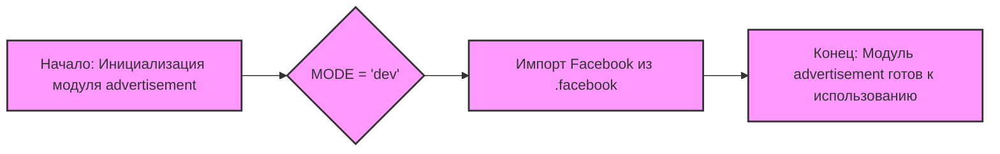

## Анализ кода `hypotez/src/endpoints/advertisement/__init__.py`

### <алгоритм>

1.  **Инициализация модуля:**
    *   Задается переменная `MODE` со значением `'dev'`.
    *   Импортируется модуль `Facebook` из `src.endpoints.advertisement.facebook`.
2.  **Завершение:**
    *   Модуль готов к использованию. Он предоставляет доступ к функционалу `Facebook` через импортированный модуль.

Пример:
    *   `MODE = 'dev'` - устанавливает режим разработки, что может влиять на логику работы модуля.
    *   `from .facebook import Facebook` - импортирует класс `Facebook` для использования в других частях проекта.

### <mermaid>

**Объяснение зависимостей:**

*   Диаграмма начинается с инициализации модуля `advertisement`.
*   Затем устанавливается значение переменной `MODE`.
*   После этого происходит импорт модуля `Facebook` из `src.endpoints.advertisement.facebook`.
*   В конце модуль готов к использованию.

### <объяснение>

**Импорты:**

*   `from .facebook import Facebook`: Этот импорт связывает текущий пакет `src.endpoints.advertisement` с подмодулем `facebook`. Он импортирует класс `Facebook`, позволяя использовать его функциональность в этом модуле. `.facebook` указывает на то, что модуль `facebook.py` находится в той же директории.

**Переменные:**

*   `MODE = 'dev'`:  Это строковая переменная, которая устанавливает режим работы модуля. В данном случае, она указывает на то, что модуль находится в режиме разработки (`dev`). Это может влиять на поведение модуля, например, при логировании или использовании отладочных функций.

**Общее:**

*   Файл `__init__.py` в Python используется для того, чтобы директория считалась пакетом. В этом случае он инициализирует пакет `advertisement`.
*   В данном файле, кроме инициализации, происходит импорт модуля `Facebook`, делая его доступным в контексте пакета `advertisement` и других модулей, которые будут импортировать этот пакет.
*   Установка режима `MODE = 'dev'` может использоваться для управления поведением модуля, например, при вызове методов из `Facebook`, можно проверять значение `MODE`, чтобы включить дополнительное логирование или отладку в режиме разработки.

**Потенциальные улучшения:**

*   Можно добавить поддержку других режимов, например, `'prod'` для production, и проверять это значение перед выполнением каких-либо действий.
*   Можно добавить документацию в файл `__init__.py` для более ясного понимания назначения модуля и его содержимого.

**Взаимосвязь с другими частями проекта:**

*   Модуль `advertisement` является частью пакета `endpoints` в проекте `hypotez`.
*   Модуль `Facebook` предположительно обеспечивает функциональность для работы с Facebook API.
*   Другие части проекта могут импортировать этот модуль для доступа к функциональности связанной с рекламой в Facebook.