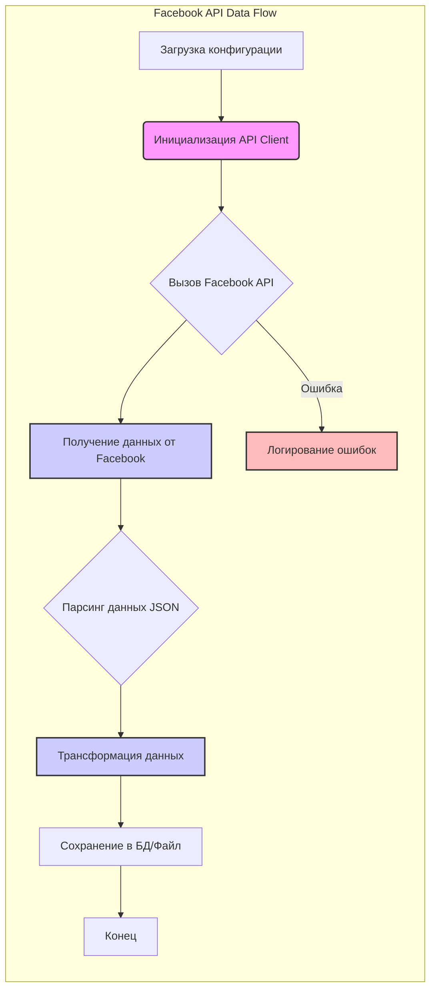

# Анализ кода из `hypotez/src/endpoints/advertisement/facebook/README.MD`

К сожалению, предоставленный код пуст.  Файл `README.MD` обычно содержит документацию или описание проекта, а не исполняемый код. Поэтому я не могу проанализировать код по заданным критериям.

Вместо этого, я предоставлю шаблон анализа, который можно использовать, если бы в файле был код.

## 1. <алгоритм>

**Предположим, что в файле был бы код, связанный с API Facebook для рекламы.**

Примерный алгоритм мог бы выглядеть так:

1.  **Инициализация:**
    *   Загрузка конфигурации (например, токена доступа, ID приложения).
    *   Создание экземпляра клиента API Facebook.
    *   Пример:
        ```python
        config = load_config("facebook_config.json")
        fb_client = FacebookClient(config['access_token'], config['app_id'])
        ```

2.  **Получение данных:**
    *   Вызов API Facebook для получения рекламных кампаний, групп объявлений, объявлений, и т.д.
    *   Обработка полученного ответа (например, парсинг JSON).
    *   Пример:
        ```python
        campaigns_data = fb_client.get_campaigns()
        parsed_campaigns = parse_campaign_data(campaigns_data)
        ```

3.  **Трансформация данных:**
    *   Преобразование полученных данных в нужный формат (например, для сохранения в базе данных).
    *   Пример:
        ```python
        transformed_campaigns = transform_campaign_data(parsed_campaigns)
        ```

4.  **Сохранение данных:**
    *   Запись трансформированных данных в базу данных или файл.
    *   Пример:
        ```python
         save_to_db(transformed_campaigns)
        ```

5.  **Обработка ошибок:**
    *   Логирование ошибок, если возникли проблемы при вызове API или обработке данных.
    *   Пример:
        ```python
        try:
           #Вызов API
        except FacebookAPIError as e:
            log_error(f"Ошибка API: {e}")
        ```
6. **Обновление данных:**
    * Реализация алгоритма для периодического обновления данных, например, каждые 15 минут.
    * Пример:
        ```python
        while True:
            # Шаги с 2 по 5
            time.sleep(900)
        ```
    
**Поток данных:**

- Конфигурация -> Инициализация -> Клиент API Facebook
- Клиент API Facebook -> Запрос к Facebook API -> Ответ от Facebook API -> Парсинг ответа -> Данные
- Данные -> Трансформация данных -> Трансформированные данные
- Трансформированные данные -> Сохранение данных -> База данных/Файл
- FacebookAPIError -> Логирование ошибок
## 2. <mermaid>

**Объяснение `mermaid`:**

*   **A[Загрузка конфигурации]**: Узел обозначает начальный этап загрузки параметров, необходимых для работы с Facebook API (например, токенов доступа).
*   **B(Инициализация API Client)**: Представляет создание экземпляра класса для взаимодействия с API Facebook, используя загруженную конфигурацию.
*   **C{Вызов Facebook API}**:  Обозначает точку, где происходит запрос к API Facebook. Это ромб, так как это является точкой принятия решений (есть ошибка или нет).
*   **D[Получение данных от Facebook]**: Узел, где хранятся сырые данные, полученные от Facebook.
*   **E{Парсинг данных JSON}**: Представляет процесс преобразования данных JSON в структурированные объекты, которые можно использовать в дальнейшем.
*   **F[Трансформация данных]**: Обозначает этап, где данные преобразуются к нужному для проекта виду.
*   **G[Сохранение в БД/Файл]**: Узел, где обработанные данные сохраняются в базу данных или в файл.
*   **C -- Ошибка --> H[Логирование ошибок]**:  Показывает, что если при вызове API возникла ошибка, то она должна быть залогирована.
*  **I[Конец]**: Конечный узел процесса.

**Зависимости, отображённые на диаграмме:**

*   **Зависимость инициализации:** `Инициализация API Client` (B) зависит от `Загрузки конфигурации` (A).
*   **Зависимость данных:** `Получение данных от Facebook` (D) зависит от успешного `Вызова Facebook API` (C).
*   **Зависимость обработки:** `Парсинг данных JSON` (E) зависит от `Получения данных от Facebook` (D).
*   **Зависимость трансформации:** `Трансформация данных` (F) зависит от `Парсинга данных JSON` (E).
*   **Зависимость сохранения:** `Сохранение в БД/Файл` (G) зависит от `Трансформации данных` (F).
*   **Зависимость логирования ошибок**: `Логирование ошибок` (H) зависит от `Вызова Facebook API` (С).

## 3. <объяснение>

**Предполагаемый код:**

Поскольку в файле `README.MD` нет кода, я буду объяснять гипотетический код, который мог бы там находиться, основываясь на приведенном алгоритме.

**Предполагаемый код (пример):**
```python
# src/endpoints/advertisement/facebook/facebook_api.py

import json
import requests
from datetime import datetime
import time
#import database
#import logger

class FacebookAPIError(Exception):
    """Exception raised for errors when calling the Facebook API."""
    pass

class FacebookClient:
    def __init__(self, access_token, app_id):
        self.access_token = access_token
        self.app_id = app_id
        self.base_url = "https://graph.facebook.com/v18.0"

    def _make_request(self, endpoint, params=None):
         """Makes a generic request to the Facebook API."""
         url = f"{self.base_url}/{endpoint}"
         headers = {"Authorization": f"Bearer {self.access_token}"}
         try:
             response = requests.get(url, params=params, headers=headers)
             response.raise_for_status()
             return response.json()
         except requests.exceptions.RequestException as e:
              #logger.error(f"Error during request: {e}")
              raise FacebookAPIError(f"Request error: {e}")

    def get_campaigns(self, fields=None):
          """Retrieves all advertising campaigns from Facebook.
        
          Args:
              fields (list of str, optional): Fields to retrieve for the campaigns. Defaults to None.
        
           Returns:
              dict: A dictionary containing all campaigns.
        
           Raises:
              FacebookAPIError: If there is an error when getting campaigns.
          """
          endpoint = "me/campaigns"
          params = {'fields': ','.join(fields)} if fields else None
          return self._make_request(endpoint, params)

def load_config(config_file):
     """Loads configuration parameters from a JSON file."""
     with open(config_file, 'r') as f:
        return json.load(f)

def parse_campaign_data(data):
      """Parses the campaign data to extract relevant information."""
      parsed_campaigns = []
      for campaign in data.get('data', []):
            parsed_campaigns.append({
                'id': campaign['id'],
                'name': campaign['name'],
                'status': campaign['status'],
                'created_time': campaign['created_time']
        })
      return parsed_campaigns

def transform_campaign_data(data):
      """Transforms parsed campaign data into a format suitable for storage."""
      transformed_campaigns = []
      for item in data:
        item['created_time'] = datetime.fromisoformat(item['created_time']).strftime('%Y-%m-%d %H:%M:%S')
        transformed_campaigns.append(item)
      return transformed_campaigns

def save_to_db(data):
     """Saves transformed data into a database."""
     #database.insert_data(data)
     print(f"Data has been saved {data}")

# Логика периодического обновления данных
def update_facebook_data():
    config = load_config("facebook_config.json")
    fb_client = FacebookClient(config['access_token'], config['app_id'])
    while True:
        try:
           campaigns_data = fb_client.get_campaigns(fields=['id', 'name', 'status', 'created_time'])
           parsed_campaigns = parse_campaign_data(campaigns_data)
           transformed_campaigns = transform_campaign_data(parsed_campaigns)
           save_to_db(transformed_campaigns)
        except FacebookAPIError as e:
            #logger.error(f"Ошибка API: {e}")
            print(f"Ошибка API: {e}")

        time.sleep(900) # Обновление каждые 15 минут
if __name__ == "__main__":
   update_facebook_data()

```

**Объяснение импортов:**

*   `json`: Используется для работы с JSON-данными (загрузка конфигурации, парсинг ответов API). Взаимосвязь с проектом:  используется при загрузке файла `config.json`.
*   `requests`: Библиотека для совершения HTTP-запросов к API Facebook. Взаимосвязь с проектом: является ключевой зависимостью для взаимодействия с API Facebook.
* `datetime`: Библиотека для работы со временем. Взаимосвязь с проектом: используется для форматирования времени.
* `time`:  Библиотека для работы со временем. Взаимосвязь с проектом: используется для организации периодического обновления данных.
*   `#import database`:  Представляет взаимодействие с модулем БД. Взаимосвязь с проектом: Предполагается, что есть модуль `database` для сохранения данных.
*   `#import logger`:  Представляет взаимодействие с модулем логирования. Взаимосвязь с проектом:  Предполагается, что есть модуль `logger` для записи ошибок.

**Объяснение классов:**

*   **`FacebookAPIError(Exception)`**: Пользовательское исключение, которое выбрасывается при ошибках взаимодействия с API Facebook. Это улучшает читаемость кода и дает возможность обрабатывать ошибки API отдельно.
*   **`FacebookClient`**:
    *   **Роль:** Класс для взаимодействия с API Facebook. Инкапсулирует детали авторизации и HTTP-запросов.
    *   **Атрибуты:**
        *   `access_token`: Токен доступа для авторизации в Facebook API.
        *   `app_id`: ID приложения Facebook.
        *   `base_url`: Базовый URL для запросов к Facebook API.
    *   **Методы:**
        *   `__init__`: Конструктор, инициализирует атрибуты класса.
        *    `_make_request`: Отправляет запрос к API Facebook и возвращает ответ в виде JSON.
        *    `get_campaigns`: Получает данные по рекламным кампаниям.
    *   **Взаимодействие:** Используется в функциях `update_facebook_data` для выполнения API запросов.

**Объяснение функций:**

*   **`load_config(config_file)`**:
    *   **Аргументы:** `config_file` (строка) - путь к файлу конфигурации (JSON).
    *   **Возвращаемое значение:** `dict` - словарь с параметрами конфигурации.
    *   **Назначение:** Загружает параметры из JSON файла.
    *   **Пример:** `config = load_config("facebook_config.json")`
*   **`parse_campaign_data(data)`**:
    *   **Аргументы:** `data` (словарь) - сырые данные, полученные от API Facebook.
    *   **Возвращаемое значение:** `list` - список словарей с отпарсенными данными о кампаниях.
    *   **Назначение:** Извлекает нужные поля из сырых данных.
    *   **Пример:**  `parsed_campaigns = parse_campaign_data(campaigns_data)`
*   **`transform_campaign_data(data)`**:
    *   **Аргументы:** `data` (список словарей) - отпарсенные данные о кампаниях.
    *   **Возвращаемое значение:** `list` - список словарей с трансформированными данными о кампаниях.
    *   **Назначение:** Преобразует данные к нужному формату (например, форматирует время).
    *   **Пример:** `transformed_campaigns = transform_campaign_data(parsed_campaigns)`
*   **`save_to_db(data)`**:
    *   **Аргументы:** `data` (список словарей) - трансформированные данные.
    *   **Возвращаемое значение:** нет.
    *   **Назначение:** Сохраняет данные в базу данных.
    *   **Пример:** `save_to_db(transformed_campaigns)`
*   **`update_facebook_data()`**:
     *   **Аргументы:** Нет.
     *  **Возвращаемое значение:** Нет.
    *   **Назначение:**  Организация периодического обновления данных по рекламным кампаниям.
    *   **Пример:** `update_facebook_data()`

**Объяснение переменных:**

*   `config`:  Словарь, хранящий параметры конфигурации (токен доступа, ID приложения).
*   `fb_client`: Экземпляр класса `FacebookClient`.
*   `campaigns_data`: Сырые данные, полученные от Facebook API.
*   `parsed_campaigns`: Список, содержащий отпарсенные данные о рекламных кампаниях.
*   `transformed_campaigns`: Список, содержащий трансформированные данные о рекламных кампаниях.

**Потенциальные ошибки и области для улучшения:**

*   **Обработка ошибок:**
    *   Сейчас обрабатывается только `FacebookAPIError`, необходимо добавить обработку других возможных ошибок (например,  `JSONDecodeError`).
    *   Стоит добавить более детальное логирование ошибок.
*   **Управление API Rate Limits:** Facebook API имеет ограничения на количество запросов. Необходимо добавить механизмы для управления rate limits.
*   **Конфигурация:** Конфигурация загружается из файла, что хорошо, но лучше использовать переменные окружения для хранения конфиденциальных данных (токен доступа).
*   **Асинхронность:** Использование асинхронного подхода (например, `asyncio`) может значительно улучшить производительность, особенно при большом количестве запросов к API.
*   **База данных:**  Необходимо реализовать реальное сохранение данных в БД, а не только вывод в консоль.
* **Логирование:** Необходимо реализовать реальное логирование ошибок, а не только вывод в консоль.

**Взаимосвязь с другими частями проекта:**
*   Данный модуль (предположительно) является частью сервиса, который занимается сбором данных из разных рекламных платформ.
*   Он может взаимодействовать с модулями сохранения данных (`database`), логирования (`logger`),  и другими модулями, которые занимаются анализом собранных данных.

Этот анализ должен помочь понять, как мог бы работать код, который мог бы быть в файле `README.MD`.