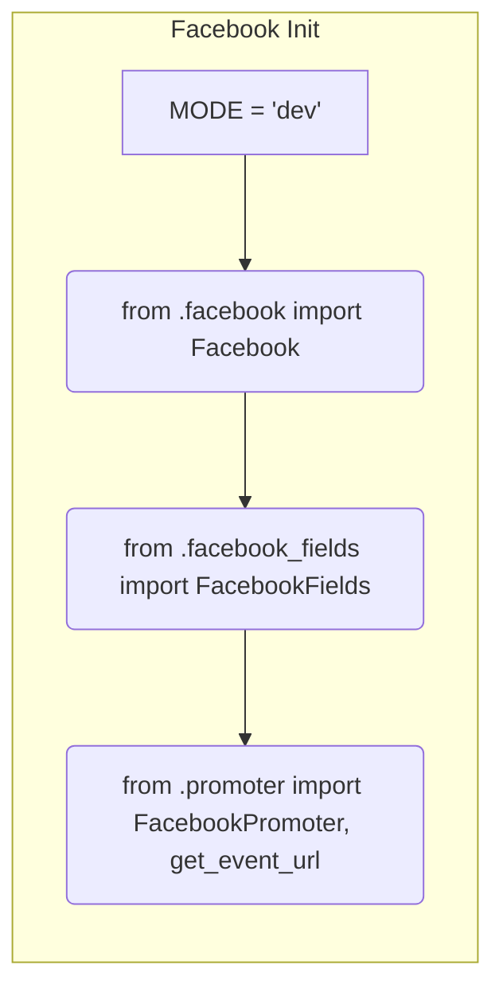

```MD
# Анализ кода hypotez/src/endpoints/advertisement/facebook/__init__.py

## <input code>

```python
## \file hypotez/src/endpoints/advertisement/facebook/__init__.py
# -*- coding: utf-8 -*-\
#! venv/Scripts/python.exe
#! venv/bin/python/python3.12

"""
.. module: src.endpoints.advertisement.facebook 
	:platform: Windows, Unix
	:synopsis:

"""
MODE = 'dev'

from .facebook import Facebook
from .facebook_fields import FacebookFields
from .promoter import FacebookPromoter, get_event_url
```

## <algorithm>

Поскольку код представляет собой файл инициализации (`__init__.py`), он не имеет прямого выполнения. Он служит для импорта модулей и констант, расположенных внутри папки `facebook`.  По сути, он определяет, какие компоненты доступны для использования в других частях проекта, которые импортируют данный файл.  Подробная блок-схема не применима, так как нет циклов, условий или сложных вычислений.


## <mermaid>



## <explanation>

**Импорты:**

- `from .facebook import Facebook`: Импортирует класс `Facebook` из модуля `facebook.py` внутри подпапки `facebook`. Это указывает на то, что этот модуль содержит логику, связанную с API Facebook.
- `from .facebook_fields import FacebookFields`: Импортирует класс `FacebookFields` из модуля `facebook_fields.py`. Предположительно, этот модуль содержит информацию о полях, используемых в API Facebook.
- `from .promoter import FacebookPromoter, get_event_url`: Импортирует класс `FacebookPromoter` и функцию `get_event_url` из модуля `promoter.py`. Это указывает на наличие логики для взаимодействия с рекламой на Facebook, а также возможно, для получения URL-адресов событий.

Все импорты относительные (`from . ...`), что означает, что импортированные модули находятся внутри текущей папки (`hypotez/src/endpoints/advertisement/facebook`).

**Классы:**

- `Facebook`: Предположительно, класс, представляющий взаимодействие с API Facebook. Он будет содержать методы для выполнения действий, таких как создание или редактирование рекламных кампаний.  Более подробная информация требует анализа кода модуля `facebook.py`.
- `FacebookFields`: Предположительно, класс или перечисление, определяющее поля и типы данных, используемые в API Facebook.  Он может использоваться для валидации и структурирования данных.  Более подробная информация требует анализа кода модуля `facebook_fields.py`.
- `FacebookPromoter`: Класс, отвечающий за продвижение (возможно, запуск рекламных кампаний) на Facebook.  Подробности требуют анализа кода модуля `promoter.py`.

**Функции:**

- `get_event_url`: Функция, возвращающая URL-адрес события.  Предположительно, она используется для интеграции с другими системами или для отображения ссылки на событие.  Подробности требуют анализа кода модуля `promoter.py`.


**Переменные:**

- `MODE = 'dev'`: Переменная, вероятно, определяющая режим работы (например, `dev` для разработки, `prod` для производства).  Это позволяет менять поведение приложения в зависимости от конфигурации.


**Возможные ошибки и улучшения:**

- Отсутствует документация.  Рекомендуется добавить docstrings к функциям, классам и методам для объяснения их назначения, аргументов и возвращаемых значений.
- Нет проверки на корректность данных.  Логика работы с API Facebook (например, проверка статуса, обработка ошибок) не представлена.


**Взаимосвязи с другими частями проекта:**

Этот файл инициализации служит точкой входа для других частей проекта, которые хотят взаимодействовать с API Facebook.  Другие части проекта будут импортировать классы и функции из этого файла для использования в своей логике.  Это указывает на более сложную архитектуру, включающую различные модули и компоненты, взаимодействующие друг с другом.