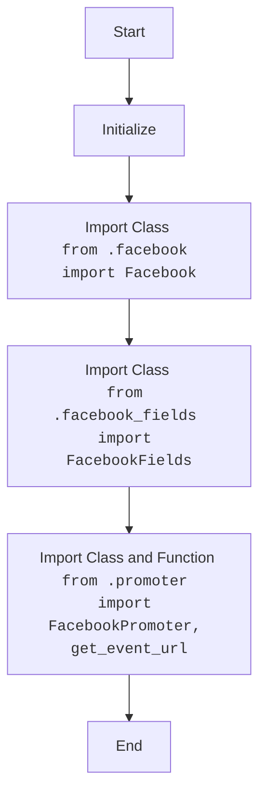

## АНАЛИЗ КОДА: `hypotez/src/endpoints/advertisement/facebook/__init__.py`

### <алгоритм>
1. **Инициализация**:
   - Задается ``. Эта переменная, вероятно, используется для определения режима работы (разработка, продакшн).
2. **Импорт `Facebook`**:
   - Импортируется класс `Facebook` из файла `facebook.py`. Этот класс, скорее всего, содержит логику взаимодействия с API Facebook.
   - *Пример*: `from .facebook import Facebook`
3. **Импорт `FacebookFields`**:
   - Импортируется класс `FacebookFields` из `facebook_fields.py`. Этот класс, вероятно, определяет необходимые поля для запросов к API Facebook.
   - *Пример*: `from .facebook_fields import FacebookFields`
4. **Импорт `FacebookPromoter` и `get_event_url`**:
   - Импортируется класс `FacebookPromoter` и функция `get_event_url` из файла `promoter.py`. Класс `FacebookPromoter` может отвечать за продвижение рекламных материалов. Функция `get_event_url` может генерировать URL для событий.
   - *Пример*: `from .promoter import FacebookPromoter, get_event_url`
5. **Конец**:
   - На этом этапе скрипт завершает свою работу, предоставляя импортированные классы и функции для использования в других модулях.

### <mermaid>

### <объяснение>

#### Импорты:

-   `from .facebook import Facebook`:
    -   **Назначение**: Импортирует класс `Facebook` из файла `facebook.py`, расположенного в том же каталоге.
    -   **Взаимосвязь с другими пакетами**: Этот класс, вероятно, обеспечивает взаимодействие с API Facebook, что является центральной частью этого подмодуля. Это позволяет создавать объекты для выполнения действий в Facebook.
-   `from .facebook_fields import FacebookFields`:
    -   **Назначение**: Импортирует класс `FacebookFields` из файла `facebook_fields.py`, находящегося в той же директории.
    -   **Взаимосвязь с другими пакетами**: `FacebookFields`, скорее всего, содержит определения полей данных, которые используются при работе с Facebook API (например, поля для рекламных объявлений).
-   `from .promoter import FacebookPromoter, get_event_url`:
    -   **Назначение**: Импортирует класс `FacebookPromoter` и функцию `get_event_url` из файла `promoter.py`, расположенного в той же директории.
    -   **Взаимосвязь с другими пакетами**: `FacebookPromoter` может отвечать за логику продвижения рекламных материалов, в то время как `get_event_url` генерирует URL для событий (например, для отслеживания конверсий).

#### Классы:

-   `Facebook`:
    -   **Роль**: Этот класс, вероятно, является основным классом, который отвечает за взаимодействие с API Facebook. Он, скорее всего, содержит методы для выполнения запросов к API (например, создание рекламных объявлений, получение статистики).
    -   **Атрибуты и методы**: Точные атрибуты и методы неизвестны без просмотра `facebook.py`, но можно предположить наличие методов для аутентификации, отправки запросов, обработки ответов, управления рекламой.
    -   **Взаимодействие**: Он может использовать `FacebookFields` для определения структуры запросов.
-   `FacebookFields`:
    -   **Роль**: Этот класс, скорее всего, служит для определения полей, которые используются при работе с Facebook API.
    -   **Атрибуты и методы**: Точные атрибуты и методы неизвестны, но можно предположить, что он содержит константы или статические методы для представления полей для запросов.
    -   **Взаимодействие**: Используется классом `Facebook` для формирования запросов к Facebook API.
-   `FacebookPromoter`:
    -   **Роль**:  Этот класс, вероятно, отвечает за продвижение рекламных материалов.
    -   **Атрибуты и методы**: Точные атрибуты и методы неизвестны без просмотра `promoter.py`, но можно предположить, что он имеет методы для создания, обновления и управления рекламными кампаниями.
    -   **Взаимодействие**: Он использует `Facebook` для взаимодействия с API Facebook, и может взаимодействовать с `get_event_url`.

#### Функции:

-   `get_event_url`:
    -   **Аргументы**: Аргументы функции неизвестны без просмотра `promoter.py`.
    -   **Возвращаемое значение**: Возвращает строку, представляющую URL.
    -   **Назначение**: Функция генерирует URL для событий. Это может быть URL для отслеживания конверсий или других действий пользователей.
    -   **Пример**:  `get_event_url(event_id="123", user_id="456")` -> `"https://example.com/event/123?user=456"`

#### Переменные:

-   `MODE`:
    -   **Тип**: Строка.
    -   **Использование**: Определяет режим работы приложения. В данном случае установлено значение `'dev'`, что указывает на режим разработки. Это позволяет изменять поведение приложения в зависимости от окружения.

#### Потенциальные ошибки и области для улучшения:

-   Отсутствует явная обработка ошибок при импорте модулей.
-   Отсутствует явная документация классов и методов (docstrings).
-   Следовало бы добавить конкретные примеры использования импортируемых объектов.
-   `MODE` определена в `__init__.py` и может быть проблематична для разных подмодулей и слоев проекта, ее лучше перенести в `gs`.

#### Взаимосвязи с другими частями проекта:

- Этот подмодуль предназначен для работы с Facebook API. Он используется в других частях проекта для создания и продвижения рекламы в Facebook.
- Предположительно, `MODE` используется в `src.gs`, который является глобальным модулем проекта.

**Цепочка взаимосвязей:**

`src.endpoints.advertisement.facebook.__init__.py` -> `src.endpoints.advertisement.facebook.facebook.py` -> `src.endpoints.advertisement.facebook.facebook_fields.py` -> `src.endpoints.advertisement.facebook.promoter.py` -> `src.gs` (предположительно).