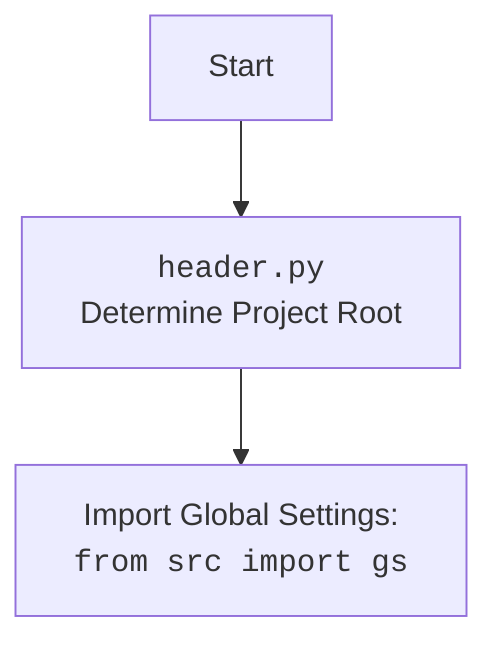

## АНАЛИЗ КОДА: `hypotez/src/endpoints/advertisement/facebook/facebook.py`

### 1. <алгоритм>

```mermaid
flowchart TD
    Start[Начало] --> Init[Инициализация класса Facebook: <br><code>__init__</code><br> Сохранение драйвера, промоутера, путей к файлам групп]
    Init --> LoginCheck{Проверка страницы: <br>Текущая страница = Страница логина?}
    LoginCheck -- Да --> LoginCall[Вызов метода login: <br><code>login()</code> <br> (Переход к сценарию логина)]
    LoginCall --> LoginScenario[Сценарий логина: <br><code>scenarios.login.login()</code>]
    LoginScenario --> AfterLogin[Действия после логина]
    LoginCheck -- Нет -->  AfterLogin[Действия после логина]

    AfterLogin --> PromotePostCheck{Проверка вызова promote_post}
    PromotePostCheck -- Да --> PromotePostCall[Вызов метода promote_post:<br><code>promote_post(item)</code>]
    PromotePostCall --> PromotePostScenario[Сценарий публикации сообщения:<br><code>scenarios.promote_post.promote_post()</code>]
    PromotePostScenario --> PostPromoted[Сообщение опубликовано]
    PromotePostCheck -- Нет --> PromoteEventCheck{Проверка вызова promote_event}

    PromoteEventCheck -- Да --> PromoteEventCall[Вызов метода promote_event: <br><code>promote_event(event)</code>]
    PromoteEventCall --> PromoteEventScenario[Сценарий продвижения события]
    PromoteEventScenario --> EventPromoted[Событие продвинуто]

    PromoteEventCheck -- Нет --> End[Конец]

    PostPromoted --> End
    EventPromoted --> End
    
    
```

**Примеры:**

*   **Инициализация:**
    `fb_instance = Facebook(driver=my_driver, promoter="my_promoter", group_file_paths=["path/to/group1", "path/to/group2"])`
    
    *   Создается экземпляр класса `Facebook` с передачей объекта `webdriver` (предположительно `my_driver`), имени `promoter` и списка путей к файлам групп.
*   **Логин:**
    `fb_instance.login()`
    
    *   Метод `login()` вызывает сценарий логина `scenarios.login.login()`, который взаимодействует с веб-драйвером для аутентификации пользователя.
*   **Продвижение поста:**
    `item_data = SimpleNamespace(message="Hello, world!", image_paths=["image1.jpg", "image2.png"])`
    `fb_instance.promote_post(item=item_data)`
    
    *   Метод `promote_post()` принимает объект `SimpleNamespace` содержащий данные поста, и вызывает сценарий `scenarios.promote_post.promote_post()`, который публикует сообщение на Facebook.

### 2. <mermaid>

```mermaid
flowchart TD
    Start[<code>facebook.py</code><br> Start] --> FacebookClass[Facebook Class<br> <code>class Facebook():</code>]
    FacebookClass --> InitMethod[<code>__init__</code><br> Initialize Driver, Promoter, Group Files]
    InitMethod --> DriverInstance[Driver Instance: <code>driver</code>]
    InitMethod --> PromoterStr[Promoter String: <code>promoter</code>]
    InitMethod --> GroupFilesList[Group Files List: <code>group_file_paths</code>]
   
    FacebookClass --> LoginMethod[<code>login()</code><br> Handles Login Scenario]
     LoginMethod --> LoginScenario[Login Scenario: <code>scenarios.login.login()</code>]
    
    FacebookClass --> PromotePostMethod[<code>promote_post(item)</code><br> Handles Post Promotion Scenario]
    PromotePostMethod --> PromotePostScenario[Promote Post Scenario: <code>scenarios.promote_post.promote_post()</code>]
    PromotePostMethod --> ItemData[Item Data: <code>SimpleNamespace</code>]
    
    FacebookClass --> PromoteEventMethod[<code>promote_event(event)</code><br> Handles Event Promotion Scenario]
    PromoteEventMethod --> PromoteEventScenario[Promote Event Scenario]
    PromoteEventMethod --> EventData[Event Data: <code>SimpleNamespace</code>]
    
    
    classDef import fill:#f9f,stroke:#333,stroke-width:2px
    DriverInstance -- импорт --> ImportDriver[<code>Driver</code>]
    PromotePostScenario  -- импорт --> ImportPromotePost[<code>from .scenarios import promote_post</code>]
    LoginScenario  -- импорт --> ImportLogin[<code>from .scenarios.login import login</code>]
    FacebookClass -- импорт --> ImportSimpleNamespace[<code>from types import SimpleNamespace</code>]
    FacebookClass -- импорт --> ImportGs[<code>from src import gs</code>]
    FacebookClass -- импорт --> ImportLogger[<code>from src.logger.logger import logger</code>]
    FacebookClass -- импорт --> ImportPath[<code>from pathlib import Path</code>]
    FacebookClass -- импорт --> ImportOs[<code>import os</code>]
    FacebookClass -- импорт --> ImportTyping[<code>from typing import Dict, List</code>]
    FacebookClass -- импорт --> ImportJjson[<code>from src.utils.jjson import j_loads, j_dumps</code>]
    ImportDriver:::import
    ImportPromotePost:::import
    ImportLogin:::import
    ImportSimpleNamespace:::import
    ImportGs:::import
    ImportLogger:::import
    ImportPath:::import
    ImportOs:::import
    ImportTyping:::import
    ImportJjson:::import
```


**Объяснение зависимостей `mermaid`:**

1.  **`FacebookClass`**: Главный класс, инкапсулирующий функциональность взаимодействия с Facebook.
2.  **`InitMethod`**: Метод инициализации `__init__`, который принимает `Driver` (экземпляр вебдрайвера), `promoter` (строку с именем промоутера) и `group_file_paths` (список путей к файлам групп) в качестве параметров.
3.  **`DriverInstance`**: Экземпляр веб-драйвера, необходимый для взаимодействия с браузером.
4.  **`PromoterStr`**: Строка, представляющая промоутера.
5.  **`GroupFilesList`**: Список строк с путями к файлам групп.
6.  **`LoginMethod`**: Метод `login()`, запускающий сценарий авторизации.
7. **`LoginScenario`**: Импортируемый сценарий логина `scenarios.login.login()`.
8.  **`PromotePostMethod`**: Метод `promote_post()`, запускающий сценарий публикации поста.
9.  **`PromotePostScenario`**: Импортируемый сценарий публикации поста `scenarios.promote_post.promote_post()`.
10. **`ItemData`**: Данные поста, передаваемые в метод `promote_post`, объект `SimpleNamespace`.
11.  **`PromoteEventMethod`**: Метод `promote_event()`, запускающий сценарий продвижения события.
12. **`PromoteEventScenario`**: Сценарий продвижения события.
13. **`EventData`**: Данные события, передаваемые в метод `promote_event`, объект `SimpleNamespace`.
14.  **Импорты**:
    *   `Driver`: Тип для аннотации, представляет вебдрайвер.
    *   `scenarios.promote_post`: Сценарий для продвижения поста.
    *   `scenarios.login.login`: Сценарий для логина.
    *   `SimpleNamespace`: Класс для создания объектов с атрибутами.
    *   `src`: Пакет верхнего уровня проекта.
    *   `gs`: Глобальные настройки.
    *   `logger`: Логгер для записи событий.
    *    `Path`: Класс для работы с путями файловой системы
    *   `os`: Модуль для взаимодействия с операционной системой.
    *   `typing`: Модуль для работы с аннотациями типов.
    *   `j_loads, j_dumps`: Функции для работы с JSON.
15. **`header.py`**: Скрипт определяет корень проекта и импортирует глобальные настройки.

### 3. <объяснение>

**Импорты:**

*   `from __future__ import annotations`: Позволяет использовать строковые аннотации типов, что особенно полезно для циклических зависимостей типов.
*   `import os, sys`:  `os` для работы с файловой системой и `sys` для параметров командной строки и других системных операций, хотя в коде явно не используются.
*   `from pathlib import Path`: Для работы с путями к файлам и директориям.
*    `from types import SimpleNamespace`: Создает простой объект с атрибутами, удобно для передачи данных.
*   `from typing import Dict, List`:  Используется для аннотации типов.
*   `from src import gs`: Импортирует глобальные настройки проекта, определенные в пакете `src`.
*   `from src.utils.jjson import j_loads, j_dumps`: Импортирует функции для работы с JSON (`j_loads` для загрузки из JSON, `j_dumps` для сохранения в JSON).
*   `from src.utils.printer import pprint`: Импортирует функцию `pprint` для "красивой печати" данных.
*   `from src.logger.logger import logger`: Импортирует объект `logger` для логирования событий.
*   `from .scenarios.login import login`: Импортирует функцию `login` из модуля `login.py` в текущей директории для выполнения сценария логина.
*   `from .scenarios import switch_account, promote_post,  post_title, upload_media, update_images_captions`: Импортирует функции сценариев для переключения аккаунта, публикации поста, установки заголовка, загрузки медиа, и обновления подписей.

**Классы:**

*   `class Facebook()`:
    *   **Назначение**: Класс для управления взаимодействием с Facebook через вебдрайвер.
    *   **Атрибуты**:
        *   `d: 'Driver'`: Объект веб-драйвера (строковая аннотация).
        *   `start_page: str`: URL начальной страницы Facebook.
        *   `promoter: str`: Строка с именем промоутера.
    *   **Методы**:
        *   `__init__(self, driver: 'Driver', promoter: str, group_file_paths: list[str], *args, **kwards)`:
            *   **Назначение**: Конструктор класса, принимает драйвер, имя промоутера и список путей к файлам групп.
            *   **Пример**: `fb = Facebook(driver=webdriver.Chrome(), promoter="my_user", group_file_paths=["path/to/file.txt"])`
        *   `login(self) -> bool`:
            *   **Назначение**: Вызывает сценарий логина.
            *   **Возвращает**: `True`, если логин успешен.
        *   `promote_post(self, item: SimpleNamespace) -> bool`:
            *   **Назначение**: Отправляет текст и медиа в форму сообщения.
            *   **Аргументы**: `item` - объект `SimpleNamespace` содержащий информацию о посте.
            *   **Возвращает**: `True`, если пост успешно опубликован.
        * `promote_event(self, event: SimpleNamespace)`:
            *   **Назначение**: Обрабатывает продвижение события.
            *   **Аргументы**: `event` - объект `SimpleNamespace` содержащий информацию о событии.
    *   **Взаимодействие**:
        *   Использует объект веб-драйвера `d` для взаимодействия с браузером.
        *   Использует импортированные сценарии из `scenarios/` для выполнения конкретных задач.

**Функции:**

*   `login(self) -> bool`:
    *   **Аргументы**: Принимает экземпляр класса `Facebook`.
    *   **Назначение**: Вызывает сценарий логина (импортируется из `scenarios/login.py`) и выполняет его.
    *   **Возвращает**: `True` при успешном логине.
*   `promote_post(self, item: SimpleNamespace) -> bool`:
    *   **Аргументы**: `self` - экземпляр класса `Facebook`, `item` - данные поста в виде `SimpleNamespace`.
    *   **Назначение**: Вызывает сценарий публикации поста (импортируется из `scenarios/promote_post.py`).
    *   **Возвращает**: `True` если публикация успешна.
*   `promote_event(self, event: SimpleNamespace)`:
    *   **Аргументы**: `self` - экземпляр класса `Facebook`, `event` - данные события в виде `SimpleNamespace`.
    *   **Назначение**: Вызывает сценарий продвижения события.
    *   **Возвращает**: нет.

**Переменные:**

*   ``: Глобальная переменная, определяющая режим работы (здесь "dev" для разработки).
*   `d`: Объект веб-драйвера.
*   `start_page`: URL стартовой страницы Facebook.
*   `promoter`: Строка с именем промоутера.
*   `group_file_paths`: Список путей к файлам групп.

**Потенциальные ошибки и области для улучшения:**

*   **Обработка исключений**: Отсутствует обработка исключений при работе с веб-драйвером и сценариями, что может привести к сбоям.
*   **Типизация**: Отсутствует конкретная типизация для `Driver`, что может привести к ошибкам во время выполнения.
*   **Комментарии**: Не все методы и сценарии имеют подробные docstring, что затрудняет понимание кода.
*   **Проверка логина**: В коде закомментирована проверка на то, что пользователь на странице логина. Она необходима для автоматического запуска процесса логина если это нужно.
*   **Недостаточно описанные сценарии**: Класс полагается на внешние сценарии, детали которых не видны в текущем файле, что может усложнить отладку и модификацию.
*   **Асинхронность**: Код не использует асинхронность, что может замедлить выполнение при выполнении задач, связанных с веб-драйвером.
*   **Конфигурация**: В коде нет конфигурации, такой как логины, пароли. Они могут браться из `gs`.

**Цепочка взаимосвязей:**

*   Класс `Facebook` зависит от:
    *   Объекта `Driver` (веб-драйвера), который должен быть создан вне этого класса.
    *   Модулей сценариев `scenarios/login.py`, `scenarios/promote_post.py` и других.
    *   Глобальных настроек `gs` из пакета `src`.
    *   Модуля логирования `logger` для записи событий.
    *   Модулей `jjson` для работы с JSON.
*   Сценарии (`scenarios/`) будут зависеть от объекта `Driver` и других библиотек, необходимых для взаимодействия с веб-страницами.
*   Глобальные настройки `gs` могут влиять на работу класса `Facebook` и сценариев.
*   Модули `logger` и `jjson` используются для логирования и работы с данными.
* `header.py` является начальным скриптом который определяет корень проекта и импортирует глобальные настройки.

Этот анализ предоставляет полное представление о структуре, функциональности и зависимостях кода в `facebook.py`.