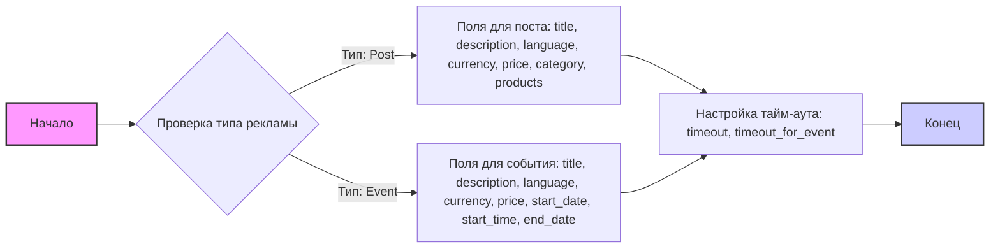

## Анализ JSON файла: `facebook_fields.json`

### 1. <алгоритм>

JSON-файл `facebook_fields.json` описывает структуру данных для полей, используемых при создании рекламных объявлений в Facebook. Этот файл служит своего рода "шаблоном" или "схемой" для определения, какие данные необходимо собрать и в каком формате, чтобы подготовить объявление к отправке в Facebook API.

**Блок-схема:**



**Примеры:**

*   **Объявление типа "Пост":**
    ```json
    {
        "post": {
            "title": "Продажа велосипеда",
            "description": "Продается отличный горный велосипед в отличном состоянии",
            "language": "ru",
            "currency": "RUB",
            "price": "15000",
            "category": "Спорт",
            "products": ["product_id_123", "product_id_456"]
        },
        "timeout": 10,
        "timeout_for_event": "presence_of_element_located"
    }
    ```
*   **Объявление типа "Событие":**
    ```json
    {
         "event": {
            "title": "Мастер-класс по рисованию",
            "description": "Приглашаем на мастер-класс для начинающих",
            "language": "ru",
            "currency": "RUB",
            "price": "500",
            "start_date": "2024-07-20",
            "start_time": "18:00",
            "end_date": "2024-07-20"
        },
        "timeout": 5,
        "timeout_for_event": "presence_of_element_located"
    }
    ```

### 2. <mermaid>

```mermaid
flowchart TD
    Start[Начало: Чтение JSON файла] --> CheckType{Проверка типа рекламы: "post" или "event"};
    CheckType -- post --> PostFields[Определение полей поста: title, description, language, currency, price, category, products];
    CheckType -- event --> EventFields[Определение полей события: title, description, language, currency, price, start_date, start_time, end_date];
    PostFields --> TimeoutConfig[Настройка тайм-аута: timeout, timeout_for_event];
    EventFields --> TimeoutConfig;
    TimeoutConfig --> End[Конец: Данные готовы к отправке в API];
    
    style Start fill:#f9f,stroke:#333,stroke-width:2px
    style End fill:#ccf,stroke:#333,stroke-width:2px
```

**Объяснение зависимостей:**

*   Диаграмма `mermaid` представляет собой поток данных, описывающий логику обработки JSON файла `facebook_fields.json`. Она показывает, как данные структурированы в зависимости от типа объявления (post или event).
*   Нет внешних зависимостей (например, импорта модулей) поскольку это просто структура данных.

### 3. <объяснение>

**Импорты:**

*   В данном файле нет импортов, так как это JSON-файл, а не Python-код. JSON используется для описания структуры данных, а не для выполнения кода.

**Классы:**

*   Файл не содержит определений классов, поскольку это файл данных, а не кода.

**Функции:**

*   Файл не содержит определений функций, поскольку это файл данных, а не кода.

**Переменные:**

*   **`post`**: Объект JSON, содержащий поля, необходимые для публикации поста в Facebook. Поля включают:
    *   `title`: Заголовок поста. Тип: `string`.
    *   `description`: Описание поста. Тип: `string`.
    *   `language`: Язык поста. Тип: `string`.
    *   `currency`: Валюта поста. Тип: `string`.
    *   `price`: Цена товара/услуги. Тип: `string`.
    *   `category`: Категория товара/услуги. Тип: `string`.
    *   `products`: Список идентификаторов продуктов. Тип: `array`.
*   **`event`**: Объект JSON, содержащий поля, необходимые для создания события в Facebook. Поля включают:
    *   `title`: Название события. Тип: `string`.
    *   `description`: Описание события. Тип: `string`.
    *   `language`: Язык события. Тип: `string`.
    *   `currency`: Валюта события. Тип: `string`.
    *   `price`: Цена билета на событие. Тип: `string`.
    *   `start_date`: Дата начала события. Тип: `string`.
    *   `start_time`: Время начала события. Тип: `string`.
    *   `end_date`: Дата окончания события. Тип: `string`.
*   **`timeout`**: Время ожидания (в секундах), используемое для ожидания загрузки элемента на странице Facebook. Тип: `integer`.
*   **`timeout_for_event`**: Строка, указывающая событие для ожидания. Тип: `string`. В данном случае это `"presence_of_element_located"`, что говорит о том, что скрипт ожидает появления определенного элемента на странице.

**Потенциальные ошибки или области для улучшения:**

*   **Отсутствие валидации данных:** Файл описывает структуру данных, но не выполняет валидацию данных. Необходимо добавить проверку типов и форматов данных при использовании этого файла для формирования запросов к API.
*   **Отсутствие enum для `timeout_for_event`:** Желательно сделать enum для возможных значений `timeout_for_event` (например, presence_of_element_located, element_to_be_clickable и т.д.), чтобы избежать ошибок ввода.
*   **Неполное покрытие всех возможных типов постов и событий:** Может потребоваться расширение списка полей для поддержки более сложных типов объявлений и событий.
*   **Не указана обязательность полей:** Для некоторых полей следует добавить отметку, является ли поле обязательным для заполнения.
*   **Хранение цен и дат в виде строк:** Логичнее хранить цену как число с плавающей точкой и даты как объекты Date, а не как строки.

**Взаимосвязь с другими частями проекта:**

*   Этот файл, вероятно, используется в модуле, который отвечает за взаимодействие с API Facebook. Например, этот файл может использоваться для генерации JSON-запросов при создании рекламных объявлений через API Facebook.
*  Этот файл может быть прочитан парсером, который в дальнейшем будет использовать эти поля при заполнении веб-форм или при создании json запросов.

В заключение, файл `facebook_fields.json` представляет собой конфигурацию для полей рекламных объявлений Facebook, а не исполняемый код. Он определяет структуру данных для объявлений двух типов - "пост" и "событие", и позволяет настраивать параметры тайм-аута.