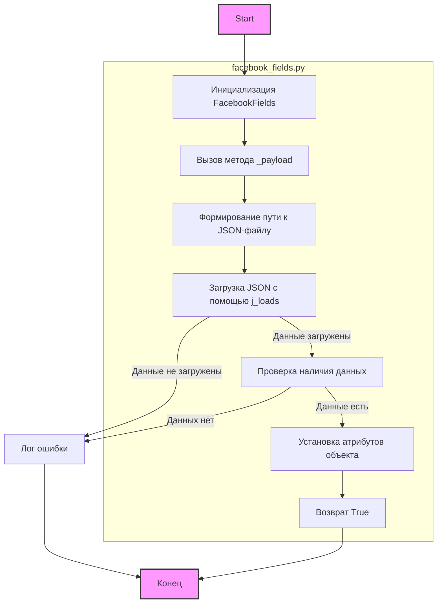
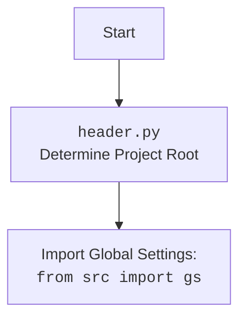

## <алгоритм>

1.  **Инициализация класса `FacebookFields`:**
    *   Создается экземпляр класса `FacebookFields`.
    *   Вызывается метод `_payload`.

2.  **Метод `_payload`:**
    *   **Загрузка данных из JSON:**
        *   Формируется путь к файлу `facebook_feilds.json` используя `gs.path.src` из глобальных настроек проекта.
        *   Вызывается функция `j_loads` для загрузки данных из JSON-файла.
        *   **Пример:** Если `gs.path.src` равен `/home/user/project/src`, то путь к файлу будет `/home/user/project/src/advertisement/facebok/facebook_feilds.json`.
        *   Если JSON-файл отсутствует или не может быть прочитан, `j_loads` вернет `None`.
    *   **Проверка загрузки данных:**
        *   Проверяется, вернула ли функция `j_loads` данные.
        *   Если данные не загружены (`data` is `None`), то в лог записывается сообщение об ошибке, и метод завершается (`return`).
    *   **Установка атрибутов объекта:**
        *   Проходится итерируется по словарю `data`.
        *   Для каждой пары ключ-значение устанавливается атрибут объекту `self` с именем ключа.
            *   **Пример:** Если `data` равен `{"ad_name": "My Ad", "ad_type": "image"}`, то будут созданы атрибуты `self.ad_name = "My Ad"` и `self.ad_type = "image"`.
        *   Метод возвращает `True` после успешной установки атрибутов.

## <mermaid>

## <объяснение>

### Импорты:
*   `from pathlib import Path`: Импортируется класс `Path` из модуля `pathlib`, используется для создания путей к файлам и директориям. Этот модуль обеспечивает более объектно-ориентированный способ работы с путями.
*   `from src import gs`: Импортируется модуль `gs` из пакета `src`, который содержит глобальные настройки проекта, такие как пути к файлам.
*   `from src.utils.jjson import j_loads, j_loads_ns`: Импортируются функции `j_loads` и `j_loads_ns` из модуля `jjson` пакета `src.utils`. Функция `j_loads`, используется для загрузки данных из JSON-файла.
*   `from src.logger.logger import logger`: Импортируется объект `logger` из модуля `logger` пакета `src.logger`, используется для логирования ошибок и отладочных сообщений.

### Класс `FacebookFields`:
*   **Назначение**: Предназначен для хранения полей, используемых при работе с Facebook API (реклама и эвенты).
*   **`__init__(self)`**:
    *   Конструктор класса.
    *   Вызывает метод `_payload` для загрузки и установки атрибутов.
*   **`_payload(self)`**:
    *   **Аргументы:** принимает `self` как аргумент.
    *   **Назначение**: Загружает поля из JSON-файла и устанавливает их как атрибуты экземпляра класса.
    *   **Порядок действий**:
        1.  Формирует путь к файлу `facebook_feilds.json` с помощью `Path` и `gs.path.src`.
        2.  Использует `j_loads` для загрузки JSON-данных.
        3.  Проверяет, были ли данные успешно загружены.
        4.  Если данные загружены, то итерируется по словарю и устанавливает каждый ключ и значение как атрибут текущего экземпляра класса.
        5.  В случае успеха возвращает `True`.
        6.  Если данные не загружены, записывает сообщение об ошибке в лог и завершает работу.

### Переменные:
*   `data`: Словарь, содержащий данные, загруженные из JSON-файла.
*   `name`: Ключ (имя поля) из словаря `data`.
*   `value`: Значение поля из словаря `data`.

### Потенциальные ошибки и области для улучшения:

1.  **Обработка ошибок `j_loads`:**
    *   В коде проверяется, вернул ли `j_loads` данные, но не обрабатываются возможные исключения, которые могут возникнуть при чтении файла JSON.
    *   Рекомендация: Обернуть `j_loads` в блок `try-except` для обработки исключений и логирования ошибок.

2.  **Отсутствие валидации данных**:
    *   Код не проверяет тип или структуру данных, полученных из JSON.
    *   Рекомендация: Добавить валидацию данных для предотвращения непредвиденных ошибок.

3.  **Уточнение типов атрибутов**:
    *   Атрибуты устанавливаются динамически на основе JSON-данных, что может затруднить понимание их типов и привести к ошибкам во время работы с экземпляром класса.
    *   Рекомендация: Рассмотреть возможность использования `dataclasses` или явное указание типов данных для атрибутов класса, если структура JSON-файла заранее известна.

4.  **Путь к файлу**:
    *   Путь к файлу `facebook_feilds.json` жестко задан в коде, что может усложнить перенос проекта или изменить его структуру.
    *   Рекомендация: Сделать путь к файлу настраиваемым с помощью глобальных настроек (например, через `gs`).

### Цепочка взаимосвязей с другими частями проекта:
1.  **Глобальные настройки (`gs`):**
    *   Используется для получения пути к директории `src`, из которой формируется полный путь к файлу с настройками `facebook_feilds.json`.
2.  **`jjson` (`src.utils.jjson`)**:
    *   Отвечает за чтение JSON-файла.
3. **Логирование (`src.logger.logger`):**
    *   Используется для записи ошибок, которые могут возникнуть во время чтения файла или обработки JSON.

**Общее**:

Данный код является частью системы, которая позволяет загружать конфигурационные данные из JSON-файла и устанавливать их как атрибуты экземпляра класса. Это позволяет упростить настройку различных компонентов системы (в данном случае, связанных с Facebook API) на основе внешних файлов, что делает систему более гибкой и простой в настройке.