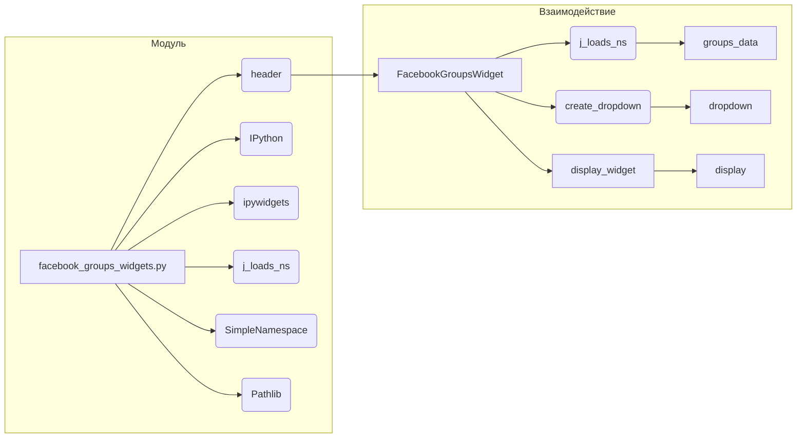

```MD
# Анализ кода facebook_groups_widgets.py

**1. <input code>**

```python
## \file hypotez/src/endpoints/advertisement/facebook/facebook_groups_widgets.py
# -*- coding: utf-8 -*-
#! venv/Scripts/python.exe
#! venv/bin/python/python3.12

"""
.. module:: src.endpoints.advertisement.facebook 
	:platform: Windows, Unix
	:synopsis: Раскрывающеся меню выбора групп для подачи объявления

"""
MODE = 'dev'

import header
from IPython.display import display
from ipywidgets import Dropdown
from src.utils.jjson import j_loads_ns
from types import SimpleNamespace
from pathlib import Path

class FacebookGroupsWidget:
    """ Создает выпадающий список с URL групп Facebook из предоставленного JSON."""

    def __init__(self, json_file_path: Path):
        """
        Инициализация виджета с выпадающим списком для групп Facebook.

        Args:
            json_file_path (Path): Путь к JSON-файлу, содержащему информацию о группах Facebook.
        """
        self.groups_data: SimpleNamespace = j_loads_ns(json_file_path)
        self.dropdown = self.create_dropdown()

    def create_dropdown(self) -> Dropdown:
        """ Создает и возвращает виджет выпадающего списка на основе данных групп.

        Returns:
            Dropdown: Виджет выпадающего списка с URL групп Facebook.
        """
        group_urls = list(self.groups_data.__dict__.keys())
        dropdown = Dropdown(
            options=group_urls,
            description='Facebook Groups:',
            disabled=False,
        )
        return dropdown

    def display_widget(self):
        """ Отображает виджет выпадающего списка."""
        display(self.dropdown)
```

**2. <algorithm>**

```mermaid
graph TD
    A[Пользовательский запрос] --> B{Инициализация FacebookGroupsWidget};
    B --> C[j_loads_ns(json_file_path)];
    C --> D[self.groups_data];
    B --> E[self.create_dropdown()];
    E --> F[self.dropdown];
    D --> G[list(self.groups_data.__dict__.keys())];
    G --> H[options=group_urls];
    H --> I[Dropdown()];
    I --> F;
    B --> J[display(self.dropdown)];
    J --> K[Вывод виджета];
```

**Пример:**

Если `json_file_path` указывает на файл `groups.json` с данными:
```json
{
  "group1": "url1",
  "group2": "url2",
  "group3": "url3"
}
```

1.  Пользовательский запрос инициализирует `FacebookGroupsWidget`.
2.  `j_loads_ns` загружает данные из `groups.json` в `self.groups_data`.
3.  `self.create_dropdown` создает `Dropdown` с опциями `['group1', 'group2', 'group3']`.
4.  `display_widget` отображает созданный виджет.

**3. <mermaid>**



**4. <explanation>**

* **Импорты:**
    * `header`: Вероятно, содержит общие импорты для проекта, такие как настройки, или дополнительные функции.  Необходимо проверить файл `header.py`
    * `IPython.display`: Предоставляет инструменты для отображения результатов в интерактивной среде Jupyter Notebook/Lab.
    * `ipywidgets`:  Библиотека для создания интерактивных виджетов в IPython.
    * `src.utils.jjson`: Возможно, предоставляет функции для обработки JSON.  Обратите внимание, что `src` указывает на подпапку в проекте.
    * `types`:  Предоставляет стандартные типы данных.
    * `pathlib`: Обеспечивает работу с путями к файлам.

* **Классы:**
    * `FacebookGroupsWidget`:  Представляет собой виджет для выбора групп Facebook.
        * `__init__`: Инициализирует объект, загружает данные из JSON и создает виджет выпадающего списка.
        * `create_dropdown`: Создаёт виджет Dropdown на основе данных групп.
        * `display_widget`: Отображает виджет.

* **Функции:**
    * `j_loads_ns`: Вероятно, функция из `src.utils.jjson` для загрузки JSON-данных в объект `SimpleNamespace`. `SimpleNamespace` позволяет получить доступ к данным как к атрибутам объекта.  (Проверить реализацию `j_loads_ns`).

* **Переменные:**
    * `MODE`: Переменная со значением 'dev'. Скорее всего, используется для управления поведением кода в зависимости от режима (разработка, продакшн).
    * `json_file_path`: Путь к файлу с данными о группах Facebook. Используется как аргумент в конструкторе.
    * `group_urls`: Список названий групп (ключей в JSON).


**Возможные ошибки/улучшения:**

* **Обработка ошибок:** Код не обрабатывает ситуации, когда файл `json_file_path` не найден или имеет некорректный формат. Добавление проверки на существование файла и валидации JSON улучшит надежность.
* **Управление данными:** В случае большого количества групп Facebook, использование `SimpleNamespace` может привести к увеличению потребления памяти. Вместо этого, можно использовать `dict` для хранения данных, особенно если нет необходимости получать доступ к данным через атрибуты.
* **Документация:** Дополнительная документация для `j_loads_ns` была бы полезна.
* **Модуль `header`:**  Необходима дополнительная информация о файле `header.py` для более полного анализа.

**Цепочка взаимосвязей:**

Код, скорее всего, входит в состав приложения, связанного с рекламой.  `FacebookGroupsWidget` используется для выбора группы Facebook при создании объявления.  Предполагается, что есть другие части кода, отвечающие за подготовку объявления и его публикацию. Необходимо исследовать контекст применения данного класса.