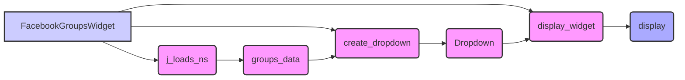

## Анализ кода `facebook_groups_widgets.py`

### 1. <алгоритм>

**Блок-схема:**

1.  **Инициализация ( `__init__` ):**
    *   Принимает `json_file_path` (путь к JSON-файлу) типа `Path`.
    *   Загружает данные из JSON-файла в виде `SimpleNamespace` в `self.groups_data`, используя `j_loads_ns`.
    *   Создает виджет выпадающего списка `self.dropdown`, вызывая `self.create_dropdown()`.

    *Пример:*

    ```python
    json_file_path = Path("groups.json") #Путь к файлу
    #json_file_path = Path("test/test_groups.json") #Путь к тестовому файлу
    widget = FacebookGroupsWidget(json_file_path)
    ```
    
    *Поток данных:* `json_file_path` -> `j_loads_ns` -> `self.groups_data` -> `create_dropdown` -> `self.dropdown`

2.  **Создание выпадающего списка ( `create_dropdown` ):**
    *   Извлекает ключи (URL групп) из `self.groups_data.__dict__` в список `group_urls`.
    *   Создает виджет `Dropdown` из `ipywidgets`:
        *   `options` устанавливается в `group_urls`.
        *   `description` устанавливается в 'Facebook Groups:'.
        *   `disabled` устанавливается в `False`.
    *   Возвращает созданный виджет `dropdown`.

    *Пример:*
      ```python
      #Предположим, что self.groups_data.__dict__ = {'group1_url': ..., 'group2_url': ...}
      group_urls = ['group1_url', 'group2_url']
      dropdown = Dropdown(options=group_urls, description='Facebook Groups:', disabled=False)
      ```
    *Поток данных:* `self.groups_data` -> `group_urls` -> `Dropdown`

3.  **Отображение виджета ( `display_widget` ):**
    *   Отображает виджет выпадающего списка `self.dropdown` с помощью `display` из `IPython.display`.

    *Пример:*
    ```python
    widget.display_widget() #Отображает выпадающий список
    ```
    *Поток данных:* `self.dropdown` -> `display` (отображение на экране)

### 2. <mermaid>



**Анализ зависимостей:**

*   `FacebookGroupsWidget`: Основной класс, управляющий созданием и отображением виджета.
*   `j_loads_ns`: Функция из `src.utils.jjson` для загрузки JSON-данных и преобразования их в `SimpleNamespace`. Зависит от `SimpleNamespace` из модуля `types` и стандартной библиотеки json.
*   `groups_data`: Атрибут класса `FacebookGroupsWidget`, хранит загруженные данные о группах в формате `SimpleNamespace`.
*   `create_dropdown`: Метод класса `FacebookGroupsWidget`, создающий выпадающий список.
*   `Dropdown`: Виджет из `ipywidgets` для отображения выпадающего списка. Зависит от  `ipywidgets`
*   `display_widget`: Метод класса `FacebookGroupsWidget`, отображающий виджет.
*   `display`: Функция из `IPython.display` для отображения виджетов. Зависит от `IPython.display`

### 3. <объяснение>

**Импорты:**

*   `header`: Локальный модуль, используется, вероятно, для определения стандартного хеадера для файлов. В данном коде не используется.
*   `IPython.display.display`: Функция из библиотеки IPython, используется для отображения виджетов, таких как `Dropdown`. Нужна для вывода виджетов в интерактивных средах, таких как Jupyter Notebook или JupyterLab.
*   `ipywidgets.Dropdown`: Класс из библиотеки `ipywidgets` для создания интерактивных выпадающих списков.
*   `src.utils.jjson.j_loads_ns`: Функция из модуля `src.utils.jjson` для загрузки JSON-данных из файла и преобразования их в объект `SimpleNamespace`. Этот модуль, вероятно, предоставляет кастомную обертку для загрузки JSON. Используется для загрузки данных о группах из JSON-файла.
*   `types.SimpleNamespace`: Класс из стандартной библиотеки Python, используется для создания простых объектов, атрибуты которых могут быть доступны как обычные атрибуты, в данном случае, для хранения данных о группах после загрузки из JSON.
*   `pathlib.Path`: Класс из стандартной библиотеки Python, используемый для представления путей к файлам и каталогам, что делает код более платформо-независимым и читаемым.

**Классы:**

*   `FacebookGroupsWidget`:
    *   **Роль:** Создает и управляет выпадающим списком URL-ов групп Facebook, загружая данные из JSON.
    *   **Атрибуты:**
        *   `groups_data: SimpleNamespace`: Хранит данные о группах, загруженные из JSON-файла, в виде объекта `SimpleNamespace`.
        *   `dropdown: Dropdown`: Хранит объект виджета выпадающего списка.
    *   **Методы:**
        *   `__init__(self, json_file_path: Path)`: Конструктор класса, инициализирует объект `FacebookGroupsWidget`, загружая данные из JSON и создавая виджет выпадающего списка.
        *   `create_dropdown(self) -> Dropdown`: Создает и возвращает виджет выпадающего списка `Dropdown` на основе загруженных данных о группах.
        *   `display_widget(self)`: Отображает виджет выпадающего списка.

**Функции:**

*   `__init__(self, json_file_path: Path)`:
    *   **Аргументы:**
        *   `json_file_path (Path)`: Путь к JSON-файлу, содержащему информацию о группах Facebook.
    *   **Возвращаемое значение:** `None`
    *   **Назначение:** Инициализирует виджет, загружает данные из JSON-файла, создает виджет выпадающего списка.
    *   **Пример:**
        ```python
        widget = FacebookGroupsWidget(Path("groups.json"))
        ```

*   `create_dropdown(self) -> Dropdown`:
    *   **Аргументы:** `None`
    *   **Возвращаемое значение:** `Dropdown`: Виджет выпадающего списка.
    *   **Назначение:** Создает и возвращает виджет выпадающего списка `Dropdown` на основе загруженных данных о группах.
    *   **Пример:**
        ```python
        dropdown_widget = widget.create_dropdown()
        ```

*   `display_widget(self)`:
    *   **Аргументы:** `None`
    *   **Возвращаемое значение:** `None`
    *   **Назначение:** Отображает виджет выпадающего списка.
    *   **Пример:**
        ```python
        widget.display_widget()
        ```

**Переменные:**

*   `MODE`: Глобальная переменная, устанавливается в значение `dev`. Вероятно, используется для определения режима работы приложения.
*   `json_file_path`:  Путь к JSON-файлу, содержащему информацию о группах Facebook (тип `Path`).
*    `groups_data`: данные о группах facebook, загруженные из json (тип `SimpleNamespace`).
*   `dropdown`: виджет выпадающего списка (`Dropdown`).
*   `group_urls`: список с url группами (`list`).

**Потенциальные ошибки и области для улучшения:**

*   **Обработка ошибок:** Код не включает обработку ошибок, например, если JSON-файл не существует или имеет неверный формат. Стоит добавить блоки `try-except` для обработки исключений.
*   **Валидация JSON:** Нет валидации структуры JSON. Может быть полезно убедиться, что данные JSON соответствуют ожидаемой структуре перед созданием виджета.
*   **Гибкость:** Жестко заданное описание `description='Facebook Groups:'`. Можно было бы сделать его параметром для большей гибкости.
*   **Использование `header`:** Импорт `header` присутствует, но не используется. Стоит либо удалить неиспользуемый импорт, либо реализовать его использование.
*   **Тестирование:** Нет тестов, которые подтверждали бы корректность работы данного кода. Желательно добавить тесты.

**Взаимосвязь с другими частями проекта:**

*   Этот компонент, вероятно, является частью более крупного проекта, связанного с автоматизацией рекламы в Facebook, где он предоставляет пользовательский интерфейс для выбора групп.
*   `src.utils.jjson`:  Зависит от модуля `jjson` для загрузки JSON-данных, что означает, что этот модуль является важной частью общей инфраструктуры проекта.
*   Интегрируется с `IPython.display` и `ipywidgets`, следовательно, код предназначен для работы в интерактивных средах, таких как Jupyter Notebook, JupyterLab.

Этот код является хорошо структурированным и выполняет свою задачу по созданию выпадающего списка для выбора групп Facebook, но есть области, в которых код может быть улучшен и сделан более надежным и гибким.