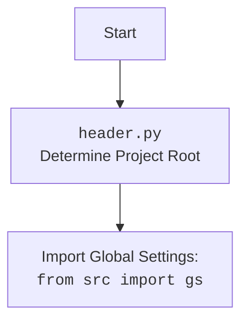

## АНАЛИЗ КОДА: `hypotez/src/endpoints/advertisement/facebook/facebook_groups_widgets.py`

### <алгоритм>

1.  **Инициализация `FacebookGroupsWidget`**:
    *   При создании экземпляра класса `FacebookGroupsWidget` передается путь к JSON-файлу (`json_file_path`).
    *   JSON-файл загружается в пространство имен `groups_data` с использованием функции `j_loads_ns`, которая  преобразует JSON в объект `SimpleNamespace`.
    *   Вызывается метод `create_dropdown` для создания выпадающего списка.
    *   Пример:
        ```python
        json_path = Path("data/facebook_groups.json")
        widget = FacebookGroupsWidget(json_path)
        ```

2.  **Создание выпадающего списка `create_dropdown`**:
    *   Из `groups_data` извлекаются ключи словаря (предположительно URL-адреса групп).
    *   Создается объект `Dropdown` из `ipywidgets` с этими URL-ами в качестве опций.
    *   Пример:
        ```python
        # groups_data = {'url1': ..., 'url2': ..., ...}
        group_urls = ['url1', 'url2', ...]
        dropdown = Dropdown(options=group_urls, description='Facebook Groups:', disabled=False)
        ```

3.  **Отображение виджета `display_widget`**:
    *   Вызывает функцию `display` из `IPython.display` для отображения созданного `dropdown` виджета.
    *   Пример:
        ```python
        widget.display_widget() # Отображает виджет в Jupyter Notebook
        ```

### <mermaid>

```mermaid
flowchart TD
    Start[Начало] --> InitializeWidget[Инициализация FacebookGroupsWidget];
    
    InitializeWidget --> LoadJson[Загрузка JSON в SimpleNamespace: <br>groups_data = j_loads_ns(json_file_path)];
    LoadJson --> CreateDropdown[Создание Dropdown виджета: <br>dropdown = create_dropdown()];

    CreateDropdown --> ExtractUrls[Извлечение URL групп: <br>group_urls = list(groups_data.__dict__.keys())];
    ExtractUrls --> CreateWidget[Создание виджета Dropdown <br>с options=group_urls];
    CreateWidget --> ReturnDropdown[Возврат Dropdown];

    InitializeWidget --> ReturnDropdown;

    ReturnDropdown --> DisplayWidget[Вызов метода display_widget]
    DisplayWidget --> Display[Отображение виджета: <br>display(self.dropdown)];
    Display --> End[Конец];
    
    
    
    
    subgraph utils.jjson
        j_loads_ns[<code>j_loads_ns</code>: загружает JSON  <br> и возвращает SimpleNamespace]
    end
    
    subgraph ipywidgets
       Dropdown[<code>ipywidgets.Dropdown</code>: создает виджет <br> выпадающего списка]
    end
     subgraph IPython.display
       display[<code>IPython.display.display</code>: отображает виджет]
    end

```



### <объяснение>

#### Импорты:

*   **`import header`**:
    *   Импортирует модуль `header`, который, как правило, используется для определения корневой директории проекта и загрузки глобальных настроек, а также для работы с системными путями.
        *   Зависимость:  `header.py` обычно настраивает `sys.path` для поиска модулей из `src`  папки.
*   **`from IPython.display import display`**:
    *   Импортирует функцию `display` из модуля `IPython.display`. Эта функция используется для отображения виджетов в интерактивных средах, таких как Jupyter Notebook.
*   **`from ipywidgets import Dropdown`**:
    *   Импортирует класс `Dropdown` из модуля `ipywidgets`. `Dropdown` используется для создания интерактивного выпадающего списка.
*   **`from src.utils.jjson import j_loads_ns`**:
    *   Импортирует функцию `j_loads_ns` из модуля `src.utils.jjson`.  Предположительно эта функция загружает JSON-файл и возвращает объект `SimpleNamespace`.
*   **`from types import SimpleNamespace`**:
    *   Импортирует класс `SimpleNamespace` из модуля `types`. `SimpleNamespace` используется для создания простых объектов с атрибутами.
*   **`from pathlib import Path`**:
    *   Импортирует класс `Path` из модуля `pathlib`. `Path` используется для представления путей к файлам и директориям в операционной системе.

#### Классы:

*   **`class FacebookGroupsWidget`**:
    *   **Роль**: Создает интерактивный выпадающий список с URL-адресами групп Facebook на основе данных из JSON-файла.
    *   **Атрибуты**:
        *   `groups_data: SimpleNamespace`: Содержит данные о группах Facebook, загруженные из JSON-файла.
        *   `dropdown: Dropdown`: Экземпляр виджета выпадающего списка.
    *   **Методы**:
        *   `__init__(self, json_file_path: Path)`:
            *   Конструктор класса, принимает путь к JSON-файлу.
            *   Загружает данные из JSON-файла с помощью `j_loads_ns` и сохраняет в `self.groups_data`.
            *   Создает выпадающий список с помощью `self.create_dropdown()`.
        *   `create_dropdown(self) -> Dropdown`:
            *   Создает и возвращает виджет выпадающего списка на основе ключей из `self.groups_data`.
            *   Ключи `self.groups_data.__dict__` предполагается являются URL-ами групп.
        *   `display_widget(self)`:
            *   Отображает виджет выпадающего списка с помощью `display(self.dropdown)`.

#### Функции:

*   `j_loads_ns(json_file_path: Path) -> SimpleNamespace`:
    *   Загружает JSON-данные из файла, указанного в `json_file_path` и преобразует их в объект `SimpleNamespace`, делая доступ к ключам  JSON как к атрибутам объекта.

#### Переменные:

*   **``**:
    *   Глобальная переменная, устанавливающая режим работы скрипта (в данном случае, режим разработки).

#### Потенциальные ошибки и улучшения:

1.  **Обработка ошибок:** В коде не хватает обработки возможных ошибок, например, если JSON-файл не найден или имеет неверный формат.
2.  **Валидация данных:** Нет проверки структуры JSON-файла.  Хорошо было бы добавить валидацию, чтобы убедиться, что ключи JSON действительно являются URL-ами.
3.  **Универсальность**: Код завязан на то, что ключи `groups_data` представляют собой URL-ы. Было бы полезно сделать его более гибким и параметризуемым.

#### Цепочка взаимосвязей с другими частями проекта:

1.  **`header.py`**: Обеспечивает корректную настройку путей и импорта, что является основой для использования других модулей проекта.
2.  **`src.utils.jjson`**:  Предоставляет утилиты для работы с JSON-файлами, что является частью базовой инфраструктуры проекта.
3.  **`ipywidgets`**: Является внешним пакетом, обеспечивающим функциональность создания интерактивных виджетов.

Этот код предназначен для создания выпадающего списка с URL-адресами групп Facebook, предположительно для использования в каком-то интерактивном интерфейсе (например, Jupyter Notebook).