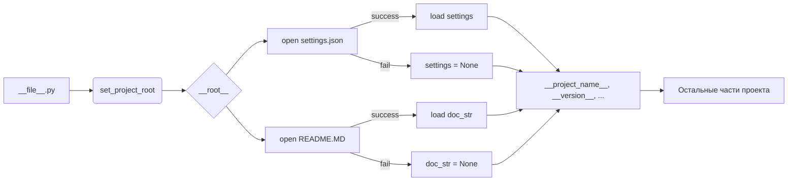

# <input code>

```python
## \file hypotez/src/endpoints/advertisement/facebook/header.py
# -*- coding: utf-8 -*-\
#! venv/Scripts/python.exe
#! venv/bin/python/python3.12

"""
.. module: src.endpoints.advertisement.facebook 
	:platform: Windows, Unix
	:synopsis:

"""
MODE = 'dev'

import sys
import json
from packaging.version import Version

from pathlib import Path
def set_project_root(marker_files=('pyproject.toml', 'requirements.txt', '.git')) -> Path:
    """
    Finds the root directory of the project starting from the current file's directory,
    searching upwards and stopping at the first directory containing any of the marker files.

    Args:
        marker_files (tuple): Filenames or directory names to identify the project root.
    
    Returns:
        Path: Path to the root directory if found, otherwise the directory where the script is located.
    """
    __root__:Path
    current_path:Path = Path(__file__).resolve().parent
    __root__ = current_path
    for parent in [current_path] + list(current_path.parents):
        if any((parent / marker).exists() for marker in marker_files):
            __root__ = parent
            break
    if __root__ not in sys.path:
        sys.path.insert(0, str(__root__))
    return __root__


# Get the root directory of the project
__root__ = set_project_root()
"""__root__ (Path): Path to the root directory of the project"""

from src import gs

settings:dict = None
try:
    with open(gs.path.root / 'src' /  'settings.json', 'r') as settings_file:
        settings = json.load(settings_file)
except (FileNotFoundError, json.JSONDecodeError):
    ...

doc_str:str = None
try:
    with open(gs.path.root / 'src' /  'README.MD', 'r') as settings_file:
        doc_str = settings_file.read()
except (FileNotFoundError, json.JSONDecodeError):
    ...


__project_name__ = settings.get("project_name", 'hypotez') if settings  else 'hypotez'
__version__: str = settings.get("version", '')  if settings  else ''
__doc__: str = doc_str if doc_str else ''
__details__: str = ''
__author__: str = settings.get("author", '')  if settings  else ''
__copyright__: str = settings.get("copyrihgnt", '')  if settings  else ''
__cofee__: str = settings.get("cofee", "Treat the developer to a cup of coffee for boosting enthusiasm in development: https://boosty.to/hypo69")  if settings  else "Treat the developer to a cup of coffee for boosting enthusiasm in development: https://boosty.to/hypo69"
```

# <algorithm>

**Алгоритм:**

1. **Найти корневой каталог проекта:** Функция `set_project_root` ищет родительские каталоги текущего файла, пока не найдет каталог, содержащий `pyproject.toml`, `requirements.txt` или `.git`.
2. **Добавить корневой каталог в `sys.path`:** Если корневой каталог еще не в `sys.path`, то добавляет его в начало. Это необходимо для импорта модулей из других каталогов проекта.
3. **Загрузить `settings.json`:** Пытается загрузить данные из `settings.json`, расположенного в корневом каталоге проекта. Обрабатывает `FileNotFoundError` и `json.JSONDecodeError`.
4. **Загрузить `README.MD`:** Пытается загрузить данные из `README.MD`, расположенного в корневом каталоге проекта. Обрабатывает `FileNotFoundError` и `json.JSONDecodeError`.
5. **Получить данные из настроек:**  Извлекает значения из загруженных данных настроек (`settings`), используя метод `get`, чтобы избежать исключений, если ключ отсутствует.
6. **Возвращает значения:** Возвращает значения переменных `__project_name__`, `__version__`, `__doc__`, `__details__`, `__author__`, `__copyright__`, `__cofee__`, инициализированные значениями из настроек или значениями по умолчанию, если настройки не найдены.

**Пример данных:**

- В `settings.json`:
  ```json
  {
    "project_name": "Мой проект",
    "version": "1.0.0",
    "author": "Автор проекта"
  }
  ```
- В `README.MD`:
  ```markdown
  Описание проекта
  ```

**Перемещение данных:**

- Функция `set_project_root` возвращает путь к корневому каталогу.
- Этот путь используется для открытия файлов `settings.json` и `README.MD`.
- Загруженные данные из `settings.json` используются для инициализации переменных проекта.
- Содержимое `README.MD` сохраняется в переменной `doc_str`.
- Значения переменных проекта используются в других частях проекта.


# <mermaid>



**Объяснение диаграммы:**

- `__file__.py` - текущий файл.
- `set_project_root` ищет корневой каталог проекта и добавляет его в `sys.path`.
- Файлы `settings.json` и `README.MD` открываются и читаются.
- Данные из `settings.json` загружаются в переменную `settings` (или `settings = None`, если возникла ошибка).
- Данные из `README.MD` загружаются в `doc_str` (или `doc_str = None`).
- Значения из `settings` используются для инициализации глобальных переменных `__project_name__`, `__version__`, и др.
- Эти глобальные переменные передаются в остальные части проекта (`K`).


# <explanation>

**Импорты:**

- `sys`: Предоставляет доступ к системным переменным, в том числе `sys.path`. Необходим для добавления корневого каталога проекта в пути поиска модулей.
- `json`: Используется для сериализации и десериализации данных в формате JSON. Используется для чтения и записи настроек из файла `settings.json`.
- `packaging.version`: Используется для работы с версиями пакетов. Вероятно, используется для проверки или обработки версий в `settings.json`.
- `pathlib`: Обеспечивает удобный способ работы с путями к файлам.  Используется для работы с файлами проекта (`settings.json`, `README.MD`).

**Классы:**

В данном коде нет классов.


**Функции:**

- `set_project_root(marker_files)`: Эта функция находит корневой каталог проекта. Она принимает `tuple` с именами файлов или каталогов, по которым определяется корень проекта. Она возвращает путь к корневому каталогу, и добавляет его в `sys.path`, что важно для импорта модулей из других частей проекта.

**Переменные:**

- `MODE`:  Строковая переменная, хранящая режим работы (вероятно, 'dev' или 'prod').
- `__root__`:  Переменная, хранящая путь к корневому каталогу проекта.
- `settings`:  Словарь, хранящий данные из `settings.json`.
- `doc_str`: Строка, хранящая содержимое `README.MD`.
- `__project_name__`, `__version__`, `__doc__`, `__details__`, `__author__`, `__copyright__`, `__cofee__`: Глобальные переменные, содержащие информацию о проекте, извлеченную из `settings.json`.


**Возможные ошибки и улучшения:**

- Обработка ошибок:  Код содержит `try...except` блоки для обработки `FileNotFoundError` и `json.JSONDecodeError`. Это хорошо, но можно добавить более специфичные проверки (например, проверку типа загруженных данных), и улучшить вывод сообщений об ошибках.  Дополнительный `except Exception as e:` блок мог бы помочь найти необработанные исключения.
- Чтение настроек: Чтение настроек из `settings.json` хорошо, но можно улучшить структуру данных,  например, использовать `dataclass` для явных типов.
- Повторные проверки: Строки, содержащие  `if settings`  повторяются. Можно извлечь это в функцию и использовать ее везде для проверки `settings` на корректность.


**Связь с другими частями проекта:**

Функции `gs.path.root`, `from src import gs` показывают взаимосвязь с другими модулями проекта `src`. `gs` вероятно предоставляет утилиты для работы с путями и настройками проекта.  Этот код предназначен для инициализации глобальных переменных, используемых в других частях проекта, в частности, в `endpoints/advertisement/facebook`.

```