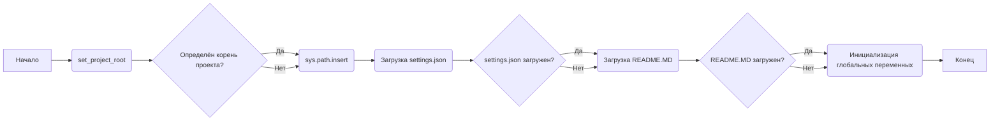
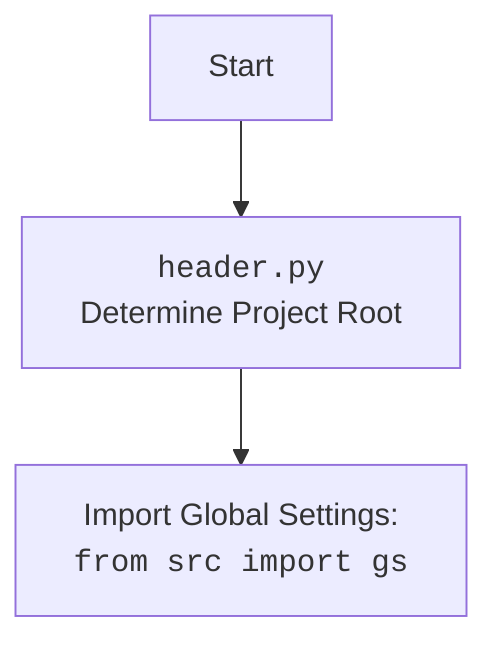

## АНАЛИЗ КОДА `hypotez/src/endpoints/advertisement/facebook/header.py`

### 1. <алгоритм>

**Общий рабочий процесс:**
1. **Определение корня проекта:** Функция `set_project_root` ищет маркерные файлы (`__root__`) начиная с директории текущего файла, поднимаясь вверх по дереву директорий. Как только маркерный файл найден, путь к родительской директории устанавливается как корень проекта, который добавляется в `sys.path`.
   *   Пример: если файл `header.py` находится в `hypotez/src/endpoints/advertisement/facebook/`, а маркерный файл `__root__` в `hypotez/`, то `hypotez/` будет определен как корень проекта.

2. **Загрузка настроек:** Глобальные настройки (`settings.json`) загружаются из файла, находящегося в корне проекта (`src/settings.json`). Если файл не найден, или возникает ошибка декодирования JSON, то переменная settings остаётся пустой, что приведёт к использованию значений по умолчанию.
   *   Пример: если `settings.json` содержит `{"project_name": "MyProject", "version": "1.0.0"}`, то `settings` будет словарем `{"project_name": "MyProject", "version": "1.0.0"}`.

3. **Загрузка документации:** Загрузка документации из `README.MD`, находящегося в корне проекта. Аналогично загрузке настроек, в случае ошибки, `doc_str` остаётся пустой.
   *   Пример: если в `README.MD` есть `"# My Project"`, то `doc_str` будет содержать строку `"# My Project"`.

4. **Инициализация переменных:** На основе загруженных настроек или значений по умолчанию инициализируются глобальные переменные:
    *   `__project_name__`: Название проекта.
    *   `__version__`: Версия проекта.
    *   `__doc__`: Строка документации.
    *   `__details__`: Подробности (по умолчанию пустая строка).
    *   `__author__`: Автор проекта.
    *   `__copyright__`: Копирайт проекта.
    *  `__cofee__`: Приглашение угостить разработчика кофе.

**Поток данных:**



### 2. <mermaid>

```mermaid
flowchart TD
    A[Start] --> B(set_project_root);
    B --> C{Check if project root is found};
    C -- Yes --> D(Add root to sys.path);
    C -- No --> D;
    D --> E(Load settings from settings.json);
    E --> F{Check if settings are loaded};
    F -- Yes --> G(Load documentation from README.MD);
    F -- No --> G;
    G --> H{Check if documentation is loaded};
    H -- Yes --> I(Initialize global variables);
    H -- No --> I;
    I --> J[End];

    classDef  file fill:#f9f,stroke:#333,stroke-width:2px
    class B,E,G file
    
```
**Анализ зависимостей `mermaid`:**

*   `set_project_root`: Функция, которая определяет корень проекта и добавляет его в `sys.path`. Зависит от `pathlib.Path`.
*   Загрузка `settings.json`: Зависит от `json` для десериализации и `gs.path.root` для определения пути к файлу настроек.
*  Загрузка `README.MD`: Зависит от `gs.path.root` для определения пути к файлу документации.
*   Инициализация глобальных переменных: Зависит от словаря `settings`, который может быть пустым.


**Анализ зависимостей `mermaid` (header.py):**
*   `Start`: Начало процесса загрузки.
*   `Header`: Файл `header.py`, который определяет корень проекта и загружает настройки.
*   `import`: Импортирует глобальные настройки `from src import gs`.

### 3. <объяснение>

**Импорты:**

*   `sys`:  Используется для работы с системными параметрами и функциями, в частности для модификации `sys.path`, что позволяет импортировать модули из корня проекта.
*   `json`: Используется для работы с JSON-данными, в частности для загрузки файла настроек `settings.json`.
*   `packaging.version.Version`: Используется для работы с версиями (в этом файле не используется, но импортирован).
*   `pathlib.Path`: Используется для работы с путями к файлам и директориям.
*   `from src import gs`: Импортирует глобальные настройки проекта, которые предположительно содержат пути к различным директориям, включая корень проекта.

**Классы:**

*   В данном коде нет классов.

**Функции:**

*   `set_project_root(marker_files: tuple = ('__root__')) -> Path`:
    *   **Аргументы:**
        *   `marker_files`: Кортеж с именами файлов или директорий, которые идентифицируют корень проекта. По умолчанию (`'__root__'`.)
    *   **Возвращает:** `pathlib.Path` - путь к корню проекта.
    *   **Назначение:** Находит корень проекта, начиная с текущей директории, поднимаясь вверх по дереву каталогов, пока не найдет один из маркерных файлов. Если корень проекта найден, он добавляется в `sys.path`, позволяя импортировать модули из этого каталога.
    *   **Пример:**
    ```python
    # Если __root__ найден в /home/user/project/
    root_path = set_project_root()
    print(root_path)  # Output: /home/user/project
    ```
    
**Переменные:**

*   `MODE`: Глобальная переменная, указывающая на режим работы (в данном случае 'dev').
*   `__root__`: `pathlib.Path` - путь к корню проекта, полученный из `set_project_root()`.
*   `settings`: `dict` - словарь с настройками, загруженный из `settings.json` (может быть `None`).
*   `doc_str`: `str` - строка с содержимым `README.MD` (может быть `None`).
*   `__project_name__`: `str` - имя проекта.
*   `__version__`: `str` - версия проекта.
*   `__doc__`: `str` - строка документации проекта.
*   `__details__`: `str` - детали проекта (по умолчанию пустая строка).
*   `__author__`: `str` - автор проекта.
*  `__copyright__`: `str` - копирайт проекта.
*  `__cofee__`: `str` - приглашение угостить разработчика кофе.

**Потенциальные ошибки и области для улучшения:**

1.  **Обработка ошибок:** Ошибки `FileNotFoundError` и `json.JSONDecodeError` обрабатываются как `pass`. Это может скрыть проблемы, если файл настроек или README.MD не найдены. Следует добавить логирование ошибок или уведомления.
2. **Использование `gs.path.root` без проверки:** Код предполагает, что `gs.path.root` всегда инициализирован. Если это не так, могут возникнуть ошибки. Необходимо добавить проверку.
3. **Использование `settings.get` с дефолтными значениями:**  Можно сделать эти значения константами, чтобы повысить читаемость кода.
4. **Отсутствие явной обработки исключений в `set_project_root`:**  Можно добавить обработку исключений, если при работе с `pathlib.Path` возникнет ошибка.

**Взаимосвязи с другими частями проекта:**

*   Этот файл используется как заголовочный для других модулей проекта, предоставляя глобальные настройки и информацию о проекте (название, версию, документацию).
*   Зависит от `src.gs` для получения пути к корню проекта и файлам настроек.

Этот анализ предоставляет подробное понимание кода, его функциональности, и возможных проблем.