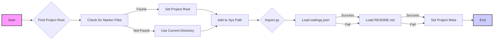

## Анализ кода `hypotez/src/endpoints/advertisement/facebook/header.py`

### 1. <алгоритм>

**Пошаговая блок-схема:**

1.  **Инициализация:**
    *   Устанавливается `MODE = 'dev'`.
    *   Импортируются необходимые модули: `sys`, `json`, `Version` из `packaging.version`, `Path` из `pathlib`.

2.  **Определение функции `set_project_root`:**
    *   Принимает кортеж `marker_files` (по умолчанию `('pyproject.toml', 'requirements.txt', '.git')`) в качестве аргумента.
    *   Получает абсолютный путь к директории текущего файла.
    *   Итерирует по текущей директории и ее родительским директориям.
    *   Проверяет наличие любого из `marker_files` в каждой директории.
    *   Если находит, устанавливает эту директорию как корневую директорию проекта `__root__`.
    *   Добавляет `__root__` в `sys.path`, если его там нет.
    *   Возвращает `__root__` как `Path`.

3.  **Определение корневой директории проекта:**
    *   Вызывается функция `set_project_root()` для определения корневой директории проекта и сохраняется в `__root__`.

4.  **Импорт `gs`:**
    *   Импортируется модуль `gs` из `src`, предположительно содержащий общие пути и настройки.

5.  **Загрузка настроек из `settings.json`:**
    *   Инициализируется переменная `settings` как `None`.
    *   Пытается открыть и прочитать `settings.json` из каталога `src` относительно корневой директории проекта.
    *   Если файл найден и успешно прочитан JSON, то загруженные данные сохраняются в переменной `settings`.
    *   Обрабатываются исключения `FileNotFoundError` и `json.JSONDecodeError`.
    *   Если файл не найден или не является валидным JSON, `settings` остается равным `None`.

6.  **Загрузка документации из `README.MD`:**
    *   Инициализируется переменная `doc_str` как `None`.
    *   Пытается открыть и прочитать `README.MD` из каталога `src` относительно корневой директории проекта.
    *   Если файл найден и успешно прочитан, то его содержимое сохраняется в переменной `doc_str`.
    *   Обрабатываются исключения `FileNotFoundError` и `json.JSONDecodeError`.
    *   Если файл не найден или не валидный, `doc_str` остается равным `None`.

7.  **Определение метаданных проекта:**
    *   Извлекает метаданные проекта из `settings`, если они доступны:
        *   `__project_name__` - название проекта (по умолчанию 'hypotez').
        *   `__version__` - версия проекта (по умолчанию '').
        *   `__doc__` - документация проекта (содержимое `README.MD` или '').
        *   `__details__` - пустая строка.
        *   `__author__` - автор проекта (по умолчанию '').
        *   `__copyright__` - авторское право (по умолчанию '').
        *   `__cofee__` - сообщение о пожертвовании (по умолчанию "Treat the developer to a cup of coffee for boosting enthusiasm in development: https://boosty.to/hypo69").
    *   Если `settings` нет, то используются значения по умолчанию.

**Примеры:**

*   **Логический блок 2 (`set_project_root`):** Если структура проекта: `/myproject/src/endpoints/advertisement/facebook/header.py` и в `/myproject/` есть `pyproject.toml`, то `set_project_root()` вернет `Path('/myproject')`.

*   **Логический блок 5 (Загрузка `settings.json`):** Если `/myproject/src/settings.json` содержит `{"project_name": "my-app", "version": "1.0.0"}`, то `settings` будет равна `{"project_name": "my-app", "version": "1.0.0"}`.

*   **Логический блок 7 (Определение метаданных):** Если `settings` равно `{"project_name": "my-app", "version": "1.0.0", "author": "John Doe"}`, то `__project_name__` будет "my-app", `__version__` будет "1.0.0", а `__author__` будет "John Doe".

### 2. <mermaid>

**Разбор `mermaid` диаграммы:**

1.  `A[Start]`: Начало процесса.
2.  `B{Find Project Root}`: Блок, отвечающий за поиск корневой директории проекта.
3.  `C[Check for Marker Files]`: Блок, проверяющий наличие маркерных файлов в текущей и родительских директориях.
    *   `C -- Found --> D`: Если маркерные файлы найдены, управление переходит к блоку D.
    *   `C -- Not Found --> E`: Если маркерные файлы не найдены, управление переходит к блоку E.
4.  `D[Set Project Root]`: Блок, устанавливающий корневую директорию проекта.
5.  `E[Use Current Directory]`: Блок, устанавливающий текущую директорию как корневую.
6.  `F[Add to Sys Path]`: Блок, добавляющий корневую директорию в `sys.path`.
7.  `G{Import gs}`: Блок, импортирующий модуль `gs` для доступа к общим ресурсам.
8.  `H[Load settings.json]`: Блок, пытающийся загрузить настройки из файла `settings.json`.
    *   `H -- Success --> I`: Если файл успешно загружен, управление переходит к блоку I.
    *   `H -- Fail --> I`: Если загрузка не удалась, управление переходит к блоку I.
9.   `I[Load README.md]`: Блок, пытающийся загрузить документацию из файла `README.md`.
    *   `I -- Success --> J`: Если файл успешно загружен, управление переходит к блоку J.
    *   `I -- Fail --> J`: Если загрузка не удалась, управление переходит к блоку J.
10. `J[Set Project Meta]`: Блок, устанавливающий метаданные проекта на основе загруженных настроек или значений по умолчанию.
11. `K[End]`: Конец процесса.

**Зависимости:**

Диаграмма отражает следующие зависимости:
- Модуль `sys` для работы с путями.
- Модуль `pathlib` для работы с путями в файловой системе.
- Модуль `json` для загрузки данных из файла `settings.json`.
- Модуль `gs`, как ресурс модуля `src`, для загрузки настроек.
- Вся логика завязана на структуру файловой системы проекта.

### 3. <объяснение>

**Импорты:**

*   `sys`: Используется для взаимодействия с интерпретатором Python, в частности для добавления корневой директории проекта в `sys.path`. Это позволяет импортировать модули из других частей проекта.
*   `json`: Используется для работы с JSON-файлами, в данном случае для загрузки настроек из файла `settings.json`.
*   `packaging.version.Version`: Не используется напрямую в коде, но импортируется. Вероятно, она используется в других частях проекта, но здесь этот импорт не имеет смысла.
*   `pathlib.Path`: Предоставляет объектно-ориентированный способ работы с путями файловой системы, что делает код более читаемым и переносимым.

**Классы:**

*   В данном файле классы отсутствуют.

**Функции:**

*   `set_project_root(marker_files: tuple) -> Path:`
    *   **Аргументы:** `marker_files` - кортеж строк, представляющих имена файлов или директорий, которые используются для идентификации корневой директории проекта (по умолчанию `('pyproject.toml', 'requirements.txt', '.git')`).
    *   **Возвращаемое значение:** `Path` - объект, представляющий абсолютный путь к корневой директории проекта.
    *   **Назначение:** Функция ищет корневую директорию проекта путем перебора родительских директорий текущего файла и проверки наличия в них заданных файлов или директорий. Она гарантирует, что пути к модулям проекта могут быть импортированы.
    *   **Пример:** Если файл находится в `/path/to/myproject/src/module.py`, а в `/path/to/myproject/` находится файл `pyproject.toml`, то вызов `set_project_root()` вернет `Path("/path/to/myproject")`.

**Переменные:**

*   `MODE`:  Глобальная переменная режима работы, установлена в `'dev'`. Может быть использована для переключения между различными режимами работы приложения.
*   `__root__`:  `Path`-объект, хранящий абсолютный путь к корневой директории проекта. Используется для поиска `settings.json` и `README.MD`.
*   `settings`: Словарь, содержащий настройки проекта, загруженные из `settings.json`.  `None`, если файл не найден или невалидный.
*   `doc_str`: Строка, содержащая содержимое файла `README.MD`.  `None`, если файл не найден.
*   `__project_name__`: Строка, хранящая имя проекта. Загружается из `settings.json` или используется значение по умолчанию `'hypotez'`.
*   `__version__`: Строка, хранящая версию проекта. Загружается из `settings.json` или используется пустая строка `''` по умолчанию.
*   `__doc__`: Строка, хранящая документацию проекта (содержимое `README.MD`).
*   `__details__`: Пустая строка. (Возможно, планировалось для расширения в будущем).
*   `__author__`: Строка, хранящая автора проекта. Загружается из `settings.json` или используется пустая строка `''` по умолчанию.
*   `__copyright__`: Строка, хранящая информацию об авторских правах. Загружается из `settings.json` или используется пустая строка `''` по умолчанию.
*   `__cofee__`: Строка, содержащая сообщение о пожертвовании. Загружается из `settings.json` или используется значение по умолчанию.

**Потенциальные ошибки и области для улучшения:**

*   **Отсутствует обработка ошибок загрузки файлов:** Хотя ошибки `FileNotFoundError` и `json.JSONDecodeError` обрабатываются при загрузке `settings.json` и `README.MD`, отсутствуют логирование или дополнительные уведомления о том, что эти файлы не были загружены. Было бы полезно добавить логирование в эти блоки `except`, например, с помощью модуля `logging`, чтобы упростить отладку.
*  **Импорт Version:** импорт `from packaging.version import Version` не используется.
*  **Переменная `__details__`**:  Не используется, и не понятно ее назначение.
*  **Повторение кода:** Повторение кода при чтении `settings.json` и `README.md`. Можно вынести этот код в отдельную функцию.
*   **Зависимость от структуры проекта:**  Код сильно полагается на наличие определенных файлов (`settings.json`, `README.MD`) в определенном расположении относительно корня проекта. Было бы полезно предусмотреть механизм конфигурирования этих путей.
*   **Жестко заданный `__cofee__`**: В настоящее время сообщение о пожертвовании жестко прописано, возможно стоит вынести его в файл настроек.

**Цепочка взаимосвязей с другими частями проекта:**

*   `gs`: Файл зависит от модуля `gs`, предполагается, что `gs` предоставляет доступ к общим ресурсам проекта, включая `gs.path.root`, который используется для доступа к файлам `settings.json` и `README.MD`.
*   `settings.json` и `README.MD`: Файл загружает настройки и документацию из этих файлов.
*   Другие части проекта:  Предполагается, что другие модули проекта используют метаданные, определенные в этом файле, например `__project_name__`, `__version__`, `__doc__`.

**Дополнительные комментарии:**

Код выполняет важную задачу по определению корневой директории проекта и загрузке основных настроек и метаданных. Он написан достаточно понятно, но можно улучшить обработку ошибок, избавиться от повторения кода и сделать его более гибким к структуре проекта.