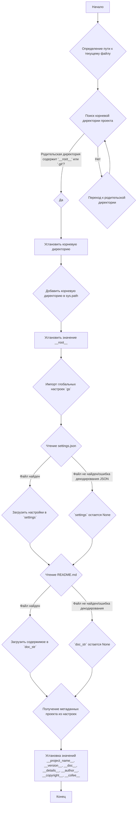

## ИНСТРУКЦИЯ:

Анализируй предоставленный код подробно и объясни его функциональность. Ответ должен включать три раздела:  

1. **<алгоритм>**: Опиши рабочий процесс в виде пошаговой блок-схемы, включая примеры для каждого логического блока, и проиллюстрируй поток данных между функциями, классами или методами.  
2. **<mermaid>**: Напиши код для диаграммы в формате `mermaid`, проанализируй и объясни все зависимости,  
    которые импортируются при создании диаграммы.  
    **ВАЖНО!** Убедитесь, что все имена переменных, используемые в диаграмме `mermaid`,  
    имеют осмысленные и описательные имена. Имена переменных вроде `A`, `B`, `C`, и т.д., не допускаются!  
    
    **Дополнительно**: Если в коде есть импорт `import header`, добавьте блок `mermaid` flowchart, объясняющий `header.py`:\
    ```mermaid\
    flowchart TD\
        Start --> Header[<code>header.py</code><br> Determine Project Root]\
    
        Header --> import[Import Global Settings: <br><code>from src import gs</code>] \
    ```

3. **<объяснение>**: Предоставьте подробные объяснения:  
   - **Импорты**: Их назначение и взаимосвязь с другими пакетами `src.`.  
   - **Классы**: Их роль, атрибуты, методы и взаимодействие с другими компонентами проекта.  
   - **Функции**: Их аргументы, возвращаемые значения, назначение и примеры.  
   - **Переменные**: Их типы и использование.  
   - Выделите потенциальные ошибки или области для улучшения.  

Дополнительно, постройте цепочку взаимосвязей с другими частями проекта (если применимо).  

Это обеспечивает всесторонний и структурированный анализ кода.
## Формат ответа: `.md` (markdown)
**КОНЕЦ ИНСТРУКЦИИ**

## <алгоритм>



**Примеры:**

*   **Блок B:** `Path(__file__).resolve().parent` определяет абсолютный путь к директории, где расположен файл `header.py`. Например, если файл расположен в `/home/user/project/src/endpoints/advertisement/facebook/header.py`, то на выходе получится `/home/user/project/src/endpoints/advertisement/facebook`.
*   **Блок C:** Поиск корневой директории. Итерируется вверх по родительским директориям, проверяя наличие файлов `__root__` или `.git`. Если эти файлы найдены в директории `/home/user/project`, то эта директория будет установлена как корневая.
*   **Блок G:** Добавление пути к корневой директории в `sys.path`. Если корневая директория `/home/user/project`, то строка `/home/user/project` будет добавлена в начало `sys.path`.
*   **Блок K:** При успешном чтении `settings.json` переменная `settings` будет содержать словарь с настройками, например, `{'project_name': 'hypotez', 'version': '1.0.0', 'author': 'John Doe'}`.
*   **Блок N:** При успешном чтении `README.md` переменная `doc_str` будет содержать строку с содержимым файла, например, `# Hypotez Project\nThis is a project...`.
*  **Блок P:** Извлечение метаданных из словаря `settings` (если он существует) с использованием метода `get()` и установка дефолтных значений при отсутствии настроек.

## <mermaid>

```mermaid
flowchart TD
    Start --> FindProjectRoot[set_project_root<br>Find Project Root Directory];
    FindProjectRoot --> SetRootPath[Set __root__ to Project Root];
    SetRootPath --> AddToSysPath[sys.path.insert(0, str(__root__))<br>Add Root to Sys Path];
     AddToSysPath --> ImportGlobalSettings[import gs<br>Import Global Settings];
     ImportGlobalSettings --> ReadSettingsFile[Read settings.json];
    ReadSettingsFile -- "Success" --> LoadSettings[settings = json.load(...)];
    ReadSettingsFile -- "Failure" --> SettingsNone[settings = None];
    LoadSettings --> ReadReadme[Read README.md];
    SettingsNone --> ReadReadme;
    ReadReadme -- "Success" --> LoadReadme[doc_str = settings_file.read()];
    ReadReadme -- "Failure" --> ReadmeNone[doc_str = None];
    LoadReadme --> ExtractMetadata[Extract Metadata from settings];
    ReadmeNone --> ExtractMetadata;
    ExtractMetadata --> SetProjectMetadata[Set __project_name__, __version__, __doc__, etc.];
    SetProjectMetadata --> End;
    
    
  subgraph  header.py
        Start
        FindProjectRoot
        SetRootPath
        AddToSysPath
        ImportGlobalSettings
        ReadSettingsFile
        LoadSettings
        SettingsNone
         ReadReadme
         LoadReadme
        ReadmeNone
        ExtractMetadata
        SetProjectMetadata
       End
   end
```

**Объяснение зависимостей `mermaid`:**

*   **`Start`**: Начало выполнения скрипта.
*   **`FindProjectRoot`**: Вызов функции `set_project_root` для определения корневой директории проекта.
*   **`SetRootPath`**: Присваивание переменной `__root__` найденного пути к корневой директории.
*    **`AddToSysPath`**: Добавление корневой директории в список `sys.path`, что позволяет импортировать модули из этой директории.
*   **`ImportGlobalSettings`**: Импорт модуля `gs` из пакета `src`, который, предположительно, содержит глобальные настройки проекта.
*   **`ReadSettingsFile`**: Попытка чтения файла `settings.json` из директории `src`.
*   **`LoadSettings`**: Загрузка содержимого файла `settings.json` в переменную `settings` в виде словаря, при успешном прочтении.
*   **`SettingsNone`**: Установка переменной `settings` в `None`, если файл `settings.json` не был найден или произошла ошибка при разборе JSON.
*   **`ReadReadme`**: Попытка чтения файла `README.md` из директории `src`.
*   **`LoadReadme`**: Загрузка содержимого файла `README.md` в переменную `doc_str`, при успешном прочтении.
*   **`ReadmeNone`**: Установка переменной `doc_str` в `None`, если файл `README.md` не был найден или произошла ошибка при чтении.
*  **`ExtractMetadata`**: Извлечение метаданных, таких как название проекта, версия, автор и т.д., из загруженных настроек или установка дефолтных значений.
*  **`SetProjectMetadata`**: Присваивание извлеченных метаданных переменным `__project_name__`, `__version__`, `__doc__` и т.д.
*   **`End`**: Конец выполнения скрипта.

## <объяснение>

**Импорты:**

*   **`import sys`**: Модуль `sys` используется для доступа к некоторым переменным и функциям, взаимодействующим с интерпретатором Python. В данном случае, он используется для добавления пути к корневой директории проекта в список путей поиска модулей (`sys.path`). Это необходимо для корректного импорта модулей из `src`.
*   **`import json`**: Модуль `json` используется для работы с данными в формате JSON. В этом коде он применяется для чтения файла `settings.json`, который содержит настройки проекта.
*   **`from packaging.version import Version`**: Импортирует класс `Version` из библиотеки `packaging`, который обычно используется для сравнения и управления версиями. В данном коде не используется, возможно, запланировано для дальнейшего использования.
*   **`from pathlib import Path`**: Импортирует класс `Path` из модуля `pathlib`, который предоставляет удобный способ работы с файловыми путями. Используется для определения пути к текущему файлу, поиска корневой директории и для формирования полных путей к файлам настроек.
*   **`from src import gs`**: Импортирует модуль `gs` из пакета `src`. Предположительно, `gs` (global settings) содержит общие настройки или пути, используемые во всем проекте, в частности, `gs.path.root`.

**Функция:**

*   **`set_project_root(marker_files=('__root__', '.git')) -> Path`**:
    *   **Аргументы:** `marker_files` - кортеж строк с именами файлов или директорий, которые служат маркерами для определения корневой директории проекта. По умолчанию используется `('__root__', '.git')`.
    *   **Возвращаемое значение:** `Path` - объект, представляющий путь к корневой директории проекта.
    *   **Назначение:** Функция определяет корневую директорию проекта, начиная поиск от директории, содержащей данный файл, и двигаясь вверх по родительским директориям, пока не найдет один из `marker_files`.
    *   **Пример:**
        *   Если файл находится в `/home/user/project/src/endpoints/advertisement/facebook/header.py`, и корневая директория расположена в `/home/user/project`, то функция вернет `Path('/home/user/project')`, если в этой директории есть файл `__root__` или директория `.git`.

**Переменные:**

*   **`__root__`**: Переменная типа `Path`, хранящая абсолютный путь к корневой директории проекта. Определяется функцией `set_project_root`. Используется для построения путей к файлам настроек и для добавления пути к корневой директории в `sys.path`.
*   **`settings`**: Словарь, содержащий настройки проекта, загруженные из файла `settings.json`. Может быть `None`, если файл не найден или не может быть прочитан.
*   **`doc_str`**: Строка, содержащая содержимое файла `README.md`. Может быть `None`, если файл не найден или не может быть прочитан.
*   **`__project_name__`**: Строка, содержащая название проекта, извлекается из `settings` или по умолчанию `'hypotez'`.
*   **`__version__`**: Строка, содержащая версию проекта, извлекается из `settings` или по умолчанию пустая строка.
*   **`__doc__`**: Строка, содержащая документацию проекта, берется из `doc_str` или по умолчанию пустая строка.
*   **`__details__`**: Строка, содержащая детали проекта. По умолчанию пустая строка.
*  **`__author__`**: Строка, содержащая имя автора проекта, извлекается из `settings` или по умолчанию пустая строка.
*  **`__copyright__`**: Строка, содержащая информацию об авторских правах, извлекается из `settings` или по умолчанию пустая строка.
*   **`__cofee__`**: Строка с предложением поддержать разработчика, извлекается из `settings` или задано дефолтное значение.

**Потенциальные ошибки и области для улучшения:**

*   **Обработка ошибок**: В коде есть обработка исключений `FileNotFoundError` и `json.JSONDecodeError` при чтении файлов `settings.json` и `README.md`. Однако, обработка сводится к `...`, что означает игнорирование ошибок. Было бы полезно либо вывести предупреждение в лог, либо задать дефолтные значения для критичных параметров, чтобы приложение могло корректно работать.
*   **Зависимость от `src/settings.json` и `src/README.md`**: Код полагается на наличие этих файлов в определенном месте. Это может быть проблемой, если структура проекта изменится. Возможно, стоит сделать пути к этим файлам настраиваемыми.
*   **`packaging.version` не используется**: Импорт `Version` не используется в коде, поэтому он может быть удален.
*   **`__details__` пустая строка**: Поле `__details__` не используется и остается пустым.
*   **Неявное использование `gs.path.root`**: Код полагается на то, что `gs.path` содержит атрибут `root`. Это неявная зависимость, и нужно убедиться, что `gs` инициализируется правильно.
*   **Устаревший Shebang**: Shebang `#! venv/bin/python/python3.12` может быть неактуальным. Лучше использовать `#! /usr/bin/env python3`.

**Взаимосвязь с другими частями проекта:**

*   Код тесно связан с модулем `src.gs`, который предположительно содержит общие настройки проекта. Он использует `gs.path.root` для определения местоположения файла `settings.json`. 
*   Данный файл используется как заголовочный, для импорта в другие модули и использования метаданных проекта.
*   Данные из `settings.json` используются для установки глобальных переменных `__project_name__`, `__version__` и других.

В целом, этот код отвечает за определение корневой директории проекта, загрузку настроек из `settings.json` и метаданных из `README.md`, а также за предоставление этих данных как глобальных переменных.