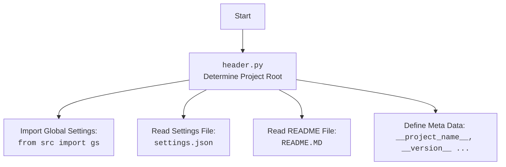

## АНАЛИЗ КОДА `hypotez/src/endpoints/advertisement/facebook/header.py`

### 1. <алгоритм>

**Функция `set_project_root`:**

1.  **Начало:** Функция принимает необязательный аргумент `marker_files` (кортеж имен файлов/директорий, по умолчанию `('__root__', '.git')`).
    *   Пример: `marker_files = ('__root__', '.git')`
2.  **Определение текущего пути:** Определяется абсолютный путь к директории, в которой находится текущий файл.
    *   Пример: Если файл находится в `/home/user/hypotez/src/endpoints/advertisement/facebook/header.py`, то `current_path` будет `/home/user/hypotez/src/endpoints/advertisement/facebook`.
3.  **Инициализация `__root__`:** Переменной `__root__` присваивается начальное значение `current_path`.
    *   Пример: `__root__` = `/home/user/hypotez/src/endpoints/advertisement/facebook`
4.  **Обход родительских директорий:**
    *   Начиная с `current_path` и переходя к родительским директориям, функция проверяет, существует ли в текущей директории какой-либо из файлов/директорий, указанных в `marker_files`.
    *   Пример: Для `current_path` = `/home/user/hypotez/src/endpoints/advertisement/facebook`, функция проверяет, есть ли в этой директории файлы/директории с именами `__root__` или `.git`. Затем переходит в `/home/user/hypotez/src/endpoints/advertisement`, `/home/user/hypotez/src/endpoints`, `/home/user/hypotez/src`, `/home/user/hypotez` и т.д.
5.  **Нахождение корня проекта:** Если маркерный файл найден, `__root__` обновляется до пути этой родительской директории и цикл прерывается.
    *   Пример: Если файл `.git` найден в `/home/user/hypotez`, то `__root__` становится `/home/user/hypotez`.
6.  **Добавление в `sys.path`:** Если путь `__root__` еще не добавлен в `sys.path`, он добавляется в начало списка. Это позволяет импортировать модули из корня проекта.
7.  **Возврат:** Функция возвращает путь к корню проекта.

**Основная часть кода:**

1.  **Вызов `set_project_root`:** Функция `set_project_root` вызывается без аргументов, и результат присваивается переменной `__root__`.
    *   Пример: `__root__` = `/home/user/hypotez`
2.  **Импорт `gs`:** Выполняется импорт `gs` из `src`.
3.  **Чтение `settings.json`:**
    *   Пытается открыть и прочитать файл `settings.json`, расположенный в каталоге `src` относительно корня проекта (`gs.path.root / 'src' / 'settings.json'`).
    *   Пример: Файл может быть расположен в `/home/user/hypotez/src/settings.json`.
    *   Если файл найден, его содержимое загружается в словарь `settings`.
    *   Обработка ошибок: Если файл не найден или произошла ошибка JSON, выполняется блок `except`, где ничего не происходит ( `...` ).
4. **Чтение `README.MD`:**
    * Пытается открыть и прочитать файл `README.MD`, расположенный в каталоге `src` относительно корня проекта (`gs.path.root / 'src' / 'README.MD'`).
    * Пример: Файл может быть расположен в `/home/user/hypotez/src/README.MD`.
    * Если файл найден, его содержимое считывается в строку `doc_str`.
    * Обработка ошибок: Если файл не найден или произошла ошибка JSON, выполняется блок `except`, где ничего не происходит (`...`).
5.  **Определение переменных:** Из словаря `settings` (если он был успешно загружен), определяются значения переменных:
    *   `__project_name__`:  название проекта (по умолчанию `hypotez`)
    *   `__version__`: версия проекта (по умолчанию '')
    *   `__doc__`: содержимое файла README.MD (по умолчанию '')
    *   `__details__`: дополнительные сведения (по умолчанию '')
    *   `__author__`: автор проекта (по умолчанию '')
    *   `__copyright__`: авторские права (по умолчанию '')
    *  `__cofee__`: сообщение с призывом поддержать разработчика (по умолчанию "Treat the developer to a cup of coffee for boosting enthusiasm in development: https://boosty.to/hypo69")

### 2. <mermaid>

```mermaid
flowchart TD
    Start --> FindProjectRoot[Найти корень проекта <br> `set_project_root()`]
    FindProjectRoot --> SetRootPath[Установить путь к корню проекта <br> `__root__`]
    SetRootPath --> ImportGs[Импортировать настройки проекта <br> `from src import gs`]
    ImportGs --> LoadSettings[Загрузить settings.json <br> в `settings`]
    LoadSettings -- "Файл найден" --> LoadReadme[Загрузить README.MD <br> в `doc_str`]
    LoadSettings -- "Файл не найден" --> SetDefaultSettings[Установить значения по умолчанию]
    LoadReadme -- "Файл найден" --> DefineProjectMetadata[Определить метаданные проекта <br> `__project_name__`, `__version__`, etc.]
    LoadReadme -- "Файл не найден" --> SetDefaultSettings
    SetDefaultSettings --> DefineProjectMetadata
    DefineProjectMetadata --> End

```

**Описание зависимостей:**

*   **`Start`**: Начало выполнения скрипта.
*   **`FindProjectRoot`**:  Вызов функции `set_project_root()`, которая определяет корень проекта, просматривая родительские директории в поисках маркерных файлов. Эта функция возвращает абсолютный путь к корню проекта.
*   **`SetRootPath`**: Присваивание пути к корню проекта переменной `__root__`. Эта переменная используется для доступа к файлам проекта.
*   **`ImportGs`**: Импорт модуля `gs` из пакета `src`, который содержит глобальные настройки проекта, такие как путь к корню проекта.  `gs.path.root` используется для доступа к пути корня проекта.
*   **`LoadSettings`**: Попытка загрузить настройки из файла `settings.json`, расположенного в каталоге `src` относительно корня проекта. Загруженные настройки хранятся в словаре `settings`. Если файл не найден, `settings` остается равным `None`.
*   **`LoadReadme`**: Попытка загрузить содержимое файла `README.MD`, расположенного в каталоге `src` относительно корня проекта. Загруженное содержимое хранится в строке `doc_str`. Если файл не найден, `doc_str` остается равным `None`.
*   **`SetDefaultSettings`**:  Устанавливает значения по умолчанию для `settings`  и `doc_str`, если их не удалось загрузить.
*    **`DefineProjectMetadata`**: На основе данных, полученных из `settings`, устанавливаются метаданные проекта, такие как название, версия, автор и т.д. Если `settings` не был загружен, используются значения по умолчанию.
*   **`End`**: Завершение выполнения скрипта.

**Дополнительный блок `mermaid` для `header.py`:**



### 3. <объяснение>

**Импорты:**

*   `sys`: Модуль для работы с системными переменными и функциями, используется для добавления пути к корню проекта в `sys.path`.
*   `json`: Модуль для работы с данными в формате JSON, используется для чтения файла `settings.json`.
*   `packaging.version.Version`: Используется для сравнения версий.
*   `pathlib.Path`: Модуль для работы с путями файлов, упрощает работу с путями в разных ОС.

**Классы:**

*   `Path` из модуля `pathlib`: Используется для представления файловых путей.
    *   Атрибуты: нет явных атрибутов, использует методы для работы с путями (`resolve()`, `parent`, `exists()`).
    *   Методы: `resolve()` возвращает абсолютный путь, `parent` возвращает родительский каталог, `exists()` проверяет существование файла или каталога.

**Функции:**

*   `set_project_root(marker_files=('__root__', '.git')) -> Path`:
    *   **Аргументы:**
        *   `marker_files`: Кортеж строк, содержащих имена файлов или каталогов, которые используются для определения корня проекта. По умолчанию `('__root__', '.git')`.
    *   **Возвращаемое значение:**
        *   Объект `Path`, представляющий путь к корню проекта. Если корень не найден, то возвращается путь к каталогу, где находится этот файл (`header.py`).
    *   **Назначение:** Функция определяет корень проекта, просматривая родительские каталоги текущего файла в поисках файлов/каталогов, перечисленных в `marker_files`. Она добавляет корень проекта в `sys.path` для обеспечения правильной работы импортов.

**Переменные:**

*   `__root__` (Path): Абсолютный путь к корню проекта. Используется для доступа к файлам проекта.
*   `settings` (dict): Словарь, содержащий настройки проекта, прочитанные из файла `settings.json`.
*    `doc_str` (str): Строка, содержащая текст из файла `README.MD`.
*   `__project_name__` (str): Название проекта, извлеченное из `settings.json` или значение по умолчанию 'hypotez'.
*   `__version__` (str): Версия проекта, извлеченная из `settings.json` или значение по умолчанию ''.
*   `__doc__` (str): Описание проекта, взятое из `README.MD`  или значение по умолчанию ''.
*   `__details__` (str): Детали проекта (по умолчанию пустая строка).
*   `__author__` (str): Автор проекта, извлеченный из `settings.json` или значение по умолчанию ''.
*   `__copyright__` (str): Авторские права, извлеченные из `settings.json` или значение по умолчанию ''.
*   `__cofee__` (str): Сообщение о возможности угостить разработчика кофе, извлеченное из `settings.json` или значение по умолчанию.

**Потенциальные ошибки и области для улучшения:**

*   **Обработка ошибок:** Обработка ошибок при чтении файлов `settings.json` и `README.MD` происходит через `try...except`, но блок `except`  не обрабатывает ошибки, что может затруднить отладку.  Можно было бы добавить логирование ошибок или сообщение об ошибке.
*   **Путь к файлам:**  Использование `gs.path.root / 'src' / 'settings.json'` предполагает, что `settings.json` всегда будет находиться в каталоге `src` относительно корня проекта.  Можно было бы сделать путь к файлу более настраиваемым.
*   **Зависимость от `settings.json`:**  Если `settings.json` отсутствует или некорректен, то большинство переменных будут иметь значения по умолчанию, что может быть нежелательно. Было бы полезно добавить более robustную логику обработки отсутствующих или неверных настроек.
*   **Использование `json.JSONDecodeError`:** Обработка `json.JSONDecodeError` при чтении `README.MD` нецелесообразна, так как этот файл не является JSON. Стоит изменить обработку на `UnicodeDecodeError`.

**Взаимосвязи с другими частями проекта:**

*   **`src.gs`:** Модуль `gs` предоставляет доступ к глобальным настройкам проекта, в том числе к пути к корню проекта, что позволяет находить и загружать файлы конфигурации (`settings.json`).
*   **Другие модули в проекте:** Модули, импортирующие `header.py`, могут использовать переменные `__project_name__`, `__version__`, `__doc__` и другие метаданные, определенные в этом файле.

**Цепочка взаимосвязей:**

1.  `header.py` определяет корень проекта, используя `set_project_root()`.
2.  `header.py` импортирует `src.gs` для доступа к пути к корню проекта.
3.  `header.py` читает `settings.json` и  `README.MD` используя путь, полученный из `src.gs`.
4.  `header.py` определяет метаданные проекта, такие как имя, версия, автор, из `settings.json` и `README.MD`.
5.  Другие модули могут импортировать `header.py` и использовать определенные в нем метаданные.

Таким образом, `header.py` играет важную роль в инициализации проекта, обеспечивая доступ к метаданным и позволяя другим модулям правильно импортировать ресурсы.