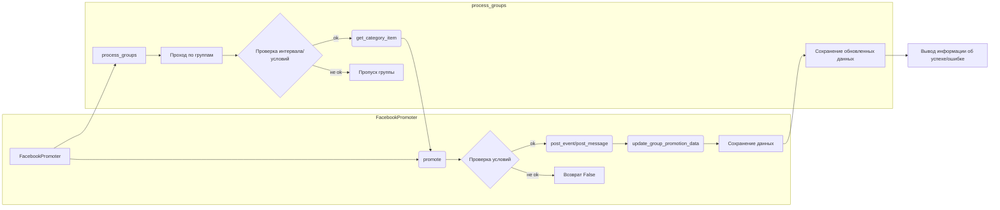

```MD
# <input code>

```python
## \file hypotez/src/endpoints/advertisement/facebook/promoter.py
# -*- coding: utf-8 -*-\
#! venv/Scripts/python.exe
#! venv/bin/python/python3.12

"""
.. module: src.endpoints.advertisement.facebook 
    :platform: Windows, Unix
    :synopsis: module handles the promotion of messages and events in Facebook groups.
It processes campaigns and events, posting them to Facebook groups while avoiding duplicate promotions.
"""
MODE = 'dev'

import random
from datetime import datetime, timedelta
from pathlib import Path
from urllib.parse import urlencode
from types import SimpleNamespace
from typing import Optional

from src import gs
from src.endpoints.advertisement import facebook
from src.webdriver.driver import Driver
from src.suppliers.aliexpress.campaign import AliCampaignEditor
from src.endpoints.advertisement.facebook.scenarios import (post_message, 
                                                   post_event, 
                                                   post_message_title, 
                                                   upload_post_media,
                                                   message_publish,
                                                   post_ad,
                                                   )

from src.utils.file import (read_text_file,
                        get_filenames,
                        get_directory_names,
                        )
from src.utils.jjson import j_loads_ns, j_dumps
from src.utils.cursor_spinner import spinning_cursor
from src.logger import logger

def get_event_url(group_url: str) -> str:
    """
    Returns the modified URL for creating an event on Facebook, replacing `group_id` with the value from the input URL.

    Args:
        group_url (str): Facebook group URL containing `group_id`.

    Returns:
        str: Modified URL for creating the event.
    """
    group_id = group_url.rstrip('/').split('/')[-1]
    base_url = "https://www.facebook.com/events/create/"
    params = {
        "acontext": '{"event_action_history":[{"surface":"group"},{"mechanism":"upcoming_events_for_group","surface":"group"}],"ref_notif_type":null}',
        "dialog_entry_point": "group_events_tab",
        "group_id": group_id
    }

    query_string = urlencode(params)
    return f"{base_url}?{query_string}"

class FacebookPromoter:
    """ Class for promoting AliExpress products and events in Facebook groups.
    
    This class automates the posting of promotions to Facebook groups using a WebDriver instance,
    ensuring that categories and events are promoted while avoiding duplicates.
    """
    d: Driver = None
    group_file_paths: str | Path = None
    no_video: bool = False
    promoter: str

    def __init__(self, d: Driver, promoter: str, group_file_paths: Optional[list[str | Path] | str | Path] = None, no_video: bool = False):
        """ Initializes the promoter for Facebook groups.

        Args:
            d (Driver): WebDriver instance for browser automation.
            group_file_paths (list[str | Path] | str | Path): List of file paths containing group data.
            no_video (bool, optional): Flag to disable videos in posts. Defaults to False.
        """
        self.promoter = promoter
        self.d = d
        self.group_file_paths = group_file_paths if group_file_paths else get_filenames(gs.path.google_drive / 'facebook' / 'groups')
        self.no_video = no_video
        self.spinner = spinning_cursor()
        # ... (rest of the class)
```

# <algorithm>

**Описание алгоритма работы кода**

1. **`get_event_url(group_url)`:** Функция формирует URL для создания события на Facebook, используя переданный URL группы.  Она извлекает `group_id` из URL и подставляет его в шаблон.
    * **Пример:**  Если `group_url` - "https://www.facebook.com/groups/12345", функция вернёт URL для создания события, содержащий `group_id=12345`.
2. **`FacebookPromoter`:** Класс для автоматизации продвижения товаров и событий в группах Facebook.
    * **`__init__`:**  Инициализирует объект, получает WebDriver, список путей к файлам с данными групп и флаг для отключения видео.  Если `group_file_paths` не задан, то используется путь по умолчанию.
    * **`promote`:** Продвигает категорию или событие в группе. Проверяет языковые и валютные соответствия. Обрабатывает различные типы продвижения (событие/сообщение) и вызывает соответствующие методы из `scenarios`.  Логирует ошибки при публикации и обновляет данные о продвинутых категориях/событиях.
    * **`log_promotion_error`:** Записывает ошибку продвижения в лог.
    * **`update_group_promotion_data`:** Обновляет данные о продвинутых категориях/событиях в группе для избежания дублирования.
    * **`process_groups`:** Обрабатывает все группы из списка файлов. Выбирает категорию/событие, проверяет интервал публикации, и если все условия выполнены, вызывает `promote` для продвижения.
    * **`get_category_item`:** Получает категорию для продвижения в зависимости от типа продвижения (`aliexpress`, другие промоутеры). Случайный выбор категории из списка. Обрабатывает различные форматы хранения данных.
    * **`check_interval`:** Проверяет интервал времени для продвижения в группе.
    * **`validate_group`:** Проверяет, что группа имеет необходимые атрибуты.


**Пошаговая блок-схема (фрагмент):**

```mermaid
graph TD
    A[Пользователь запускает продвижение] --> B{Загрузка данных о группах};
    B -- ok --> C[Проверка интервала];
    C -- ok --> D{Проверка соответствия (язык, валюта)};
    D -- ok --> E[Получение категории/события];
    E -- ok --> F[Продвижение в группе (вызов promote)];
    F -- ok --> G[Сохранение обновленных данных];
    F -- ошибка --> H[Логирование ошибки];
    G --> I[Вывод сообщения об успехе];
    C -- не ok --> J[Пропуск группы];
    D -- не ok --> K[Пропуск группы];
    E -- ошибка --> K;
    H -- ok --> I;
    J --> I;
```


# <mermaid>



**Объяснение зависимостей:**

Диаграмма показывает основные взаимосвязи внутри класса `FacebookPromoter` и функции `process_groups`.  Ключевые зависимости:

* `src.gs`:  Возможно, для доступа к данным в Google Drive.
* `src.webdriver.driver`: Для работы с браузером.
* `src.suppliers.aliexpress.campaign`:  Для работы с данными о кампаниях AliExpress.
* `src.endpoints.advertisement.facebook.scenarios`:  Для выполнения действий по публикации сообщений и событий в Facebook.
* `src.utils.file`, `src.utils.jjson`, `src.utils.cursor_spinner`, `src.logger`:  Утилитарные функции для работы с файлами, JSON, индикаторами выполнения, логированием соответственно.


# <explanation>

**Импорты:**

* `src`:  Основной модуль проекта, содержащий вспомогательные функции и классы.
* `src.gs`:  Вероятно, содержит функции для работы с Google Sheets или другими сервисами.
* `src.webdriver.driver`: Класс для управления WebDriver.
* `src.suppliers.aliexpress.campaign`: Подмодуль для работы с кампаниями AliExpress.
* `src.endpoints.advertisement.facebook.scenarios`: Модуль, содержащий функции для публикации сообщений и событий на Facebook.
* `src.utils.file`:  Функции для работы с файлами (чтение, поиск файлов).
* `src.utils.jjson`: Функции для работы с JSON.
* `src.utils.cursor_spinner`: Функция для создания вращающегося индикатора.
* `src.logger`: Модуль для логирования.


**Классы:**

* `FacebookPromoter`: Центральный класс, отвечающий за продвижение товаров/событий в группах Facebook.
    * `d`: Экземпляр `Driver` для взаимодействия с браузером.
    * `group_file_paths`: Пути к файлам, содержащим данные о группах.
    * `no_video`: Флаг для отключения видео в публикациях.
    * `promoter`: Название промоутера (например, `aliexpress`).

**Функции:**

* `get_event_url`: Возвращает URL для создания события на Facebook.
* `FacebookPromoter.__init__`: Инициализация объекта `FacebookPromoter`.
* `FacebookPromoter.promote`: Основная функция для продвижения категории/события.
* `FacebookPromoter.log_promotion_error`: Логирование ошибок.
* `FacebookPromoter.update_group_promotion_data`: Обновление данных о продвинутых категориях/событиях.
* `FacebookPromoter.process_groups`: Обработка всех групп для текущей кампании/события.
* `FacebookPromoter.get_category_item`: Получение категории для продвижения.
* `FacebookPromoter.check_interval`: Проверка интервала времени для продвижения.
* `FacebookPromoter.validate_group`: Валидация данных о группе.

**Переменные:**

* `MODE`: Переменная, вероятно, определяющая режим работы приложения (например, 'dev', 'prod').
* `gs.path.google_drive`: Путь к папке в Google Drive.
* `group_url, group`: Данные о группе Facebook.
* `item`: Объект, представляющий категорию/событие.


**Возможные ошибки и улучшения:**

* **Обработка ошибок:** Обработка ошибок при чтении файлов, получении данных, работе с Facebook API. Например, проверка, что файл `group_file_paths` существует, содержит данные.
* **Улучшение логирования:** Более детальное логирование (включая информацию о времени, идентификатор пользователя, тип ошибки и т. д.).
* **Параллелизация:**  Для ускорения обработки большого количества групп можно использовать многопоточность или асинхронное программирование.
* **Обработка исключений:** Добавьте более детальную обработку исключений, например, при работе с файлами, API и другими внешними ресурсами.
* **Управление ресурсами:** Необходимо добавить код для закрытия `webdriver` после использования.
* **Документация:** Необходимо доработать документацию функций и методов для лучшего понимания их функциональности.
* **Проверка данных:** Добавьте проверки на корректность данных (типы, наличие необходимых атрибутов).


**Цепочка взаимосвязей:**

Код взаимодействует с другими частями проекта через импортированные модули (`src.*`).  Например, функция `process_groups` использует `gs`, `j_loads_ns`, `j_dumps`, и `get_filenames` из `src.utils`, которые взаимодействуют с данными, хранящимися в Google Drive.


```