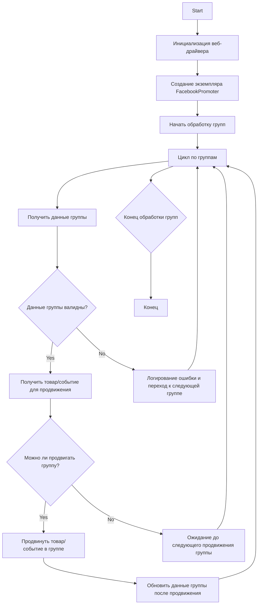

## АНАЛИЗ КОДА: `facebook/promoter.md`

### <алгоритм>

1.  **Инициализация**:
    *   Начало работы модуля.
    *   Создание экземпляра класса `FacebookPromoter`, который принимает драйвер веб-браузера, имя промоутера, пути к файлам с данными групп и флаг для отключения видео.
    *   Пример: `promoter = FacebookPromoter(d=driver, promoter="aliexpress", group_file_paths=["groups1.json", "groups2.json"], no_video=True)`.

2.  **Обработка групп**:
    *   Вызов метода `process_groups` для начала процесса продвижения.
    *   Метод принимает имя кампании, список событий, категории для продвижения, язык и валюту.
    *   Пример: `promoter.process_groups(campaign_name="Summer Sale", events=[event1, event2], group_categories_to_adv=["sales", "deals"], language="en", currency="USD")`.

3.  **Получение данных группы**:
    *   Метод `process_groups` перебирает группы из предоставленных файлов или данных.
    *   Для каждой группы проверяется валидность данных с помощью метода `validate_group`.

4.  **Проверка валидности группы**:
    *   Метод `validate_group` проверяет, имеются ли у группы необходимые атрибуты (например, `group_id`, `last_promotion_time`).
    *   Если данные группы не валидны, в лог записывается ошибка, и группа пропускается.
    *   Пример: Если `group` не содержит `group_id` или `group_name`, функция вернет `False`.

5.  **Получение товара/события для продвижения**:
    *   Если данные группы валидны, вызывается метод `get_category_item`, чтобы получить товар или событие для продвижения.
    *   Метод на основе имени кампании, языка и валюты получает данные для продвижения.
    *   Пример: `item = promoter.get_category_item(campaign_name="Summer Sale", group=group, language="en", currency="USD")`.

6.  **Проверка интервала**:
    *   Перед продвижением проверяется, прошло ли достаточно времени с момента последнего продвижения этой группы с помощью метода `check_interval`.
    *   Если времени прошло недостаточно, происходит ожидание, и процесс возвращается к началу цикла обработки групп.

7.  **Продвижение**:
    *   Если интервал соблюден, вызывается метод `promote` для продвижения товара/события в группе.
    *   Метод `promote` использует драйвер браузера для выполнения действий по публикации поста в Facebook группе.

8.  **Обновление данных группы**:
    *   После успешного продвижения вызывается метод `update_group_promotion_data`, чтобы обновить данные о последнем продвижении группы, включая время и название продвигаемого товара/события.
    *   Пример: `promoter.update_group_promotion_data(group=group, item_name=item.name, is_event=False)`.

9.  **Обработка ошибок**:
    *   В случае ошибки при продвижении вызывается метод `log_promotion_error`, который регистрирует ошибку в логе.

10. **Завершение**:
    *   После обработки всех групп, или если возникла ошибка, работа модуля завершается.

### <mermaid>

### <объяснение>

#### Импорты:
*   `random`: Используется для генерации случайных значений, хотя в коде не показано его прямое использование.
*   `datetime`: Используется для работы с датами и временем, например, для отслеживания последнего времени продвижения группы.
*   `pathlib`: Используется для работы с путями файлов.
*   `urllib.parse`: Используется для разбора и формирования URL.
*   `types.SimpleNamespace`: Используется для создания простых объектов для хранения данных.
*   `src`: Это кастомный модуль, предполагается, что он содержит другие модули и классы, необходимые для работы промоутера. В данном случае используются `src.endpoints.advertisement.facebook.promoter` (где находится класс `FacebookPromoter`), `src.webdriver.driver` (где определен класс `Driver`) и `src.utils.jjson` для работы с json файлами.

#### Класс `FacebookPromoter`:
*   **Роль**: Основной класс для управления процессом продвижения товаров и событий в Facebook группах. Он инкапсулирует все функции, необходимые для автоматизации этого процесса.
*   **Атрибуты**:
    *   `d` (`Driver`): Экземпляр веб-драйвера, используемый для автоматизации действий в браузере.
    *   `promoter` (`str`): Название промоутера (например, "aliexpress").
    *   `group_file_paths` (`Optional[list[str | Path] | str | Path]`): Список или путь к файлам с данными групп.
    *   `no_video` (`bool`): Флаг, указывающий, нужно ли отключать видео в постах.
*   **Методы**:
    *   `__init__`: Инициализирует объект класса, устанавливая значения атрибутов.
    *   `promote`: Выполняет продвижение товара или события в Facebook группе.
    *   `log_promotion_error`: Регистрирует ошибку продвижения.
    *   `update_group_promotion_data`: Обновляет данные о последнем продвижении группы.
    *   `process_groups`: Запускает основной процесс обработки групп для продвижения.
    *   `get_category_item`: Получает товар или событие для продвижения на основе параметров кампании.
    *   `check_interval`: Проверяет, прошло ли достаточно времени с момента последнего продвижения группы.
    *   `validate_group`: Проверяет, валидны ли данные группы.
*   **Взаимодействие**: Класс `FacebookPromoter` взаимодействует с классом `Driver` для управления браузером, классами и функциями из кастомного пакета `src` для получения необходимых данных и утилитарных функций (например, работа с `json`).

#### Функции (методы класса):
*   `__init__(self, d: Driver, promoter: str, group_file_paths: Optional[list[str | Path] | str | Path] = None, no_video: bool = False)`
    *   **Назначение**: Конструктор класса, инициализирует экземпляр `FacebookPromoter`.
    *   **Аргументы**:
        *   `d`: Экземпляр `Driver`.
        *   `promoter`: Строка, имя промоутера.
        *   `group_file_paths`: Опциональный список путей к файлам или путь к файлу с данными групп.
        *   `no_video`: Опциональный флаг, отключающий загрузку видео.
    *   **Возвращает**: `None`.

*   `promote(self, group: SimpleNamespace, item: SimpleNamespace, is_event: bool = False, language: str = None, currency: str = None) -> bool`
    *   **Назначение**: Продвигает товар или событие в группе.
    *   **Аргументы**:
        *   `group`: Данные группы в виде `SimpleNamespace`.
        *   `item`: Данные товара/события в виде `SimpleNamespace`.
        *   `is_event`: Флаг, указывающий на событие.
        *   `language`: Язык для продвижения.
        *   `currency`: Валюта для продвижения.
    *   **Возвращает**: `bool`, `True` если продвижение прошло успешно, `False` иначе.

*   `log_promotion_error(self, is_event: bool, item_name: str)`
    *   **Назначение**: Регистрирует ошибку продвижения.
    *   **Аргументы**:
        *   `is_event`: Флаг, указывающий на событие.
        *   `item_name`: Название товара/события.
    *   **Возвращает**: `None`.

*   `update_group_promotion_data(self, group: SimpleNamespace, item_name: str, is_event: bool = False)`
    *   **Назначение**: Обновляет данные о продвижении группы.
    *   **Аргументы**:
        *   `group`: Данные группы в виде `SimpleNamespace`.
        *   `item_name`: Название товара/события.
        *   `is_event`: Флаг, указывающий на событие.
    *   **Возвращает**: `None`.

*   `process_groups(self, campaign_name: str = None, events: list[SimpleNamespace] = None, is_event: bool = False, group_file_paths: list[str] = None, group_categories_to_adv: list[str] = ['sales'], language: str = None, currency: str = None)`
    *   **Назначение**: Основной метод для запуска процесса продвижения.
    *   **Аргументы**:
        *   `campaign_name`: Название кампании.
        *   `events`: Список событий для продвижения.
        *   `is_event`: Флаг, указывающий на продвижение событий.
        *   `group_file_paths`: Список путей к файлам с данными групп.
        *   `group_categories_to_adv`: Список категорий для продвижения.
        *   `language`: Язык для продвижения.
        *   `currency`: Валюта для продвижения.
    *   **Возвращает**: `None`.

*   `get_category_item(self, campaign_name: str, group: SimpleNamespace, language: str, currency: str) -> SimpleNamespace`
    *   **Назначение**: Получает данные товара/события для продвижения.
    *   **Аргументы**:
        *   `campaign_name`: Название кампании.
        *   `group`: Данные группы.
        *   `language`: Язык для продвижения.
        *   `currency`: Валюта для продвижения.
    *   **Возвращает**: `SimpleNamespace`, данные товара/события.

*   `check_interval(self, group: SimpleNamespace) -> bool`
    *   **Назначение**: Проверяет, прошло ли достаточно времени для повторного продвижения в группе.
    *   **Аргументы**:
        *   `group`: Данные группы.
    *   **Возвращает**: `bool`, `True`, если интервал прошел, `False` иначе.

*   `validate_group(self, group: SimpleNamespace) -> bool`
    *   **Назначение**: Проверяет, валидны ли данные группы.
    *   **Аргументы**:
        *   `group`: Данные группы.
    *   **Возвращает**: `bool`, `True`, если данные валидны, `False` иначе.

#### Переменные:
*   `d`: Экземпляр класса `Driver`, представляет веб-драйвер.
*   `promoter`: Строка, название промоутера (например, "aliexpress").
*   `group_file_paths`: Список строк или объектов `Path`, указывающих на пути к файлам с данными групп.
*   `no_video`: Булевая переменная, указывающая, нужно ли отключать видео в постах.
*   `group`: Объект `SimpleNamespace`, содержащий данные группы.
*   `item`: Объект `SimpleNamespace`, содержащий данные о товаре или событии.
*   `is_event`: Булевая переменная, указывающая, является ли продвигаемое сообщение событием или нет.
*   `campaign_name`: Строка, название кампании.
*   `events`: Список объектов `SimpleNamespace`, представляющих события для продвижения.
*   `group_categories_to_adv`: Список строк, представляющих категории товаров для продвижения.
*   `language`: Строка, представляющая язык для продвижения.
*   `currency`: Строка, представляющая валюту для продвижения.

#### Потенциальные ошибки и области для улучшения:
*   **Обработка ошибок**: В коде не показаны детализированная обработка исключений при работе с веб-драйвером и файлами.
*   **Логирование**: Необходимо расширить логирование для отслеживания подробностей работы, включая время выполнения каждого шага.
*   **Конфигурация**: Параметры, такие как интервал ожидания между продвижениями, могут быть вынесены в конфигурационный файл.
*   **Повторное использование кода**: Некоторые функции могут быть вынесены в отдельные утилитарные модули для переиспользования.
*   **Тестирование**: Код должен быть покрыт тестами для обеспечения корректной работы всех функций.

#### Цепочка взаимосвязей:
1.  Модуль `promoter.py` из `src.endpoints.advertisement.facebook` использует:
    *   `Driver` из `src.webdriver.driver` для управления браузером.
    *   `j_loads_ns` из `src.utils.jjson` для работы с JSON файлами.
2.  Взаимодействует с файлами конфигурации групп (`group_file_paths`), которые должны быть структурированы определенным образом (`group_id`, `last_promotion_time` и тд).
3.  Предполагает, что данные о товарах и событиях хранятся в некотором формате, который может быть получен через `get_category_item` на основе имени кампании, языка и валюты.
4.  Реализует логику продвижения и обновляет данные о группах.