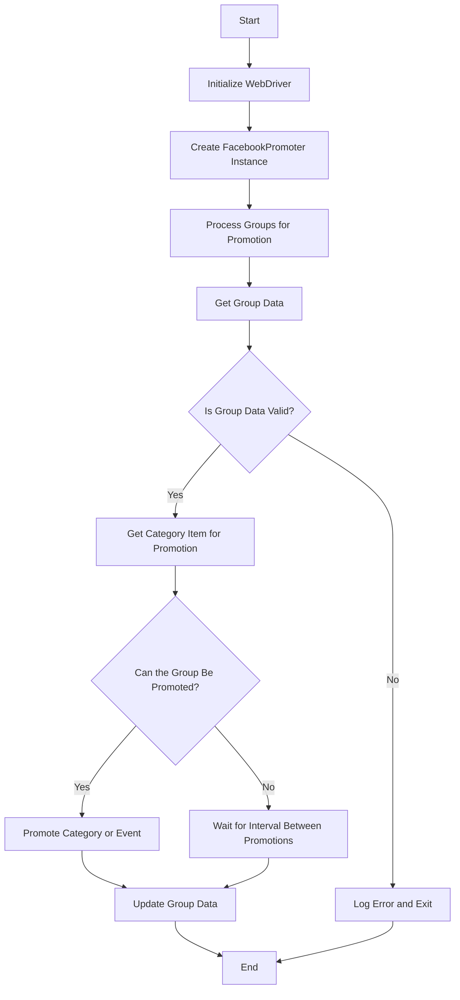

## АНАЛИЗ КОДА: `hypotez/src/endpoints/advertisement/facebook/promoter.md`

### 1. <алгоритм>

**Общий рабочий процесс:**

1.  **Инициализация:**
    *   Создается экземпляр класса `FacebookPromoter`, который включает в себя инициализацию WebDriver (`Driver`), имя промоутера, список файлов с данными групп и флаг для отключения загрузки видео.
    *   Пример: `promoter = FacebookPromoter(d=driver_instance, promoter="aliexpress", group_file_paths=["groups1.json", "groups2.json"], no_video=True)`.

2.  **Обработка групп (`process_groups`):**
    *   Метод `process_groups` получает данные о группах,  итерируется по каждой группе, и  вызывает `get_category_item`  для получения элемента для продвижения.
    *   Пример: `promoter.process_groups(campaign_name="summer_sale", events=[], group_categories_to_adv=["sales"], language="en", currency="USD")`.

3.  **Получение данных группы (`get_group_data`):**
    *   Внутри `process_groups`, данные группы загружаются из файла и преобразуются в объект `SimpleNamespace` (если ещё не).
    *   Пример: Загрузка из файла `groups1.json` с данными группы, такими как `last_promotion_time`, `promoted_categories`, `promoted_events`, и т.д.

4.  **Проверка данных группы (`validate_group`):**
    *   Метод `validate_group` проверяет, что у группы есть все необходимые атрибуты (например, `group_id`, `last_promotion_time`, и другие). Если нет, то выводится ошибка и переход к следующей группе.
    *   Пример: Проверка, есть ли в данных группы поле `group_id`.

5.  **Получение элемента для продвижения (`get_category_item`):**
    *   Метод `get_category_item`  получает данные об элементе для продвижения (категория или событие) для конкретной группы. Он зависит от  параметров `campaign_name`, `group`, `language` и `currency`.
    *   Пример: Получение объекта `SimpleNamespace` с данными товара для акции "summer_sale" из категории "sales".

6.  **Проверка интервала (`check_interval`):**
    *   Метод `check_interval` проверяет, прошло ли достаточно времени с момента последней публикации в группе, чтобы выполнить еще одно продвижение. Если интервал не прошел, то группа пропускается.
    *   Пример: Проверка прошло ли, например, 24 часа с момента последнего продвижения в группе.

7.  **Продвижение (`promote`):**
    *   Метод `promote` публикует контент  в Facebook. Он получает данные группы, элемент продвижения, флаг события и параметры `language` и `currency`.
    *   Пример: Публикация поста в Facebook группе с данными о товаре/событии.

8.  **Обновление данных группы (`update_group_promotion_data`):**
    *   Метод `update_group_promotion_data` обновляет данные группы, добавляя информацию о продвинутом элементе  в списки `promoted_categories` или `promoted_events`, а также меняет время последнего продвижения.
    *   Пример: Добавление ID товара в список `promoted_categories` группы и обновление времени последнего продвижения.

9.  **Логирование ошибок (`log_promotion_error`):**
    *   Метод `log_promotion_error` логирует ошибки, которые могут возникнуть в процессе продвижения.
    *   Пример: Логирование ошибки, если публикация не удалась.

10. **Завершение:**
    *   Процесс обработки групп завершается после итерации по всем группам.

**Блок-схема в виде псевдокода:**

```
Start
  Initialize FacebookPromoter
  For each group in group_file_paths:
    Get group data
    If group data is valid:
      Get category item
      If check_interval passed:
          Promote item
          Update group data
      Else:
          Wait for interval
    Else:
        Log error
  End For
End
```

### 2. <mermaid>



**Объяснение диаграммы:**

*   **Start**: Начало процесса.
*   **InitDriver**: Инициализация WebDriver для управления браузером. Зависит от `src.webdriver.driver.Driver`.
*   **CreatePromoter**: Создание экземпляра класса `FacebookPromoter` . Зависит от  `src.endpoints.advertisement.facebook.promoter.FacebookPromoter`.
*   **ProcessGroups**: Запускает процесс обработки списка групп для продвижения. Вызывает метод `process_groups` класса `FacebookPromoter`.
*   **GetGroupData**: Загружает данные о конкретной группе из файла, преобразуя их в `SimpleNamespace`. Зависит от `src.utils.jjson.j_loads_ns`.
*   **ValidateGroup**: Проверяет, являются ли данные группы корректными и содержат ли все необходимые атрибуты. Вызывает метод `validate_group` класса `FacebookPromoter`.
*   **GetCategoryItem**: Извлекает элемент (категорию или событие) для продвижения из данных группы. Вызывает метод `get_category_item` класса `FacebookPromoter`.
*   **CheckInterval**: Проверяет, прошло ли достаточно времени с момента предыдущей публикации в этой группе. Вызывает метод `check_interval` класса `FacebookPromoter`.
*   **PromoteItem**: Продвигает выбранный элемент в группе Facebook. Вызывает метод `promote` класса `FacebookPromoter`.
*   **UpdateGroupData**: Обновляет данные группы после продвижения, добавляя информацию о том, что было продвинуто и когда. Вызывает метод `update_group_promotion_data` класса `FacebookPromoter`.
*   **WaitForInterval**: Ожидание заданного интервала перед повторным продвижением в группе.
*   **LogErrorAndExit**: Логирует ошибку, если данные группы не валидны и прерывает процесс для текущей группы. Вызывает метод `log_promotion_error` класса `FacebookPromoter`.
*   **End**: Завершение процесса.

### 3. <объяснение>

#### Импорты:

*   `from src.endpoints.advertisement.facebook.promoter import FacebookPromoter`: Импортирует класс `FacebookPromoter`, который является основным классом этого модуля и отвечает за продвижение контента в Facebook. Он находится в модуле `src.endpoints.advertisement.facebook`.
*   `from src.webdriver.driver import Driver`: Импортирует класс `Driver` для управления WebDriver, который используется для автоматизации браузера. Он находится в модуле `src.webdriver`.
*   `from src.utils.jjson import j_loads_ns`: Импортирует функцию `j_loads_ns`, которая, вероятно, загружает JSON данные и преобразует их в объект `SimpleNamespace`. Она находится в модуле `src.utils`.
*   `import random`: Импортирует модуль `random` для генерации случайных чисел.
*   `import datetime`: Импортирует модуль `datetime` для работы с датами и временем.
*   `from pathlib import Path`: Импортирует класс `Path` из модуля `pathlib` для работы с путями файлов.
*   `from urllib.parse import urlparse`: Импортирует функцию `urlparse` для разбора URL-адресов.
*  `from types import SimpleNamespace`: Импортирует класс `SimpleNamespace` для создания простых объектов, которые могут содержать произвольные атрибуты.
*   `from typing import Optional, List`: Импортирует `Optional` и `List` для статической типизации, указывая на то, что аргументы могут быть опциональными и листами.

#### Классы:

*   **`FacebookPromoter`**:
    *   **Роль:**  Основной класс, который управляет процессом продвижения в Facebook. Он отвечает за загрузку данных групп, выбор элементов для продвижения, публикацию контента и обновление данных после продвижения.
    *   **Атрибуты:**
        *   `d (Driver)`: Экземпляр класса `Driver` для управления браузером.
        *   `promoter (str)`: Имя промоутера (например, "aliexpress").
        *   `group_file_paths (Optional[list[str | Path] | str | Path])`: Пути к файлам, содержащим данные о группах.
        *   `no_video (bool)`: Флаг, указывающий, нужно ли отключать загрузку видео.
    *   **Методы:**
        *   `__init__`: Инициализирует экземпляр класса.
        *   `promote`: Публикует контент в Facebook.
        *   `log_promotion_error`: Логирует ошибки продвижения.
        *   `update_group_promotion_data`: Обновляет данные группы после продвижения.
        *   `process_groups`: Основной метод, управляющий процессом продвижения для нескольких групп.
        *   `get_category_item`: Получает элемент для продвижения (категорию или событие).
        *   `check_interval`: Проверяет, прошло ли достаточно времени с момента последней публикации.
        *   `validate_group`: Проверяет валидность данных группы.

#### Функции:

*   `j_loads_ns`: Функция из модуля `src.utils.jjson`, которая загружает данные из JSON и возвращает их в виде объекта `SimpleNamespace`.
*   методы класса `FacebookPromoter` описаны выше

#### Переменные:

*   `d (Driver)`: Объект класса `Driver`, представляющий WebDriver.
*   `promoter (str)`: Строка, представляющая имя промоутера.
*   `group_file_paths (Optional[list[str | Path] | str | Path])`: Список путей к файлам с данными групп.
*   `no_video (bool)`: Логическое значение, указывающее, нужно ли отключать загрузку видео.
*   `group (SimpleNamespace)`: Объект, представляющий данные группы.
*   `item (SimpleNamespace)`: Объект, представляющий элемент для продвижения (категорию или событие).
*    `campaign_name (str)`: Название текущей кампании.
*    `events (list[SimpleNamespace])`: Список событий для продвижения.
*    `is_event (bool)`: Флаг, указывающий на то, является ли продвижение событием.
*    `group_categories_to_adv (list[str])`: Список категорий для продвижения.
*    `language (str)`: Язык продвижения.
*    `currency (str)`: Валюта продвижения.

#### Потенциальные ошибки и области для улучшения:

*   **Обработка ошибок**:  Код имеет метод для логирования ошибок, но не содержит подробной обработки ошибок, таких как ошибки WebDriver, сетевые ошибки, ошибки JSON и т.д. Необходимо добавить try/except блоки для перехвата и обработки исключений.
*   **Конфигурация интервала**:  Интервал между продвижениями не конфигурируется и может быть задан только в коде. Необходимо сделать интервал настраиваемым, возможно, через файл конфигурации.
*   **Логирование**:  Логирование сейчас очень базовое, нужно добавить больше информации в логи, а также добавить возможность настройки логирования (уровень, куда логировать и т.п.).
*   **Проверка валидности данных**: Проверка валидности данных групп ограничена наличием необходимых атрибутов, можно добавить более детальную проверку (например, проверку на соответствие типов).
*   **Зависимость от WebDriver:**  Модуль сильно зависит от конкретной реализации WebDriver. Можно выделить интерфейс для WebDriver и создать несколько реализаций, позволяя работать с разными браузерами.

#### Взаимосвязи с другими частями проекта:

*   **`src.webdriver.driver.Driver`**:  Модуль `promoter` зависит от модуля `Driver` для управления браузером. `Driver` предоставляет интерфейс для выполнения действий в браузере, таких как переход по страницам, ввод данных и т.д.
*   **`src.utils.jjson.j_loads_ns`**: Модуль `promoter` использует функцию `j_loads_ns` для загрузки данных из файлов JSON.
*   **`src`**: Модуль `promoter` является частью проекта `src` и использует другие модули из этого проекта.

В целом, модуль `FacebookPromoter` является хорошо структурированным и отвечает за автоматизацию продвижения в Facebook. Однако, есть области, которые можно улучшить для большей стабильности, гибкости и расширяемости.