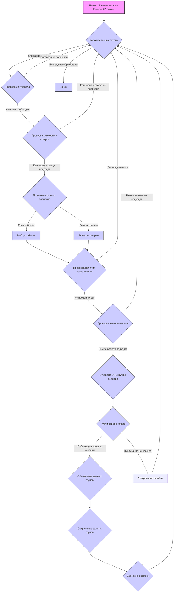

## Анализ кода `hypotez/src/endpoints/advertisement/facebook/promoter.py`

### 1. <алгоритм>

**Общая логика:**

1.  **Инициализация:**
    *   Создается экземпляр `FacebookPromoter`, который принимает драйвер веб-браузера (`Driver`), имя промоутера и путь к файлам групп.
    *   Инициализируется спиннер для отображения процесса загрузки.
    *   Устанавливается флаг `no_video` для отключения видео в постах.

2.  **Процесс продвижения:**
    *   Метод `process_groups` является основным. Он получает данные для кампании (или события), список групп для продвижения, список категорий для продвижения и параметры языка и валюты.
    *   Он итерируется по файлам групп, загружает данные для каждой группы, и вызывает метод `promote` для каждой группы.
    *   Перед продвижением проверяется интервал между продвижениями, если требуется.
    *   Если это событие, то оно выбирается из списка событий. Иначе выбирается категория с помощью `get_category_item`.
    *   Проверяется, было ли уже продвижение этого элемента в группе.
    *   Если требуется, открывается URL страницы группы или страницы создания события.
    *   Вызывается метод `promote` для публикации.

3.  **Метод `promote`:**
    *   Принимает объект группы (`SimpleNamespace`), объект с данными для публикации (`SimpleNamespace` или `str`) и флаг является ли продвигаемый элемент событием.
    *   Если нужно, проверяет соответствие языка и валюты группы с запрошенными параметрами.
    *   Если продвигается событие, то вызывает `post_event`, в противном случае - `post_ad` или `post_message`.
    *   После публикации обновляет данные группы, вызывая `update_group_promotion_data`.

4.  **Получение данных (`get_category_item`):**
    *   В зависимости от `promoter` извлекает данные категории из файлов кампании или из API Aliexpress.
    *   Для промоутера Aliexpress вызывается `AliCampaignEditor`, из которого получает список категорий, случайным образом выбирается одна категория, а также продукты в этой категории.
    *   Для остальных промоутеров, загружаются категории из JSON файла и случайным образом выбирается одна.

5.  **Вспомогательные методы:**
    *   `get_event_url` формирует URL для создания события на Facebook.
    *   `log_promotion_error` записывает ошибку в журнал.
    *   `update_group_promotion_data` обновляет данные о продвижении в объекте группы.
    *   `check_interval` проверяет интервал между публикациями.
    *   `validate_group` проверяет структуру объекта группы.

**Блок-схема с примерами:**



### 2. <mermaid>

```mermaid
flowchart TD
    subgraph FacebookPromoter
        A[__init__] --> B{set `d`, `promoter`, `group_file_paths`, `no_video`};
        B --> C{Init spinning_cursor};
        C --> D[promote];
        D --> E{check `language` and `currency`};
         E -- Not Match --> M[return];
         E -- Match --> F{is_event};
         F -- True --> G[post_event];
         F -- False -->H{Check `promoter` for 'kazarinov' or 'emil'};
         H -- True --> I[post_ad]
         H -- False --> J[post_message]
         I --> K{update_group_promotion_data};
         J --> K;
         G --> K;
         K --> L[return true];
         L --> M;
         D --> N[log_promotion_error];
        A --> O[process_groups];
        O -->P{Check `campaign_name` and `events`};
        P --  Not Found --> Q[log "Nothing to promote!" ];
        P -- Found --> R{Iterate `group_file_paths`};
        R --> S{Load `groups_ns` from JSON file};
          S -- No Data -->T[log  error];
        S -- Data Found --> U{Iterate groups in `groups_ns`};
        U --> V{Check promotion interval};
            V -- Interval false --> U;
        V -- Interval true -->W{Check `group_categories_to_adv`};
             W -- Not  Match --> U;
             W -- Match --> X{Get category/event `item`};
            X --> Y{Check `item` already promoted};
              Y --  Already promoted --> U;
             Y -- Not Promoted --> Z{Check `language` and `currency`};
             Z -- Not Match -->U;
               Z -- Match --> AA{Get group url};
               AA --> BB{call `promote`};
            BB -->CC{Save `groups_ns` to JSON file};
            CC -->DD{Wait};
            DD -->U;
    end
    subgraph AliCampaignEditor
        EE[__init__] --> FF{set `campaign_name`, `language`, `currency`};
        FF --> GG[list_categories];
        GG --> HH{get_category};
        HH --> II{get_category_products};
    end
    subgraph utils
        JJ[j_loads_ns]
        KK[j_dumps]
        LL[read_text_file]
        MM[get_filenames]
        NN[get_directory_names]
        OO[spinning_cursor]
    end
      subgraph logger
        PP[logger.debug]
        QQ[logger.error]
      end
    subgraph Driver
       RR[driver.get_url]
    end
    subgraph FacebookScenarios
        SS[post_message]
        TT[post_event]
        UU[post_message_title]
        VV[upload_post_media]
        WW[message_publish]
        XX[post_ad]
    end
     A --> JJ;
     KK --> O;
     LL --> X;
    MM --> X;
    NN --> X;
    OO --> A;
    PP --> D;
    PP --> O;
     QQ --> O;
     RR --> AA;
     SS --> J;
     TT --> G;
     UU --> J;
      VV --> J;
      WW --> J;
      XX -->I
     B -->RR;
     D -->SS;
     D -->TT;
     D -->XX;
     E -->RR;
     K -->KK;
     S -->JJ;
     X -->EE;
    classDef classFill fill:#f9f,stroke:#333,stroke-width:2px
   class A,B,C,D,E,F,G,H,I,J,K,L,M,N,O,P,Q,R,S,T,U,V,W,X,Y,Z,AA,BB,CC,DD,EE,FF,GG,HH,II,JJ,KK,LL,MM,NN,OO,PP,QQ,RR,SS,TT,UU,VV,WW,XX classFill

```

**Объяснение зависимостей:**

1.  **`FacebookPromoter`:**
    *   **`__init__`**: Инициализирует экземпляр класса, получая данные драйвера, промоутера, пути к файлам групп и флаг отключения видео.
    *   **`promote`**: Основной метод для продвижения. Вызывает другие методы для фактической публикации.
    *   **`process_groups`**: Обрабатывает группы и вызывает `promote`.
    *   `**get_category_item**`: Получает данные о категориях для продвижения из `AliCampaignEditor` или из JSON файла.

2.  **`AliCampaignEditor`**:
    *   `__init__`: Инициализирует редактор кампаний Aliexpress, принимая имя кампании, язык и валюту.
    *  `list_categories`: Возвращает список категорий.
    * `get_category`: Возвращает данные категории.
    *  `get_category_products`: Возвращает товары в категории.

3.  **`utils`**:
    *   **`j_loads_ns`**: Загружает JSON в объект `SimpleNamespace`.
    *   **`j_dumps`**: Сериализует объект `SimpleNamespace` в JSON.
    *   **`read_text_file`**: Читает текст из файла.
    *   **`get_filenames`**: Получает список имен файлов из директории.
    *   **`get_directory_names`**: Получает список имен директорий из директории.
    *   **`spinning_cursor`**: Создаёт спиннер для анимации в консоли.

4.  **`logger`**:
    *   **`logger.debug`**: Записывает отладочные сообщения.
     *   **`logger.error`**: Записывает сообщения об ошибках.

5. **`Driver`**:
    * **`driver.get_url`**: Открывает URL в веб-браузере.

6.  **`FacebookScenarios`**:
    *   **`post_message`**: Отправляет сообщение в Facebook группу.
    *   **`post_event`**: Создаёт событие в Facebook группе.
    *   **`post_message_title`**: Отправляет сообщение с заголовком в Facebook группу.
    *   **`upload_post_media`**: Загружает медиа файл.
     *   **`message_publish`**: Публикует сообщение.
     *   **`post_ad`**: Публикует объявление в Facebook.

### 3. <объяснение>

#### Импорты:

*   `random`: Используется для генерации случайных чисел, например, для выбора случайной категории или задержки времени.
*   `datetime`, `timedelta`: Используются для работы с датой и временем, например, для проверки интервалов между публикациями.
*   `pathlib.Path`: Используется для работы с путями к файлам и директориям.
*   `urllib.parse.urlencode`: Используется для кодирования параметров URL.
*   `types.SimpleNamespace`: Используется для создания простых объектов с атрибутами.
*  `typing.Optional`: Позволяет сделать аргумент функции необязательным.
*   `src.gs`: Глобальные настройки проекта.
*   `src.endpoints.advertisement.facebook`: Специфические функции для работы с Facebook.
*   `src.webdriver.driver`: Драйвер для управления браузером.
*  `src.suppliers.aliexpress.campaign`: Класс для работы с кампаниями Aliexpress.
*   `src.endpoints.advertisement.facebook.scenarios`: Сценарии для выполнения действий в Facebook.
*   `src.utils.file`: Функции для работы с файлами.
*   `src.utils.jjson`: Функции для работы с JSON.
*   `src.utils.cursor_spinner`: Спиннер для отображения загрузки в консоли.
*   `src.logger.logger`: Модуль для логирования.

#### Классы:

*   **`FacebookPromoter`**:
    *   **Роль**: Управляет процессом продвижения товаров и событий в группах Facebook.
    *   **Атрибуты**:
        *   `d`: Экземпляр `Driver` для управления браузером.
        *   `group_file_paths`: Путь к файлам с данными групп.
        *   `no_video`: Флаг для отключения видео в постах.
        *    `promoter`: Название промоутера.
        *   `spinner`: Экземпляр `spinning_cursor` для анимации загрузки.
    *   **Методы**:
        *   `__init__`: Инициализация класса.
        *   `promote`: Выполняет фактическое продвижение.
        *   `log_promotion_error`: Логирует ошибки.
        *   `update_group_promotion_data`: Обновляет данные группы.
        *   `process_groups`: Основной метод управления продвижением.
        *   `get_category_item`: Получает данные для продвижения (категорию или событие).
        *   `check_interval`: Проверяет интервал между продвижениями.
        *   `validate_group`: Проверяет данные группы.

#### Функции:

*   **`get_event_url`**:
    *   **Аргументы**:
        *   `group_url` (str): URL группы Facebook.
    *   **Возвращаемое значение**:
        *   str: URL для создания события.
    *   **Назначение**: Формирует URL для создания события на Facebook.
    *   **Пример**:

```python
    group_url = "https://www.facebook.com/groups/123456789/"
    event_url = get_event_url(group_url)
    print(event_url)  # Output: https://www.facebook.com/events/create/?acontext=%7B%22event_action_history%22%3A%5B%7B%22surface%22%3A%22group%22%7D%2C%7B%22mechanism%22%3A%22upcoming_events_for_group%22%2C%22surface%22%3A%22group%22%7D%5D%2C%22ref_notif_type%22%3Anull%7D&dialog_entry_point=group_events_tab&group_id=123456789
```

#### Переменные:

*   `MODE`: Строка, определяющая режим работы (например, 'dev' для разработки).
*   `group_file_paths`: Может быть списком путей к файлам или строкой с путем, указывая где находятся файлы с информацией о группах.

#### Потенциальные ошибки и улучшения:

*   **Обработка ошибок**:
    *   В коде есть обработка ошибок, например, логирование ошибок, но не хватает более детальной обработки исключений (try-except) в разных функциях, что бы ловить и обрабатывать разные ошибки.
*   **Неявные зависимости**:
    *   В методе `get_category_item`  определён промоутер 'aliexpress', а также метод формирует пути к файлам основываясь на имени промоутера `self.promoter`, из этого следует, что необходима большая гибкость и масштабируемость при добавлении новых промоутеров.
*   **Повторяющийся код**:
    *   В `process_groups` есть логика проверки соответствия языка и валюты два раза, до вызова `promote` и после. Проверку соответствия можно вынести в отдельный метод.
    *   В методе `update_group_promotion_data` проверка на список  `group.promoted_events = group.promoted_events if isinstance(group.promoted_events, list) else [group.promoted_events]`  и `group.promoted_categories = group.promoted_categories if isinstance(group.promoted_categories, list) else [group.promoted_categories]` можно вынести в отдельную функцию.
*   **Улучшение логирования**:
    *   Логирование можно сделать более подробным, включив больше информации о действиях, выполняемых в коде.

#### Взаимосвязи с другими частями проекта:

*   **`src.gs`**: Используется для получения глобальных настроек, таких как пути к файлам.
*   **`src.webdriver.driver`**: Используется для управления браузером при выполнении действий на Facebook.
*  **`src.suppliers.aliexpress.campaign`**: Используется для получения данных о кампаниях Aliexpress.
*   **`src.endpoints.advertisement.facebook.scenarios`**: Содержит функции, которые выполняют сценарии постов в Facebook.
*   **`src.utils.file`**: Используется для чтения и получения списков файлов и директорий.
*  **`src.utils.jjson`**: Используется для чтения/записи JSON файлов.
*   **`src.utils.cursor_spinner`**: Используется для отображения спиннера во время загрузки.
*   **`src.logger.logger`**: Используется для логирования событий и ошибок.

Этот анализ предоставляет всестороннее представление о структуре и функционировании данного модуля, а также о его взаимодействии с другими частями проекта.