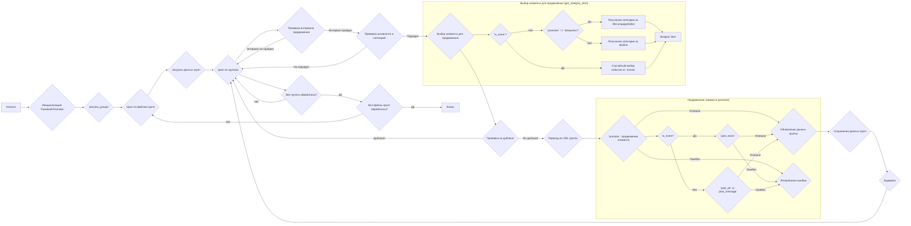

## АНАЛИЗ КОДА `src/endpoints/advertisement/facebook/promoter.py`

### 1. **<алгоритм>**

#### **Блок-схема:**



**Примеры:**

*   **Инициализация `FacebookPromoter`**:
    Создается экземпляр `FacebookPromoter` с драйвером браузера, именем промоутера и, возможно, списком файлов групп. Например:
    ```python
    driver = Driver()
    promoter = FacebookPromoter(d=driver, promoter='my_promoter', group_file_paths=['groups1.json', 'groups2.json'])
    ```
*   **`process_groups`**:
    Запускается процесс продвижения с указанием названия кампании, списка событий (если есть), списка файлов групп, категорий для продвижения, языка и валюты:
    ```python
    promoter.process_groups(
        campaign_name='my_campaign', 
        group_file_paths=['groups1.json'], 
        group_categories_to_adv=['sales', 'discount'], 
        language='ru', 
        currency='rub'
        )
    ```
*   **Проверка интервала продвижения:**
    Функция `check_interval` проверяет, достаточно ли времени прошло с момента последней публикации в группе, чтобы избежать слишком частого постинга.
*   **`promote`**:
    Если это событие, вызывается `post_event`, иначе `post_ad` (если `kazarinov` или `emil` в имени промоутера) или `post_message` для обычного сообщения.

### 2. **<mermaid>**

```mermaid
flowchart TD
    subgraph FacebookPromoter
        A[FacebookPromoter] --> B(Driver: WebDriver);
        A --> C(group_file_paths: List[str] or str);
        A --> D(no_video: bool);
        A --> E(promoter: str);
        A --> F(spinner: spinning_cursor);
        F --> G(spinning_cursor)
        A --> H(promote(group, item, is_event, language, currency): bool);
        A --> I(log_promotion_error(is_event, item_name): void);
        A --> J(update_group_promotion_data(group, item_name, is_event): void);
        A --> K(process_groups(campaign_name, events, is_event, group_file_paths, group_categories_to_adv, language, currency): void);
        A --> L(get_category_item(campaign_name, group, language, currency): SimpleNamespace);
        A --> M(check_interval(group): bool);
        A --> N(validate_group(group): bool);

        H --> O{post_event}
        H --> P{post_ad}
        H --> Q{post_message}

    end

     subgraph Utils
         R(read_text_file(file_path): str)
         S(get_filenames_from_directory(dir_path): List[str])
         T(get_directory_names(dir_path): List[str])
         U(j_loads_ns(file_path): SimpleNamespace)
         V(j_dumps(data: SimpleNamespace, file_path: str))
    end
    subgraph External
        W(datetime: module)
        X(random: module)
        Y(Path: module)
        Z(urlencode: function)
        A1(SimpleNamespace: type)
    end

     subgraph "src.endpoints.advertisement.facebook.scenarios"
        O --> B1(post_event(d, event): bool)
        P --> C1(post_ad(d, message): bool)
        Q --> D1(post_message(d, message, no_video, without_captions): bool)
        --> E1(upload_post_media(d, message):bool)
        --> F1(message_publish(d, message):bool)
        --> G1(post_message_title(d, message):bool)
     end

     subgraph "src.suppliers.aliexpress.campaign"
        L --> H1(AliCampaignEditor: class)
     end
      subgraph "src"
        B --> I1(Driver: class)
          K --> J1(logger: module)
     end
     FacebookPromoter --> I1

      L --> R
      L --> S
      K --> T
       K --> U
        K --> V
    K-->J1
```

#### **Зависимости:**

*   **`FacebookPromoter`** использует `Driver` из `src.webdriver.driver` для управления браузером.
*   Для работы с файлами используются функции из `src.utils.file_async`, включая `read_text_file`, `get_filenames_from_directory` и `get_directory_names`.
*   Для обработки JSON используется `j_loads_ns` и `j_dumps` из `src.utils.jjson`.
*   `post_message`, `post_event`, `post_ad` из `src.endpoints.advertisement.facebook.scenarios` отвечают за выполнение конкретных действий на Facebook.
*   `AliCampaignEditor` из `src.suppliers.aliexpress.campaign` используется для получения данных кампаний AliExpress.
*   Модуль `src.gs` содержит глобальные настройки приложения.
*   Используются стандартные библиотеки `random`, `datetime`, `pathlib`, `urllib`, `types`.
*   `logger` используется для логирования ошибок и отладки.

### 3. **<объяснение>**

#### **Импорты:**

*   `random`: Для генерации случайных чисел (например, для случайного выбора элементов для публикации).
*   `datetime`, `timedelta`: Для работы с датой и временем (например, для проверки интервалов).
*   `pathlib.Path`: Для работы с путями к файлам и директориям.
*   `urllib.parse.urlencode`: Для кодирования параметров URL.
*   `types.SimpleNamespace`: Для создания объектов с атрибутами.
*   `typing.Optional`: Для указания необязательных типов аргументов.
*   `src.gs`: Глобальные настройки приложения.
*   `src.endpoints.advertisement.facebook`: Содержит модули для работы с Facebook API.
*   `src.webdriver.driver.Driver`: Драйвер браузера для автоматизации действий.
*   `src.suppliers.aliexpress.campaign.AliCampaignEditor`: Редактор кампаний AliExpress.
*   `src.endpoints.advertisement.facebook.scenarios`: Содержит функции для выполнения различных сценариев в Facebook.
*   `src.utils.file_async`: Асинхронные функции для работы с файлами.
*   `src.utils.jjson`: Функции для работы с JSON.
*   `src.utils.cursor_spinner`: Для отображения спиннера в консоли.
*   `src.logger.logger`: Для логирования.

#### **Классы:**

*   `FacebookPromoter`:
    *   **Атрибуты:**
        *   `d: Driver`: Экземпляр драйвера браузера.
        *   `group_file_paths: str | Path`: Путь к файлам с данными групп.
        *   `no_video: bool`: Флаг для отключения видео в постах.
        *   `promoter: str`: Имя промоутера.
        *   `spinner`: Объект для отображения спиннера в консоли.
    *   **Методы:**
        *   `__init__(self, d, promoter, group_file_paths, no_video)`: Конструктор класса. Инициализирует атрибуты.
        *   `promote(self, group, item, is_event, language, currency)`: Продвигает товар или событие в группе. Проверяет язык и валюту группы, вызывает соответствующие функции `post_event`, `post_ad` или `post_message`.
        *   `log_promotion_error(self, is_event, item_name)`: Логирует ошибку продвижения.
        *   `update_group_promotion_data(self, group, item_name, is_event)`: Обновляет данные о продвижении группы.
        *   `process_groups(self, campaign_name, events, is_event, group_file_paths, group_categories_to_adv, language, currency)`: Обрабатывает группы, проверяет интервалы, выбирает элемент для продвижения и вызывает `promote`.
        *   `get_category_item(self, campaign_name, group, language, currency)`: Возвращает объект с данными о товаре или событии для продвижения.
        *   `check_interval(self, group)`: Проверяет, прошло ли достаточно времени с последней публикации.
        *   `validate_group(self, group)`: Проверяет, корректны ли данные группы.

#### **Функции:**

*   `get_event_url(group_url: str) -> str`:
    *   **Аргументы**: `group_url` - URL группы Facebook.
    *   **Возвращает**: URL для создания события в Facebook.
    *   **Назначение**: Преобразует URL группы в URL для создания события.
    *   **Пример**:
        ```python
        url = get_event_url("https://www.facebook.com/groups/123456789/")
        print(url)
        # Вывод: https://www.facebook.com/events/create/?acontext={"event_action_history":[{"surface":"group"},{"mechanism":"upcoming_events_for_group","surface":"group"}],"ref_notif_type":null}&dialog_entry_point=group_events_tab&group_id=123456789
        ```
*   `get_filenames(path: str | Path) -> list[str] | str`:
    *   **Аргументы**: `path` - путь к директории.
    *   **Возвращает**: Список файлов или имя файла в директории.
    *   **Назначение**: Получение списка имен файлов в директории.

#### **Переменные:**

*   `d` (`Driver`): Экземпляр драйвера браузера для управления браузером.
*   `group_file_paths` (`str | Path | list[str | Path]`): Пути к файлам, содержащим информацию о группах Facebook.
*   `no_video` (`bool`): Флаг, указывающий, нужно ли отключать видео в постах.
*   `promoter` (`str`): Строка, идентифицирующая промоутера (например, 'aliexpress').
*   `campaign_name` (`str`): Название рекламной кампании.
*   `events` (`list[SimpleNamespace]`): Список событий для продвижения.
*   `is_event` (`bool`): Флаг, указывающий, является ли продвигаемый контент событием.
*   `group_categories_to_adv` (`list[str]`): Список категорий групп, в которых будет размещаться реклама.
*   `language` (`str`): Язык для продвижения.
*   `currency` (`str`): Валюта для продвижения.
*   `group` (`SimpleNamespace`): Объект, содержащий информацию о группе Facebook.
*   `item` (`SimpleNamespace`): Объект, содержащий информацию о продвигаемом товаре или событии.
*   `timestamp` (`str`): Текущее время в формате "dd/mm/yy HH:MM".
*    `item_name` (`str`): Название товара или события.
*    `ce` (`AliCampaignEditor`): Экземпляр редактора кампаний AliExpress.
*    `adv` (`SimpleNamespace`): Объект, содержащий данные для продвижения.
*    `base_path` (`Path`): Путь к файлам кампании.
*   `groups_ns` (`dict`): Словарь, содержащий данные о группах Facebook.
*   `path_to_group_file` (`Path`): Путь к файлу с данными группы.
*    `ev_or_msg` (`SimpleNamespace`): Объект с данными для события или сообщения.

#### **Потенциальные ошибки и области для улучшения:**

*   **Обработка ошибок**: В некоторых местах обработка ошибок минимальна (например, при чтении файлов). Стоит добавить более детализированную обработку и логирование.
*   **Использование `SimpleNamespace`**: `SimpleNamespace` удобен, но можно рассмотреть использование `dataclass` для более структурированных данных.
*   **Повторяющийся код**: Можно выделить общие блоки кода (например, проверку `is_event`) в отдельные функции для уменьшения дублирования.
*   **`check_interval`**: Реализация `check_interval` не показана в предоставленном коде.
*   **Сохранение данных**: Сохранение данных групп выполняется после каждого продвижения. Возможно, стоит сохранять данные более редко (например, в конце обработки всех групп) для оптимизации.
*   **Имена переменных**: Некоторые переменные (`t`, `_img`) не очень описательные, стоит переименовать их.
*   **Логика перебора категорий**: Логика перебора категорий может быть улучшена для более равномерного продвижения.

#### **Взаимосвязи с другими частями проекта:**

*   **`src.gs`**: Глобальные настройки, используются для получения путей к директориям.
*   **`src.webdriver.driver`**: Для управления браузером (Chrome, Firefox, etc.).
*   **`src.suppliers.aliexpress.campaign`**: Для получения данных для продвижения товаров AliExpress.
*   **`src.endpoints.advertisement.facebook.scenarios`**: Содержит функции для выполнения действий в Facebook.
*   **`src.utils.file_async`**, **`src.utils.jjson`**, **`src.utils.cursor_spinner`**, **`src.logger.logger`**: Общие утилиты проекта.
*   **`src.endpoints.advertisement`**: Модуль, в котором, вероятно, находятся другие классы или модули, связанные с рекламой.

Этот код представляет собой класс `FacebookPromoter`, который автоматизирует процесс продвижения товаров и событий в группах Facebook. Класс использует различные утилиты и модули проекта, а также внешний браузер через `webdriver`, для выполнения поставленных задач.