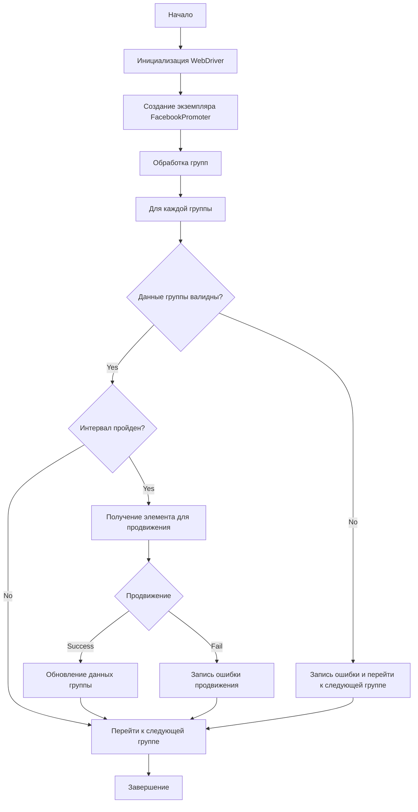
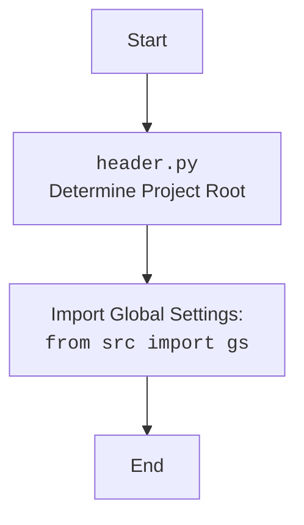

## АНАЛИЗ КОДА: `hypotez/src/endpoints/advertisement/facebook/promoter.ru.md`

### 1. <алгоритм>

**Общий процесс работы:**

1.  **Инициализация:**
    *   Создается экземпляр класса `FacebookPromoter`, который принимает в качестве аргументов:
        *   `Driver`: Экземпляр WebDriver для взаимодействия с браузером.
        *   `promoter`: Строка, идентифицирующая промоутера (например, "aliexpress").
        *   `group_file_paths`: Список путей к JSON файлам с настройками групп или путь к одному файлу.
        *   `no_video`: Флаг, отключающий загрузку видео в постах, по умолчанию `False`.
2.  **Обработка групп (`process_groups`):**
    *   Функция `process_groups` получает список групп (из файлов, указанных в `group_file_paths`).
    *   Для каждой группы выполняется следующий цикл:
        *   **Валидация группы:** Вызывается метод `validate_group` для проверки корректности данных группы (наличие обязательных полей).
            *   Если данные группы невалидны, то фиксируется ошибка и обрабатывается следующая группа.
        *   **Проверка интервала:** Вызывается метод `check_interval`, чтобы убедиться, что прошло достаточно времени с момента последнего продвижения.
            *   Если интервал не прошел, группа пропускается.
        *   **Получение элемента для продвижения:** Вызывается метод `get_category_item` для получения категории или мероприятия для продвижения.
        *   **Продвижение:** Вызывается метод `promote` для публикации поста в группе.
        *   **Обновление данных:** Если продвижение успешно, вызывается метод `update_group_promotion_data` для обновления данных о группе (добавление информации о продвинутом элементе).
3.  **Методы класса `FacebookPromoter`:**
    *   `__init__`: Инициализация объекта.
    *   `promote`: Осуществляет публикацию поста в Facebook группе.
    *   `log_promotion_error`: Записывает ошибку продвижения.
    *   `update_group_promotion_data`: Обновляет данные о группе после успешного продвижения.
    *   `process_groups`: Обрабатывает группы для продвижения.
    *   `get_category_item`: Получает категорию или мероприятие для продвижения.
    *   `check_interval`: Проверяет, прошло ли достаточно времени с последнего продвижения.
    *   `validate_group`: Проверяет корректность данных группы.

**Примеры логических блоков:**

*   **Инициализация:**
    ```python
    d = Driver() # Экземпляр WebDriver
    promoter = FacebookPromoter(
        d=d, 
        promoter="aliexpress", 
        group_file_paths=["groups1.json", "groups2.json"]
    )
    ```
*   **Валидация группы:**
    ```python
    group_data = {"group_id": "123", "last_promotion_time": "2024-01-01"}
    group = SimpleNamespace(**group_data)
    if promoter.validate_group(group):
        # Данные группы валидны
        pass
    else:
        # Данные группы невалидны, записать ошибку
        promoter.log_promotion_error(is_event=False, item_name="Неизвестно")
    ```
*   **Проверка интервала:**
    ```python
     group_data = {"group_id": "123", "last_promotion_time": "2024-01-01"}
     group = SimpleNamespace(**group_data)
     if promoter.check_interval(group):
        # Интервал прошел, можно продвигать
        pass
     else:
        # Интервал не прошел, пропускаем группу
        pass
    ```
*   **Продвижение:**
    ```python
    group_data = {"group_id": "123", "last_promotion_time": "2024-01-01"}
    group = SimpleNamespace(**group_data)
    item = SimpleNamespace(name="item_name", url="item_url")
    if promoter.promote(group, item):
        # Продвижение успешно
        promoter.update_group_promotion_data(group, item.name)
    else:
        # Продвижение не удалось
        promoter.log_promotion_error(is_event=False, item_name=item.name)
    ```

### 2. <mermaid>



**Описание зависимостей:**

*   `Start`: Начальная точка выполнения программы.
*   `InitializeWebDriver`: Инициализация веб-драйвера для управления браузером.
*   `CreateFacebookPromoter`: Создание экземпляра класса `FacebookPromoter` с веб-драйвером и конфигурациями.
*   `ProcessGroups`: Запуск процесса обработки групп для продвижения.
*   `ForEachGroup`: Цикл по каждой группе из списка групп для продвижения.
*   `ValidateGroup`: Проверка корректности данных текущей группы.
*   `CheckInterval`: Проверка, прошло ли достаточно времени с последнего продвижения в этой группе.
*   `GetPromotionItem`: Получение категории или мероприятия для продвижения из базы данных.
*   `Promote`: Продвижение товара или мероприятия в группе.
*   `UpdateGroupData`: Обновление информации о продвижении в данных группы.
*   `LogPromotionError`: Запись ошибки, если продвижение не удалось.
*   `LogErrorAndNext`: Запись ошибки, если данные группы невалидны и переход к следующей группе.
*   `NextGroup`: Переход к следующей группе.
*   `End`: Конечная точка выполнения программы.

**mermaid для header.py**



### 3. <объяснение>

#### Импорты

*   `random`: Используется для генерации случайных чисел, если требуется. (В предоставленном коде не используется).
*   `datetime`: Используется для работы с датами и временем, например, для проверки интервала между продвижениями.
*   `pathlib`: Используется для работы с файловыми путями, обеспечивая более удобный и кроссплатформенный способ управления файлами.
*   `urllib.parse`: Используется для работы с URL, например, для создания или разбора ссылок.
*   `types.SimpleNamespace`: Используется для создания простых объектов с произвольными атрибутами, что позволяет передавать данные без создания специальных классов.
*   `src`: Пользовательский модуль, который, вероятно, содержит классы и функции, специфичные для проекта.
    *   `src.endpoints.advertisement.facebook.promoter`: Импортируется текущий модуль `FacebookPromoter`.
    *   `src.webdriver.driver`: Импортируется класс `Driver` для управления веб-браузером.
    *   `src.utils.jjson`: Импортируется функция `j_loads_ns` для загрузки данных из JSON-файлов в объекты `SimpleNamespace`.

#### Классы

*   **`FacebookPromoter`**:
    *   **Роль**: Управляет процессом продвижения товаров и мероприятий AliExpress в группах Facebook.
    *   **Атрибуты**:
        *   `d` (Driver): Экземпляр WebDriver для управления браузером.
        *   `promoter` (str): Название промоутера (например, "aliexpress").
        *   `group_file_paths` (list[str] или str): Список путей к файлам с данными групп.
        *   `no_video` (bool): Флаг, указывающий, нужно ли отключать загрузку видео.
    *   **Методы**:
        *   `__init__(self, d: Driver, promoter: str, group_file_paths: Optional[list[str | Path] | str | Path] = None, no_video: bool = False)`: Инициализирует промоутер, настраивая WebDriver, имя промоутера, пути к файлам групп, и параметр отключения видео.
        *   `promote(self, group: SimpleNamespace, item: SimpleNamespace, is_event: bool = False, language: str = None, currency: str = None) -> bool`: Выполняет продвижение элемента (категории или мероприятия) в группе Facebook.
        *   `log_promotion_error(self, is_event: bool, item_name: str)`: Записывает ошибку в лог при неудачном продвижении.
        *   `update_group_promotion_data(self, group: SimpleNamespace, item_name: str, is_event: bool = False)`: Обновляет данные о группе после продвижения.
        *    `process_groups(self, campaign_name: str = None, events: list[SimpleNamespace] = None, is_event: bool = False, group_file_paths: list[str] = None, group_categories_to_adv: list[str] = ['sales'], language: str = None, currency: str = None)`:  Главный метод для запуска процесса продвижения.
        *   `get_category_item(self, campaign_name: str, group: SimpleNamespace, language: str, currency: str) -> SimpleNamespace`: Получает данные о товаре или мероприятии для продвижения.
        *   `check_interval(self, group: SimpleNamespace) -> bool`: Проверяет, достаточно ли прошло времени с последнего продвижения для данной группы.
        *   `validate_group(self, group: SimpleNamespace) -> bool`: Валидирует данные группы перед продвижением.

#### Функции

*   `__init__`: Конструктор класса `FacebookPromoter`, задает начальные значения атрибутов, обрабатывая путь к файлам групп
*   `promote`: Отвечает за отправку поста в Facebook, использует `self.d` для действий в браузере.
*   `log_promotion_error`: Записывает информацию об ошибке в лог.
*   `update_group_promotion_data`: Обновляет информацию в объекте группы после успешного продвижения.
*   `process_groups`: Главная функция продвижения, обрабатывает список групп, проверяет валидность данных, интервал и вызывает `promote` для каждого элемента.
*   `get_category_item`:  Запрашивает данные о товаре или мероприятии для продвижения из некоторого источника.
*   `check_interval`: Проверяет, прошло ли достаточно времени с момента последнего продвижения,  используя атрибут `last_promotion_time`.
*   `validate_group`: Проверяет, что обязательные поля (`group_id`) существуют в данных группы.

#### Переменные

*   `d` (Driver): Экземпляр WebDriver, используемый для управления браузером.
*   `promoter` (str): Название промоутера (например, "aliexpress").
*   `group_file_paths` (list[str] или str): Пути к файлам JSON, содержащим информацию о группах.
*   `no_video` (bool): Флаг, отключающий видео.
*   `group` (SimpleNamespace): Данные группы, загруженные из JSON-файла.
*   `item` (SimpleNamespace): Категория или мероприятие для продвижения.
*   `is_event` (bool): Указывает, является ли продвигаемый элемент мероприятием.
*   `language` (str): Язык для публикации.
*   `currency` (str): Валюта для публикации.
*   `campaign_name` (str): Название кампании.
*    `events` (list[SimpleNamespace]): Список событий.
*   `group_categories_to_adv` (list[str]): Список категорий для продвижения.

#### Потенциальные ошибки и области для улучшения

1.  **Обработка ошибок**:
    *   Более детальная обработка исключений при работе с файлами, веб-драйвером и API Facebook.
    *   Логирование ошибок с контекстом для упрощения отладки.
2.  **Управление интервалами**:
    *   Возможность настройки интервалов продвижения.
    *   Гибкая система расчета интервалов (например, на основе количества постов, времени, т.д.).
3.  **Абстракция и расширяемость**:
    *   Использование интерфейсов для добавления поддержки других платформ продвижения.
    *   Разделение логики получения данных для продвижения от логики продвижения.
4.  **Управление конфигурацией**:
    *   Использование конфигурационных файлов для гибкой настройки параметров (например, интервалы, категории, группы).
5. **Безопасность**:
    * Хранение учетных данных для Facebook (если используются) в безопасном месте.
6. **Параллельная обработка**:
    *   Возможность параллельной обработки групп для повышения производительности (использование многопоточности).

#### Взаимосвязь с другими частями проекта

*   **`src.webdriver.driver`**: Класс `Driver` используется для создания и управления сессией браузера, что является основным инструментом для автоматизации взаимодействия с Facebook.
*   **`src.utils.jjson`**: Модуль `jjson` используется для загрузки данных из JSON-файлов, содержащих информацию о группах, и преобразования их в объекты `SimpleNamespace`.
*   Другие части проекта могут включать:
    *   Модули для обработки данных о товарах и мероприятиях с AliExpress.
    *   Модули для взаимодействия с API Facebook.
    *   Модули для логирования и отладки.

В целом, код представляет собой хорошо структурированный модуль для автоматизированного продвижения в Facebook, но требует улучшений в части обработки ошибок, гибкости и безопасности.