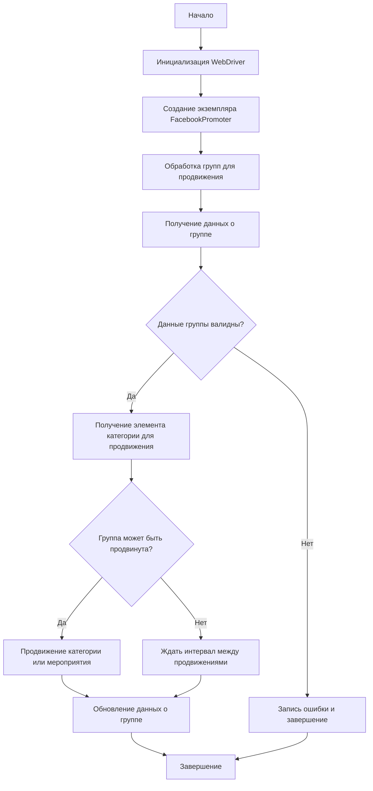
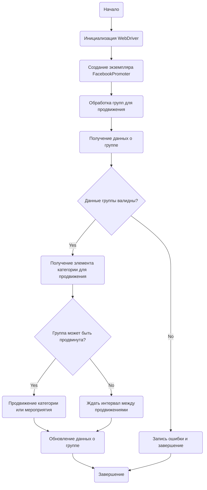

# Документация модуля Facebook Promoter

## Обзор

Модуль **Facebook Promoter** автоматизирует продвижение товаров и мероприятий AliExpress в группах Facebook. Модуль управляет публикациями рекламных материалов на Facebook, избегая дублирования. Для эффективного продвижения используется WebDriver для автоматизации браузера.

## Особенности модуля

-   Продвижение категорий и мероприятий в группах Facebook.
-   Избежание дублирования публикаций через отслеживание уже опубликованных элементов.
-   Поддержка конфигурации данных групп через файлы.
-   Возможность отключения загрузки видео в публикациях.

## Требования

-   **Python** 3.x
-   Необходимые библиотеки:
    -   `random`
    -   `datetime`
    -   `pathlib`
    -   `urllib.parse`
    -   `types.SimpleNamespace`
    -   `src` (пользовательский модуль)

## Использование

### Пример использования класса FacebookPromoter

```python
from src.endpoints.advertisement.facebook.promoter import FacebookPromoter
from src.webdriver.driver import Driver
from src.utils.jjson import j_loads_ns

# Настройка экземпляра WebDriver (замените на реальный WebDriver)
d = Driver()

# Создание экземпляра FacebookPromoter
promoter = FacebookPromoter(
    d=d, 
    promoter="aliexpress", 
    group_file_paths=["path/to/group/file1.json", "path/to/group/file2.json"]
)

# Начало продвижения товаров или мероприятий
promoter.process_groups(
    campaign_name="Campaign1",
    events=[], 
    group_categories_to_adv=["sales"],
    language="en",
    currency="USD"
)
```

## Документация классов

### Класс `FacebookPromoter`

Этот класс управляет процессом продвижения товаров и мероприятий AliExpress в группах Facebook.



#### Методы

##### `__init__(self, d: Driver, promoter: str, group_file_paths: Optional[list[str | Path] | str | Path] = None, no_video: bool = False)`

Инициализирует промоутер для Facebook с необходимыми конфигурациями.

-   **Аргументы:**
    -   `d (Driver)`: Экземпляр WebDriver для автоматизации.
    -   `promoter (str)`: Имя промоутера (например, "aliexpress").
    -   `group_file_paths (Optional[list[str | Path] | str | Path])`: Пути к файлам с данными групп.
    -   `no_video (bool)`: Флаг для отключения видео в публикациях. По умолчанию `False`.

##### `promote(self, group: SimpleNamespace, item: SimpleNamespace, is_event: bool = False, language: str = None, currency: str = None) -> bool`

Продвигает категорию или мероприятие в указанной группе Facebook.

-   **Аргументы:**
    -   `group (SimpleNamespace)`: Данные группы.
    -   `item (SimpleNamespace)`: Категория или мероприятие для продвижения.
    -   `is_event (bool)`: Является ли элемент мероприятием.
    -   `language (str)`: Язык публикации.
    -   `currency (str)`: Валюта для продвижения.

-   **Возвращает:**
    -   `bool`: Успешно ли прошло продвижение.

##### `log_promotion_error(self, is_event: bool, item_name: str)`

Записывает ошибку, если продвижение не удалось.

-   **Аргументы:**
    -   `is_event (bool)`: Является ли элемент мероприятием.
    -   `item_name (str)`: Название элемента.

##### `update_group_promotion_data(self, group: SimpleNamespace, item_name: str, is_event: bool = False)`

Обновляет данные группы после продвижения, добавляя продвигаемый элемент в список продвигаемых категорий или мероприятий.

-   **Аргументы:**
    -   `group (SimpleNamespace)`: Данные группы.
    -   `item_name (str)`: Название продвигаемого элемента.
    -   `is_event (bool)`: Является ли элемент мероприятием.

##### `process_groups(self, campaign_name: str = None, events: list[SimpleNamespace] = None, is_event: bool = False, group_file_paths: list[str] = None, group_categories_to_adv: list[str] = ['sales'], language: str = None, currency: str = None)`

Обрабатывает группы для текущей кампании или продвижения мероприятия.

-   **Аргументы:**
    -   `campaign_name (str)`: Название кампании.
    -   `events (list[SimpleNamespace])`: Список мероприятий для продвижения.
    -   `is_event (bool)`: Является ли продвижение мероприятий или категорий.
    -   `group_file_paths (list[str])`: Пути к файлам с данными групп.
    -   `group_categories_to_adv (list[str])`: Категории для продвижения.
    -   `language (str)`: Язык публикации.
    -   `currency (str)`: Валюта для продвижения.

##### `get_category_item(self, campaign_name: str, group: SimpleNamespace, language: str, currency: str) -> SimpleNamespace`

Получает элемент категории для продвижения в зависимости от кампании и промоутера.

-   **Аргументы:**
    -   `campaign_name (str)`: Название кампании.
    -   `group (SimpleNamespace)`: Данные группы.
    -   `language (str)`: Язык для публикации.
    -   `currency (str)`: Валюта для публикации.

-   **Возвращает:**
    -   `SimpleNamespace`: Элемент категории для продвижения.

##### `check_interval(self, group: SimpleNamespace) -> bool`

Проверяет, прошло ли достаточно времени, чтобы снова продвигать эту группу.

-   **Аргументы:**
    -   `group (SimpleNamespace)`: Данные группы.

-   **Возвращает:**
    -   `bool`: Можно ли снова продвигать группу.

##### `validate_group(self, group: SimpleNamespace) -> bool`

Проверяет данные группы, чтобы убедиться в их корректности.

-   **Аргументы:**
    -   `group (SimpleNamespace)`: Данные группы.

-   **Возвращает:**
    -   `bool`: Корректны ли данные группы.

## Лицензия

Этот модуль является частью пакета **Facebook Promoter** и лицензируется по лицензии MIT.

---

### **<алгоритм>**
**Блок-схема работы `FacebookPromoter`:**

1.  **Начало:**
    -   Программа начинает выполнение.
2.  **Инициализация WebDriver:**
    -   Создается экземпляр `Driver` (из `src.webdriver.driver`), который управляет браузером.
    -   *Пример*: `d = Driver()`
3.  **Создание экземпляра `FacebookPromoter`:**
    -   Создается объект `FacebookPromoter` с экземпляром `Driver`, именем промоутера и путями к файлам групп.
    -   *Пример*: `promoter = FacebookPromoter(d=d, promoter="aliexpress", group_file_paths=["groups1.json", "groups2.json"])`
4.  **Обработка групп для продвижения:**
    -   Вызывается метод `process_groups`.
    -   *Пример*: `promoter.process_groups(campaign_name="SummerSale", group_categories_to_adv=["sales"], language="en", currency="USD")`
5.  **Получение данных о группе:**
    -   Метод `process_groups` проходит по каждой группе, полученной из файлов.
    -   Из каждого файла загружаются данные группы.
    -   *Пример*: Из файла `groups1.json` загружаются данные о группе в виде `SimpleNamespace`.
6.  **Проверка данных группы:**
    -   Вызывается метод `validate_group`.
    -   Если данные группы не валидны (например, отсутствуют обязательные поля), то переходим к шагу 8.
    -   *Пример*: если в данных группы нет поля `group_id`, то данные группы не валидны.
    -   **Поток данных**: `group` (SimpleNamespace) -> `validate_group()` -> `True` / `False`.
7.  **Получение элемента категории для продвижения:**
    -   Если данные группы валидны, вызывается метод `get_category_item`, который выбирает элемент для продвижения (категорию товара или мероприятие).
    -   *Пример*: `item = promoter.get_category_item(campaign_name="SummerSale", group=group_data, language="en", currency="USD")`.
    -   **Поток данных**: `campaign_name` (str), `group` (SimpleNamespace), `language` (str), `currency` (str) -> `get_category_item()` -> `item` (SimpleNamespace)
8.  **Запись ошибки и завершение:**
    -   Если данные группы не валидны, выводится сообщение об ошибке, и обработка данной группы прекращается.
    -   *Пример*: Выводится сообщение "Группа не валидна" и программа переходит к следующей группе (если она есть).
    -   **Поток данных**: `is_event` (bool), `item_name` (str) -> `log_promotion_error()`
9.  **Проверка интервала продвижения:**
    -   Вызывается метод `check_interval`, который проверяет, прошло ли достаточно времени с последнего продвижения группы.
    -   Если время не прошло, программа переходит к шагу 11.
    -   *Пример*: Если с момента последнего продвижения прошло меньше 10 минут, то программа ждет.
    -    **Поток данных**: `group` (SimpleNamespace) -> `check_interval()` -> `True` / `False`
10. **Продвижение категории или мероприятия:**
    -   Если группа может быть продвинута, вызывается метод `promote` для публикации элемента в группе.
    -    *Пример*: `promoter.promote(group=group_data, item=item, language="en", currency="USD")`.
    -    **Поток данных**: `group` (SimpleNamespace), `item` (SimpleNamespace), `is_event` (bool), `language` (str), `currency` (str) -> `promote()` -> `True` / `False`
11. **Ожидание интервала между продвижениями:**
    -   Если группа не может быть продвинута, программа ждет установленный интервал времени.
    -   *Пример*: программа спит в течение заданного интервала (например 10 минут).
12. **Обновление данных о группе:**
    -   После успешного продвижения вызывается метод `update_group_promotion_data`, который обновляет информацию о том, что данная категория или мероприятие было опубликовано в данной группе.
    -    *Пример*: `promoter.update_group_promotion_data(group=group_data, item_name=item.name, is_event=False)`.
    -   **Поток данных**: `group` (SimpleNamespace), `item_name` (str), `is_event` (bool) -> `update_group_promotion_data()`
13. **Завершение:**
    -   Обработка групп завершается, программа завершает выполнение.

### **<mermaid>**



**Зависимости в диаграмме `mermaid`:**

1.  **`Start`**: Начало процесса, не имеет зависимостей, обозначает начало выполнения.
2.  **`InitializeWebDriver`**: Инициализирует WebDriver, имеет зависимость от класса `Driver` из модуля `src.webdriver.driver`.
3.  **`CreatePromoterInstance`**: Создает экземпляр класса `FacebookPromoter`. Зависит от класса `FacebookPromoter`, принимает экземпляр `Driver`, строку промоутера и список путей к файлам групп.
4.  **`ProcessGroups`**: Метод `process_groups`, управляет процессом обработки групп, зависит от данных групп и конфигурационных параметров.
5.  **`GetGroupData`**: Получает данные о группе из файлов. Зависит от формата данных в файлах групп.
6.  **`ValidateGroup`**: Проверяет валидность данных группы, не имеет явных зависимостей от внешних модулей, зависит от структуры данных групп.
7.  **`GetCategoryItem`**: Метод `get_category_item` получает элемент категории для продвижения. Зависит от логики выбора категории и внешних данных (например, от настроек кампании).
8.  **`LogErrorAndFinish`**: Записывает ошибку продвижения и завершает обработку группы. Зависит от логгера и данных ошибки.
9. **`CheckPromotionInterval`**: Проверяет, можно ли продвигать группу. Зависит от логики интервалов продвижения и данных о последнем продвижении.
10. **`PromoteItem`**: Метод `promote` продвигает категорию или мероприятие. Зависит от браузера и API Facebook.
11. **`WaitInterval`**: Ожидает интервал времени. Не имеет прямых зависимостей от других модулей.
12. **`UpdateGroupData`**: Обновляет данные о группе после продвижения. Зависит от данных группы.
13. **`Finish`**: Завершает процесс. Не имеет зависимостей, обозначает конец выполнения.

### **<объяснение>**

**Импорты:**

-   `from src.endpoints.advertisement.facebook.promoter import FacebookPromoter`: Импортирует класс `FacebookPromoter` из модуля `src.endpoints.advertisement.facebook.promoter`, который является основным классом для продвижения в Facebook.
-   `from src.webdriver.driver import Driver`: Импортирует класс `Driver` из модуля `src.webdriver.driver`, который используется для управления браузером и автоматизации действий на веб-странице.
-   `from src.utils.jjson import j_loads_ns`: Импортирует функцию `j_loads_ns` из модуля `src.utils.jjson`, которая используется для загрузки данных из JSON файлов в виде объектов `SimpleNamespace`, что упрощает доступ к данным через атрибуты, а не ключи словарей.
-   `from typing import Optional, List`: Используется для аннотаций типов, указывая что переменные могут быть  `Optional`, т.е. могут быть `None` или списками `List`.
-   `from pathlib import Path`: Для работы с путями к файлам.
-   `from types import SimpleNamespace`: Для создания простых объектов с атрибутами.

**Класс `FacebookPromoter`:**

-   **Роль:** Класс `FacebookPromoter` управляет процессом продвижения товаров и мероприятий AliExpress в группах Facebook. Он включает методы для инициализации, продвижения, логирования ошибок, обновления данных и проверки интервалов между продвижениями.
-   **Атрибуты:**
    -   `d (Driver)`: Экземпляр класса `Driver` для управления браузером.
    -   `promoter (str)`: Имя промоутера (например, "aliexpress").
    -   `group_file_paths (Optional[list[str | Path] | str | Path])`: Пути к файлам с данными групп.
    -   `no_video (bool)`: Флаг, указывающий, нужно ли отключать загрузку видео в публикациях.

-   **Методы:**
    -   `__init__(self, d: Driver, promoter: str, group_file_paths: Optional[list[str | Path] | str | Path] = None, no_video: bool = False)`:
        -   Инициализирует объект класса.
        -   Принимает экземпляр `Driver` для работы с браузером, имя промоутера и пути к файлам с данными групп.
        -   `no_video` управляет загрузкой видео в публикациях.
    -   `promote(self, group: SimpleNamespace, item: SimpleNamespace, is_event: bool = False, language: str = None, currency: str = None) -> bool`:
        -   Выполняет продвижение товара или мероприятия в указанной группе.
        -   Принимает данные группы, элемент для продвижения (категорию или мероприятие), флаг, является ли элемент мероприятием, язык и валюту.
        -   Возвращает `True`, если продвижение прошло успешно, `False` в противном случае.
    -   `log_promotion_error(self, is_event: bool, item_name: str)`:
        -   Записывает ошибку продвижения в лог.
        -   Принимает флаг, является ли элемент мероприятием, и имя элемента.
    -   `update_group_promotion_data(self, group: SimpleNamespace, item_name: str, is_event: bool = False)`:
        -   Обновляет данные о группе после продвижения, сохраняя информацию о том, что данный элемент был продвинут.
        -   Принимает данные группы, имя элемента и флаг, является ли элемент мероприятием.
    -    `process_groups(self, campaign_name: str = None, events: list[SimpleNamespace] = None, is_event: bool = False, group_file_paths: list[str] = None, group_categories_to_adv: list[str] = ['sales'], language: str = None, currency: str = None)`:
        -   Обрабатывает все группы для продвижения.
        -   Принимает имя кампании, список мероприятий, флаг, является ли продвижение мероприятий или категорий, пути к файлам групп, категории для продвижения, язык и валюту.
        -   Этот метод организует основной цикл продвижения по группам.
    -   `get_category_item(self, campaign_name: str, group: SimpleNamespace, language: str, currency: str) -> SimpleNamespace`:
        -   Возвращает элемент категории для продвижения в соответствии с кампанией, группой, языком и валютой.
        -   Принимает название кампании, данные группы, язык и валюту.
        -   Возвращает объект `SimpleNamespace` с данными для продвижения.
    -   `check_interval(self, group: SimpleNamespace) -> bool`:
        -   Проверяет, прошло ли достаточно времени для повторного продвижения группы.
        -   Принимает данные группы.
        -   Возвращает `True`, если можно продвигать группу, `False` в противном случае.
    -   `validate_group(self, group: SimpleNamespace) -> bool`:
        -   Проверяет корректность данных группы.
        -   Принимает данные группы.
        -   Возвращает `True`, если данные валидны, `False` в противном случае.

**Функции:**

-   `j_loads_ns` (из `src.utils.jjson`): Загружает данные из JSON файла и возвращает их в виде `SimpleNamespace`. Это помогает работать с данными как с атрибутами объекта, а не как с ключами словаря.

**Переменные:**

-   `d (Driver)`: Экземпляр класса `Driver`, используется для управления браузером.
-   `promoter (str)`: Строка, представляющая имя промоутера (например, "aliexpress").
-   `group_file_paths (list[str] | str)`: Список путей к JSON файлам с данными групп или один путь к файлу.
-   `no_video (bool)`: Логическая переменная, указывающая, нужно ли отключать загрузку видео.
-   `campaign_name (str)`: Название кампании, например, "Summer Sale".
-   `events (list[SimpleNamespace])`: Список мероприятий для продвижения, каждый элемент – `SimpleNamespace` с данными о мероприятии.
-   `group_categories_to_adv (list[str])`: Список категорий товаров для продвижения, например, ["sales", "new arrivals"].
-   `language (str)`: Язык для публикаций (например, "en", "ru").
-   `currency (str)`: Валюта для публикаций (например, "USD", "EUR").
-   `group (SimpleNamespace)`: Данные о группе из JSON файла.
-   `item (SimpleNamespace)`: Данные о категории или мероприятии для продвижения.
-   `is_event (bool)`: Логическая переменная, указывающая, является ли элемент мероприятием.
-   `item_name (str)`: Название элемента (категории или мероприятия).

**Цепочка взаимосвязей с другими частями проекта:**

1.  `src.webdriver.driver`: Класс `Driver` отвечает за управление браузером. `FacebookPromoter` использует его для взаимодействия с Facebook.
2.  `src.utils.jjson`: Функция `j_loads_ns` используется для загрузки данных из JSON файлов, где хранятся настройки групп.
3.  `src.endpoints.advertisement.facebook`:  `FacebookPromoter` является частью этого модуля, который отвечает за всю логику продвижения в Facebook.
4.  Другие части проекта, например, модули для работы с API AliExpress, могут передавать данные о товарах и мероприятиях в `FacebookPromoter` для публикации в Facebook.

**Потенциальные ошибки и области для улучшения:**

1.  **Обработка ошибок:**
    -   В методе `promote` необходимо более подробно обрабатывать возможные ошибки при публикации, а не просто возвращать `True` или `False`.
    -   Следует добавить логирование ошибок для более удобного отслеживания проблем.
    -   Добавить обработку ошибок при загрузке файлов групп.
2.  **Проверка данных:**
    -   Добавить проверку формата данных группы и элементов для продвижения.
    -   В `validate_group` проверять наличие всех необходимых полей в данных группы.
3.  **Интервалы продвижения:**
    -   Интервалы продвижения должны быть настраиваемыми.
    -   Реализовать более сложную логику определения интервалов (например, с учетом времени суток).
4.  **Поддержка разных типов продвижения:**
    -   Расширить функциональность для продвижения разных типов контента (например, не только посты, но и истории).
    -   Добавить гибкость в настройке текста публикаций.
5. **Гибкость в управлении файлами групп**:
    - Реализовать загрузку данных групп не только из файлов, но и из других источников.
6. **Параллелизм**:
    - Реализовать обработку групп в многопоточном режиме для повышения производительности.

Этот анализ обеспечивает подробное понимание функциональности и взаимодействия компонентов модуля `FacebookPromoter`.