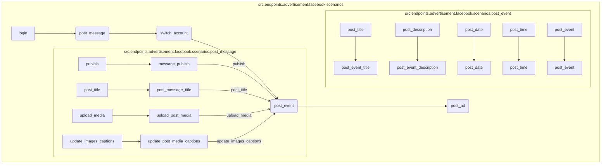

```MD
# <input code>

```python
## \file hypotez/src/endpoints/advertisement/facebook/scenarios/__init__.py
# -*- coding: utf-8 -*-
#! venv/Scripts/python.exe
#! venv/bin/python/python3.12

"""
.. module: src.endpoints.advertisement.facebook.scenarios 
	:platform: Windows, Unix
	:synopsis:

"""
MODE = 'dev'

from .login import login
from .post_message  import *
from .switch_account import switch_account
from .post_message import (post_title as post_message_title,   # <- заголовок
                           upload_media as upload_post_media, # <- изображения 
                           update_images_captions as update_post_media_captions, # <- подписи к изображениям 
                           publish as message_publish,
                           post_message,
                           )

from .post_event import (post_title as post_event_title,
                         post_description as post_event_description,
                         post_date,
                         post_time,
                         #send,
                         post_event
                         )

from .post_ad import post_ad
```

# <algorithm>

В данном файле организованы импорты и доступ к функциям, относящимся к сценариям рекламных объявлений в Facebook.

**Шаг 1**: Импортируются функции из модулей `login`, `post_message`, `switch_account`, `post_event`, `post_ad`.

**Пример**: Импорт функции `login` из модуля `login.py` в данном модуле.

**Шаг 2**: В модуле `post_message` импортируются конкретные функции (например, `post_title`, `upload_media`).

**Пример**: Импорт функции `post_message_title` как переименования функции `post_title`.

**Шаг 3**: В модуле `post_event` импортируются функции, связанные с публикацией событий.

**Пример**: Импорт функции `post_event_title` как переименования функции `post_title`.

**Шаг 4**: Импортируется функция `post_ad`.

**Пример**:  Возможный сценарий - вызов `post_ad()` для создания объявления.


# <mermaid>



**Описание диаграммы:**  Диаграмма показывает взаимосвязь между модулями.  `login` взаимодействует с `post_message`, `post_event` и `post_ad`. Модуль `post_message` имеет зависимости внутри себя на другие функции. Такая структура предполагает, что функции в разных модулях взаимодействуют для создания целого рекламного сценария.


# <explanation>

* **Импорты**: Файл импортирует функции из подпапок `login`, `post_message`, `switch_account`, `post_event` и `post_ad`.  Это типичный способ организации кода в Python, группируя функции по задачам. Все пути импортирования начинаются с `.`, что указывает на то, что импортируются модули из текущего пакета `hypotez/src/endpoints/advertisement/facebook/scenarios`.


* **Классы**: В данном файле нет классов. Все импортированные объекты - функции.

* **Функции**:  Файл предоставляет функции для различных аспектов управления рекламными объявлениями в Facebook. К примеру, `login` вероятно реализует авторизацию, а `post_message`, `post_event`, `post_ad` отвечают за публикацию соответственно сообщений, событий и объявлений. Переименование импортируемых функций (`post_title as post_message_title`) показывает, что в различных модулях могут использоваться идентичные операции, но под разными именами в разных контекстах.


* **Переменные**: `MODE = 'dev'` - константа, вероятно, определяющая режим работы (разработка, производство).


* **Возможные ошибки или области для улучшений**:
    * Отсутствует документация для функций. Добавьте docstrings для каждой функции для лучшей читаемости.
    * Не указана обработка исключений.  Важно добавить обработку потенциальных ошибок (например, проблем с подключением к Facebook).
    * Возможна повторяемость кода.  Если функции из разных модулей выполняют похожие задачи, может быть полезно создать общий базовый класс или функцию для их абстракции.
    * Не указаны зависимости от внешних библиотек. Если используются какие-то специфические библиотеки, нужно их перечислить.


**Цепочка взаимосвязей с другими частями проекта:**
Этот файл является частью функциональности, связанной с рекламной кампанией в Facebook.  Связь с другими частями проекта - через вызовы функций из этого файла,  которые, скорее всего,  обращаются к API Facebook (через какие-то библиотеки) и хранят результаты в базе данных (или других компонентах проекта).

**Примечание:** Без доступа к другим файлам проекта (например, `hypotez/src/endpoints/advertisement/facebook/scenarios/post_message.py`), сложно полностью оценить функциональность и структуру.  Коментарии помогут в понимании.