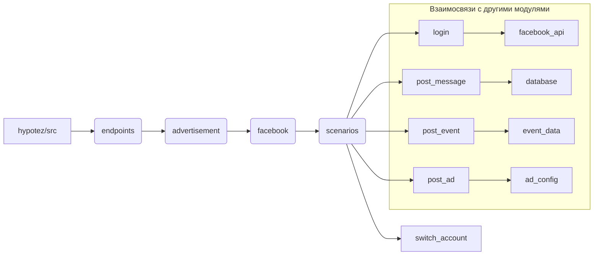

1. **<input code>**

```python
## \file hypotez/src/endpoints/advertisement/facebook/scenarios/__init__.py
# -*- coding: utf-8 -*-
#! venv/Scripts/python.exe
#! venv/bin/python/python3.12

"""
.. module: src.endpoints.advertisement.facebook.scenarios 
	:platform: Windows, Unix
	:synopsis:

"""
MODE = 'dev'

from .login import login
from .post_message  import *
from .switch_account import switch_account
from .post_message import (post_title as post_message_title,   # <- заголовок
                           upload_media as upload_post_media, # <- изображения 
                           update_images_captions as update_post_media_captions, # <- подписи к изображениям 
                           publish as message_publish,
                           post_message,
                           )

from .post_event import (post_title as post_event_title,
                         post_description as post_event_description,
                         post_date,
                         post_time,
                         #send,
                         post_event
                         )

from .post_ad import post_ad
```

2. **<algorithm>**

Этот код представляет собой модуль, который импортирует функции и классы из других файлов в подпапках `hypotez/src/endpoints/advertisement/facebook/scenarios`.  Он организует доступ к функциям для работы с Facebook рекламой.  Пошаговая блок-схема сложная, так как код фактически является точкой входа для различных сценариев, но не содержит логики самого исполнения.

Пример:
Пользовательский код может импортировать этот модуль и вызвать `login()`, `post_message()`, `post_event()` или другие функции, определенные в подмодулях.

3. **<mermaid>**



**Описание диаграммы:**

* Модуль `hypotez/src` - это корневой модуль проекта.
* `endpoints` - модуль, содержащий различные типы точек входа.
* `advertisement`, `facebook` и `scenarios` - подмодули, организующие работу с Facebook рекламой.
* `login`, `post_message`, `switch_account`, `post_event`, `post_ad` - функции/классы для выполнения конкретных действий.
* `facebook_api`, `database`, `event_data`, `ad_config` - предполагаемые зависимости, которые могут быть задействованы в других модулях.
* Стрелки показывают зависимости, например, `login` использует `facebook_api`.

4. **<explanation>**

* **Импорты:** Модуль `__init__.py` в папке `scenarios` импортирует функции из других модулей внутри папки. Это позволяет пользователям этого модуля работать со всеми функциями, не перечисляя все из них в каждом файле.  Импорты демонстрируют зависимость от других модулей в проекте (например, от функций аутентификации, публикаций, и т.д.) в `endpoints`.
* **Классы:**  Код не содержит классов, только функции, что указывает на функциональный, а не объектно-ориентированный подход для работы с Facebook.
* **Функции:**  Импортированные функции (например, `login`, `post_message`, `post_ad`) предназначены для выполнения специфических задач в Facebook API. Например, `login` выполняет вход, `post_message` публикует сообщения и т.д.  Названия функций указывают на их назначение.  Этот код не содержит реализации самих функций, но показывает, как они могут быть использованы.
* **Переменные:** `MODE = 'dev'` — константа, вероятно, определяющая режим работы приложения (разработка, производство и т.д.).
* **Возможные ошибки и улучшения:**  
    * Нет никакой валидации входных данных. Например, для функции `post_message` должно быть проверка корректности переданных данных (типы, длины).
    * Отсутствие обработки ошибок: код не содержит обработку исключений, что может привести к сбою приложения при возникновении проблем с Facebook API.
    * Неопределенные зависимости: Должны быть указаны конкретные зависимости от Facebook API или других библиотек.
    * Отсутствие документации:  не хватает docstrings для функций и методов для лучшего понимания функциональности.
    * Желательно использовать try...except блоки для обработки возможных ошибок при взаимодействии с Facebook API.


**Цепочка взаимосвязей:**

Код `hypotez/src/endpoints/advertisement/facebook/scenarios/__init__.py` зависит от функций и классов из модулей, которые он импортирует.  Эти зависимые модули, вероятно, содержат взаимодействие с Facebook API, базой данных или другими сервисами.  В свою очередь, они могут быть зависимы от других модулей (например, для работы с базой данных).  Полная картина взаимосвязей требует анализа всех зависимых модулей.