## АНАЛИЗ КОДА: `hypotez/src/endpoints/advertisement/facebook/scenarios/__init__.py`

### <алгоритм>
1. **Импорт модулей**:
    - Импортируются функции для управления действиями на Facebook, такими как вход в систему, публикация сообщений/событий, переключение аккаунтов и т.д.
    - `from .login import login` импортирует функцию `login` для авторизации пользователя в Facebook.
    - `from .post_message import *` импортирует все функции из модуля `post_message`, включая функции для создания и публикации постов в Facebook.
    - `from .switch_account import switch_account` импортирует функцию `switch_account` для переключения между аккаунтами Facebook.
    -  Импорты из `.post_message` и `.post_event`  являются селективными, и некоторые функции импортируются с псевдонимами. Например, `post_title as post_message_title`
     -`from .post_ad import post_ad` импортирует функцию `post_ad` для создания рекламных объявлений.
2. **Использование импортированных функций:**
    - В других модулях или скриптах проекта импортированные функции будут вызываться для выполнения соответствующих действий на Facebook.
    - Пример: `login(username, password)` - вызовет функцию входа в Facebook
    - Пример: `post_message_title("Title")` - вызовет функцию установки заголовка сообщения.
    - Пример: `upload_post_media(["image1.jpg", "image2.png"])` - вызовет функцию загрузки медиафайлов к посту.
    - Пример: `switch_account("account_name")` - вызовет функцию переключения аккаунта.
    - Пример: `post_event("event_name", date, time)` - вызовет функцию создания события.
    - Пример: `post_ad(title, description, image)` - вызовет функцию создания рекламного объявления.

```mermaid
flowchart TD
    subgraph post_message
        post_message_title["post_title as post_message_title"]
        upload_post_media["upload_media as upload_post_media"]
        update_post_media_captions["update_images_captions as update_post_media_captions"]
        message_publish["publish as message_publish"]
        post_message_func["post_message"]
    end

    subgraph post_event
         post_event_title["post_title as post_event_title"]
         post_event_description["post_description as post_event_description"]
         post_date["post_date"]
         post_time["post_time"]
         post_event_func["post_event"]
    end
    
    login_func["login"]
    switch_account_func["switch_account"]
    post_ad_func["post_ad"]

    login_func --> | from .login | scenarios_module
    post_message_func -->  | from .post_message | scenarios_module
    switch_account_func -->  | from .switch_account | scenarios_module
    post_ad_func --> | from .post_ad | scenarios_module
    post_event_func --> | from .post_event | scenarios_module

    scenarios_module[<code>__init__.py</code><br> Facebook Scenarios Module]
    
    style scenarios_module fill:#f9f,stroke:#333,stroke-width:2px
```

### <mermaid>

### <объяснение>
#### Импорты:
- `from .login import login`:
    - Импортирует функцию `login` из модуля `login.py`, расположенного в той же директории.
    - Функция `login` предназначена для авторизации пользователя в Facebook. Она устанавливает сессию и, вероятно, использует учетные данные для входа.
    - Связь с другими частями проекта: используется для начала сеанса взаимодействия с Facebook API.
- `from .post_message import *`:
    - Импортирует все функции из модуля `post_message.py`, расположенного в той же директории.
    - Эти функции предоставляют возможность создавать и публиковать сообщения в Facebook.
     - Они могут включать загрузку медиафайлов (изображений, видео), установку заголовков и подписей к медиафайлам.
     - Связь с другими частями проекта: используется для создания и публикации постов в Facebook
-   `from .post_message import (post_title as post_message_title, ...)`
     - Импортирует конкретные функции из модуля `post_message.py` и переименовывает их.
     -  `post_title` переименовывается в `post_message_title`,
     -`upload_media` переименовывается в `upload_post_media`
     -`update_images_captions` переименовывается в `update_post_media_captions`
     -`publish` переименовывается в `message_publish`
     -`post_message` остается без изменений.
     -  Это делается для уточнения контекста, что эти функции относятся к публикации сообщений, а не событий или чего-то иного.
    - Связь с другими частями проекта: используется для создания и публикации постов в Facebook с селективным импортом функций.
- `from .switch_account import switch_account`:
    - Импортирует функцию `switch_account` из модуля `switch_account.py`, расположенного в той же директории.
    - Функция `switch_account` предназначена для переключения между различными учетными записями пользователя в Facebook.
    - Связь с другими частями проекта: используется для переключения между аккаунтами пользователя Facebook.
- `from .post_event import (post_title as post_event_title, ...)`:
    - Импортирует конкретные функции из модуля `post_event.py`, расположенного в той же директории.
    -  `post_title` переименовывается в `post_event_title`
    - `post_description` переименовывается в `post_event_description`
    -  `post_date`, `post_time`, `post_event` импортируются без изменения имени.
    - Эти функции предназначены для создания и публикации событий на Facebook.
    - Связь с другими частями проекта: используется для создания и публикации событий в Facebook.
- `from .post_ad import post_ad`:
    - Импортирует функцию `post_ad` из модуля `post_ad.py`, расположенного в той же директории.
    - Функция `post_ad` предназначена для создания и публикации рекламных объявлений в Facebook.
    - Связь с другими частями проекта: используется для создания рекламных объявлений в Facebook.
#### Классы:
- В данном коде классы не определены.
#### Функции:
- В данном коде явно функции не вызываются, а только импортируются.
    - Функции, импортированные из модулей `.login`, `.post_message`, `.switch_account`, `.post_event`, `.post_ad`, предоставляют API для выполнения основных действий по управлению аккаунтом, публикацией и рекламой на Facebook.
    - Примеры функций и их назначение приведены в разделе "<алгоритм>".
#### Переменные:
- В данном коде переменные не определены.
#### Потенциальные ошибки и области для улучшения:
- **Отсутствие обработки исключений**: В коде не показано, как обрабатываются ошибки при вызове функций. Необходимо предусмотреть обработку исключений, чтобы обеспечить устойчивость и стабильность работы.
- **Зависимость от сторонних библиотек**: Код, скорее всего, зависит от сторонних библиотек, взаимодействующих с Facebook API. Необходимо корректно управлять зависимостями.
- **Использование импорта `*`**: Импорт всех функций (`*`) из `post_message` может привести к конфликтам имен, если в других файлах проекта используются такие же имена. Рекомендуется использовать явный импорт конкретных функций, как это сделано для `post_message_title`, `upload_post_media` и `update_post_media_captions` .

#### Цепочка взаимосвязей:
1.  `__init__.py` в пакете `src.endpoints.advertisement.facebook.scenarios` является точкой входа для использования сценариев работы с Facebook.
2.  Он импортирует функции из подмодулей, предоставляющих логику для авторизации, публикации сообщений, событий и рекламных объявлений, а также переключения аккаунтов.
3.  Модули, которые импортируются из `./`, находятся в той же директории, т.е. в `src/endpoints/advertisement/facebook/scenarios/`.
4.  Другие части проекта, вероятно, используют `scenarios` для взаимодействия с Facebook. Например, модуль, реализующий конкретную бизнес-логику.
5.  Таким образом, `__init__.py` предоставляет удобный интерфейс для других модулей, скрывая детали реализации взаимодействия с Facebook API.

   Данный код представляет собой централизованную точку входа для управления сценариями работы с Facebook. Он обеспечивает доступ к различным функциям, связанным с авторизацией, публикацией, переключением аккаунтов и созданием рекламы.