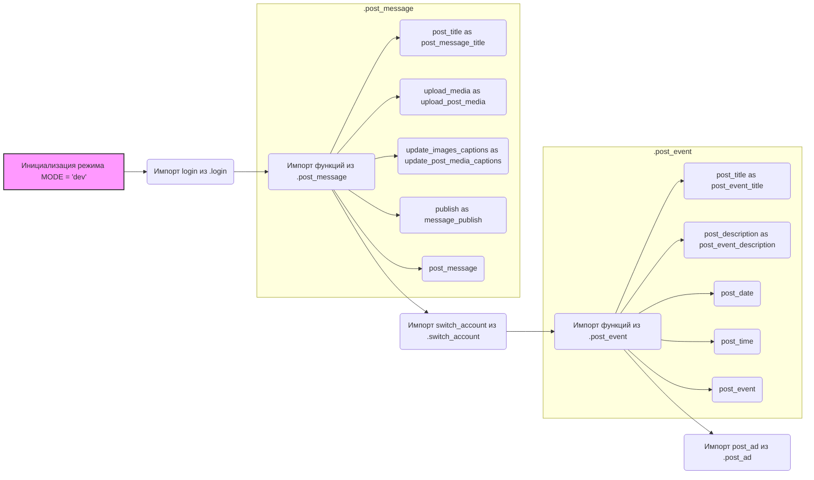

## Анализ кода `hypotez/src/endpoints/advertisement/facebook/scenarios/__init__.py`

### <алгоритм>
1. **Инициализация:**
   - Устанавливается режим работы `MODE = 'dev'`. Это может использоваться для определения поведения программы в зависимости от окружения (разработка, тестирование, продакшн).
2. **Импорт функций:**
   - Из модуля `.login` импортируется функция `login`. Она, вероятно, отвечает за аутентификацию пользователя в Facebook.
   - Из модуля `.post_message` импортируются все функции (`*`), а также некоторые функции импортируются с переопределением имени (`post_title as post_message_title` и т.д.)
     - `post_title`: устанавливает заголовок сообщения
     - `upload_media`: загружает медиафайлы (изображения)
     - `update_images_captions`: обновляет подписи к загруженным изображениям
     - `publish`: публикует сообщение
     - `post_message`: основная функция для создания и публикации сообщения
   - Из модуля `.switch_account` импортируется функция `switch_account`, вероятно, для смены аккаунта пользователя Facebook.
   - Из модуля `.post_event` импортируются функции для работы с событиями.
     - `post_title`: устанавливает заголовок события.
     - `post_description`: устанавливает описание события.
     - `post_date`: устанавливает дату события.
     - `post_time`: устанавливает время события.
     - `post_event`: основная функция для создания и публикации события.
   - Из модуля `.post_ad` импортируется функция `post_ad`, вероятно, для создания рекламного объявления.

**Примеры:**
   - **Режим:** `MODE` устанавливается в `'dev'`
   - **Аутентификация:** Вызывается `login()` для входа в аккаунт.
   - **Публикация сообщения:**
     1. Вызывается `post_message_title("Заголовок сообщения")` для установки заголовка.
     2. Вызывается `upload_post_media("image1.jpg", "image2.png")` для загрузки изображений.
     3. Вызывается `update_post_media_captions({"image1.jpg": "Подпись к изображению 1", "image2.png": "Подпись к изображению 2"})` для добавления подписей.
     4. Вызывается `post_message()` для создания сообщения, используя ранее установленные параметры.
     5. Вызывается `message_publish()` для публикации сообщения.
   - **Публикация события:**
      1. Вызывается `post_event_title("Заголовок события")` для установки заголовка.
      2. Вызывается `post_event_description("Описание события")` для установки описания.
      3. Вызывается `post_date("2024-12-31")` для установки даты.
      4. Вызывается `post_time("12:00")` для установки времени.
      5. Вызывается `post_event()` для создания и публикации события.
   - **Создание рекламы:** Вызывается функция `post_ad()`.
   - **Переключение аккаунта:** Вызывается `switch_account()`, вероятно, с аргументом для смены аккаунта.

### <mermaid>

**Объяснение зависимостей `mermaid`:**
- `A`: Инициализация режима работы `MODE`. Начальная точка графа.
- `B`: Импорт функции `login` из модуля `.login`.
- `C`: Импорт всех необходимых функций из модуля `.post_message` для работы с публикациями (заголовок, загрузка медиа, обновление подписей, публикация).
- `D`: Импорт функции `switch_account` из модуля `.switch_account` для переключения учетных записей.
- `E`: Импорт функций из `.post_event` для управления событиями.
- `F`: Импорт функции `post_ad` из модуля `.post_ad`.
- **Подграфы:** `".post_message"` и `".post_event"`  показывают, какие конкретные функции импортируются.
    - `C1-C5`: Функции для работы с постами.
    - `E1-E5`: Функции для работы с событиями.

### <объяснение>

**Импорты:**
   - `from .login import login`: Импортирует функцию `login` из модуля `login.py`, находящегося в той же директории (`.`) что и текущий файл. Вероятно, используется для аутентификации в Facebook API.
   - `from .post_message import *`: Импортирует все функции и переменные из модуля `post_message.py`, также находящегося в текущей директории.  Включает функции для создания и публикации сообщений.
   - `from .switch_account import switch_account`: Импортирует функцию `switch_account` из `switch_account.py` для переключения между аккаунтами пользователя.
   - `from .post_message import ...`: Импортирует конкретные функции из `post_message.py`, переименовывая их для более удобного использования (например, `post_title` переименовывается в `post_message_title`).
   - `from .post_event import ...`: Импортирует функции для создания и публикации событий из `post_event.py`.
   - `from .post_ad import post_ad`: Импортирует функцию `post_ad` из `post_ad.py` для управления рекламными объявлениями.

**Классы:**
   - В данном файле нет классов.

**Функции:**
   - `login()`:  Аутентификация пользователя.
   - `switch_account()`: Переключение между учетными записями Facebook.
    - `post_message_title()`: Устанавливает заголовок сообщения.
     - `upload_post_media()`: Загружает медиа (изображения) для сообщения.
     - `update_post_media_captions()`: Добавляет или обновляет подписи к изображениям сообщения.
     - `message_publish()`: Публикует сообщение.
     - `post_message()`: Основная функция для создания сообщения.
   - `post_event_title()`: Устанавливает заголовок события.
   - `post_event_description()`: Устанавливает описание события.
   - `post_date()`: Устанавливает дату события.
   - `post_time()`: Устанавливает время события.
   - `post_event()`: Основная функция для создания и публикации события.
   - `post_ad()`: Функция для создания и публикации рекламных объявлений.

**Переменные:**
   - `MODE = 'dev'`: Переменная, определяющая режим работы программы (разработка, тестирование, продакшн).

**Взаимосвязи с другими частями проекта:**
- Данный файл (`__init__.py`) служит точкой входа для использования функциональности, связанной со сценариями Facebook. Он объединяет в себе различные модули, связанные с публикацией сообщений, событий и рекламных объявлений. Он также зависит от модулей `login.py` и `switch_account.py` для аутентификации и переключения аккаунтов.

**Потенциальные ошибки и области для улучшения:**
- Использование `from .post_message import *` может привести к конфликтам имен, если в модуле `post_message.py` будет объявлена переменная или функция с именем, совпадающим с именем, используемым в другом месте.  Рекомендуется явно перечислить необходимые функции.
- Отсутствует обработка ошибок при выполнении функций.
- Жестко заданный режим `MODE = 'dev'` может потребовать изменения при переходе к production.
- Не хватает подробных комментариев и документации для функций.

**Цепочка взаимосвязей:**
- `__init__.py` → `login.py` (аутентификация)
- `__init__.py` → `post_message.py` (публикация сообщений)
- `__init__.py` → `switch_account.py` (смена аккаунтов)
- `__init__.py` → `post_event.py` (публикация событий)
- `__init__.py` → `post_ad.py` (публикация рекламных объявлений)