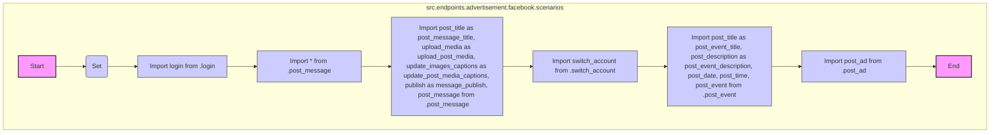

## Анализ кода `hypotez/src/endpoints/advertisement/facebook/scenarios/__init__.py`

### <алгоритм>

1.  **Инициализация**:
    *   Устанавливается режим работы ``. Это указывает на то, что код выполняется в режиме разработки.

2.  **Импорт `login`**:
    *   Импортируется функция `login` из модуля `.login`. Эта функция, вероятно, отвечает за аутентификацию пользователя в Facebook.
    *   **Пример**: Вызов `login()` с учетными данными пользователя.

3.  **Импорт `post_message`**:
    *   Импортируется все (`*`) из модуля `.post_message`. Это означает импорт всех функций и классов, связанных с публикацией сообщений в Facebook.
    *   **Пример**: Вызов `post_message(text='Hello, world!')` для публикации текстового сообщения.
    *   Также импортируются отдельные функции с переименованием:
        *   `post_title` переименовывается в `post_message_title` (заголовок сообщения).
        *   `upload_media` переименовывается в `upload_post_media` (загрузка медиа).
        *   `update_images_captions` переименовывается в `update_post_media_captions` (обновление подписей к медиа).
        *   `publish` переименовывается в `message_publish` (публикация сообщения).

4.  **Импорт `switch_account`**:
    *   Импортируется функция `switch_account` из модуля `.switch_account`. Эта функция, вероятно, отвечает за переключение между аккаунтами Facebook.
    *   **Пример**: Вызов `switch_account(account_id='12345')` для переключения на аккаунт с ID '12345'.

5.  **Импорт `post_event`**:
    *   Импортируются функции из модуля `.post_event`, связанные с публикацией событий.
        *   `post_title` переименовывается в `post_event_title` (заголовок события).
        *   `post_description` переименовывается в `post_event_description` (описание события).
        *    Импортируются `post_date` и `post_time`.
        *    Импортируется `post_event` (основная функция для публикации события).
    *   **Пример**: Вызов `post_event(title='Party', description='Come to my party!')`.

6.  **Импорт `post_ad`**:
    *   Импортируется функция `post_ad` из модуля `.post_ad`. Эта функция, вероятно, отвечает за создание и публикацию рекламы в Facebook.
    *   **Пример**: Вызов `post_ad(target='users in New York', budget=100)`.

### <mermaid>

**Объяснение `mermaid`:**

*   Диаграмма `flowchart TD` представляет собой блок-схему, отображающую поток управления.
*   `subgraph src.endpoints.advertisement.facebook.scenarios` — обозначает, что все узлы находятся в рамках пакета `src.endpoints.advertisement.facebook.scenarios`.
*   `Start` и `End` обозначают начало и конец выполнения кода.
*   `SetMode(Set )` —  указывает на установку режима `MODE` в значение `'dev'`.
*   `ImportLogin` , `ImportPostMessage`, `ImportRenamedPostMessage`, `ImportSwitchAccount`, `ImportPostEvent`, `ImportPostAd`  представляют собой операции импорта из соответствующих модулей внутри пакета.
*   Стрелки `-->` показывают последовательность выполнения операций.
*   `classDef module fill:#ccf,stroke:#333,stroke-width:1px` и  `class SetMode,ImportLogin,ImportPostMessage,ImportRenamedPostMessage,ImportSwitchAccount,ImportPostEvent,ImportPostAd module;` стилизуют блоки.

### <объяснение>

**Импорты:**

*   `from .login import login`: Импортирует функцию `login` из модуля `login.py`, находящегося в том же пакете (`.`). Эта функция, вероятно, используется для аутентификации пользователя в Facebook.
*   `from .post_message import *`: Импортирует все (*) элементы из модуля `post_message.py`. Этот модуль, вероятно, содержит функции и классы для создания и публикации сообщений на Facebook, включая загрузку медиа, обновление подписей к изображениям и их публикацию.
*   `from .switch_account import switch_account`: Импортирует функцию `switch_account` из модуля `switch_account.py`. Эта функция, вероятно, позволяет переключаться между разными аккаунтами Facebook.
*   `from .post_message import (post_title as post_message_title, upload_media as upload_post_media, update_images_captions as update_post_media_captions, publish as message_publish, post_message,)`: Импортирует выбранные функции из модуля `post_message.py` и переименовывает их для удобства. `post_message` импортируется без переименования.
*   `from .post_event import (post_title as post_event_title, post_description as post_event_description, post_date, post_time,  post_event)`: Импортирует выбранные функции из модуля `post_event.py`,  связанные с созданием и публикацией событий на Facebook. Некоторые из них переименованы для ясности.
*    `from .post_ad import post_ad`: импортируется функция `post_ad` из модуля `post_ad.py`, которая используется для создания и публикации рекламных объявлений в Facebook.

**Переменные:**

*   ``: Определяет режим работы приложения как "разработка". Эта переменная может использоваться для включения/выключения отладочных функций, логгирования и других возможностей, специфичных для разработки.

**Общее назначение файла:**

Файл `__init__.py` в пакете `src.endpoints.advertisement.facebook.scenarios` служит точкой входа для всех сценариев, связанных с Facebook рекламой и публикациями. Он импортирует и предоставляет доступ к функциям, которые позволяют:

*   Авторизовываться в Facebook (`login`).
*   Публиковать сообщения (`post_message`, `post_message_title`, `upload_post_media`, `update_post_media_captions`, `message_publish`).
*   Переключаться между аккаунтами (`switch_account`).
*   Публиковать события (`post_event`, `post_event_title`, `post_event_description`, `post_date`, `post_time`).
*   Публиковать рекламные объявления (`post_ad`).

**Цепочка взаимосвязей:**

Этот файл импортирует модули из своего же пакета (например, `.login`, `.post_message` и т.д.). Он служит связующим звеном между различными подмодулями, предоставляя единый интерфейс для доступа к их функциональности. Подразумевается, что каждый импортированный модуль, в свою очередь, зависит от других частей проекта (например, `src.core`, `src.utils`), хотя это не показано напрямую в данном файле.

**Потенциальные области для улучшения:**

*   **Явное импортирование**: Использование `from .post_message import *` может привести к конфликтам имен и затруднить понимание, какие именно функции доступны. Лучше явно перечислить импортируемые функции, чтобы код стал более понятным и поддерживаемым.
*   **Конфигурация**: Вместо жесткого задания ``, лучше использовать механизм конфигурации, например, через переменные окружения или файлы конфигурации.
*   **Обработка ошибок**: В этом файле не показана обработка ошибок. Необходимо добавить обработку исключений, возникающих при работе с API Facebook.
*   **Логирование**: Добавить логирование для отслеживания выполнения функций и отладки проблем.
*   **Документация**: Добавить docstrings к функциям, чтобы облегчить их использование и понимание.