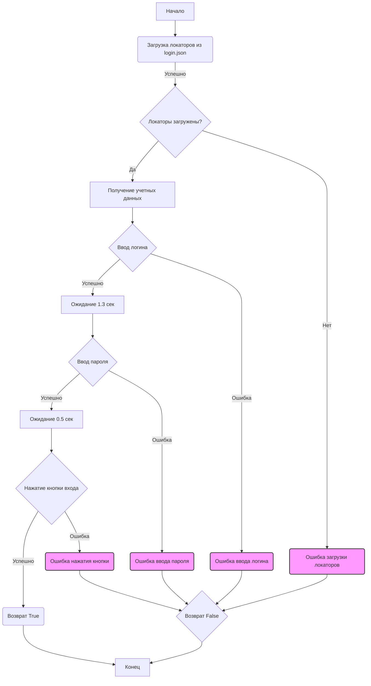

## <алгоритм>

1. **Загрузка настроек:**
   - Загружаются настройки из файла `login.json` с помощью функции `j_loads_ns`. Эти настройки, предположительно, содержат локаторы элементов веб-страницы Facebook (например, поля для ввода логина/пароля и кнопки входа).
   - **Пример:** `locators = j_loads_ns(Path(...))` загружает JSON-файл с локаторами в словарь `locators`.
   - Проверка: Если загрузка `locators` не удалась, то выводится сообщение об ошибке.

2. **Авторизация пользователя (функция `login`):**
   - Принимает объект `Driver` в качестве аргумента, предоставляющий методы для взаимодействия с браузером.
   - Извлекает учетные данные пользователя из `gs.facebook_credentials`.
    - **Пример:** `credentials = gs.facebook_credentials[0]` получает первый набор учетных данных из глобальных настроек.

3. **Ввод логина:**
   - Использует метод `send_key_to_webelement` объекта `Driver` для отправки логина (username) в поле ввода, локатор которого был загружен ранее (из `locators`).
    - **Пример:** `d.send_key_to_webelement(locators.email, credentials.username)` отправляет имя пользователя в поле, локатор которого соответствует ключу 'email' в словаре `locators`.
   - Если возникает ошибка при вводе логина, функция регистрирует ошибку в логе и возвращает `False`.

4. **Ожидание:**
   - Выполняется ожидание в 1.3 секунды для имитации поведения пользователя.
   - **Пример:** `d.wait(1.3)`

5. **Ввод пароля:**
   - Аналогично вводу логина, использует `send_key_to_webelement` для отправки пароля в соответствующее поле.
   - **Пример:** `d.send_key_to_webelement(locators['password'], credentials['password'])`
   - При возникновении ошибки, функция регистрирует ее и возвращает `False`.

6. **Ожидание:**
   - Короткая задержка в 0.5 секунд.
   - **Пример:** `d.wait(0.5)`

7. **Нажатие кнопки входа:**
   - Использует метод `execute_locator` объекта `Driver` для нажатия на кнопку входа.
     - **Пример:** `d.execute_locator(locators['button'])`
   - Если нажатие не удалось, функция регистрирует ошибку в логе и возвращает `False`.

8. **Успешная авторизация:**
   - Если все шаги выполнены без ошибок, функция возвращает `True`.

## <mermaid>



**Объяснение зависимостей:**

-   `pathlib.Path`: Используется для работы с путями к файлам. Необходим для указания пути к файлу `login.json`.
-   `typing.Dict`: Используется для аннотации типов данных, например, для указания, что ожидается словарь.
-   `src.gs`: Предположительно, это модуль, содержащий глобальные настройки и переменные, включая учетные данные Facebook (`facebook_credentials`).
-   `src.webdriver.driver.Driver`: Это класс, который обеспечивает взаимодействие с веб-браузером. Он содержит методы для ввода текста (`send_key_to_webelement`), нажатия на элементы (`execute_locator`), ожидания (`wait`).
-   `src.utils.jjson`: Модуль, содержащий функции `j_loads`, `j_loads_ns` и `j_dumps` для работы с JSON. В данном коде используется `j_loads_ns` для загрузки данных из JSON-файла с локаторами.
-   `src.logger.logger`: Модуль для логирования событий и ошибок. Используется для записи сообщений об ошибках при авторизации.

## <объяснение>

**Импорты:**

-   `pathlib.Path`: Используется для создания объектов путей к файлам, что делает код более переносимым между разными операционными системами.
-   `typing.Dict`: Используется для статической типизации, что улучшает читаемость и помогает отлавливать ошибки на ранних этапах.
-   `src.gs`: Модуль глобальных настроек, который предоставляет доступ к глобальным переменным, включая `facebook_credentials`. Вероятно, эта переменная содержит список учетных данных для Facebook.
-   `src.webdriver.driver.Driver`: Это ключевой компонент, предоставляющий абстракцию для управления браузером. Он содержит методы для взаимодействия с веб-элементами, такие как ввод текста, нажатие на кнопки и ожидание.
-   `src.utils.jjson`: Этот модуль содержит утилиты для работы с JSON. Функция `j_loads_ns` используется для загрузки JSON-данных из файла, предполагается, что она возвращает словарь, где ключи являются атрибутами, а значения — данными.
-   `src.logger.logger`: Модуль для логирования, который позволяет записывать сообщения о событиях, ошибках и другой отладочной информации.

**Переменные:**

-   `MODE`: Глобальная переменная, определяющая режим работы (в данном случае `'dev'`). Возможно, она влияет на поведение других частей системы, например, на уровень логирования или выбор среды.
-   `locators`: Словарь, загружаемый из `login.json`, который содержит локаторы элементов веб-страницы Facebook. Локаторы – это способы доступа к элементам HTML (например, по ID, классу, CSS-селектору, XPath).
-   `credentials`: Словарь, содержащий имя пользователя и пароль для входа в Facebook, загруженный из `gs.facebook_credentials`.
-    `d`: Объект класса `Driver` - экземпляр драйвера для взаимодействия с веб-элементами

**Функции:**

-   `login(d: Driver) -> bool`:
    -   **Аргументы:**
        -   `d`: Объект `Driver`, который используется для управления браузером.
    -   **Возвращаемое значение:**
        -   `True`: Если авторизация прошла успешно.
        -   `False`: Если авторизация не удалась.
    -   **Назначение:** Выполняет авторизацию на Facebook.
    -   **Пример использования:**
        ```python
        from src.webdriver.driver import Driver
        driver = Driver()
        success = login(driver)
        if success:
            print("Авторизация прошла успешно")
        else:
            print("Авторизация не удалась")
        ```
    - **Внутренние операции:**
       1. Получение учетных данных из `gs.facebook_credentials`.
       2. Ввод логина в соответствующее поле на странице Facebook.
       3. Ожидание.
       4. Ввод пароля в соответствующее поле.
       5. Ожидание.
       6. Нажатие кнопки входа.
       7. Возврат `True` при успехе, иначе `False`.
    - **Возможные ошибки:**
        - Ошибки при вводе логина, пароля или нажатии кнопки обрабатываются с помощью `try...except`, ошибки логируются, функция возвращает `False`.

**Цепочка взаимосвязей:**

1.  **`login.json`**: Этот файл хранит локаторы элементов веб-страницы Facebook. Без него невозможно будет взаимодействовать с элементами формы авторизации на странице.
2.  **`src.gs`**: Модуль глобальных настроек, предоставляет доступ к учетным данным Facebook. Без `facebook_credentials` авторизация невозможна.
3.  **`src.webdriver.driver.Driver`**: Это ядро для взаимодействия с браузером. Без экземпляра этого класса невозможно будет управлять браузером и взаимодействовать с веб-элементами.
4. **`src.utils.jjson`**: Модуль необходим для корректной загрузки `login.json`
5.  **`src.logger.logger`**: Позволяет отслеживать ошибки во время выполнения, что облегчает отладку и обнаружение проблем.

**Потенциальные ошибки и области для улучшения:**

1. **Обработка ошибок:** Код использует общую обработку исключений (`except Exception as ex`).  Вместо этого, лучше обрабатывать конкретные типы исключений, например `NoSuchElementException`, чтобы точнее определять причину ошибки и обрабатывать ее соответствующим образом.
2. **Ожидания:** Использование `d.wait(seconds)` может быть недостаточно надежным. Лучше использовать явные ожидания (explicit waits), которые ждут появления определенного условия (например, появление элемента на странице), что делает код более устойчивым.
3. **Хранение учетных данных:** Учетные данные хранятся в `gs.facebook_credentials`.  Это не безопасно, особенно если код попадает в репозиторий. Необходимо использовать более безопасные методы хранения (например, переменные окружения или менеджеры секретов).
4. **`MODE`:** Использование `MODE` в виде строковой переменной не является безопасным и может привести к ошибкам, если в другом месте кода будут использоваться неверные сравнения (например, `if MODE == 'development'`).  Лучше использовать `enum` или другие методы, которые позволят четко задавать возможные варианты режима.
5. **Абсолютные пути:** Использование абсолютного пути в `Path(gs.path.src / 'endpoints' / 'advertisement' / 'facebook' / 'locators' / 'login.json')` не является переносимым, лучше использовать `Path(__file__).parent` для указания пути относительно местоположения скрипта.
6. **Логирование:** Сообщения об ошибках могли бы быть более информативными (например, включать в лог, какой именно локатор не был найден).
7. **Не реализована многопоточность:** Код не является многопоточным и в случае если необходимо запускать множество сценариев параллельно это создаст проблемы.

**Дополнительные замечания:**

- Код имеет строгие ограничения по времени ожидания. Это может привести к проблемам, если страница загружается долго.
- Код не проверяет наличие капчи, что может привести к проблемам с автоматической авторизацией.
- Код не обрабатывает дополнительные факторы аутентификации, такие как двухфакторная аутентификация, если она включена у пользователя.
- Код использует `[0]` для получения учетных данных из списка `gs.facebook_credentials`. Если список будет пустым, возникнет ошибка `IndexError`. Лучше добавить проверку.

Этот анализ предоставляет подробную информацию о том, как работает код, какие зависимости он имеет и какие области можно улучшить.