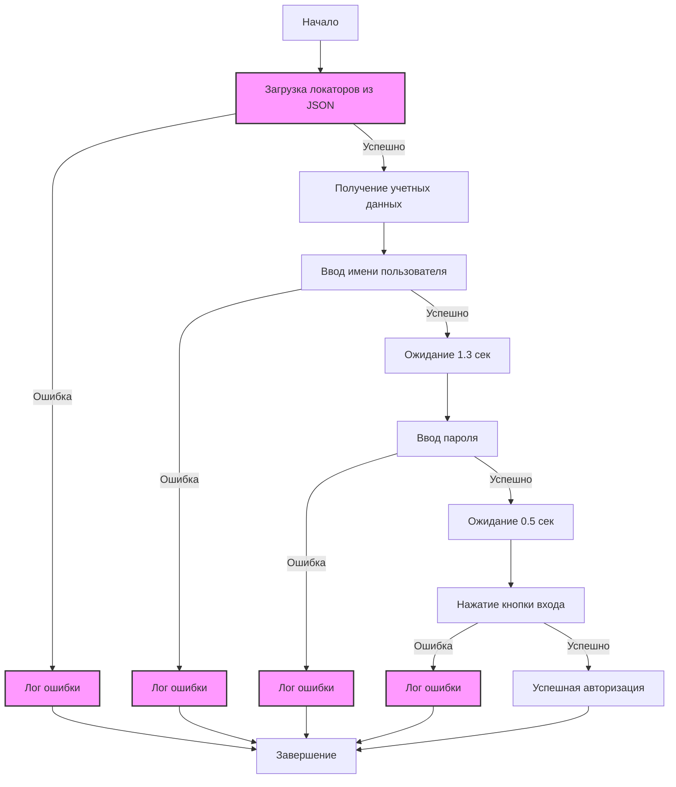
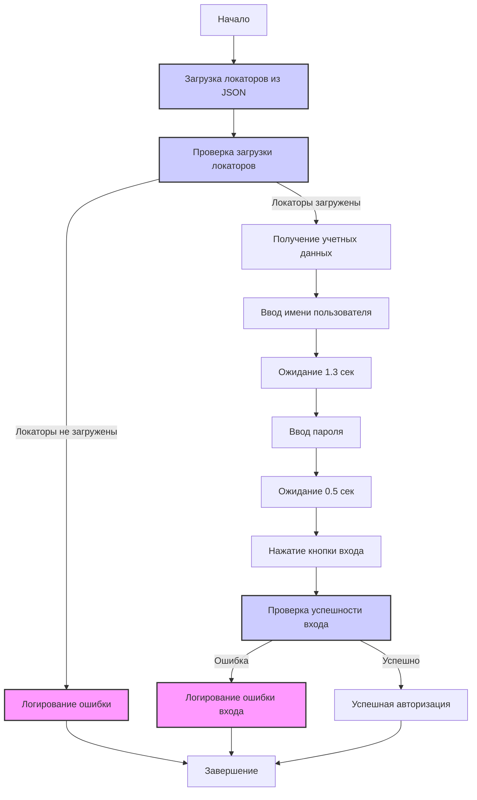
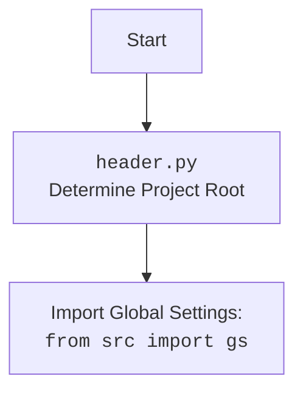

## АНАЛИЗ КОДА: `hypotez/src/endpoints/advertisement/facebook/scenarios/login.py`

### 1. <алгоритм>

**Блок-схема:**


**Примеры для блоков:**
1.  **`LoadLocators`**: Загружает JSON файл `login.json`, содержащий селекторы элементов для авторизации на Facebook, например:
    ```json
    {
        "email": {"by": "id", "value": "email"},
        "password": {"by": "id", "value": "pass"},
        "button": {"by": "name", "value": "login"}
     }
    ```
2.  **`GetCredentials`**: Извлекает данные пользователя для входа из `gs.facebook_credentials`. Пример:

    ```python
    credentials = {
         "username": "example@mail.com",
         "password": "password123"
     }
    ```
3.  **`InputUsername`**: Функция `d.send_key_to_webelement(locators.email, credentials.username)` вводит email в поле ввода логина, используя значение `locators.email`  (`{"by": "id", "value": "email"}`) и `credentials.username` = `"example@mail.com"`.
4.  **`InputPassword`**: Функция `d.send_key_to_webelement(locators['password'], credentials['password'])` вводит пароль в поле ввода пароля.
5.  **`ClickLoginButton`**: Функция `d.execute_locator(locators['button'])` выполняет клик на кнопку входа, используя `locators['button']`.
6.  **`ErrorLog`**: Если при загрузке локаторов не удалось загрузить локаторы, то будет вызван логер.
7.  **`ErrorLogUsername`**: Если при вводе логина возникла ошибка, будет вызвана функция логгера.
8.  **`ErrorLogPassword`**: Если при вводе пароля возникла ошибка, будет вызвана функция логгера.
9.   **`ErrorLogButton`**: Если при нажатии на кнопку возникла ошибка, будет вызвана функция логгера.

### 2. <mermaid>



**Объяснение зависимостей в mermaid диаграмме:**

- **`Start`**: Начало процесса.
- **`LoadLocators`**: Загружает JSON файл с локаторами элементов. Зависимости: `pathlib`, `src.utils.jjson`. Использует `j_loads_ns` для загрузки локаторов из JSON.
- **`CheckLocators`**: Проверяет, были ли загружены локаторы.
- **`LogErrorLocators`**: Логирует ошибку, если не удалось загрузить локаторы. Зависимости: `src.logger.logger`.
- **`GetCredentials`**: Получает учетные данные пользователя из `gs.facebook_credentials`. Зависимости: `src`.
- **`InputUsername`**: Вводит имя пользователя в поле ввода. Зависимости: `src.webdriver.driver`.
- **`Wait1`**:  Ожидает заданное количество времени.
- **`InputPassword`**: Вводит пароль в поле ввода. Зависимости: `src.webdriver.driver`.
- **`Wait2`**:  Ожидает заданное количество времени.
- **`ClickLoginButton`**: Нажимает кнопку входа. Зависимости: `src.webdriver.driver`.
- **`LoginSuccessCheck`**: Проверка успешности входа.
- **`LoginSuccess`**: Авторизация прошла успешно.
- **`LogErrorLogin`**: Логирует ошибку, если авторизация не удалась. Зависимости: `src.logger.logger`.
- **`End`**: Конец процесса.

**Дополнительно (header.py):**



### 3. <объяснение>

**Импорты:**

-   **`pathlib`**: Используется для работы с путями к файлам и каталогам, для получения пути к файлу локаторов.
-   **`typing.Dict`**: Используется для аннотации типов, для обозначения типов переменных, если необходимо.
-   **`src`**:
    -   **`gs`**: Импортирует глобальные настройки проекта, содержащие пути к файлам, credentials и другие глобальные параметры.
    -   **`webdriver.driver.Driver`**: Импортирует класс `Driver` для управления браузером.
    -   **`utils.jjson`**:
        -   **`j_loads`, `j_loads_ns`**: Функции для загрузки данных из JSON файлов.
        -   **`j_dumps`**: Функция для преобразования данных в JSON формат.
    -  **`logger.logger`**: Импортирует объект `logger` для логирования ошибок и отладочной информации.

**Переменные:**

-   **`MODE`**: Строковая константа, устанавливающая режим работы приложения (в данном случае `'dev'`).
-   **`locators`**: Словарь, содержащий локаторы веб-элементов для авторизации на Facebook, загруженные из JSON-файла.

**Функции:**

-   **`login(d: Driver) -> bool`**:
    -   **Аргументы**:
        -   `d`: Объект `Driver`, представляющий драйвер браузера, который будет использоваться для взаимодействия с веб-страницей.
    -   **Возвращаемое значение**:
        -   `True`, если авторизация прошла успешно, иначе `False`.
    -   **Назначение**:
        1. Загружает учетные данные пользователя из глобальных настроек.
        2. Последовательно вводит имя пользователя, пароль и нажимает кнопку входа.
        3. Обрабатывает возможные исключения, возникающие при взаимодействии с веб-элементами.
        4. Вызывает логгер для логирования ошибок и отладочной информации.
        5. Возвращает `True`, если авторизация прошла успешно, иначе `False`.
    -   **Пример:**
        ```python
        from src.webdriver.driver import Driver

        driver = Driver()
        success = login(driver)
        if success:
            print("Login successful")
        else:
            print("Login failed")
        ```

**Классы:**

-   **`Driver`**: Класс из `src.webdriver.driver`, предназначенный для управления браузером, отправки текста в поля, выполнения кликов по элементам, а также ожидания элементов.

**Взаимодействие:**

1.  Функция `login` использует класс `Driver` для взаимодействия с веб-страницей Facebook.
2.  Локаторы из JSON-файла используются для поиска элементов на странице.
3.  Глобальные настройки (из `gs`) содержат учетные данные для входа.
4.  Логгер (`logger`) используется для записи ошибок и отладочной информации.

**Потенциальные ошибки и области для улучшения:**

1.  **Жестко заданный индекс `[0]`**:  При использовании `gs.facebook_credentials[0]` всегда используется первый набор учетных данных. Это может быть недостатком при наличии нескольких учетных записей.
2.  **Отсутствие проверок на успешную авторизацию**: Функция предполагает, что если ввод данных и нажатие кнопки прошли без ошибок, то авторизация успешна.  Необходимо добавить проверку, например, по наличию определенных элементов на странице после авторизации.
3.  **Общая обработка исключений**: Функция перехватывает любые исключения, что может затруднить отладку. Лучше обрабатывать конкретные типы исключений.
4.  **Задержки `wait()`**: Задержки `d.wait(1.3)` и `d.wait(0.5)` могут быть нестабильными.  Лучше использовать более надежные методы ожидания, такие как `WebDriverWait`.
5.  **Отсутствие подробного логгирования**: При неудачной попытке входа в лог записывается только общее сообщение "Invalid login", не указывая конкретную причину. Необходимо более подробное логгирование для облегчения отладки.

**Цепочка взаимосвязей:**
- `login.py` -> `src/gs` (глобальные настройки) -> `src/webdriver/driver.py` (управление браузером) -> `src/utils/jjson` (загрузка JSON) -> `src/logger/logger.py` (логгирование)
- `login.py` -> `src/endpoints/advertisement/facebook/locators/login.json` (локаторы элементов).