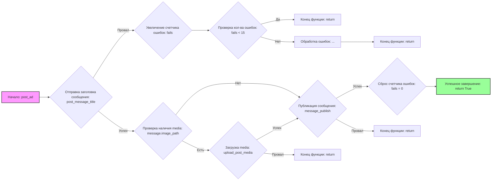

## Анализ кода `hypotez/src/endpoints/advertisement/facebook/scenarios/post_ad.py`

### <алгоритм>
1. **Инициализация**:
   - Устанавливается глобальная переменная `fails` в `0`.
   - Загружаются локаторы из `post_message.json` в `locator`.
   - Функция `post_ad` принимает драйвер `d` типа `Driver` и сообщение `message` типа `SimpleNamespace`.

2. **Отправка заголовка сообщения**:
   - Вызывается функция `post_message_title` с драйвером `d` и текстом сообщения `message.description`.
   - **Пример**:
     ```python
     message = SimpleNamespace(description="Event Description")
     # driver initialization
     post_message_title(d, "Event Description")
     ```
   - Если `post_message_title` возвращает `False`:
     - Записывается сообщение об ошибке в лог.
     - Увеличивается счетчик ошибок `fails` на 1.
     - Если `fails` меньше 15, функция завершается.
     - Если `fails` больше или равно 15, выполняется код `...` (который не указан, но предполагает обработку ситуации).

3. **Загрузка медиа**:
   - Задержка в 1 секунду.
   - Если у `message` есть атрибут `image_path` и он не пустой:
     - Вызывается функция `upload_post_media` с драйвером `d`, путем к медиа `message.image_path` и флагом `without_captions=True`.
     - **Пример**:
       ```python
       message = SimpleNamespace(description="Event Description", image_path="/path/to/image.jpg")
       # driver initialization
       upload_post_media(d, media = "/path/to/image.jpg", without_captions = True)
       ```
     - Если `upload_post_media` возвращает `False`, функция завершается.

4. **Публикация сообщения**:
   - Вызывается функция `message_publish` с драйвером `d`.
     - **Пример**:
       ```python
       # driver initialization
       message_publish(d)
       ```
   - Если `message_publish` возвращает `False`, функция завершается.

5. **Сброс счетчика ошибок и успешное завершение**:
   - Счетчик ошибок `fails` сбрасывается в 0.
   - Функция возвращает `True`.

### <mermaid>

**Объяснение зависимостей `mermaid`**:

- `graph LR`:  Определяет тип диаграммы как направленный граф (LR - Left to Right).
- `A`, `B`, `C`, `D` и т.д.:  Узлы графа, представляющие этапы выполнения кода. Каждый узел имеет осмысленное имя, описывающее его действие.
- `-->`: Обозначает направленные связи между узлами, показывающие порядок выполнения действий.
- Условные переходы  `B -- Успех --> C` показывают поток выполнения в зависимости от результата выполнения предыдущего шага.

### <объяснение>
#### Импорты:
- `socket.timeout`: Используется для обработки таймаутов при сетевых операциях. В коде явно не используется, но может быть нужен в зависимых функциях или модулях, как `src.webdriver.driver`
- `time`: Используется для управления временем, в частности, для добавления задержки между операциями.
- `pathlib.Path`: Используется для работы с путями к файлам и директориям, обеспечивает кроссплатформенность.
- `types.SimpleNamespace`: Используется для создания простых объектов с атрибутами, что позволяет удобно хранить и передавать данные.
- `typing.Dict, List`:  Используются для аннотации типов, повышает читаемость и обнаруживает ошибки на этапе разработки.
- `urllib.parse.urlencode`: Используется для кодирования параметров URL. В данном коде не используется напрямую, но может быть необходим в других функциях или модулях.
- `selenium.webdriver.remote.webelement.WebElement`: Используется для представления элементов веб-страницы, является частью библиотеки Selenium.
- `src.gs`:  Импортируется `gs` из `src`, вероятно, содержит глобальные настройки и константы для проекта.
- `src.webdriver.driver.Driver`:  Импортируется класс `Driver`, представляющий драйвер браузера, используемый для управления веб-страницей.
- `src.endpoints.advertisement.facebook.scenarios.post_message_title, upload_post_media, message_publish`: Импортируются функции, специфичные для публикации рекламных сообщений на Facebook.
- `src.utils.jjson.j_loads_ns, pprint`: Импортируются функции для загрузки JSON в виде `SimpleNamespace` и для форматированного вывода.
- `src.logger.logger.logger`: Импортируется объект `logger` для логирования событий.

#### Переменные:
- `MODE`:  Глобальная переменная, определяющая режим работы (здесь 'dev').
- `locator`: Глобальная переменная типа `SimpleNamespace`, содержащая локаторы элементов веб-страницы, загруженные из JSON файла.
- `fails`:  Глобальная целочисленная переменная, счетчик ошибок.

#### Функции:
- `post_ad(d: Driver, message: SimpleNamespace) -> bool`:
    - **Аргументы**:
        - `d`: Экземпляр класса `Driver` для управления браузером.
        - `message`: Экземпляр `SimpleNamespace`, содержащий данные для публикации (текст, путь к изображению).
    - **Возвращаемое значение**:
        - `bool`: `True` при успешной публикации сообщения, в противном случае функция может неявно вернуть `None`, или преждевременно выйти из функции, не возвращая значения.
    - **Назначение**:
        -  Публикует рекламное сообщение, включая текст и изображение, в Facebook.
    - **Примеры**:
        ```python
        driver = Driver(...) # Инициализация драйвера
        message = SimpleNamespace(description="Описание события", image_path="/path/to/image.jpg")
        success = post_ad(driver, message)
        if success:
            print("Сообщение успешно опубликовано")
        ```
        ```python
        driver = Driver(...) # Инициализация драйвера
        message = SimpleNamespace(description="Описание события")
        success = post_ad(driver, message)
         if success:
            print("Сообщение успешно опубликовано")
        ```

#### Классы:
- В коде напрямую не определены классы, но используются классы из импортированных модулей, такие как `Driver`, `SimpleNamespace`.

#### Взаимосвязи с другими частями проекта:
- Зависит от `src.webdriver.driver` для управления браузером.
- Использует `src.endpoints.advertisement.facebook.scenarios.post_message_title`, `upload_post_media`, `message_publish` для выполнения конкретных действий по публикации в Facebook.
- Использует `src.utils.jjson` для загрузки конфигурации из JSON файлов.
- Логирует ошибки с помощью `src.logger.logger`.
- `src.gs` предоставляет глобальные настройки.

#### Потенциальные ошибки и области для улучшения:
- Функция `post_ad` может неявно возвращать `None`, если `post_message_title`, `upload_post_media` или `message_publish` возвращают `False`.  Это может усложнить обработку ошибок.  Следует явно возвращать `False` в таких случаях.
- Код `...` при `fails >= 15` не имеет реализации. Необходимо добавить логику для обработки большого количества ошибок.
- Отсутствует обработка возможных исключений, возникающих при взаимодействии с браузером.
- Желательно добавить более подробное логирование для облегчения отладки.
- Использовать более информативные названия для переменных `d` и `message`.

Этот анализ предоставляет всестороннее представление о функциональности, зависимостях и потенциальных проблемах кода.