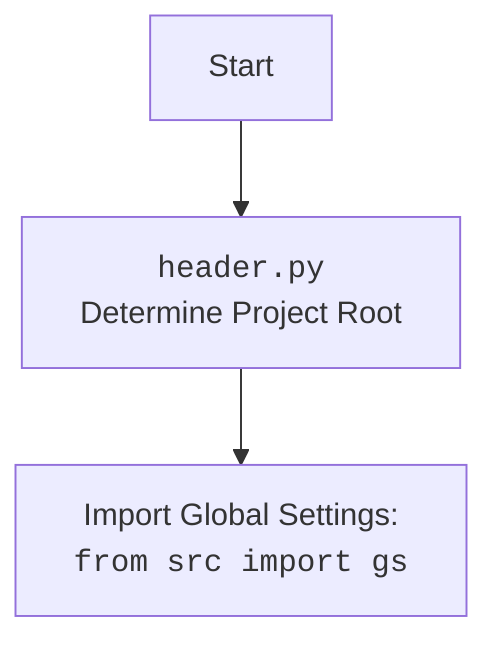

## Анализ кода `post_ad.py`

### <алгоритм>

1.  **Начало:** Функция `post_ad` принимает объект `Driver` (веб-драйвер) и `message` (пространство имен с данными рекламного сообщения). Инициализируется счетчик `fails` (глобальная переменная) в 0.
    *   Пример: `d` - объект класса `Driver` для управления браузером; `message` - `SimpleNamespace(description="Описание", image_path="путь/к/изображению")`.

2.  **Отправка заголовка:** Функция `post_message_title` пытается отправить заголовок рекламного сообщения (значение `message.description`).
    *   Если отправка не удалась, регистрируется ошибка, счетчик `fails` увеличивается, и происходит проверка на количество неудачных попыток. Если количество неудачных попыток `fails` меньше 15, функция прерывается. Если 15 или больше, то... (пропуск кода).
    *   Пример: `post_message_title(d, "Описание")`. Если успешно, возвращает `True`; иначе возвращает `False`.

3.  **Загрузка медиа:** Проверяется, есть ли у объекта `message` атрибут `image_path`. Если есть и он не пуст, вызывается функция `upload_post_media` для загрузки изображения. Параметр `without_captions` установлен в `True`.
    *   Если загрузка медиа не удалась, функция `post_ad` завершается.
    *   Пример: `upload_post_media(d, media="путь/к/изображению", without_captions=True)`.

4.  **Публикация сообщения:** Функция `message_publish` пытается опубликовать сообщение.
    *   Если публикация не удалась, функция `post_ad` завершается.
    *   Пример: `message_publish(d)`.

5.  **Сброс счетчика и успех:** Счетчик `fails` сбрасывается до 0. Функция `post_ad` возвращает `True`, сигнализируя об успешной публикации.
    *   Пример: `fails` := 0, `return True`.

### <mermaid>

```mermaid
flowchart TD
    Start(Начало) --> CheckTitle[Проверка отправки заголовка: <br><code>post_message_title(d, message.description)</code>]
    CheckTitle -- Успех --> CheckMedia[Проверка наличия медиа: <br><code>hasattr(message, 'image_path') and message.image_path</code>]
    CheckTitle -- Неудача --> FailIncrement[Увеличение счетчика неудач: <br><code>fails += 1</code>]
    FailIncrement --> CheckFails[Проверка количества неудач: <br><code>fails < 15</code>]
    CheckFails -- Менее 15 --> End
    CheckFails -- 15 или больше --> Skip[Пропуск]
    Skip --> End

    CheckMedia -- Есть медиа --> UploadMedia[Загрузка медиа: <br><code>upload_post_media(d, message.image_path, True)</code>]
    CheckMedia -- Нет медиа --> PublishMessage[Публикация сообщения: <br><code>message_publish(d)</code>]
    UploadMedia -- Успех --> PublishMessage
    UploadMedia -- Неудача --> End
    PublishMessage -- Успех --> ResetFails[Сброс счетчика: <br><code>fails = 0</code>]
    PublishMessage -- Неудача --> End
    ResetFails --> Success[Возврат: <code>return True</code>]
    End[Конец]
    Success--> End
```

**Объяснение `mermaid` диаграммы:**

*   `Start`: Начало функции `post_ad`.
*   `CheckTitle`: Проверка успешной отправки заголовка сообщения.
*   `FailIncrement`: Увеличение счетчика `fails`, если отправка заголовка не удалась.
*   `CheckFails`: Проверка, не превысило ли количество неудачных попыток установленный лимит (15).
*   `CheckMedia`: Проверка наличия медиа (изображения) для загрузки.
*   `UploadMedia`: Загрузка медиафайла, если он присутствует.
*   `PublishMessage`: Публикация сообщения после успешной загрузки медиа или отсутствия медиа.
*   `ResetFails`: Сброс счетчика неудач `fails` после успешной публикации.
*   `Success`: Завершение функции с возвратом `True`.
*   `End`: Конец выполнения функции `post_ad`.
*   Стрелки обозначают поток управления программы.



**Объяснение `header.py` диаграммы:**
* `Start`: Начало процесса.
* `Header`: Представляет выполнение скрипта `header.py`, который определяет корень проекта.
* `import`:  Импорт глобальных настроек из `src`, которые могут включать пути к файлам, переменные окружения и т.д.

### <объяснение>

**Импорты:**

*   `socket.timeout`: Используется для обработки таймаутов при сетевых операциях (хотя в данном коде явно не используется, возможно, используется в импортированных модулях).
*   `time`: Для временных задержек (`time.sleep(1)`).
*   `pathlib.Path`: Для работы с путями к файлам в виде объектов, что упрощает переносимость кода.
*   `types.SimpleNamespace`: Удобный способ создания объектов с произвольными атрибутами (используется для хранения данных сообщения).
*   `typing.Dict, List`: Для аннотации типов, что делает код более читаемым и надежным.
*   `urllib.parse.urlencode`: Для кодирования параметров URL (не используется непосредственно в этом файле, но может использоваться в других модулях, на которые есть ссылки).
*   `selenium.webdriver.remote.webelement.WebElement`: Представляет элемент веб-страницы (используется внутри `Driver`, но не в этом коде).
*   `src`: Базовый пакет, откуда импортируются модули проекта.
    *   `src.gs`: Глобальные настройки проекта, включая пути к файлам.
    *   `src.webdriver.driver.Driver`: Класс, инкапсулирующий управление браузером через Selenium.
    *   `src.endpoints.advertisement.facebook.scenarios`: Модуль, содержащий функции для выполнения действий на Facebook.
        *   `post_message_title`: Функция для отправки заголовка сообщения.
        *   `upload_post_media`: Функция для загрузки медиафайлов.
        *   `message_publish`: Функция для публикации сообщения.
    *   `src.utils.jjson`: Модуль для работы с JSON файлами.
    *   `src.logger.logger`: Модуль для логирования событий.

**Переменные:**

*   `locator`:  `SimpleNamespace`, который загружает локаторы элементов веб-страницы из `post_message.json`.
    *   Используется для нахождения нужных элементов на веб-странице.
    *   Загружается при инициализации модуля.
*   `fails`: Глобальная переменная-счетчик неудачных попыток.

**Функции:**

*   `post_ad(d: Driver, message: SimpleNamespace) -> bool`: Основная функция, выполняющая публикацию рекламного сообщения.
    *   `d`: Экземпляр класса `Driver` для управления браузером.
    *   `message`: `SimpleNamespace`, содержащий данные рекламного сообщения: описание, путь к медиафайлу.
    *   Возвращает `True` при успешной публикации или `None` в случае неудачи (функция не возвращает `False`).
    *   Пример использования: `post_ad(driver, message_data)`, где `driver` - объект `Driver`, а `message_data` - объект `SimpleNamespace` с данными.

**Классы:**

*   `Driver`: Класс, управляющий браузером через Selenium. Его экземпляр (`d`) передается в функцию `post_ad` для взаимодействия с веб-страницей.
    *   Используется для всех действий с браузером: навигации, поиска элементов, отправки текста и кликов.

**Объяснение и цепочка взаимосвязей:**

1.  **Загрузка локаторов**: Функция `j_loads_ns` из `src.utils.jjson` используется для загрузки JSON файла с локаторами элементов веб-страницы. Эти локаторы используются внутри функций `post_message_title`, `upload_post_media` и `message_publish` для взаимодействия с элементами Facebook.
2.  **Управление браузером**: Класс `Driver` (из `src.webdriver.driver`) предоставляет интерфейс для управления браузером (вероятно, Chrome или Firefox). Экземпляр этого класса передается в функцию `post_ad`.
3.  **Пошаговое выполнение**: Функция `post_ad` последовательно вызывает другие функции из `src.endpoints.advertisement.facebook.scenarios`: `post_message_title` (отправка заголовка), `upload_post_media` (загрузка медиа) и `message_publish` (публикация сообщения).
4.  **Логирование ошибок**: При неудачной отправке заголовка сообщение об ошибке регистрируется с помощью `logger.error` из `src.logger.logger`.
5.  **Глобальные настройки**: `gs` из `src` используется для получения путей к файлам (в данном случае к файлу с локаторами).

**Потенциальные ошибки и области для улучшения:**

1.  **Обработка ошибок:** Обработка ошибок ограничена. При неудачной отправке заголовка или публикации сообщения функция просто завершается без четкого сообщения об ошибке. Стоит предусмотреть более подробное логирование и возможную перезагрузку страницы для повторной попытки публикации.
2.  **Жесткая привязка к 15 попыткам**: Жестко заданное количество неудачных попыток (15) может быть не оптимальным. Стоит сделать эту настройку гибкой и вынести её в конфиг файл или глобальные настройки.
3.  **Отсутствие возврата `False`**: Функция `post_ad` возвращает `True` только при успехе и ничего не возвращает при неудаче (неявный возврат `None`).
4.  **Повторная попытка загрузки медиа**: Функция `upload_post_media` не имеет механизма повторной загрузки, если первая попытка не удалась.

Этот код является частью системы для автоматизации публикации рекламных сообщений в Facebook. Он зависит от других модулей проекта, таких как управление браузером (`Driver`), работа с JSON, логирование и других модулей для работы с Facebook.