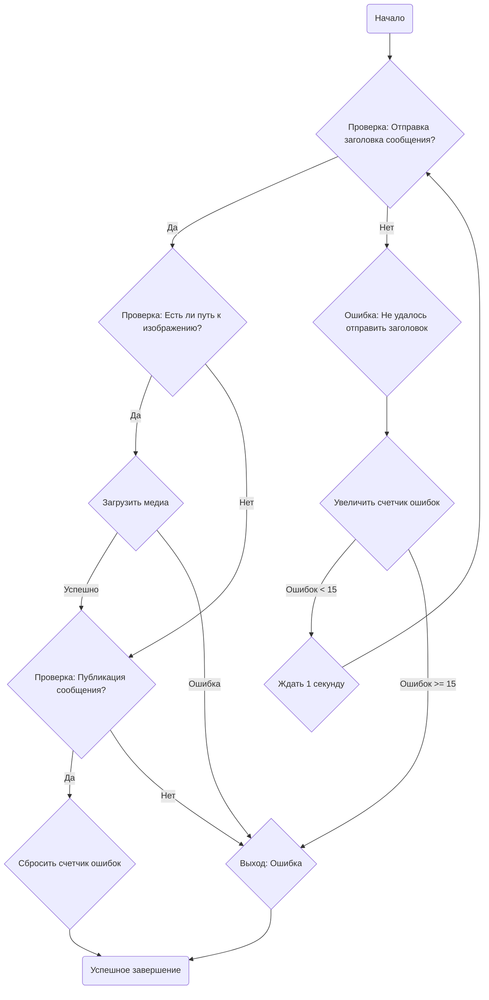

## Анализ кода `post_ad.py`

### 1. <алгоритм>

**Блок-схема работы функции `post_ad`:**



**Примеры:**

1.  **Успешная публикация:**
    *   `message` содержит заголовок (`description`) и путь к изображению (`image_path`).
    *   Заголовок успешно отправляется, изображение загружается, сообщение публикуется.
    *   Функция возвращает `True`.
2.  **Неудача при отправке заголовка:**
    *   `post_message_title` возвращает `False`.
    *   Счетчик `fails` увеличивается, при достижении 15 программа выходит.
    *   Функция может ничего не вернуть (если ошибок < 15), или не явно вернуть `None`, либо завершится без возврата (если >= 15).
3.  **Неудача при загрузке изображения:**
    *   `upload_post_media` возвращает `None`.
    *   Функция завершается.
4.  **Неудача при публикации:**
    *   `message_publish` возвращает `None`.
    *   Функция завершается.

### 2. <mermaid>

```mermaid
flowchart TD
    Start(Начало функции post_ad) --> SendTitle(Отправка заголовка: post_message_title);
    SendTitle -- Успех --> CheckMedia(Проверка наличия медиа);
    SendTitle -- Провал --> ErrorHandling(Обработка ошибки: fails += 1);
    ErrorHandling --> CheckFails(Проверка счетчика ошибок: fails < 15);
    CheckFails -- Да --> Wait1(Ожидание: time.sleep(1));
    CheckFails -- Нет --> ExitError(Выход: Ошибка);
    Wait1 --> SendTitle;
    CheckMedia -- Да --> UploadMedia(Загрузка медиа: upload_post_media);
    CheckMedia -- Нет --> Publish(Публикация: message_publish);
    UploadMedia -- Успех --> Publish;
    UploadMedia -- Провал --> ExitError;
    Publish -- Успех --> ResetFails(Сброс счетчика ошибок: fails = 0);
    Publish -- Провал --> ExitError;
    ResetFails --> End(Успешное завершение: return True);
    ExitError --> End
```

**Анализ зависимостей:**

*   `socket.timeout`: Импортируется для обработки таймаутов при сетевых операциях, хотя в данном коде явно не используется. Возможно, используется в функциях, которые он вызывает.
*   `time`: Импортируется для использования функции `sleep` для приостановки выполнения кода, например, между отправкой заголовка и загрузкой медиа.
*   `pathlib.Path`: Используется для работы с путями к файлам и директориям, в частности, для загрузки локаторов из JSON-файла.
*   `types.SimpleNamespace`: Используется для создания простых объектов с атрибутами, представляющих данные сообщений и настроек.
*   `typing.Dict`, `typing.List`: Используется для аннотации типов. В данном случае, они импортированы, но не используются непосредственно.
*   `urllib.parse.urlencode`: Импортируется, но не используется в этом коде. Возможно, используется в других частях проекта.
*   `selenium.webdriver.remote.webelement.WebElement`: Импортируется для работы с веб-элементами, но явно не используется.
*   `src.gs`: Импортируется как глобальные настройки проекта.
*   `src.webdriver.driver.Driver`: Импортируется класс `Driver`, который используется для взаимодействия с браузером.
*   `src.endpoints.advertisement.facebook.scenarios.post_message_title`: Импортируется функция `post_message_title` для отправки заголовка сообщения.
*   `src.endpoints.advertisement.facebook.scenarios.upload_post_media`: Импортируется функция `upload_post_media` для загрузки медиафайлов.
*   `src.endpoints.advertisement.facebook.scenarios.message_publish`: Импортируется функция `message_publish` для публикации сообщения.
*   `src.utils.jjson.j_loads_ns`, `src.utils.jjson.pprint`: Импортируется `j_loads_ns` для загрузки данных из JSON-файлов в объект SimpleNamespace, `pprint` для отладочного вывода.
*   `src.logger.logger.logger`: Импортируется логгер для записи сообщений об ошибках и событиях.

**mermaid flowchart для `header.py`:**


### 3. <объяснение>

#### Импорты:
*   `socket.timeout`:  Используется для работы с таймаутами сокетов, возможно используется где-то в вызываемых функциях
*   `time`: Используется для добавления задержек между действиями с помощью `time.sleep()`, что полезно для контроля скорости выполнения скрипта и избежания проблем с загрузкой веб-страниц.
*   `pathlib.Path`: Предоставляет объектно-ориентированный способ работы с путями к файлам и директориям. Используется для формирования пути к файлу с локаторами `post_message.json`.
*   `types.SimpleNamespace`: Удобный способ создания объектов для хранения атрибутов, в данном случае для локаторов, и данных сообщений.
*   `typing.Dict`, `typing.List`: Используются для статической типизации данных.
*   `urllib.parse.urlencode`: Предоставляет функциональность для кодирования URL-параметров, в данном коде не используется напрямую, возможно используется в вызываемых функциях.
*   `selenium.webdriver.remote.webelement.WebElement`: Представляет веб-элемент на странице. В данном коде не используется напрямую, возможно используется в вызываемых функциях.
*   `src.gs`: Глобальные настройки проекта, содержащие пути, параметры и другие общие переменные.
*   `src.webdriver.driver.Driver`:  Класс для управления веб-драйвером, обеспечивающий взаимодействие с браузером.
*   `src.endpoints.advertisement.facebook.scenarios.post_message_title`:  Функция для отправки заголовка сообщения.
*   `src.endpoints.advertisement.facebook.scenarios.upload_post_media`: Функция для загрузки медиафайлов к сообщению.
*   `src.endpoints.advertisement.facebook.scenarios.message_publish`: Функция для публикации сообщения.
*   `src.utils.jjson.j_loads_ns`: Функция для загрузки JSON данных в объект `SimpleNamespace`.
*   `src.utils.jjson.pprint`: Функция для вывода отладочной информации.
*   `src.logger.logger`: Модуль для ведения логов, позволяющий записывать информацию о работе программы.

#### Переменные:
*   `locator: SimpleNamespace`: Содержит локаторы веб-элементов, загруженные из JSON-файла.
*   `fails: int`: Счетчик ошибок, используется для ограничения числа попыток публикации в случае сбоя.

#### Функции:
*   **`post_ad(d: Driver, message: SimpleNamespace) -> bool`**:
    *   **Аргументы:**
        *   `d: Driver`: Экземпляр класса `Driver` для взаимодействия с браузером.
        *   `message: SimpleNamespace`: Объект, содержащий информацию о сообщении (описание и путь к изображению).
    *   **Возвращает:**
        *   `bool`: `True` в случае успешной публикации, иначе может вернуть `None`, или завершится.
    *   **Назначение:**
        *   Функция отвечает за публикацию рекламного сообщения.
        *   Сначала отправляет заголовок сообщения, затем загружает медиа (если есть), и публикует сообщение.
        *   Если возникают ошибки, увеличивает счетчик `fails` и возвращается, если количество ошибок не превысило 15.
        *   Использует другие функции (`post_message_title`, `upload_post_media`, `message_publish`) для выполнения отдельных действий.

#### Классы:
*   `Driver` : Класс, представляющий интерфейс для взаимодействия с веб-драйвером, описан в файле `/src/webdriver/driver.py`

#### Взаимосвязи с другими частями проекта:

*   **Глобальные настройки (`src.gs`):** Используются для получения путей к файлам и других параметров.
*   **`src.webdriver.driver.Driver`:** Обеспечивает взаимодействие с браузером для выполнения действий на веб-странице.
*   **`src.endpoints.advertisement.facebook.scenarios.post_message_title`, `upload_post_media`, `message_publish`:** Отвечают за отправку заголовка, загрузку медиа и публикацию сообщения соответственно.
*   **Логгер (`src.logger.logger`):** Используется для записи информации о событиях и ошибках.
*    **`src.utils.jjson`**: Используется для загрузки `json` файлов с настройками.

#### Потенциальные ошибки и области для улучшения:
*   **Жестко заданное число попыток (`fails < 15`):** Возможно, стоит сделать количество попыток настраиваемым параметром.
*   **Нет явной обработки исключений**: В функции `post_ad` не обрабатываются исключения, возникающие при вызове других функций, что может привести к неожиданному завершению программы.
*   **Неполная типизация**: Некоторые переменные не имеют аннотацию типов, что может усложнить понимание кода и его отладку.
*   **Отсутствие обработки ошибок при загрузке локаторов**: В случае если файл `post_message.json` не существует, или содержит некорректный JSON, то программа завершится с ошибкой.
*   **Обработка ошибок на уровне `Driver`**: Возможно, стоит добавить обработку ошибок, возникающих при использовании `Driver`, например, таймауты, ошибки соединения и т.д.
*   **Нет обработки ситуации когда `message` не имеет атрибута `image_path`**: Если атрибут `image_path` не существует, код будет работать, но не будет загружать изображение.
*   **Нет явного возврата значения**: В некоторых случаях (ошибка при отправке заголовка), функция может не возвращать ничего. Необходимо явно возвращать `False` в случае ошибки.
*   **Сброс счетчика `fails` не имеет смысла**: в конце функции, если публикация прошла успешно, нет смысла сбрасывать `fails`, так как это локальная переменная.
*   **Отсутствие комментариев**: Больше комментариев в коде помогли бы лучше понять его работу.
*   **Не используется `urlencode`**: Импортирован модуль `urlencode`, но не используется в этом файле.

Этот анализ предоставляет полное понимание кода, его функциональности, зависимостей и потенциальных проблем.