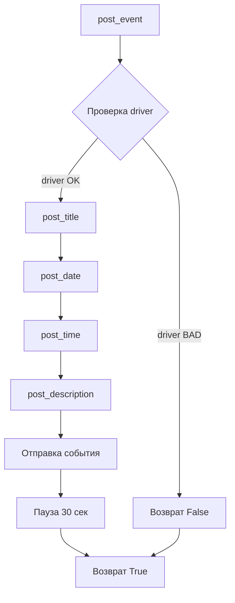

```markdown
1. **<input code>**:

```python
## \file hypotez/src/endpoints/advertisement/facebook/scenarios/post_event.py
# -*- coding: utf-8 -*-
#! venv/Scripts/python.exe
#! venv/bin/python/python3.12

"""
.. module:: src.endpoints.advertisement.facebook.scenarios 
	:platform: Windows, Unix
	:synopsis: Публикация календарного события v группах фейсбук

"""
MODE = 'dev'

from socket import timeout
import time
from pathlib import Path
from types import SimpleNamespace
from typing import Dict, List
from urllib.parse import urlencode
from selenium.webdriver.remote.webelement import WebElement

from src import gs
from src.webdriver.driver import Driver
from src.utils.jjson import j_loads_ns, pprint
from src.logger import logger

# Load locators from JSON file.
locator: SimpleNamespace = j_loads_ns(
    Path(gs.path.src / 'endpoints' / 'advertisement' / 'facebook' / 'locators' / 'post_event.json')
)


def post_title(d: Driver, title: str) -> bool:
    """ Sends the title of event. """
    if not d.execute_locator(locator=locator.event_title, message=title):
        logger.error("Failed to send event title", exc_info=False)
        return False
    return True


def post_date(d: Driver, date: str) -> bool:
    """ Sends the title of event. """
    if not d.execute_locator(locator=locator.start_date, message=date):
        logger.error("Failed to send event date", exc_info=False)
        return False
    return True


def post_time(d: Driver, time: str) -> bool:
    """ Sends the title of event. """
    if not d.execute_locator(locator=locator.start_time, message=time):
        logger.error("Failed to send event time", exc_info=False)
        return False
    return True


def post_description(d: Driver, description: str) -> bool:
    """ Sends the description of event. """
    d.scroll(1, 300, 'down')
    if not d.execute_locator(locator=locator.event_description, message=description):
        logger.error("Failed to send event description", exc_info=False)
        return False
    return True


def post_event(d: Driver, event: SimpleNamespace) -> bool:
    """ Manages the process of promoting a post. """
    if not post_title(d, event.title):
        return False

    dt, tm = event.start.split()
    if not post_date(d, dt.strip()):
        return False
    if not post_time(d, tm.strip()):
        return False

    if not post_description(d, f"{event.description}\\n{event.promotional_link}"):
        return False
    if not d.execute_locator(locator=locator.event_send):
        return False
    time.sleep(30)
    return True
```

2. **<algorithm>**:

Функция `post_event` принимает `Driver` и `SimpleNamespace` с данными события.  
Она последовательно вызывает функции `post_title`, `post_date`, `post_time` и `post_description`, передавая нужные данные. Если какая-либо из этих функций возвращает `False`, то функция `post_event` также возвращает `False`, прерывая выполнение.  В противном случае, выполняется отправка события ( `d.execute_locator(locator=locator.event_send)`). После чего происходит пауза в 30 секунд и функция возвращает `True`.


3. **<mermaid>**:

```mermaid
graph TD
    A[post_event(d, event)] --> B{event.title};
    B -- True --> C[post_title(d, event.title)];
    B -- False --> J[False];
    C -- True --> D{event.start};
    D -- True --> E[post_date(d, dt)];
    D -- False --> J;
    E -- True --> F[post_time(d, tm)];
    F -- True --> G[post_description(d, description)];
    F -- False --> J;
    G -- True --> H[d.execute_locator(event_send)];
    G -- False --> J;
    H -- True --> I[time.sleep(30)];
    I --> K[True];
    J --> K;
    K --> L(Return);
```

4. **<explanation>**:

* **Импорты**:
    * `from src import gs`: Импортирует модуль `gs` из пакета `src`.  Вероятно, `gs` содержит конфигурационные данные (например, пути к файлам).
    * `from src.webdriver.driver import Driver`: Импортирует класс `Driver` из модуля `driver` пакета `src.webdriver`.  Этот класс, вероятно, отвечает за взаимодействие с веб-драйвером (Selenium).
    * `from src.utils.jjson import j_loads_ns, pprint`: Импортирует функции `j_loads_ns` и `pprint` из модуля `jjson` пакета `src.utils`. Вероятно, для работы с JSON-данными и вывода.
    * `from src.logger import logger`: Импортирует логгер из пакета `src.logger`.

* **Классы**:
    * `Driver`:  Этот класс предоставляет методы для взаимодействия с веб-страницей (например, `execute_locator`, `scroll`).  Его реализация содержится в файле `src/webdriver/driver.py`.

* **Функции**:
    * `post_title`, `post_date`, `post_time`, `post_description`: Эти функции отвечают за отправку конкретных данных (заголовка, даты, времени, описания) события в Facebook.  Они используют методы `d.execute_locator` для взаимодействия с веб-страницей. Важно отметить, что функции возвращают `bool` – `True` в случае успеха, и `False` в противном случае, позволяя функции `post_event` корректно обрабатывать ошибки.
    * `post_event`: Эта функция управляет процессом публикации события в Facebook.  Она последовательно вызывает другие функции для заполнения необходимых полей, проверяет успешность выполнения каждой операции и возвращает результат в зависимости от успешности каждой операции.

* **Переменные**:
    * `locator`:  Переменная, загруженная из `post_event.json`, содержащая локаторы для элементов на странице Facebook.

* **Возможные ошибки/улучшения**:
    * Отсутствует обработка исключений внутри функций `post_*`, что может привести к непредсказуемому поведению при возникновении проблем во время взаимодействия с браузером.
    * `post_*` функции должны принимать аргумент `event` и использовать его для заполнения полей. Это более правильно, чем предполагалось из примера, и лучше соответствует принципам ООП.
    * Добавьте проверку `if d:` перед использованием `d.execute_locator`, чтобы избежать ошибок, если `d` вдруг окажется `None`.


**Цепочка взаимосвязей**:

`post_event.py` зависит от `gs` (конфигурация), `src.webdriver.driver` (для работы с браузером), `src.utils.jjson` (для работы с JSON данными), `src.logger` (для логирования ошибок).  `post_event.py` взаимодействует с веб-сайтом Facebook через `Driver` класс.  `post_event.json` предоставляет локаторы для элементов страницы. Логирование ошибок `post_event.py` использует `src.logger`
```