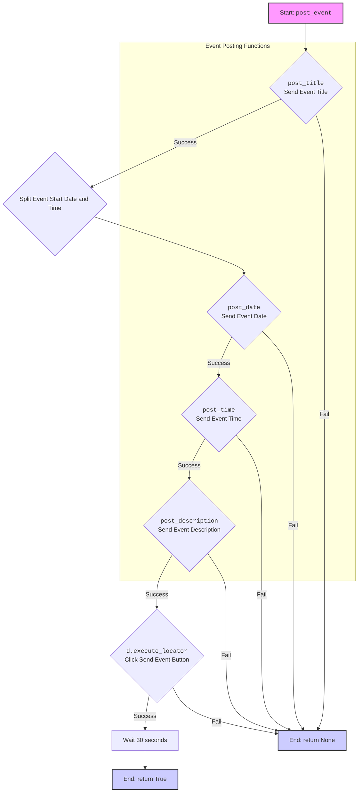

## ИНСТРУКЦИЯ:

Анализируй предоставленный код подробно и объясни его функциональность. Ответ должен включать три раздела:  

1.  **<алгоритм>**: Опиши рабочий процесс в виде пошаговой блок-схемы, включая примеры для каждого логического блока, и проиллюстрируй поток данных между функциями, классами или методами.  
2.  **<mermaid>**: Напиши код для диаграммы в формате `mermaid`, проанализируй и объясни все зависимости, 
    которые импортируются при создании диаграммы. 
    **ВАЖНО!** Убедитесь, что все имена переменных, используемые в диаграмме `mermaid`, 
    имеют осмысленные и описательные имена. Имена переменных вроде `A`, `B`, `C`, и т.д., не допускаются!  
    
    **Дополнительно**: Если в коде есть импорт `import header`, добавьте блок `mermaid` flowchart, объясняющий `header.py`:\
    ```mermaid
    flowchart TD
        Start --> Header[<code>header.py</code><br> Determine Project Root]
    
        Header --> import[Import Global Settings: <br><code>from src import gs</code>] 
    ```

3.  **<объяснение>**: Предоставьте подробные объяснения:  
    - **Импорты**: Их назначение и взаимосвязь с другими пакетами `src.`.  
    - **Классы**: Их роль, атрибуты, методы и взаимодействие с другими компонентами проекта.  
    - **Функции**: Их аргументы, возвращаемые значения, назначение и примеры.  
    - **Переменные**: Их типы и использование.  
    - Выделите потенциальные ошибки или области для улучшения.  

Дополнительно, постройте цепочку взаимосвязей с другими частями проекта (если применимо).  

Это обеспечивает всесторонний и структурированный анализ кода.
## Формат ответа: `.md` (markdown)
**КОНЕЦ ИНСТРУКЦИИ**

### <алгоритм>

**Блок-схема работы `post_event.py`:**

```mermaid
flowchart TD
    A[Начало: `post_event(d, event)`] --> B{`post_title(d, event.title)`};
    B -- Успешно --> C{`event.start.split()`};
    C --> D{`post_date(d, dt)`};
    D -- Успешно --> E{`post_time(d, tm)`};
    E -- Успешно --> F{`post_description(d, f"{event.description}\\n{event.promotional_link}")`};
    F -- Успешно --> G{`d.execute_locator(locator.event_send)`};
    G -- Успешно --> H[Задержка 30 секунд];
    H --> I[Конец: `return True`];
    
    B -- Неуспешно --> J[Конец: `return None`];
    D -- Неуспешно --> J;
    E -- Неуспешно --> J;
    F -- Неуспешно --> J;
    G -- Неуспешно --> J;
    
    subgraph "Функции публикации"
        B
        D
        E
        F
    end
    
    style A fill:#f9f,stroke:#333,stroke-width:2px
    style I fill:#ccf,stroke:#333,stroke-width:2px
    style J fill:#faa,stroke:#333,stroke-width:2px
    
```

**Пример:**

1.  **Начало:** Функция `post_event` вызывается с объектом `Driver` и объектом `SimpleNamespace` `event` (например, `event = SimpleNamespace(title="Заголовок", start="2024-05-07 10:00", description="Описание", promotional_link="https://example.com")`).
2.  **`post_title(d, event.title)`:** Функция пытается ввести заголовок события ("Заголовок") с помощью драйвера. Если успешно, переходим к следующему шагу; если нет, функция завершается с `None`.
3.  **`event.start.split()`:** Строка времени начала события "2024-05-07 10:00" разбивается на дату `dt`("2024-05-07") и время `tm` ("10:00").
4.  **`post_date(d, dt)`:** Функция пытается ввести дату события ("2024-05-07") с помощью драйвера. Если успешно, переходим к следующему шагу; если нет, функция завершается с `None`.
5.  **`post_time(d, tm)`:** Функция пытается ввести время события ("10:00") с помощью драйвера. Если успешно, переходим к следующему шагу; если нет, функция завершается с `None`.
6.  **`post_description(d, f"{event.description}\\n{event.promotional_link}")`:** Функция пытается ввести описание события ("Описание\nhttps://example.com") с помощью драйвера. Если успешно, переходим к следующему шагу; если нет, функция завершается с `None`.
7.  **`d.execute_locator(locator.event_send)`:** Функция пытается кликнуть по кнопке отправки события. Если успешно, переходим к следующему шагу; если нет, функция завершается с `None`.
8.  **Задержка 30 секунд:** Программа делает паузу на 30 секунд.
9.  **Конец:** Функция возвращает `True`.

### <mermaid>



**Анализ зависимостей `mermaid`:**

-   Диаграмма показывает поток управления в функции `post_event`.
-   Функция `post_event` вызывает другие функции для отправки заголовка (`post_title`), даты (`post_date`), времени (`post_time`) и описания (`post_description`) события.
-   После отправки всех данных, происходит клик на кнопку отправки (`d.execute_locator(locator.event_send)`), и после задержки возвращается `True`, если все прошло успешно.
-   Если любая из функций вернет ошибку, то произойдет выход из `post_event` с результатом `None`
-   Используются осмысленные имена переменных, такие как `post_title`, `post_date`, `post_description`, `event_send`, `d` (driver), `event`, которые отражают их назначение.
-   Обозначения успеха/неудачи помогают визуализировать логику выполнения.

### <объяснение>

**Импорты:**

*   `socket.timeout`: Импортируется для обработки таймаутов при работе с сокетами, но не используется в коде.
*   `time`: Импортируется для использования функции `time.sleep()`, которая добавляет задержку в выполнение кода.
*   `pathlib.Path`: Импортируется для работы с путями к файлам и директориям в операционной системе.
*   `types.SimpleNamespace`: Импортируется для создания простых объектов, к которым можно обращаться по атрибутам. Используется для хранения данных о событиях и локаторах.
*   `typing.Dict`, `typing.List`: Импортируется для аннотации типов, что улучшает читаемость и возможность отладки кода.
*   `urllib.parse.urlencode`: Импортируется для кодирования URL-параметров, не используется в предоставленном коде.
*   `selenium.webdriver.remote.webelement.WebElement`: Импортируется для работы с веб-элементами, не используется явно в коде.
*   `src.gs`: Импортируется для доступа к глобальным настройкам проекта, в том числе к путям файлов.
*   `src.webdriver.driver.Driver`: Импортируется для управления веб-драйвером, через который осуществляется взаимодействие с веб-страницей.
*  `src.utils.jjson.j_loads_ns`, `src.utils.jjson.pprint`: Импортируется для загрузки JSON файлов в SimpleNamespace и для красивого вывода в консоль, соответственно
*  `src.logger.logger`: Импортируется для логирования сообщений.

**Переменные:**

*   `MODE`:  Строковая переменная, задающая режим работы приложения (`dev` - разработка).
*   `locator`: Объект `SimpleNamespace`, содержащий локаторы для веб-элементов на странице, загруженные из JSON файла.

**Функции:**

*   `post_title(d: Driver, title: str) -> bool`: Отправляет заголовок события на веб-страницу.
    *   **Аргументы:**
        *   `d`: Объект `Driver` для взаимодействия с веб-страницей.
        *   `title`: Строка с заголовком события.
    *   **Возвращаемое значение:**
        *   `True` в случае успеха.
        *   `None` в случае ошибки.
    *   **Пример:** `post_title(driver, "Заголовок мероприятия")`.
*   `post_date(d: Driver, date: str) -> bool`: Отправляет дату события на веб-страницу.
    *   **Аргументы:**
        *   `d`: Объект `Driver` для взаимодействия с веб-страницей.
        *   `date`: Строка с датой события.
    *   **Возвращаемое значение:**
        *  `True` в случае успеха.
        *   `None` в случае ошибки.
    *   **Пример:** `post_date(driver, "2024-05-07")`.
*   `post_time(d: Driver, time: str) -> bool`: Отправляет время события на веб-страницу.
    *   **Аргументы:**
        *   `d`: Объект `Driver` для взаимодействия с веб-страницей.
        *   `time`: Строка со временем события.
    *   **Возвращаемое значение:**
        *  `True` в случае успеха.
        *   `None` в случае ошибки.
    *   **Пример:** `post_time(driver, "10:00")`.
*   `post_description(d: Driver, description: str) -> bool`: Отправляет описание события на веб-страницу.
    *   **Аргументы:**
        *   `d`: Объект `Driver` для взаимодействия с веб-страницей.
        *   `description`: Строка с описанием события.
    *   **Возвращаемое значение:**
        *   `True` в случае успеха.
        *   `None` в случае ошибки.
    *   **Пример:** `post_description(driver, "Описание мероприятия")`.
*   `post_event(d: Driver, event: SimpleNamespace) -> bool`: Управляет процессом публикации события, вызывая вспомогательные функции для отправки заголовка, даты, времени и описания.
    *   **Аргументы:**
        *   `d`: Объект `Driver` для взаимодействия с веб-страницей.
        *   `event`: Объект `SimpleNamespace` с данными о событии (заголовок, дата, время, описание, рекламная ссылка).
    *   **Возвращаемое значение:**
        *   `True` в случае успеха.
        *   `None` в случае ошибки.
    *   **Пример:**
    ```python
    event = SimpleNamespace(title="Вебинар", start="2024-05-07 14:00", description="Приглашаем на вебинар!", promotional_link="https://example.com/webinar")
    post_event(driver, event)
    ```

**Цепочка взаимосвязей:**

1.  **Загрузка локаторов:** Функция `post_event` загружает локаторы веб-элементов из JSON файла, используя `j_loads_ns` из `src.utils.jjson`.
2.  **Использование `Driver`:** Все функции используют объект `Driver` из `src.webdriver.driver`, который обеспечивает взаимодействие с браузером (нажатие кнопок, ввод текста и т.д.).
3.  **Логирование:** При возникновении ошибок используется `logger` из `src.logger.logger` для записи сообщений об ошибках.
4.  **Глобальные настройки:** `gs` из `src` используется для доступа к глобальным путям и настройкам проекта.

**Потенциальные ошибки и области для улучшения:**

*   **Обработка ошибок:** Функции возвращают `None` в случае ошибки, но не обрабатывают исключения. Целесообразно использовать блоки `try-except` для более надежной обработки ошибок и логирования исключений.
*   **Таймауты:** Не указана явная обработка таймаутов при взаимодействии с веб-элементами, что может привести к проблемам при медленном интернете.
*   **Использование `time.sleep(30)`:**  Задержка в 30 секунд может быть слишком большой или недостаточной в разных ситуациях. Было бы лучше использовать более гибкие методы ожидания, например, `WebDriverWait` из Selenium.
*  **Импорт `timeout`:** Импорт `from socket import timeout` не используется в коде и может быть удален.
*   **Повторный ввод данных**:  В коде присутствует много дублирующего кода, например, во всех функциях отправки данных. Можно это обобщить в одну функцию `send_data(d: Driver, locator: SimpleNamespace, message: str)`, чтобы избежать дублирования.

В целом, код выполняет свою задачу публикации события, но нуждается в более надежной обработке ошибок и улучшении гибкости.