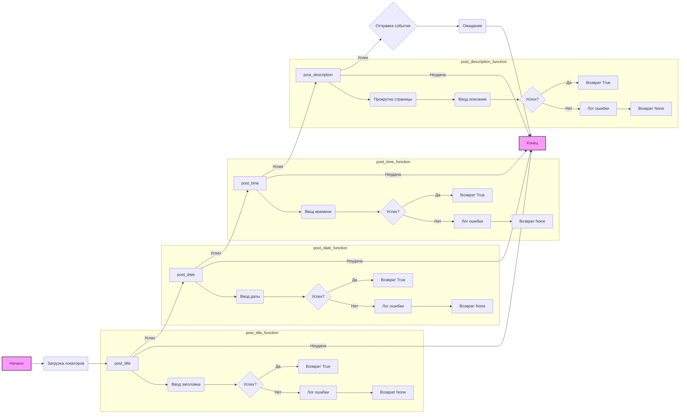

## Анализ кода `hypotez/src/endpoints/advertisement/facebook/scenarios/post_event.py`

### 1. <алгоритм>

**Блок-схема:**

1.  **Начало**:
    *   Инициализация: Загрузка необходимых библиотек и конфигураций.
    *   Загрузка локаторов из JSON (`j_loads_ns`).
2.  **Функция `post_title`**:
    *   Принимает `Driver` и `title` (строку) в качестве аргументов.
    *   Использует метод `execute_locator` драйвера для ввода заголовка события в соответствующее поле.
    *   Если ввод не удался, регистрирует ошибку в лог и возвращает `None`.
    *   В случае успеха возвращает `True`.
    *   **Пример**: `post_title(driver, "Заголовок события")`
3.  **Функция `post_date`**:
    *   Принимает `Driver` и `date` (строку) в качестве аргументов.
    *   Использует метод `execute_locator` драйвера для ввода даты события.
    *   Если ввод не удался, регистрирует ошибку в лог и возвращает `None`.
    *   В случае успеха возвращает `True`.
    *   **Пример**: `post_date(driver, "2024-07-22")`
4.  **Функция `post_time`**:
    *   Принимает `Driver` и `time` (строку) в качестве аргументов.
    *   Использует метод `execute_locator` драйвера для ввода времени события.
    *   Если ввод не удался, регистрирует ошибку в лог и возвращает `None`.
    *   В случае успеха возвращает `True`.
    *   **Пример**: `post_time(driver, "10:00")`
5.  **Функция `post_description`**:
    *   Принимает `Driver` и `description` (строку) в качестве аргументов.
    *   Прокручивает страницу вниз с помощью `d.scroll()`.
    *   Использует метод `execute_locator` драйвера для ввода описания события.
    *   Если ввод не удался, регистрирует ошибку в лог и возвращает `None`.
    *   В случае успеха возвращает `True`.
    *   **Пример**: `post_description(driver, "Описание события и ссылка")`
6.  **Функция `post_event`**:
    *   Принимает `Driver` и `event` (SimpleNamespace) в качестве аргументов.
    *   Вызывает `post_title` для ввода заголовка события, если `None` - возвращает `None`.
    *   Разделяет дату и время из `event.start`.
    *   Вызывает `post_date` для ввода даты события, если `None` - возвращает `None`.
    *   Вызывает `post_time` для ввода времени события, если `None` - возвращает `None`.
    *   Вызывает `post_description` для ввода описания события, если `None` - возвращает `None`.
    *   Выполняет действие с помощью `execute_locator` по локатору отправки события.
    *   Ждет 30 секунд.
    *   Возвращает `True`.
    *   **Пример**: `event = SimpleNamespace(title="Вебинар", start="2024-07-22 10:00", description="Описание вебинара", promotional_link="https://example.com")` `post_event(driver, event)`
7.  **Конец**: Выполнение завершено.

### 2. <mermaid>



**Объяснение зависимостей:**

*   **`Начало`**: Начальная точка выполнения скрипта.
*   **`Загрузка локаторов`**: Загружает JSON-файл с локаторами элементов веб-страницы, необходимыми для взаимодействия с Facebook.
*   **`post_title`**: Функция для ввода заголовка события. Зависит от `Driver` и данных события (`title`). Внутри вызывает методы `execute_locator` драйвера.
*   **`post_date`**: Функция для ввода даты события. Зависит от `Driver` и данных события (`date`). Внутри вызывает методы `execute_locator` драйвера.
*   **`post_time`**: Функция для ввода времени события. Зависит от `Driver` и данных события (`time`). Внутри вызывает методы `execute_locator` драйвера.
*   **`post_description`**: Функция для ввода описания события. Зависит от `Driver` и данных события (`description`).  Внутри вызывает `d.scroll()` и `execute_locator` драйвера.
*    **`Отправка события`**: Функция для отправки события. Зависит от `Driver` и вызывает `execute_locator` драйвера по локатору отправки.
*   **`Ожидание`**: Временная задержка с помощью `time.sleep(30)`.
*   **`Конец`**: Конечная точка выполнения скрипта.

### 3. <объяснение>

#### Импорты:

*   `socket.timeout`: Используется для обработки таймаутов сокетов, хотя в коде не используется напрямую, возможно, есть в  `Driver`.
*   `time`: Используется для задержки выполнения кода (`time.sleep`).
*   `pathlib.Path`: Используется для работы с путями файловой системы.
*   `types.SimpleNamespace`:  Используется для создания простых объектов с атрибутами (похоже на словарь, но с доступом через точку).
*   `typing.Dict, typing.List`: Используются для аннотации типов,  указывают, что ожидается словарь и список.
*   `urllib.parse.urlencode`: Используется для кодирования URL,  в данном коде не используется, возможно используется где-то в `src`.
*   `selenium.webdriver.remote.webelement.WebElement`: Тип данных, который представляет веб-элемент в Selenium.
*   `src.gs`:  Глобальные настройки проекта, доступ к путям.
*   `src.webdriver.driver.Driver`: Класс для управления веб-драйвером Selenium.
*   `src.utils.jjson.j_loads_ns, src.utils.jjson.pprint`:  Функции для работы с JSON, загрузка JSON в SimpleNamespace, красивый вывод.
*   `src.logger.logger`: Модуль для логирования.

**Взаимосвязь с другими пакетами `src`:**

*   `src.gs`: Предоставляет доступ к глобальным переменным, таким как пути к файлам.
*   `src.webdriver.driver.Driver`: Управляет веб-драйвером (например, Chrome, Firefox) для автоматизации действий в браузере.
*   `src.utils.jjson`: Позволяет загружать JSON файлы в `SimpleNamespace` и красиво выводить в терминал.
*   `src.logger.logger`:  Используется для записи сообщений об ошибках и других событиях в лог.

#### Переменные:

*   `MODE`: Глобальная переменная, определяет режим работы (в данном случае `'dev'`).
*   `locator`: SimpleNamespace, содержащий локаторы веб-элементов, загруженных из `post_event.json`. Локаторы используются для поиска элементов на странице.

#### Функции:

*   **`post_title(d: Driver, title: str) -> bool`**:
    *   **Аргументы**:
        *   `d`: Объект класса `Driver`, используется для управления браузером.
        *   `title`: Строка, содержащая заголовок события.
    *   **Возвращает**: `True`, если заголовок отправлен успешно, иначе `None`.
    *   **Назначение**: Вводит заголовок события в соответствующее поле на веб-странице.
    *   **Пример**: `post_title(driver, "Конференция 2024")`
*   **`post_date(d: Driver, date: str) -> bool`**:
    *   **Аргументы**:
        *   `d`: Объект класса `Driver`, используется для управления браузером.
        *   `date`: Строка, содержащая дату события.
    *   **Возвращает**: `True`, если дата отправлена успешно, иначе `None`.
    *   **Назначение**: Вводит дату события в соответствующее поле на веб-странице.
    *   **Пример**: `post_date(driver, "2024-07-25")`
*   **`post_time(d: Driver, time: str) -> bool`**:
    *   **Аргументы**:
        *   `d`: Объект класса `Driver`, используется для управления браузером.
        *   `time`: Строка, содержащая время события.
    *   **Возвращает**: `True`, если время отправлено успешно, иначе `None`.
    *   **Назначение**: Вводит время события в соответствующее поле на веб-странице.
    *   **Пример**: `post_time(driver, "15:30")`
*   **`post_description(d: Driver, description: str) -> bool`**:
    *   **Аргументы**:
        *   `d`: Объект класса `Driver`, используется для управления браузером.
        *   `description`: Строка, содержащая описание события.
    *   **Возвращает**: `True`, если описание отправлено успешно, иначе `None`.
    *   **Назначение**: Вводит описание события в соответствующее поле на веб-странице. Предварительно прокручивает страницу вниз, чтобы обеспечить видимость элемента.
    *   **Пример**: `post_description(driver, "Приходите на нашу конференцию! https://example.com")`
*   **`post_event(d: Driver, event: SimpleNamespace) -> bool`**:
    *   **Аргументы**:
        *   `d`: Объект класса `Driver`, используется для управления браузером.
        *   `event`: `SimpleNamespace` объект, содержащий информацию о событии, включая заголовок, дату, время, описание и ссылку.
    *   **Возвращает**: `True` в случае успешного завершения, в ином случае `None`.
    *   **Назначение**: Координирует публикацию события на веб-странице, вызывая `post_title`, `post_date`, `post_time`, и `post_description`, и после этого нажимает кнопку отправить.
    *   **Пример**:
       ```python
        event = SimpleNamespace(
            title="Вебинар по Python",
            start="2024-07-26 19:00",
            description="Узнайте больше про Python!",
            promotional_link="https://example.com/python"
        )
        post_event(driver, event)
       ```

#### Классы:

*   **`Driver`**:
    *   Предположительно класс, управляющий веб-драйвером Selenium, используемым для взаимодействия с веб-страницей.
    *   Методы, используемые в коде:
        *   `execute_locator(locator, message=None)`:  Ищет элемент на странице по локатору и, если нужно, отправляет в него текст.
        *  `scroll(x,y, direction)`: Прокручивает страницу.

#### Потенциальные ошибки и области для улучшения:

1.  **Обработка ошибок**:
    *   Функции `post_title`, `post_date`, `post_time`, `post_description` и `post_event` возвращают `None` при ошибке и логируют ошибку, это позволяет вызывающей стороне понять, что возникла проблема.
    *    В функции `post_event` отсутствует обработка исключений при split(), что может привести к ошибке в случае неправильного формата даты и времени.
2.  **Улучшение логики**:
     *   Функция `post_event` вызывает `time.sleep(30)` после отправки формы, возможно, это нужно заменить на ожидание появления элемента, это снизит время выполнения скрипта.
3.  **Обновление документации**:
    *   Примеры в docstring могут быть расширены, чтобы более точно отражать сценарии использования, а также  использовать тип `SimpleNamespace` в примерах.
4.  **Константы**:
    *   Переменную `MODE` можно вынести в настройки проекта, либо заменить на параметр функции, если значение меняется в ходе выполнения.

#### Цепочка взаимосвязей:

1.  **Загрузка настроек**: Скрипт начинает с загрузки глобальных настроек и локаторов из JSON файлов (`src.gs`, `src.utils.jjson`).
2.  **Инициализация драйвера**: Для взаимодействия с веб-страницей используется класс `Driver` из `src.webdriver.driver`, который предположительно инициализирует и управляет браузером.
3.  **Публикация события**: Функция `post_event` вызывает другие функции (`post_title`, `post_date`, `post_time`, `post_description`) для заполнения полей формы, используя методы `Driver`.
4.  **Логирование**: В случае ошибок используется логгер из `src.logger.logger` для записи информации об ошибках.

В целом, скрипт отвечает за публикацию календарного события в Facebook, используя Selenium для взаимодействия с веб-страницей.