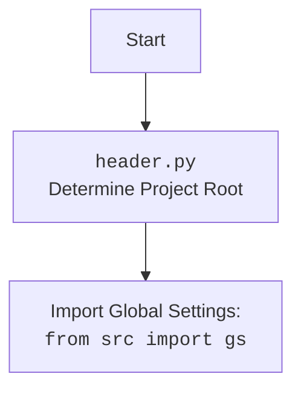

## АНАЛИЗ КОДА: `src/endpoints/advertisement/facebook/scenarios/post_event.py`

### 1. <алгоритм>

**Блок-схема:**

```mermaid
graph LR
    A[Начало: `post_event(d, event)`] --> B{Проверка: `post_title(d, event.title)`};
    B -- Нет --> Z[Конец: `return None`];
    B -- Да --> C{Разделение: `event.start.split()`};
    C --> D{Проверка: `post_date(d, dt.strip())`};
    D -- Нет --> Z;
    D -- Да --> E{Проверка: `post_time(d, tm.strip())`};
    E -- Нет --> Z;
    E -- Да --> F{Формирование: `f"{event.description}\\n{event.promotional_link}"`};
    F --> G{Проверка: `post_description(d, formatted_description)`};
    G -- Нет --> Z;
    G -- Да --> H{Проверка: `d.execute_locator(locator = locator.event_send)`};
    H -- Нет --> Z;
    H -- Да --> I[Ожидание: `time.sleep(30)`];
    I --> J[Конец: `return True`];
```

**Примеры для каждого блока:**

-   **A: `post_event(d, event)`**
    *   Вход: `d` - экземпляр `Driver`, `event` - `SimpleNamespace` с данными о событии.
    *   Выход: `True` если событие опубликовано, иначе `None`.

-   **B: `post_title(d, event.title)`**
    *   Вход: `d` - экземпляр `Driver`, `event.title` - строка (заголовок события).
    *   Пример: `post_title(driver, "Вебинар по программированию")`
    *   Выход: `True` если заголовок введен, иначе `None`.

-   **C: `event.start.split()`**
    *   Вход: `event.start` - строка, содержащая дату и время (например, `"2024-03-15 18:00"`).
    *   Выход: `dt` - `"2024-03-15"`, `tm` - `"18:00"`

-   **D: `post_date(d, dt.strip())`**
    *   Вход: `d` - экземпляр `Driver`, `dt` - строка (дата события, `"2024-03-15"`).
    *   Пример: `post_date(driver, "2024-03-15")`
    *   Выход: `True` если дата введена, иначе `None`.

-  **E: `post_time(d, tm.strip())`**
    *   Вход: `d` - экземпляр `Driver`, `tm` - строка (время события, `"18:00"`).
    *   Пример: `post_time(driver, "18:00")`
    *   Выход: `True` если время введено, иначе `None`.

-   **F: `f"{event.description}\\n{event.promotional_link}"`**
    *   Вход: `event.description` - строка, `event.promotional_link` - строка
    *   Пример: `f"Описание события\\nhttps://example.com"`
    *   Выход: строка с описанием события и ссылкой.

-   **G: `post_description(d, formatted_description)`**
    *   Вход: `d` - экземпляр `Driver`, `formatted_description` - строка
    *   Пример: `post_description(driver, "Описание события\\nhttps://example.com")`
    *   Выход: `True` если описание введено, иначе `None`.

-   **H: `d.execute_locator(locator = locator.event_send)`**
    *   Вход: `d` - экземпляр `Driver`, `locator.event_send` - локатор кнопки отправки
    *   Выход: `True` если кнопка нажата, иначе `None`.

-   **I: `time.sleep(30)`**
    *   Вход: нет
    *   Выход: Пауза 30 секунд

-   **J: `return True`**
    *   Вход: нет
    *   Выход: Возвращает True после успешной публикации.

### 2. <mermaid>

```mermaid
flowchart TD
    Start(post_event) --> CheckTitle{post_title}
    CheckTitle -- Success --> SplitDateTime[Разделить дату и время]
    CheckTitle -- Fail --> EndFail(return None)
    SplitDateTime --> CheckDate{post_date}
    CheckDate -- Success --> CheckTime{post_time}
    CheckDate -- Fail --> EndFail
    CheckTime -- Success --> FormatDescription[Форматировать описание]
    CheckTime -- Fail --> EndFail
    FormatDescription --> CheckDescription{post_description}
    CheckDescription -- Success --> ExecuteLocator[d.execute_locator]
    CheckDescription -- Fail --> EndFail
    ExecuteLocator -- Success --> Wait[time.sleep(30)]
    ExecuteLocator -- Fail --> EndFail
    Wait --> EndSuccess(return True)
    
    classDef red fill:#f9f,stroke:#333,stroke-width:2px
    class EndFail,EndSuccess red
```

**Импортируемые зависимости:**

-   `socket.timeout`: Используется для обработки тайм-аутов сокетов, но в коде не используется.
-   `time`: Используется для паузы в 30 секунд после отправки события.
-   `pathlib.Path`: Используется для работы с путями файловой системы.
-   `types.SimpleNamespace`: Используется для создания объектов с атрибутами, к которым можно обращаться через точку.
-   `typing.Dict`, `typing.List`: Используются для аннотации типов.
-   `urllib.parse.urlencode`: Используется для кодирования URL. В коде не используется.
-   `selenium.webdriver.remote.webelement.WebElement`: Используется для работы с веб-элементами. В коде не используется напрямую, но используется внутри `Driver`.
-   `src.gs`: Содержит глобальные настройки проекта, используется для доступа к путям файлов.
-   `src.webdriver.driver.Driver`: Драйвер для управления браузером, используется для взаимодействия с веб-страницей.
-   `src.utils.jjson.j_loads_ns`, `src.utils.jjson.pprint`: Используется для загрузки JSON данных в виде `SimpleNamespace`.
-   `src.logger.logger.logger`: Используется для логирования ошибок.



### 3. <объяснение>

#### Импорты:

-   `from socket import timeout`: Импортирует класс `timeout` из модуля `socket`. В текущем коде он не используется, но, вероятно, может быть необходим для других целей, связанных с сетевыми операциями.
-   `import time`: Импортирует модуль `time`, который предоставляет функции для работы со временем, включая паузу `time.sleep(30)` для ожидания.
-   `from pathlib import Path`: Импортирует класс `Path` из модуля `pathlib`, используется для представления путей к файлам и каталогам. Помогает сделать код более кроссплатформенным.
-   `from types import SimpleNamespace`: Импортирует `SimpleNamespace`, который позволяет создавать простые объекты с атрибутами, доступными через точку.
-   `from typing import Dict, List`: Импортирует `Dict` и `List` для аннотации типов, что улучшает читаемость и помогает выявлять ошибки на этапе разработки.
-   `from urllib.parse import urlencode`: Импортирует `urlencode` для кодирования URL, в данном коде не используется.
-   `from selenium.webdriver.remote.webelement import WebElement`: Импортирует `WebElement` для взаимодействия с веб-элементами через Selenium, но в коде напрямую не используется.
-   `from src import gs`: Импортирует модуль `gs` из пакета `src`. Модуль содержит глобальные настройки проекта, например, пути к директориям.
-   `from src.webdriver.driver import Driver`: Импортирует класс `Driver` из модуля `src.webdriver.driver`. Этот класс используется для управления браузером и взаимодействия с веб-страницей.
-   `from src.utils.jjson import j_loads_ns`: Импортирует функции `j_loads_ns` для загрузки JSON данных в виде `SimpleNamespace` и `pprint` для печати данных в удобном формате (не используется в коде, но может быть полезна для отладки).
-   `from src.logger.logger import logger`: Импортирует объект `logger` для записи событий и ошибок.

#### Классы:

-   `Driver` (из `src.webdriver.driver`):
    -   **Роль:** Класс для управления браузером и взаимодействия с веб-страницами. Предоставляет методы для навигации, поиска элементов, ввода данных и т.д.
    -   **Атрибуты:**  Зависит от реализации класса `Driver`.
    -   **Методы:** `execute_locator`, `scroll` и другие методы, предоставляемые Selenium.
    -   **Взаимодействие:** Используется во всех функциях для выполнения действий на веб-странице.

#### Функции:

-   `post_title(d: Driver, title: str) -> bool`:
    -   **Аргументы:**
        -   `d` (`Driver`): Экземпляр драйвера для управления браузером.
        -   `title` (`str`): Заголовок события для ввода.
    -   **Возвращаемое значение:**
        -   `True`, если ввод заголовка успешен.
        -   `None`, если ввод заголовка не удался.
    -   **Назначение:** Вводит заголовок события на веб-странице.
    -   **Пример:** `post_title(driver, "Новый вебинар")`
-   `post_date(d: Driver, date: str) -> bool`:
    -   **Аргументы:**
        -   `d` (`Driver`): Экземпляр драйвера для управления браузером.
        -   `date` (`str`): Дата события для ввода.
    -   **Возвращаемое значение:**
        -   `True`, если ввод даты успешен.
        -   `None`, если ввод даты не удался.
    -   **Назначение:** Вводит дату события на веб-странице.
    -    **Пример:** `post_date(driver, "2024-08-03")`
-   `post_time(d: Driver, time: str) -> bool`:
    -   **Аргументы:**
        -   `d` (`Driver`): Экземпляр драйвера для управления браузером.
        -   `time` (`str`): Время события для ввода.
    -   **Возвращаемое значение:**
        -   `True`, если ввод времени успешен.
        -   `None`, если ввод времени не удался.
    -   **Назначение:** Вводит время события на веб-странице.
    -   **Пример:** `post_time(driver, "19:00")`
-   `post_description(d: Driver, description: str) -> bool`:
    -   **Аргументы:**
        -   `d` (`Driver`): Экземпляр драйвера для управления браузером.
        -   `description` (`str`): Описание события для ввода.
    -   **Возвращаемое значение:**
        -   `True`, если ввод описания успешен.
        -   `None`, если ввод описания не удался.
    -   **Назначение:** Вводит описание события на веб-странице.
    -   **Пример:** `post_description(driver, "Описание мероприятия")`
-   `post_event(d: Driver, event: SimpleNamespace) -> bool`:
    -   **Аргументы:**
        -   `d` (`Driver`): Экземпляр драйвера для управления браузером.
        -   `event` (`SimpleNamespace`): Объект, содержащий данные о событии (заголовок, описание, дата, время, ссылку).
    -   **Возвращаемое значение:**
        -   `True`, если публикация события прошла успешно.
        -   `None`, если возникли ошибки при публикации.
    -   **Назначение:** Управляет процессом публикации события, вызывая вспомогательные функции для ввода заголовка, даты, времени и описания, а также отправляет форму.
    -   **Пример:**
        ```python
        event_data = SimpleNamespace(
            title="Вебинар",
            start="2024-08-03 19:00",
            description="Описание вебинара",
            promotional_link="https://example.com"
        )
        post_event(driver, event_data)
        ```

#### Переменные:

-   `locator` (`SimpleNamespace`): Содержит локаторы элементов веб-страницы, загруженные из JSON файла.
-   `d` (`Driver`): Экземпляр драйвера браузера, используемый для взаимодействия с веб-страницей.
-   `title`, `date`, `time`, `description` (`str`): Строки, содержащие соответствующие данные для ввода.
-   `event` (`SimpleNamespace`): Объект, содержащий данные о событии.
-    `dt`, `tm` (`str`): Дата и время, полученные путем разделения строки `event.start`.

#### Потенциальные ошибки и области для улучшения:

1.  **Обработка ошибок:**
    -   Функции `post_title`, `post_date`, `post_time`, `post_description` и `post_event` возвращают `None` в случае неудачи, а не выбрасывают исключение. Это может затруднить отладку. Можно рассмотреть возможность выбрасывания исключений или более детального логирования ошибок.
2.  **Таймауты:**
    -  `time.sleep(30)` является статичной паузой, что может привести к лишним задержкам. Лучше использовать динамические ожидания с помощью `WebDriverWait`.
3.  **Универсальность:**
    -   Код сильно зависит от конкретной структуры веб-страницы Facebook. Изменения на сайте Facebook могут привести к поломке скрипта. Необходимо сделать локаторы более универсальными или использовать динамические методы их поиска.
4.  **Повторение кода:**
    -   Функции `post_title`, `post_date`, `post_time` и `post_description` имеют очень похожую структуру. Можно выделить общий функционал в отдельную функцию, чтобы избежать дублирования кода.
5.  **Отсутствие комментариев:**
     -  В коде отсутствуют комментарии, объясняющие логику кода и назначение переменных, функций и классов, что может затруднить понимание и поддержку.

#### Взаимосвязь с другими частями проекта:

-   **`src.gs`**: Используется для получения пути к файлу с локаторами.
-   **`src.webdriver.driver.Driver`**: Используется для управления браузером и взаимодействия с веб-страницей.
-   **`src.utils.jjson`**: Используется для загрузки локаторов из JSON файла.
-   **`src.logger.logger`**: Используется для логирования ошибок.
-   Код является частью модуля `src.endpoints.advertisement.facebook.scenarios` и предназначен для автоматизации процесса публикации событий в группах Facebook.

**Дополнительные замечания:**

-   Код предназначен для автоматизации действий в браузере с использованием Selenium.
-   Локаторы элементов веб-страницы хранятся в отдельном JSON файле, что упрощает их изменение при необходимости.
-   Функции возвращают `True` в случае успеха и ничего (`None`) в случае неудачи, что может потребовать дополнительной обработки.
-   В коде есть жестко заданная пауза `time.sleep(30)`, которую следует заменить на более гибкую систему ожиданий.