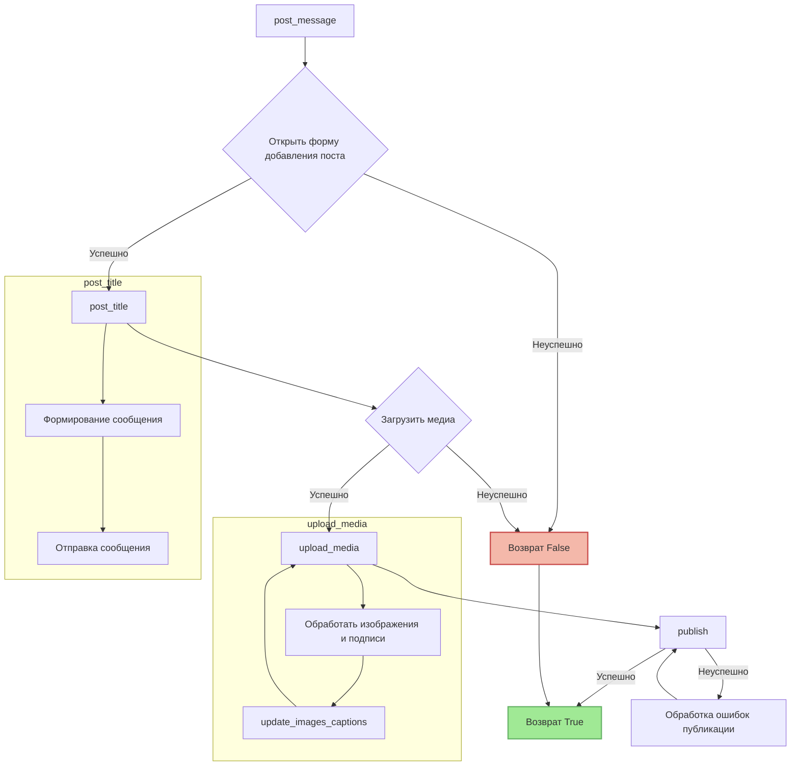

# <input code>

```python
## \file hypotez/src/endpoints/advertisement/facebook/scenarios/post_message.py
# -*- coding: utf-8 -*-\
#! venv/Scripts/python.exe
#! venv/bin/python/python3.12

"""
.. module:: src.endpoints.advertisement.facebook.scenarios 
	:platform: Windows, Unix
	:synopsis: Публикация сообщения

"""
MODE = 'dev'


import time
from pathlib import Path
from types import SimpleNamespace
from typing import Dict, List, Optional
from selenium.webdriver.remote.webelement import WebElement
from src import gs
from src.webdriver.driver import Driver
from src.utils.jjson import j_loads_ns
from src.utils.printer import pprint
from src.logger import logger

# Load locators from JSON file.
locator: SimpleNamespace = j_loads_ns(
    Path(gs.path.src / 'endpoints' / 'advertisement' / 'facebook' / 'locators' / 'post_message.json')
)


def post_title(d: Driver, message: SimpleNamespace | str) -> bool:
    """ Sends the title and description of a campaign to the post message box.

    Args:
        d (Driver): The driver instance used for interacting with the webpage.
        category (SimpleNamespace): The category containing the title and description to be sent.

    Returns:
        bool: `True` if the title and description were sent successfully, otherwise `None`.

    Examples:
        >>> driver = Driver(...)
        >>> category = SimpleNamespace(title="Campaign Title", description="Campaign Description")
        >>> post_title(driver, category)
        True
    """
    # ... (Implementation details)
    return True


def upload_media(d: Driver, media: SimpleNamespace | List[SimpleNamespace] | str | list[str], no_video: bool = False, without_captions:bool = False) -> bool:
    """ Uploads media files to the images section and updates captions.

    Args:
        d (Driver): The driver instance used for interacting with the webpage.
        media (SimpleNamespace | List[SimpleNamespace] | str | list[str]): Media to upload.

    Returns:
        bool: `True` if media files were uploaded successfully, otherwise `None`.
    """
    # ... (Implementation details)
    return True


def update_images_captions(d: Driver, media: List[SimpleNamespace], textarea_list: List[WebElement]) -> None:
    """ Adds descriptions to uploaded media files. """
    # ... (Implementation details)


def publish(d:Driver, attempts = 5) -> bool:
    """ Publishes the post. """
    # ... (Implementation details)
    return True


def promote_post(d: Driver, category: SimpleNamespace, products: List[SimpleNamespace], no_video: bool = False) -> bool:
    """ Manages the process of promoting a post. """
    # ... (Implementation details)
    return True


def post_message(d: Driver, message: SimpleNamespace, no_video: bool = False, images:Optional[str | list[str]] = None, without_captions:bool = False) -> bool:
    """ Manages the process of posting a message. """
    # ... (Implementation details)
    return True
```

# <algorithm>

**Функция post_message:**

1. Вызывает `post_title` для ввода заголовка и описания.
2. Вызывает `upload_media` для загрузки медиа.
3. Проверяет наличие кнопки "Отправить" и возвращает `True` если она есть.
4. Вызывает `publish` для публикации.
5. Возвращает `True` если публикация прошла успешно.

**Функция post_title:**

1. Проверяет успешность скролла страницы.
2. Вызывает `execute_locator` для открытия окна добавления поста.
3. Формирует сообщение, комбинируя `title` и `description`.
4. Вызывает `execute_locator` для добавления сообщения.
5. Возвращает `True` при успешном добавлении.

**Функция upload_media:**

1. Проверяет наличие медиа данных.
2. Вызывает `execute_locator` для открытия формы добавления медиа.
3. Преобразует `media` в список, если это не список.
4. Итерируется по `media`:
   - Получает путь к медиа файлу из `SimpleNamespace`.
   - Вызывает `execute_locator` для загрузки медиа.
   - Обрабатывает ошибки при загрузке.
5. Если `without_captions` - возвращает `True`.
6. Вызывает `execute_locator` для открытия формы редактирования медиа.
7. Выбирает `uploaded_media_frame`.
8. Вызывает `execute_locator` для получения областей для подписей.
9. Вызывает `update_images_captions` для добавления подписей.
10. Возвращает `True`.

**Функция update_images_captions:**

1. Загружает локальные переводы.
2. Определяет направление текста (`LTR` или `RTL`).
3. Итерируется по `media`:
   - Формирует сообщение из данных продукта, используя переводы.
   - Отправляет сообщение в соответствующее поле.
4. Возвращает `None`.

**Функция publish:**

1. Проверяет количество попыток.
2. Вызывает `execute_locator` для завершения редактирования.
3. Вызывает `execute_locator` для публикации.
4. При неудаче публикации:
   - Повторяет публикацию, уменьшая количество попыток.
   - Обрабатывает возможные всплывающие окна.
5. Возвращает `True` если публикация успешна или количество попыток исчерпано.


**Данные передаются между функциями:**

- `Driver` объект передается по ссылке между всеми функциями для взаимодействия с веб-драйвером.
- `SimpleNamespace` и списки `SimpleNamespace` передаются в качестве аргументов, содержащих данные для обработки.
- Функции возвращают логические значения (True/False), которые используются для принятия решений в других функциях (например, в `post_message`).


# <mermaid>



**Объяснение диаграммы:**

*   `post_message` - главный метод, который вызывает `post_title` и `upload_media`.
*   `post_title` - отправляет заголовок и описание.
*   `upload_media` - загружает медиа и обрабатывает подписи.
*   `update_images_captions` - обрабатывает подписи к изображениям.
*   `publish` - публикует пост.
*   Стрелки показывают последовательность вызовов и возможные пути (успех/неуспех).
*   Цветные блоки обозначают разветвления по результатам выполнения.


# <explanation>

**Импорты:**

- `from src import gs`: Импортирует модуль `gs`, скорее всего, содержащий конфигурационные настройки (например, пути к файлам).
- `from src.webdriver.driver import Driver`: Импортирует класс `Driver`, отвечающий за взаимодействие с веб-драйвером.
- `from src.utils.jjson import j_loads_ns`: Импортирует функцию `j_loads_ns` для загрузки локаторов из JSON.
- `from src.utils.printer import pprint`: Импортирует функцию `pprint` для красивой печати.
- `from src.logger import logger`: Импортирует логгер для записи сообщений об ошибках.
- Остальные импорты стандартные (`time`, `pathlib`, `types`, `typing`, `selenium.webdriver.remote.webelement`)


**Классы:**

- `Driver`: Это класс, который, вероятно, предоставляет методы для управления веб-драйвером. Очевидно, в нем есть методы `scroll`, `execute_locator`, `wait` и другие.

**Функции:**

- `post_title`: Отправляет заголовок и описание поста. Принимает экземпляр класса `Driver` и данные поста. Возвращает `True` при успехе, иначе `None`.
- `upload_media`: Загружает медиа файлы. Принимает экземпляр класса `Driver`, список медиа файлов. Возвращает `True` при успехе, иначе `None`. Важно отметить перегрузку аргументов для обработки разных типов медиа.
- `update_images_captions`: Добавляет подписи к загруженным медиа файлам.
- `publish`: Публикует пост. Принимает экземпляр класса `Driver` и число попыток. Возвращает `True` или `None`. Использование рекурсии для обработки возможных ошибок публикации.
- `promote_post`: Объединяет `post_title`, `upload_media` и `publish` для публикации поста.
- `post_message`: Главная функция для публикации поста.


**Переменные:**

- `MODE`: Строковая переменная, вероятно, определяющая режим работы (например, `dev` или `prod`).
- `locator`: Объект `SimpleNamespace`, содержащий локаторы, загруженные из JSON файла.


**Возможные ошибки и улучшения:**

- **Обработка исключений:** Код содержит некоторые `try...except` блоки, но они могут быть расширены для более надежной обработки ошибок. Например, в `upload_media` необходимо указать обработку исключений для каждой операции загрузки.
- **Улучшение обработки ошибок:** Функции, такие как `publish`, должны иметь более ясную логику обработки ошибок, и должно быть улучшено уведомление о возникновении проблем.
- **Дополнения:** Необходимо добавить валидации аргументов, чтобы гарантировать корректность входных данных для предотвращения неожиданного поведения.
- **Константы:** Рекомендуется использовать константы для значений таймаутов и других часто используемых величин.
- **Повторяющийся код:** В функции `publish` повторяется код для обработки ошибок публикации. Можно выделить отдельную функцию для обработки ошибок.
- **Улучшенная логика в publish:** Возможна более оптимальная логика в `publish` для обработки сообщений об ошибках, например, `if attempts > 0:`.


**Взаимосвязи с другими частями проекта:**

- `gs`: вероятно содержит конфигурацию.
- `src.webdriver.driver`: содержит класс для работы с веб-драйвером.
- `src.utils.jjson`: содержит методы для парсинга JSON.
- `src.logger`: для записи логов.
- `src.endpoints.advertisement.facebook.locators`:  конфигурация локаторов.
- `src.advertisement.facebook.scenarios.translations`: переводы для описаний.


Этот код, вероятно, часть системы автоматизированного маркетинга, которая публикует рекламные объявления на Facebook.