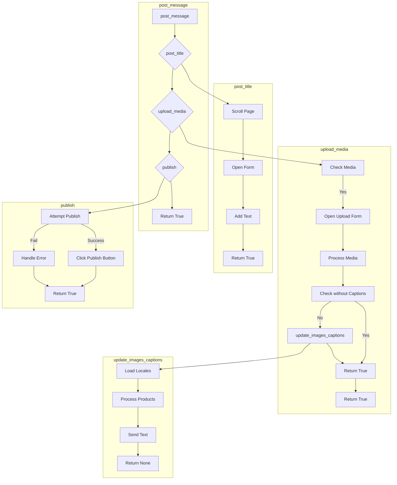

# <input code>

```python
## \file hypotez/src/endpoints/advertisement/facebook/scenarios/post_message.py
# -*- coding: utf-8 -*-\
#! venv/Scripts/python.exe
#! venv/bin/python/python3.12

"""
.. module: src.endpoints.advertisement.facebook.scenarios 
	:platform: Windows, Unix
	:synopsis: Публикация сообщения

"""
MODE = 'dev'


import time
from pathlib import Path
from types import SimpleNamespace
from typing import Dict, List, Optional
from selenium.webdriver.remote.webelement import WebElement
from src import gs
from src.webdriver.driver import Driver
from src.utils.jjson import j_loads_ns
from src.utils.printer import pprint
from src.logger import logger

# Load locators from JSON file.
locator: SimpleNamespace = j_loads_ns(
    Path(gs.path.src / 'endpoints' / 'advertisement' / 'facebook' / 'locators' / 'post_message.json')
)


def post_title(d: Driver, message: SimpleNamespace | str) -> bool:
    """ Sends the title and description of a campaign to the post message box.

    Args:
        d (Driver): The driver instance used for interacting with the webpage.
        category (SimpleNamespace): The category containing the title and description to be sent.

    Returns:
        bool: `True` if the title and description were sent successfully, otherwise `None`.

    Examples:
        >>> driver = Driver(...)
        >>> category = SimpleNamespace(title="Campaign Title", description="Campaign Description")
        >>> post_title(driver, category)
        True
    """
    # ... (implementation details)
    return True


def upload_media(d: Driver, media: SimpleNamespace | List[SimpleNamespace] | str | list[str], no_video: bool = False, without_captions:bool = False) -> bool:
    """ Uploads media files to the images section and updates captions.

    # ... (implementation details)
    return ret


def update_images_captions(d: Driver, media: List[SimpleNamespace], textarea_list: List[WebElement]) -> None:
    """ Adds descriptions to uploaded media files.

    # ... (implementation details)


def publish(d: Driver, attempts=5) -> bool:
    """ Publishes the post.
    # ... (implementation details)
    return True


def promote_post(d: Driver, category: SimpleNamespace, products: List[SimpleNamespace], no_video: bool = False) -> bool:
    """ Manages the process of promoting a post.

    # ... (implementation details)
    return True


def post_message(d: Driver, message: SimpleNamespace, no_video: bool = False, images:Optional[str | list[str]] = None, without_captions:bool = False) -> bool:
    """ Manages the process of posting a message.
    # ... (implementation details)
    return True
```

# <algorithm>

**Функция `post_message`:**

1. **Отправляет заголовок и описание:** Вызывает `post_title` для добавления текста в форму сообщения.
2. **Загружает медиа:** Вызывает `upload_media` для загрузки медиафайлов.
3. **Проверяет кнопку "Готово":** Проверяет наличие кнопки "Готово" и, если она есть, нажимает на нее.
4. **Публикует сообщение:** Вызывает `publish` для публикации сообщения.
5. **Возвращает результат:** Возвращает `True`, если публикация прошла успешно.


**Функция `post_title`:**

1. **Прокрутка страницы:** Прокручивает страницу вверх.
2. **Открытие формы:** Открывает форму создания сообщения.
3. **Добавление текста:** Формирует текст сообщения из переданных данных и добавляет его в поле сообщения.
4. **Возвращает результат:** Возвращает `True`.

**Функция `upload_media`:**

1. **Проверка наличия медиа:** Проверяет, есть ли медиафайлы для загрузки.
2. **Открытие формы загрузки:** Открывает форму загрузки медиа.
3. **Обработка медиа:** Цикл перебора медиафайлов, загрузка каждого файла.
4. **Обработка подписей:** Если параметр `without_captions` не установлен, вызывает функцию `update_images_captions` для добавления описаний к загруженным медиа.
5. **Возвращает результат:** Возвращает `True`.

**Функция `update_images_captions`:**

1. **Загрузка данных о локализации:** Загружает данные для локализации.
2. **Обработка каждого продукта:** Цикл перебора элементов медиафайлов, добавление описаний, учитывая язык.
3. **Ввод текста в текстовое поле:** Ввод текста в текстовое поле.
4. **Возвращает результат:**  Возвращает `None`.


**Функция `publish`:**

1. **Попытки публикации:** Повторяет попытки публикации, обрабатывая возможные ошибки.
2. **Нажатие кнопки публикации:** Нажимает на кнопку публикации.
3. **Обработка ошибок:** Обрабатывает ошибки, связанные с публикацией.
4. **Возвращает результат:** Возвращает `True`, если публикацию выполнено.


**Пример передачи данных:**

`post_message` -> `post_title` (передает `message`) -> `d.execute_locator` (передает локатор)
`post_message` -> `upload_media` (передает `message.products`) -> `d.execute_locator` (передает локатор)
`upload_media` -> `update_images_captions` (передает `media`, `textarea_list`) ->  `textarea_list[i].send_keys` (передает текст)


# <mermaid>



# <explanation>

**Импорты:**

- `time`: Для работы с временем.
- `pathlib`: Для работы с путями к файлам.
- `types`: Для использования `SimpleNamespace`.
- `typing`: Для типов данных.
- `selenium.webdriver.remote.webelement`: Для работы с элементами веб-страницы.
- `src.gs`: Содержит глобальные переменные.
- `src.webdriver.driver`: Класс для управления веб-драйвером.
- `src.utils.jjson`: Для загрузки данных из JSON.
- `src.utils.printer`: Для вывода данных.
- `src.logger`: Для логирования.


**Классы:**

- `Driver`:  Представляет класс для взаимодействия с веб-драйвером. Этот класс, скорее всего, определен в файле `src/webdriver/driver.py` и предоставляет методы для работы с браузером (например, `execute_locator`, `scroll`, `wait`).


**Функции:**

- `post_title`: Отправляет заголовок и описание в поле сообщения.
- `upload_media`: Загружает медиафайлы и обновляет подписи.
- `update_images_captions`: Добавляет подписи к загруженным медиафайлам.
- `publish`: Публикует пост, обрабатывая ошибки.
- `promote_post`: Управляет процессом продвижения поста.
- `post_message`: Основная функция для публикации поста, объединяющая все предыдущие.


**Переменные:**

- `locator`:  `SimpleNamespace`, содержащий локэйторы для элементов на странице. Загружен из `post_message.json`.
- `message`: `SimpleNamespace` или строка, содержащая данные для сообщения.
- `media`: `SimpleNamespace`, `List[SimpleNamespace]`, строка или список строк, представляющие загружаемые медиа.
- `no_video`: Флаг для отключения загрузки видео.
- `without_captions`: Флаг для пропущения обновления подписей.
- `attempts`: Количество попыток публикации.


**Возможные ошибки и улучшения:**

- **Обработка ошибок:** Функции `upload_media` и `update_images_captions` должны быть более устойчивыми к ошибкам, например, при отсутствии медиафайлов или сбоях при загрузке.  Обработка исключений (`try...except`) недостаточно подробная, и нет ясности в каких ситуациях она нужна.
- **Логирование:**  Логирование должно быть более подробным (например, детали ошибок, успешные действия).
- **Улучшение кода:**  В `post_title`, `upload_media`,  и `update_images_captions` нужно улучшить структуру и сделать её более удобной для чтения.  Используйте именованные кортежи (namedtuples) или типы данных из `typing` для явного описания данных.
- **Временные ожидания:** Нужно иметь более надежные механизмы ожидания, чтобы избежать ошибок из-за того, что элементы еще не загрузились. `d.wait()` не очень хорошо с точки зрения обработки таймаутов. Нужно использовать `WebDriverWait` из Selenium.
- **Переменная `ret` в `upload_media`:** Не очень понятна необходимость возвращать `ret` в `upload_media`.
- **Логирование в функциях `post_title` и `publish`:**  В этих функциях нет логов о успешном выполнении или возникших проблемах.
- **`Optional` типы:** Использование `Optional` для `images` и улучшение типов данных в аргументах функций.
- **`media` как список:**  Измененный тип данных `media` может сработать в одном случае, но будет создавать проблемы в другом.  Лучше использовать `List[SimpleNamespace]` для однозначного ожидания списка.
- **Более подробные комментарии:** Код мог бы быть более ясным и понятным с более подробными комментариями о назначении переменных и ветвей кода.
- **Обработка ошибок в `update_images_captions`:** Функция `handle_product` должна более аккуратно обрабатывать исключения. Необходимо убрать `...` в блоках except и правильно обрабатывать ошибки.
- **Рекурсивный вызов publish():** Необходимо продумать, как обрабатывать рекурсивные вызовы в publish(), особенно если функция вызывается из функции, которая не предоставляет гарантии возврата.

**Цепочка взаимосвязей:**

Этот код взаимодействует с `src.gs` (глобальные настройки), `src.webdriver.driver` (работа с драйвером), `src.utils.jjson` (парсинг JSON), `src.logger` (логирование), и, вероятно, с другими модулями в `src.utils` и `src.endpoints`, которые обрабатывают локализацию, веб-драйвер, и т.д.  Локаторы загружаются из `post_message.json`, хранящегося в `src/endpoints/advertisement/facebook/locators`.

```
src.gs -> post_message.py -> src.webdriver.driver -> src.utils.jjson -> src.logger
                                          ↓
                                        post_message.json
```
```