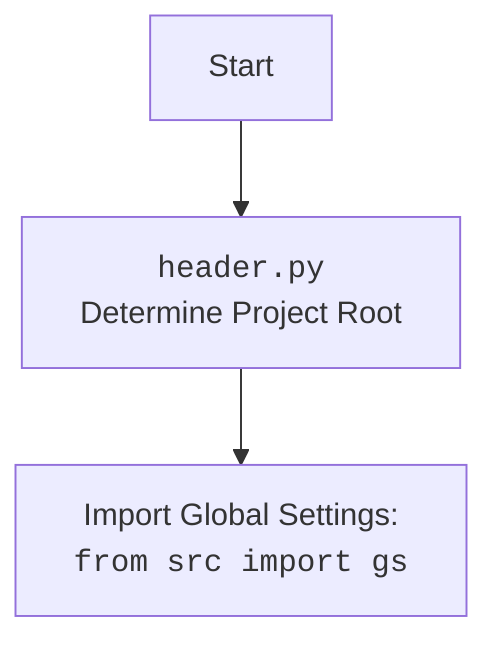

## АНАЛИЗ КОДА `post_message.py`

### <алгоритм>

**1. `post_title(d: Driver, message: SimpleNamespace | str) -> bool`**:
   - **Начало:** Функция принимает драйвер `d` и сообщение `message` (либо `SimpleNamespace`, либо строка).
   - **Прокрутка:** Прокручивает страницу назад (`d.scroll`) на 1200 пикселей.
   - **Открытие поля ввода:** Открывает поле ввода сообщения, используя локатор `locator.open_add_post_box`.
   - **Формирование сообщения:** Формирует строку сообщения `m`, объединяя `title` и `description` из `message`, если `message` - `SimpleNamespace`, иначе использует `message` как есть.
   - **Ввод сообщения:** Вводит сообщение `m` в поле ввода, используя локатор `locator.add_message`.
   - **Возврат:** Возвращает `True` при успешном выполнении, в противном случае возвращает `None`.

**Пример:**

```python
driver = Driver(...)
message_data = SimpleNamespace(title="Заголовок", description="Описание")
post_title(driver, message_data) # Вернёт True если всё успешно
post_title(driver, "Простое сообщение") # Вернёт True если всё успешно
```

**2. `upload_media(d: Driver, media: SimpleNamespace | List[SimpleNamespace] | str | list[str], no_video: bool = False, without_captions:bool = False) -> bool`**:
   - **Начало:** Функция принимает драйвер `d` и данные о медиа `media` (может быть `SimpleNamespace`, список `SimpleNamespace`, строка или список строк), а также флаги `no_video` и `without_captions`.
   - **Проверка медиа:** Проверяет, есть ли медиа, если нет - выход.
   - **Открытие формы:** Открывает форму добавления медиа, используя локатор `locator.open_add_foto_video_form`.
   - **Нормализация списка:** Преобразует `media` в список `media_list`.
   - **Цикл загрузки:** Цикл по `media_list` для загрузки каждого медиафайла.
       - **Определение пути:** Определяет путь к медиафайлу `media_path` из `SimpleNamespace`(`local_video_path` если `no_video=False`, иначе `local_image_path`) или непосредственно из строки или `Path`.
       - **Загрузка:** Загружает медиа, используя локатор `locator.foto_video_input`.
       - **Задержка:** Делает паузу (1.5 сек) после загрузки.
   - **Проверка подписей:** Если `without_captions = True`, функция завершается успешно.
   - **Редактирование:** Кликает по кнопке редактирования загруженных медиа, используя локатор `locator.edit_uloaded_media_button`.
   - **Поиск фрейма:** Ищет фрейм, содержащий загруженные медиа, используя локатор `locator.uploaded_media_frame`.
   - **Поиск текстовых полей:** Ищет текстовые поля для добавления подписей, используя локатор `locator.edit_image_properties_textarea`.
   - **Обновление подписей:** Вызывает функцию `update_images_captions` для добавления подписей.
   - **Возврат:** Возвращает `True` при успешном выполнении, в противном случае возвращает `None`.

**Пример:**
```python
driver = Driver(...)
media_files = [
    SimpleNamespace(local_image_path="path/to/image1.jpg", ...),
    SimpleNamespace(local_image_path="path/to/image2.png", ...)
]
upload_media(driver, media_files) # Вернёт True если всё успешно

media_video = SimpleNamespace(local_video_path="path/to/video.mp4", ...)
upload_media(driver, media_video, no_video=False)  # Вернёт True если всё успешно
upload_media(driver, "path/to/image.jpg",  without_captions=True) # Вернёт True если всё успешно
```

**3. `update_images_captions(d: Driver, media: List[SimpleNamespace], textarea_list: List[WebElement]) -> None`**:
   - **Начало:** Принимает драйвер `d`, список медиа `media` и список текстовых полей `textarea_list`.
    - **Загрузка локализации:** Загружает локализацию из `translations.json`.
   - **Цикл обработки продуктов:** Итерируется по списку `media` и для каждого элемента вызывает `handle_product`.

**4. `handle_product(product: SimpleNamespace, textarea_list: List[WebElement], i: int) -> None`**:
   - **Начало:** Принимает продукт `product`, список текстовых полей `textarea_list` и индекс `i`.
   - **Определение языка:** Определяет язык из `product.language` и направление текста (LTR или RTL) из загруженных локализаций.
   - **Формирование сообщения:** Создаёт сообщение `message` на основе атрибутов `product` (название, описание, цена, скидка и т.д.) с учётом направления текста.
   - **Отправка сообщения:** Отправляет сформированное сообщение в соответствующее текстовое поле `textarea_list[i]`.

**5. `publish(d:Driver, attempts = 5) -> bool`**:
    - **Начало:** Принимает драйвер `d` и количество попыток `attempts`.
    - **Проверка попыток:** Если `attempts` < 0, то выход.
    - **Нажатие "Завершить редактирование":** Выполняет клик по `locator.finish_editing_button`.
    - **Нажатие "Опубликовать":** Выполняет клик по `locator.publish`.
    - **Обработка попапов:** Если `publish` не удался, то обрабатываются попапы `locator.close_pop_up` и `locator.not_now`, с последующими попытками.
    - **Ожидание:** Если не удалось опубликовать и попытки не закончились, ждем 5 секунд и повторяем попытку.
    - **Ожидание открытия поля ввода:** Ждет, пока не откроется поле ввода сообщения, если не открылось, то обрабатываются попапы, и делаются повторные попытки.
    - **Возврат:** Возвращает `True` при успешном выполнении, в противном случае возвращает `None`.

**6. `promote_post(d: Driver, category: SimpleNamespace, products: List[SimpleNamespace], no_video: bool = False) -> bool`**:
   - **Начало:** Принимает драйвер `d`, категорию `category` и список продуктов `products`.
   - **Публикация заголовка:** Вызывает `post_title` для установки заголовка и описания.
   - **Загрузка медиа:** Вызывает `upload_media` для загрузки медиа.
   - **Завершение редактирования:** Кликает по `locator.finish_editing_button`.
   - **Публикация:** Кликает по `locator.publish`.
   - **Возврат:** Возвращает `True` при успешном выполнении, в противном случае возвращает `None`.

**7. `post_message(d: Driver, message: SimpleNamespace, no_video: bool = False, images:Optional[str | list[str]] = None, without_captions:bool = False) -> bool`**:
   - **Начало:** Принимает драйвер `d`, сообщение `message`, флаги `no_video`, `images` и `without_captions`.
   - **Публикация заголовка:** Вызывает `post_title` для установки заголовка и описания.
   - **Загрузка медиа:** Вызывает `upload_media` для загрузки медиа.
    - **Проверка на кнопку отправки:** Если есть локатор `send`, то выход из функции (если одно изображение).
   - **Завершение редактирования:** Кликает по `locator.finish_editing_button`.
    - **Публикация:** Вызывает `publish` для публикации сообщения.
   - **Возврат:** Возвращает `True` при успешном выполнении, в противном случае возвращает `None`.

### <mermaid>
```mermaid
flowchart TD
    Start(Start) --> PostTitle[post_title(d, message)]
    PostTitle -- Success --> UploadMedia[upload_media(d, media, no_video, without_captions)]
    PostTitle -- Failure --> End(End)
    UploadMedia -- Success --> CheckSendButton{Check locator.send}
    UploadMedia -- Failure --> End
    CheckSendButton -- True --> End
    CheckSendButton -- False --> FinishEditingButton[d.execute_locator(locator.finish_editing_button)]
    FinishEditingButton -- Success --> Publish[publish(d)]
    FinishEditingButton -- Failure --> End
    Publish -- Success --> End
    Publish -- Failure --> End
    End(End)

    style Start fill:#f9f,stroke:#333,stroke-width:2px
    style End fill:#ccf,stroke:#333,stroke-width:2px
```


### <объяснение>

**Импорты:**

-   `time`: Используется для задержек (`time.sleep`).
-   `pathlib.Path`: Используется для работы с путями к файлам.
-   `types.SimpleNamespace`: Используется для создания объектов с атрибутами, доступ к которым осуществляется через точку.
-   `typing.Dict, typing.List, typing.Optional`: Используются для аннотации типов, делая код более читаемым и понятным.
-   `selenium.webdriver.remote.webelement.WebElement`: Тип для элементов веб-страницы.
-   `src.gs`: Глобальные настройки проекта.
-   `src.webdriver.driver.Driver`: Класс для управления веб-драйвером Selenium.
-   `src.utils.jjson.j_loads_ns`: Функция для загрузки JSON-данных в `SimpleNamespace`.
-   `src.utils.printer.pprint`: Функция для "красивого" вывода данных в консоль.
-   `src.logger.logger.logger`: Объект для логирования.

**Классы:**

-   `Driver`: Класс, отвечающий за управление веб-драйвером Selenium. Он содержит методы для взаимодействия с элементами веб-страницы, прокрутки, выполнения JS-скриптов, ожидания и т.д.

**Функции:**

-   `post_title(d: Driver, message: SimpleNamespace | str) -> bool`:
    -   **Аргументы**:
        -   `d`: Объект драйвера для управления браузером.
        -   `message`: Сообщение в виде `SimpleNamespace` (с атрибутами `title` и `description`) или строка.
    -   **Возвращаемое значение**: `bool`. `True` в случае успеха.
    -   **Назначение**: Публикует заголовок и описание сообщения.
    -   **Примеры**:

        ```python
        post_title(driver, SimpleNamespace(title="Заголовок", description="Описание"))
        post_title(driver, "Текст сообщения")
        ```
-   `upload_media(d: Driver, media: SimpleNamespace | List[SimpleNamespace] | str | list[str], no_video: bool = False, without_captions:bool = False) -> bool`:
    -   **Аргументы**:
        -   `d`: Объект драйвера для управления браузером.
        -   `media`: Данные о медиафайлах (путь, список путей).
            - Может быть как `SimpleNamespace`, который содержит атрибут  `local_image_path` (путь к изображению) или `local_video_path` (путь к видео), так и список таких объектов.
            -  Так же можно передать путь к изображению/видео в виде строки.
        -   `no_video`: Флаг для отмены загрузки видео.
        -   `without_captions`: Флаг отмены подписей к изображениям.
    -   **Возвращаемое значение**: `bool`. `True` в случае успеха.
    -   **Назначение**: Загружает медиафайлы и обновляет подписи.
    -   **Примеры**:

        ```python
        upload_media(driver, [SimpleNamespace(local_image_path="path/to/image.jpg")])
        upload_media(driver, SimpleNamespace(local_video_path="path/to/video.mp4"), no_video=False)
        upload_media(driver, "path/to/image.jpg", without_captions=True)
        ```

-   `update_images_captions(d: Driver, media: List[SimpleNamespace], textarea_list: List[WebElement]) -> None`:
    -   **Аргументы**:
        -   `d`: Объект драйвера для управления браузером.
        -   `media`: Список объектов `SimpleNamespace` с данными о продуктах для создания подписи.
        -   `textarea_list`: Список веб-элементов `textarea`, в которые нужно вставить подписи.
    -   **Возвращаемое значение**: `None`.
    -   **Назначение**: Обновляет подписи к загруженным медиафайлам, используя данные о продуктах.

-    `handle_product(product: SimpleNamespace, textarea_list: List[WebElement], i: int) -> None`:
        -   **Аргументы**:
            -   `product`: Обьект `SimpleNamespace` с данными о продукте.
            -   `textarea_list`: Список веб-элементов `textarea`.
            -  `i`: Индекс для определения, в какой `textarea` нужно вставить подпись.
        -   **Возвращаемое значение**: `None`.
        -   **Назначение**: Генерирует строку с информацией о продукте и вставляет её в соответствующий `textarea`.

-   `publish(d:Driver, attempts = 5) -> bool`:
    -   **Аргументы**:
         - `d`: Обьект `Driver`.
         - `attempts`: Количество попыток.
    -   **Возвращаемое значение**: `bool`. `True` в случае успеха.
    -   **Назначение**: Нажимает кнопку публикации поста, обрабатывает попапы и пробует несколько раз.

-   `promote_post(d: Driver, category: SimpleNamespace, products: List[SimpleNamespace], no_video: bool = False) -> bool`:
    -   **Аргументы**:
        -   `d`: Объект драйвера для управления браузером.
        -   `category`: Объект `SimpleNamespace` с заголовком и описанием.
        -   `products`: Список объектов `SimpleNamespace` с путями к медиафайлам.
        -    `no_video`: Флаг для отмены загрузки видео.
    -   **Возвращаемое значение**: `bool`. `True` в случае успеха.
    -   **Назначение**:  Выполняет полный цикл создания поста с заголовком, медиа и публикацией.
-   `post_message(d: Driver, message: SimpleNamespace, no_video: bool = False, images:Optional[str | list[str]] = None, without_captions:bool = False) -> bool`:
    -   **Аргументы**:
        -   `d`: Объект драйвера для управления браузером.
        -   `message`: Объект `SimpleNamespace` с заголовком и описанием, а так же с массивом  `products` (путями к медиафайлам).
        -    `no_video`: Флаг для отмены загрузки видео.
        -    `images`: Путь или массив путей к медиа файлам.
        -   `without_captions`: Флаг отмены подписей к изображениям.
    -   **Возвращаемое значение**: `bool`. `True` в случае успеха.
    -   **Назначение**:  Выполняет полный цикл создания поста с заголовком, медиа и публикацией.

**Переменные:**
-   `MODE`: Строковая константа для определения режима работы.
-   `locator`: Объект `SimpleNamespace`, содержащий локаторы для веб-элементов, загруженные из JSON-файла.
-    `media_path`: Строка или обьект `Path`, путь к медиафайлу.
-   `local_units`: Объект `SimpleNamespace`, содержащий локализованные строки.
- `media_list`: Список медиафайлов.
- `attempts`: Количество попыток для публикации.
- `textarea_list`: Список веб-элементов `textarea`.
- `m`: Сообщение для отправки.

**Потенциальные ошибки и области для улучшения:**

-   **Обработка ошибок:**
    -   В блоках `try-except` не всегда обрабатываются конкретные исключения, что может затруднить отладку.
    -   Стоит добавить более детальные логи при ошибках с указанием, в каком именно месте возникла проблема, а так же добавить обработку конкретных типов ошибок.
-   **Повторение кода:**
    -   Код в `promote_post` и `post_message` очень похож, можно выделить общую логику в отдельную функцию.
-   **Жестко заданные задержки:**
    -   Использование `time.sleep()` может замедлить выполнение. Лучше использовать ожидания от Selenium.
-   **Локаторы:**
    -   Необходимо убедиться, что локаторы в `locators.json` всегда актуальны.
- **Улучшения:**
    - Добавить обработку ошибок в `handle_product`.
    - Добавить возможность загружать разные типы медиа (не только изображения и видео).
    - Добавить валидацию входных данных.

**Взаимосвязь с другими частями проекта:**

-   **`src.gs`**: Используется для получения путей к файлам и других глобальных настроек.
-   **`src.webdriver.driver.Driver`**: Используется для взаимодействия с браузером и веб-страницей.
-   **`src.utils.jjson.j_loads_ns`**: Используется для загрузки локаторов и локализаций из JSON-файлов.
-   **`src.logger.logger.logger`**: Используется для логирования событий и ошибок.
-   **`src.advertisement.facebook.locators.post_message.json`**: Содержит локаторы для элементов на странице Facebook.
-   **`src.advertisement.facebook.scenarios.translations.json`**: Содержит переводы для подписей к изображениям.