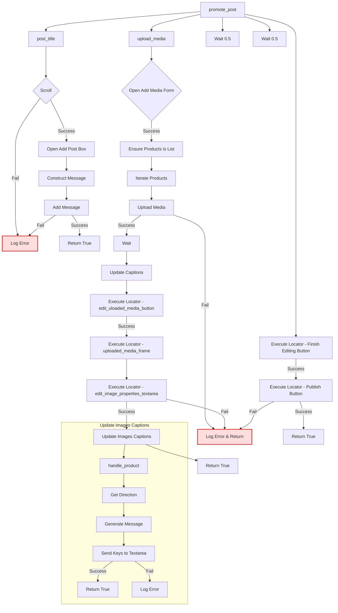

```MD
# <input code>

```python
## \file hypotez/src/endpoints/advertisement/facebook/scenarios/post_message_async.py
# -*- coding: utf-8 -*-\
#! venv/Scripts/python.exe
#! venv/bin/python/python3.12

"""
.. module: src.endpoints.advertisement.facebook.scenarios 
	:platform: Windows, Unix
	:synopsis: Публикация сообщения из `aliexpress` промо

"""
MODE = 'dev'

import time
import asyncio
from pathlib import Path
from types import SimpleNamespace
from typing import Dict, List
from selenium.webdriver.remote.webelement import WebElement
from src import gs
from src.webdriver.driver import Driver
from src.utils.jjson import j_loads_ns, pprint
from src.logger import logger

# Load locators from JSON file.
locator: SimpleNamespace = j_loads_ns(
    Path(gs.path.src / 'endpoints' / 'advertisement' / 'facebook' / 'locators' / 'post_message.json')
)


def post_title(d: Driver, category: SimpleNamespace) -> bool:
    """ Sends the title and description of a campaign to the post message box.

    Args:
        d (Driver): The driver instance used for interacting with the webpage.
        category (SimpleNamespace): The category containing the title and description to be sent.

    Returns:
        bool: `True` if the title and description were sent successfully, otherwise `None`.

    Examples:
        >>> driver = Driver(...)
        >>> category = SimpleNamespace(title="Campaign Title", description="Campaign Description")
        >>> post_title(driver, category)
        True
    """
    # ... (implementation details)
    return True


async def upload_media(d: Driver, products: List[SimpleNamespace], no_video:bool = False) -> bool:
    """ Uploads media files to the images section and updates captions.

    # ... (implementation details)
    return ret

```


# <explanation>

**Импорты:**

- `time`, `asyncio`, `pathlib`: Стандартные библиотеки Python для работы с временем, асинхронностью и файлами.
- `types`, `typing`:  Модули для работы с типами данных (в частности, `SimpleNamespace` и `List`).
- `selenium.webdriver.remote.webelement`: Часть Selenium для работы с веб-элементами.
- `src.gs`: Локальный модуль, предположительно содержащий конфигурационные данные, такие как пути.
- `src.webdriver.driver`: Модуль, содержащий класс `Driver`, который, вероятно, управляет взаимодействием с веб-драйвером (Selenium).
- `src.utils.jjson`:  Модуль для работы с JSON-данными. `j_loads_ns` – функция, вероятно, парсит JSON в `SimpleNamespace`.
- `src.logger`: Модуль для логирования ошибок и сообщений.

**Классы:**

- `Driver`:  В этом коде используется класс `Driver`, который не определен, но, судя по импорту `from src.webdriver.driver import Driver`, он находится в пакете `src.webdriver.driver`.  Предполагается, что он отвечает за взаимодействие с веб-драйвером, предоставляя методы для работы с веб-элементами, ожиданий, отправки запросов и других задач.

**Функции:**

- `post_title(d: Driver, category: SimpleNamespace) -> bool`: Отправляет заголовок и описание кампании в поле для публикации поста. Принимает экземпляр `Driver` и `SimpleNamespace` с данными кампании. Возвращает `True` при успехе, иначе `None`.
- `upload_media(d: Driver, products: List[SimpleNamespace], no_video:bool = False) -> bool`: Загружает медиафайлы (изображения или видео) и обновляет подписи к ним. Принимает экземпляр `Driver`, список продуктов (каждый – `SimpleNamespace` с данными о медиафайле) и опциональный флаг `no_video`.  Возвращает `True` при успехе, иначе `None`.
- `update_images_captions(d: Driver, products: List[SimpleNamespace], textarea_list: List[WebElement]) -> None`: Асинхронно добавляет описания к загруженным медиафайлам. Принимает экземпляр `Driver`, список продуктов и список элементов `WebElement` (textarea).
- `promote_post(d: Driver, category: SimpleNamespace, products: List[SimpleNamespace], no_video:bool = False) -> bool`:  Управляет процессом продвижения поста, объединяя `post_title`, `upload_media` и выполнение необходимых действий для публикации.

**Переменные:**

- `MODE`: Строковая переменная, вероятно, определяющая режим работы (например, 'dev', 'prod').
- `locator`: `SimpleNamespace` объект, содержащий данные локейторов из файла `post_message.json`.

**Возможные ошибки и улучшения:**

- Нет обработки потенциальных исключений (например, `FileNotFoundError` при чтении файла).
- Отсутствие явного возвращения `None` в функциях, которые могут завершиться неуспешно. Рекомендуется сделать возвращаемые значения функций более явными.

**Взаимосвязи с другими частями проекта:**

- `gs.path.src`: Подразумевается, что это часть пути к корневой директории проекта.
- `src.endpoints.advertisement.facebook.locators.post_message.json`: Этот JSON-файл определяет локейторы (пути к элементам страницы) для взаимодействия с Facebook.
- `src.utils.jjson.j_loads_ns`: Эта функция загружает данные из JSON в `SimpleNamespace`.
- `src.logger`: Утилита для логирования, позволяющая отслеживать действия и ошибки во время выполнения.
- `src.webdriver.driver.Driver`:  Класс, вероятно, использует `selenium` для взаимодействия с браузером, взаимодействуя с веб-сайтом Facebook.
- `advertisement/facebook/scenarios/translations.json`:  Этот файл используется для обработки текстовых переводов, что показывает, что приложение может быть многоязычным.

В целом, код реализует асинхронную процедуру публикации поста в Facebook, включая загрузку медиа и добавление подписей.  Он хорошо организован с помощью функций и асинхронных операций, но требует улучшений в обработке ошибок.