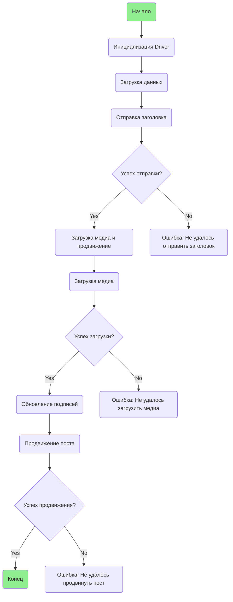

## ИНСТРУКЦИЯ:

Анализируй предоставленный код подробно и объясни его функциональность. Ответ должен включать три раздела:

1.  **<алгоритм>**: Опиши рабочий процесс в виде пошаговой блок-схемы, включая примеры для каждого логического блока, и проиллюстрируй поток данных между функциями, классами или методами.
2.  **<mermaid>**: Напиши код для диаграммы в формате `mermaid`, проанализируй и объясни все зависимости,
    которые импортируются при создании диаграммы.
    **ВАЖНО!** Убедитесь, что все имена переменных, используемые в диаграмме `mermaid`,
    имеют осмысленные и описательные имена. Имена переменных вроде `A`, `B`, `C`, и т.д., не допускаются!

    **Дополнительно**: Если в коде есть импорт `import header`, добавьте блок `mermaid` flowchart, объясняющий `header.py`:
    ```mermaid
    flowchart TD
        Start --> Header[<code>header.py</code><br> Determine Project Root]

        Header --> import[Import Global Settings: <br><code>from src import gs</code>]
    ```

3.  **<объяснение>**: Предоставьте подробные объяснения:
    -   **Импорты**: Их назначение и взаимосвязь с другими пакетами `src.`.
    -   **Классы**: Их роль, атрибуты, методы и взаимодействие с другими компонентами проекта.
    -   **Функции**: Их аргументы, возвращаемые значения, назначение и примеры.
    -   **Переменные**: Их типы и использование.
    -   Выделите потенциальные ошибки или области для улучшения.

Дополнительно, постройте цепочку взаимосвязей с другими частями проекта (если применимо).

Это обеспечивает всесторонний и структурированный анализ кода.
## Формат ответа: `.md` (markdown)
**КОНЕЦ ИНСТРУКЦИИ**
##  **<алгоритм>**:

**Общий процесс:**

1.  **Инициализация драйвера:**
    *   Создается экземпляр класса `Driver`, который используется для взаимодействия с веб-страницей Facebook.
    *   Пример: `driver = Driver(...)`

2.  **Загрузка данных категории и продуктов:**
    *   Создается объект `SimpleNamespace` для представления данных категории (заголовок и описание).
    *   Создается список объектов `SimpleNamespace` для представления данных продуктов (пути к медиафайлам).
    *   Пример:
        ```python
        category = SimpleNamespace(title="Campaign Title", description="Campaign Description")
        products = [SimpleNamespace(local_saved_image='path/to/image.jpg', ...)]
        ```

3.  **Отправка заголовка:**
    *   Вызывается функция `post_title` для отправки заголовка и описания кампании в поле ввода сообщения Facebook.
    *   В качестве аргументов передаются экземпляр `Driver` и объект `category`.
    *   Пример: `post_title(driver, category)`
    *   Возвращает `True`, если отправка прошла успешно, иначе `None`.

4.  **Проверка успеха отправки заголовка:**
    *   Если `post_title` вернула `True`, то процесс продолжается, иначе выводится сообщение об ошибке "Failed to send title".

5.  **Загрузка медиа и продвижение поста:**
    *   Вызывается функция `promote_post`, которая управляет процессом загрузки медиафайлов и продвижения поста.
    *   В качестве аргументов передаются экземпляр `Driver`, объекты `category` и `products`, а также флаг `no_video`.
    *   Пример: `promote_post(driver, category, products, no_video=False)`

6.  **Загрузка медиа:**
    *   Внутри функции `promote_post` вызывается функция `upload_media` для загрузки медиафайлов (изображений и видео).
    *   В качестве аргументов передаются экземпляр `Driver`, список объектов `products` и флаг `no_video`.
    *   Пример: `upload_media(driver, products, no_video=False)`
    *   Возвращает `True`, если загрузка прошла успешно, иначе `None`.

7.  **Проверка успеха загрузки медиа:**
    *   Если `upload_media` вернула `True`, то процесс продолжается, иначе выводится сообщение об ошибке "Failed to upload media".

8.  **Обновление подписей к изображениям:**
    *   Вызывается функция `update_images_captions` для добавления подписей к загруженным изображениям.
    *   В качестве аргументов передаются экземпляр `Driver`, список объектов `products` и список текстовых полей `textarea_list`.
    *   Пример: `update_images_captions(driver, products, textarea_list)`
    *   Ничего не возвращает.

9.  **Продвижение поста:**
    *   Завершается процесс продвижения поста.

10. **Проверка успеха продвижения:**
    *   Если `promote_post` вернула `True`, то процесс завершается успешно, иначе выводится сообщение об ошибке "Failed to promote post".

## **<mermaid>**



**Анализ зависимостей:**

*   **`Start`**: Начало сценария, не зависит ни от чего.
*   **`InitDriver`**:  Создание экземпляра класса `Driver`. Зависит от модуля, предоставляющего класс `Driver` (`src.webdriver.driver`).
*   **`LoadCategoryAndProducts`**: Загрузка данных категорий и продуктов. Использует `SimpleNamespace` из `types`.
*   **`SendTitle`**: Отправка заголовка. Зависит от экземпляра `Driver` и данных категории.
*   **`CheckTitleSuccess`**: Проверка успеха отправки заголовка. Зависит от результата функции `post_title`.
*   **`UploadMediaAndPromotePost`**: Загрузка медиафайлов и продвижение поста. Зависит от экземпляра `Driver`, данных категорий и продуктов.
*   **`UploadMedia`**: Загрузка медиафайлов. Зависит от экземпляра `Driver` и данных продуктов.
*   **`CheckMediaSuccess`**: Проверка успеха загрузки медиа. Зависит от результата функции `upload_media`.
*   **`UpdateCaptions`**: Обновление подписей к изображениям. Зависит от экземпляра `Driver`, данных продуктов и списка текстовых полей.
*    **`PromotePost`**: Завершение процесса продвижения поста. Зависит от экземпляра `Driver`.
*   **`CheckPromoteSuccess`**: Проверка успеха продвижения поста. Зависит от результата функции `promote_post`.
*   **`TitleError`**: Вывод сообщения об ошибке, если не удалось отправить заголовок.
*   **`MediaError`**: Вывод сообщения об ошибке, если не удалось загрузить медиа.
*   **`PromoteError`**: Вывод сообщения об ошибке, если не удалось продвинуть пост.
*   **`End`**: Конец сценария.

## **<объяснение>**

### Импорты:

*   **`src.webdriver.driver.Driver`**: Класс `Driver` отвечает за управление веб-браузером, взаимодействие со страницей Facebook через Selenium. Он инициализирует браузер, находит элементы на странице и выполняет действия (нажатия, ввод текста и т.д.).
*   **`types.SimpleNamespace`**: Используется для создания простых объектов с атрибутами, к которым можно обращаться через точку. Это удобно для хранения и передачи данных категорий и продуктов.
*   **`typing.List`**: Используется для аннотации типов, определяя, что аргумент является списком.
*   **`selenium`**:  Это библиотека для автоматизации браузеров, позволяющая управлять веб-страницами, находить элементы и выполнять действия.
*    **`asyncio`**: Библиотека для написания асинхронного кода.
*    **`pathlib`**: Модуль для работы с путями к файлам.

### Функции:

*   **`post_title(d: Driver, category: SimpleNamespace) -> bool`**:
    *   **Назначение**: Отправляет заголовок и описание кампании в поле ввода сообщения Facebook.
    *   **Аргументы**:
        *   `d`: Экземпляр класса `Driver` для управления браузером.
        *   `category`: Объект `SimpleNamespace`, содержащий заголовок (`title`) и описание (`description`).
    *   **Возвращаемое значение**: `True`, если отправка прошла успешно, иначе `None`.
    *   **Пример**:
        ```python
        category = SimpleNamespace(title="Заголовок кампании", description="Описание кампании")
        post_title(driver, category)
        ```

*   **`upload_media(d: Driver, products: List[SimpleNamespace], no_video: bool = False) -> bool`**:
    *   **Назначение**: Загружает медиафайлы (изображения и видео) на страницу Facebook.
    *   **Аргументы**:
        *   `d`: Экземпляр класса `Driver`.
        *   `products`: Список объектов `SimpleNamespace`, содержащих пути к медиафайлам.
        *   `no_video`: Флаг, указывающий, нужно ли пропускать загрузку видео.
    *   **Возвращаемое значение**: `True`, если загрузка прошла успешно, иначе `None`.
    *   **Пример**:
        ```python
        products = [SimpleNamespace(local_saved_image='path/to/image.jpg', local_saved_video='path/to/video.mp4')]
        upload_media(driver, products, no_video=True) # пропускаем видео
        ```

*   **`update_images_captions(d: Driver, products: List[SimpleNamespace], textarea_list: List[WebElement]) -> None`**:
    *   **Назначение**: Добавляет подписи к загруженным изображениям.
    *   **Аргументы**:
        *   `d`: Экземпляр класса `Driver`.
        *   `products`: Список объектов `SimpleNamespace`, содержащих описания для подписей.
        *   `textarea_list`: Список текстовых полей (элементы `WebElement`), в которые нужно добавить подписи.
    *   **Возвращаемое значение**: `None` (ничего не возвращает).
    *   **Пример**:
        ```python
        products = [SimpleNamespace(description='Описание изображения')]
        textarea_list = [...] # Получаем список текстовых полей
        update_images_captions(driver, products, textarea_list)
        ```

*   **`promote_post(d: Driver, category: SimpleNamespace, products: List[SimpleNamespace], no_video: bool = False) -> bool`**:
    *   **Назначение**: Управляет процессом продвижения поста с заголовком, описанием и медиафайлами.
    *   **Аргументы**:
        *   `d`: Экземпляр класса `Driver`.
        *   `category`: Объект `SimpleNamespace`, содержащий заголовок и описание кампании.
        *   `products`: Список объектов `SimpleNamespace`, содержащих пути к медиафайлам и их описания.
        *   `no_video`: Флаг для пропуска загрузки видео.
    *   **Возвращаемое значение**: `True`, если продвижение прошло успешно, иначе `None`.
    *   **Пример**:
        ```python
        category = SimpleNamespace(title="Заголовок", description="Описание")
        products = [SimpleNamespace(local_saved_image='path/to/image.jpg', description='Описание изображения')]
        promote_post(driver, category, products, no_video=False)
        ```

### Переменные:

*   `driver`: Экземпляр класса `Driver`, используется для управления браузером.
*   `category`: Объект `SimpleNamespace` для хранения данных категории (заголовок и описание).
*   `products`: Список объектов `SimpleNamespace` для хранения данных продуктов (пути к медиафайлам и описания).
*   `no_video`: Логическая переменная для управления загрузкой видео.
*    `textarea_list`: Список элементов `WebElement`, который представляет текстовые поля для ввода подписей.

### Потенциальные ошибки и улучшения:

1.  **Обработка ошибок**:
    *   В коде присутствует некоторая обработка ошибок через возврат `None`, но можно добавить более детальную обработку исключений (например, через `try-except`) и логирование, чтобы понять, что именно пошло не так.
    *   Следует добавить обработки ошибок при загрузке файлов (например, если файл не существует).

2.  **Асинхронность**:
    *   Хотя в названии модуля есть слово "async", неясно, как именно используется асинхронность. Возможно, асинхронные операции должны использоваться для загрузки медиа и обновления подписей. В предоставленном коде асинхронность явно не применяется.

3.  **Динамические элементы**:
    *   Веб-страницы могут быть динамическими, и элементы могут загружаться не сразу. Нужно добавить явные ожидания (`WebDriverWait` из Selenium) для уверенности, что элементы доступны перед взаимодействием с ними.

4.  **Переиспользование кода**:
    *   Некоторые шаги (например, поиск элементов) можно вынести в отдельные методы, чтобы избежать дублирования кода.

5.  **Модульность**:
    *   Можно разделить процесс на более мелкие, переиспользуемые функции.

### Взаимосвязи с другими частями проекта:

*   **`src.webdriver.driver`**: Модуль, предоставляющий класс `Driver` для управления браузером.
*   **`src.endpoints.advertisement.facebook`**:  Этот скрипт является частью подсистемы для автоматизации задач на Facebook.
*   **`src`**: Скрипт использует общие компоненты из корневого каталога `src`.

**Общая цепочка вызовов:**

1.  Скрипт инициализирует `Driver` для работы с браузером.
2.  Загружаются данные категории и продуктов.
3.  Отправляется заголовок и описание поста.
4.  Загружаются медиафайлы.
5.  Обновляются подписи к изображениям.
6.  Пост продвигается.
7.  Выводится сообщение об успехе или ошибке.